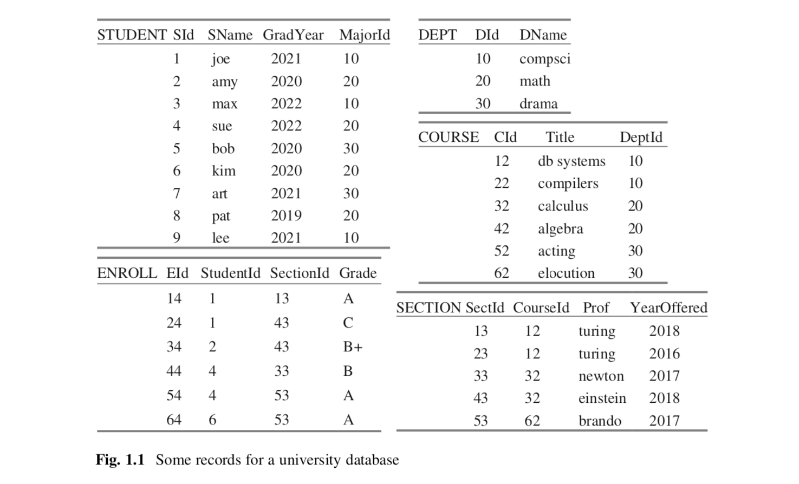

# 第一章 数据库系统
数据库系统在企业里扮演着一个非常重要的角色. 一些数据库系统(比如Oracle)是极其复杂的,并运行在大型高端机器上.其它的(比如SQLite)是小巧,精简的,面向特定应用数据的存储.尽管用途广泛,但所有的数据库系统都有类似的特征.本章考察数据库所必须解决的问题及其应具备的能力,同时也会介绍Derby和SimpleDB数据库系统,它们会在本书被讨论.

## 1.1 为什么是一个数据库系统?
一个数据库是一个保存在计算机上的数据的集合.数据库中的数据常常被组织为记录,比如员工记录,医疗记录,销售记录等等. 图1.1描绘了一个包含一个大学的学生信息和课程信息的数据库. 这个数据库会被当做实例用于整本书中. 图1.1的数据库包含5中类型的记录:
*	有一个STUDENT学生记录表记录这个大学的每一个学生.每一条记录包含该学生的id号,姓名,毕业年份和专业系的id.
*	有一个DEPARTMENT系记录表记录这个大学的每一个系.每条记录包含该系的id和名称.
*	有一个COURSE课程记录表记录着这个大学提供的课程.每条记录包含该课程的id,标题,和开这门课的系的id.
*	有一个SECTION记录表记录每门课程的开课记录.每条记录包含id,开课年份,课程id,授课教授.
*	有一个ENROLL记录表记录每位学生的选课记录.每条记录包含id,学生id,课程开课SECTION的id,和成绩.

  

[图1.1]

图1.1仅仅是逻辑上的展示,并没有展示任何关于记录是怎么存的以及是怎么被访问的.有很多数据库系统软件产品,提供管理记录的扩展功能.

"管理记录"意味着什么呢?什么功能是数据库系统必须有的,什么是可选的?下面是5种基本要求.
*	数据库必须持久化.否则电脑一关闭数据就会消失.
*	数据可以被分享.许多数据库,比如我们大学的数据库,就是很多用户同时共享使用的.
*	数据库必须精确.如果用户不能信任一个数据库的内容,那么这个数据库也就什么用处和价值了.
*	数据库可以非常巨大.图1.1仅包含29条记录,这是极其少的.一个数据库就包含几百万(甚至数十亿)的记录,并不少见.
*	数据库必须可用.如果用户不能轻易的获取他们想要的数据,他们的产出就会受到影响,他们会嚷嚷着换其它产品.

下面的小节将研究这些要求的实现.每一个要求都迫使数据库系统包含更多的特性,以至于系统变得比你想象的复杂.

### 1.1.1 记录存储(Record Storage)
 将数据保存到文件中是一种数据库持久化常见的方法.最简单直接的方式就是将记录存储在文本文件中,一个文件一种类型;一条记录可以是一行文本,以tab分隔各个值.图1.2描绘了针对STUDENT记录表的文本文件.
  

[图 1.2]

这种方式有一个好处是用户可以通过文本编辑器检查,修改这些文件.不幸的是,这种方式太低效了.原因在于以下两点.

第一个原因是大文件的修改很费时.假设,举个例子,有人从STUDENT的文件删除了Joe的记录.这个数据库系统别无选择只能重写文件的开头,将Amy的记录及后面的记录都向左移.尽管重写一个小文件是非常快的,但重写一个1GB的文件很轻易就消耗几分钟,这是不可接受的.一个数据库系统需要聪明地存储数据,使得更新只需要小部分的重写.

第二个原因是大文件读也很费时.思考从STUDENT文件中搜索2019班级的学生.只能顺序扫描这个文件.顺序扫描是非常没有效率的.你可能知道几种内存数据结构,比如树,哈希表,它们能加快搜索.一个数据库系统需要用类似的数据结果去实现它的文件存储.举个例子,一个数据库可以使用方便某种类型(比如学生姓名,毕业年份或专业)搜索的数据结构来组织文件的记录,或者创建几个辅助文件,方便不同类型的搜索.这些辅助文件被称为索引(indexes),它是12章节的主题.

### 1.1.2 多用户访问
当许多用户共享一个数据库,他们有可能会并发访问数据库文件.并发是一个好东西,因为每个用户都能得到快速的响应,而不用等其他用户完成他们的工作.但是太多并发可能导致数据库变得不准确.比如,思考一个旅行计划数据库.假设2个用户尝试预定一个还剩下40个座位的航班.如果两个用户同时读到同一个航班的记录,他们都看到有40个可选的座位.然后他们都修改了记录,这时航班还剩39个座位.糟了.2个座位被预定了,但仅仅一个预定被记录在数据库里.

限制并发是这个问题的一个解决方案.数据库系统应该允许第一个访问用户读航班记录,让他看到还有40个座位,而阻塞第二个用户的访问直到第一个用户完成.当第二个用户恢复访问的时候,会看到还剩39个座位,然后修改到38个.一般来说,数据库系统必须能检测到什么时候一个用户将要产生的动作会与其它用户的动作冲突,并在那个时间点(且仅在那个时间点)阻塞那个用户的执行直到第一个用户完成他的动作.

用户也许需要撤回他们所作的数据库修改.比如,假设一个用户为了到马德里的旅行搜索旅行计划数据库,并发现有一天同时有航班和旅馆可以预定.现在假设这个用户预定了航班,然后当预定旅馆的时候,那天所有的旅馆都被预定了.在这种情况下,用户需要撤销航班的预定并尝试其它日期.

一个被撤回了的更新,不应该被其它用户感知到.否则,其它用户可能看到这个更新,并认为它是真的,然后基于此做决定.因此数据库系统必须提供一种能力让用户能决定什么时候他们的改变是固定不变的,对用户来说便是提交改变(commit changes)这一操作.一旦用户提交了(commits),这些改变就会变得可见且不能被撤销.章节5会讨论这些问题.

### 1.1.3 容灾
假设你正在运行一个给所有教授加薪的程序的时候,数据库崩溃了.系统重启后,你发现有些教授有新的薪资 ,但其他人没有.你应该做什么?你不能只是重新运行那个程序,因为这会给某些教授双倍的加薪.相反,你需要数据库系统从系统崩溃中优雅地恢复过来,撤销崩溃发生时程序所有的更新操作. 恢复的机制是有趣且不简单的,在章节5会讨论它.

### 1.1.4 内存管理
数据库需要持久化存储,比如磁盘或闪存.闪存比磁盘快100倍,但也算非常耗时的.通常一次磁盘访问时间是6ms,闪存是60μs.但它们都比内存慢几个数量级,内存的一次访问大概是60ns.也就是说,内存比闪存快1000倍,比磁盘快100000倍.

为了直观感受到性能差异造成的结果及影响,我们来打个比方.假设你想要吃巧克力饼干.有三种方法得到:从你的厨房,从附近的超市,或者通过邮购.在这个类比中,你的厨房相当于RAM(内存),附近的超市相当于flash drive(闪存),邮购公司相当于disk(磁盘).假设从厨房拿会花5秒.那么从超市拿则会花5000秒,超过1小时.这包含去超市,排队,买饼干和返回等时间.那么类比中的邮购将会需要500000秒,它包含在线下单,快递等时间.从这个比方看,闪存和磁盘就显得十分的慢.

等等!甚至可能更糟糕.数据库对并发和可靠性的支持将会使事情变得更慢.如果有人正在使用你想用的数据,你可能必须等到数据被释放.在我们的类比中,这相当于到了超市发现饼干卖完了,你必须等到它们再上架.

换句话说,数据库面临着下面的难题:它必须用比较慢的设备管理远大于内存的数据,支持多用户访问,且需要完全可恢复,同时还要保持合理的响应时间.

解决这个难题的核心在于利用缓存.当数据库需要处理一条数据的时候,将其加载到内存,并尽可能久的保留在那.
因此内存会保存正在使用中的数据库的一部分.所有的读和写都发生在内存里.这个策略的优势在于更快的内存而不是缓慢的持久化存储被使用,但劣势在于持久化版本的数据库可能会过期.数据库需要同步持久化版本的内存版本的数据库,即使在系统崩溃的情况下(当内存里的内容被销毁的时候).章节4会思考各种缓存策略.

### 1.1.5 可用性
如果用户不能轻易抽取它们想要的数据,那么这个数据库也就没什么用.比如说,假设一个用户想知道毕业于2019年的所有学生的姓名.如果没有数据库,用户需要写一个程序遍历学生文件.图1.3给出了这样程序的java代码,假定文件是以文本的形式存储的.注意到大部分的Java代码用于处理解码文件,读取记录,分割成待验证的数组.判断是否是想要的学生姓名的代码则藏在无趣的文件操作代码中.

[图1.3]

因此,许多数据库系统都支持一种查询语言,使用用户可以容易找到他们想要的数据.关系型数据库的标准查询语句是SQL.图1.3的代码可以用一句sql表达:
select SName from STUDENT where GradYear = 2019

这条sql语句比相应的Java程序代码要短的多,主要是因为它可以指定抽取的数据,而不用管如何获取数据.

## 1.2 Derby数据库系统

如果你可以使用一个数据库系统上手操作,那么学习数据库的概念会更高效.尽管有很多种可用的数据库系统,但是我建议你可以使用Derby数据库系统,因为它是基于Java写的,且免费,易安装,易使用.最新版本的Derby可以从http://db.apache.org/derby/derby_downloads.html 下载到. 解压下载的文件,可以得到一个包含几个目录的文件夹.比如,docs目录包含参考文档,demo目录包含一个简单的数据库,等等.这个数据库包含很多特性,在此就不赘述了,感兴趣的读者可以细读docs目录里的各种介绍和使用手册.

Derby有许多此书中不需要的特性.实际上,你只需要从Derby的lib目录添加4个文件到你的类路径下:derby.jar,derbynet.jar,derbyclient.jar和derbytools.jar.有很多方法可以改变类路径,取决于你的Java平台和操作系统.我会介绍在Eclipse开发平台里怎么做.如果你不太熟悉Eclipse,你可以从https://www.eclipse.org/ 下载它的代码和文档.如果你使用其他的开发平台,那么你应该适配我的Eclipse的指导到你的环境中去.

首先,创建一个Eclipse项目给Derby.然后配置它的构建路径,像下面这样操作.从Properties菜单,选择"Java Build Path". 点击"Libraries"标签,然后点击"Add External JARS",接下来用文件选择器选择你需要的那4个jar文件.就这样.

Derby安装包里有一个应用,叫做ij,你可以用它来创建和访问Derby数据库.因为Derby完全使用Java写的,ij实际上是一个Java类的名称,在org.apache.derby.tools包下面.你可以执行类文件来运行ij.执行类文件请到Ecliipse的运行配置(Run Configurations)菜单.添加一个新的配置到Derby项目,命名为"Derby ij".在main class配置的地方输入"org.apache.derby.tools.ij".当你运行这个配置,ij会显示一个询问输入的控制窗口.

给ij的输入是一连串的命令.一个命令是以分号结尾的字符串.命令可以分割成几行文本.ij客户端不会执行一个命令直到它遇到分号.任何SQL声明都是合法的命令.另外,ij支持数据库的连接和断开,以及会话的退出.

连接命令指定ij应该连接的数据库,退出断开命令指定退出的数据库.一个会话可以连接和断开很多次.exit命令结束命令.图1.4展示了一个ij的会话的例子.这个会话有两部分.第一部分,用户连接了一个新的数据库,创建了一个表,插入了一条记录到表里,并断开连接.第二部分,用户重新连接了这个数据库,获取插入的值并断开连接.
 

[图1.4]

连接命令的参数被叫做连接字符串(connection string).连接字符串有三个子字符串,以冒号分隔.前两个子字符串是"jdbc"和"derby",意味着你想连接一个Derby数据库并用JDBC协议.(JDBC是第二章的主题)第三个子字符串确定数据库.字符串"ijtest"是数据库的名称.它的文件保存在ij程序的启动路径下一个叫"ijtest"的文件夹里.比如,如果你在Eclipse中运行该程序,那个数据库文件夹讲会在项目目录下.字符串"create=true"告诉Derby创建一个新的数据库.如果省略它,那么Derby就会查找存在的指定名称的数据库.

## 1.3 数据库引擎
就像ij这样,一个数据库应用由两部分构成:用户接口(或UI),和访问数据库的代码.后者被称为数据库引擎.将UI从数据库引擎分离是不错的系统设计,因为这样可以简化应用的开发.微软的Access数据库系统就是一个非常出名的例子.它有图形化界面允许用户通过点击鼠标和值的输入与数据库交互,并由引擎处理数据存储.当UI需要数据库的信息,它会构建一个请求,并发给引擎.然后引擎执行请求并返回值给UI.

这种分离也给系统带来了灵活性:一个应用设计者可以用同一个UI给不同的数据库引擎或给相同的数据库引擎构建不同的UI.微软的Access提供了两者的例子.一个表单创建UI能连接Access的引擎或其他数据库引擎.Excel中的表格可以包含查询Access引擎的公式.

UI通过连接指定的引擎和调用引擎的API方法来访问数据库.作为一个例子,注意Derby的ij真的只是一个UI.它的连接命令建立一个连接到指定数据库引擎,然后每一个SQL命令发送sql给引擎,获取结果并展示.

数据库引擎一般支持多个标准API.当一个Java程序连接到一个引擎,选择的API叫做JDBC.第二章会详细讨论JDBC并展示怎么写一个类似ij的应用程序.

UI至数据库的连接可以是嵌入式的或服务端的.在嵌入式连接中,数据库引擎的代码和UI的代码运行在同一个进程中,使得该UI只能访问同一进程下的引擎.当数据库只属于某个应用并与应用存储在同一台机器时,该应用程序应该使用嵌入式连接.其他情况需要使用服务端的连接.

在一个服务端的连接,引擎的代码在专门的服务器程序中运行.这种服务器程序会一直运行,等待客户端的连接,不需要和客户端在同一台机器上.客户端和服务器建立连接后,客户端会发送JDBC请求并接受响应.

一个服务器可以同时连接多个客户端.服务器处理某个客户端的请求的同时,其他客户端也可以发送它们自己的请求.服务器端有调度器负责请求的排队和决定执行的时机.每个客户端感知不到其他客户端的存在,就好像服务端只在处理它的请求.

图1.4的会话用的是嵌入式连接.它创建了名为"ijtest"的数据库在本机上,不涉及服务器.为了执行类似的服务端版的ij会话,有两点需要改变:Derby引擎必须作为服务端运行,且必须修改连接的命令以发现服务端.

Derby服务端的代码是Java类NetworkServerControl,它在org.apache.derby.drda包下. 在Eclipse里运行这个服务端程序可以到运行(Run)菜单的"Run Configurations",添加一个配置并命名为"Derby Server".在main class的配置项里输入“org.apache.derby.drda.NetworkServerControl”.在Arguments标签下输入程序参数"start -h localhost".每次运行这个配置,一个控制台窗口应该会出现,表示Derby服务端正在运行.

程序参数"start -h localhost"的目的是什么? 第一词是"start",代表启动服务端.你可以传"shutdown"参数,执行同一个class来停止服务端.(或者你可以直接从控制台窗口关闭进程)字符串"-h localhost"告诉服务端只接受来自本机客户端的请求.如果用一个域名或ip地址替换"localhost",那么服务端将只能接受来自指定机器的请求.ip地址'0.0.0.0'告诉服务端可以接受来自任何机器的请求.(当然,如果你允许来自任何地方的客户端连接,那么你将暴露数据库给黑客或不善良的用户.一般来说,你要么配置防火墙要么开启Derby的安全认证机制,抑或是两者.)

一个服务端的连接字符串必须指定服务器的网络或ip地址.特别地,考虑以下的ij连接命令:
ij> connect 'jdbc:derby:ijtest'
ij> connect 'jdbc:derby://localhost/ijtest'
ij> connect 'jdbc:derby://cs.bc.edu/ijtest'

第一个命令建立一个嵌入式的连接到"ijtest"数据库.第二个命令建立了服务端的连接到"localhost"本地机器上的"ijtest"数据库.第三个命令建立了服务端的连接到"cs.bc.edu"机器上的"ijtest"数据库.注意连接字符串是怎么封装决定使用嵌入式或服务端的连接的.比如,再次考虑图1.4,你可以通过简单地改变命令就可以将会话切换为服务端的连接.会话里的其他命令不受影响.

## 1.4 SimpleDB 数据库系统
Derby是一个复杂的,全面的数据库系统.复杂全面另一方面也意味着它的源码不太容易阅读,修改.我写的SimpleDB
数据库系统正好与Derby相反,它的代码量少,易读且易修改.它省略了所有不需要的功能,仅实现了SQL的一部分,而且仅使用最简单的(通常也不实用)算法,目的在于让你对数据库引擎的各个部分和它们如何交互的有一个清晰的认知.

最新版的SimpleDB可从这个链接:http://www.cs.bc.edu/~sciore/simpledb 下载. 解压下载的文件可以得到名为SimpleDB_3.x的文件夹;这个文件夹包含 simpledb,simpleclient,和derbyclient目录.simpledb文件夹包含数据库引擎代码.不像Derby,这些代码没有压缩为jar文件.相反,源码文件都在文件里可见.

要安装SimpleDB引擎,你必须把simpledb目录添加到你的类路径下.使用Eclipse操作的话,首先建一个项目命名为"SimpleDB Engine",然后从SimpleDB_3.x文件夹下复制"simpledb"文件夹到项目的src目录下.最后用文件菜单(File menu)里的刷新命令(refresh)刷新这个项目.

Derbyclient文件夹包含调用Derby引擎的样例代码.复制这个文件夹里的内容到你的Derby项目下的src目录下,并刷新.这些客户端程序将在第二章讨论.

Simpleclient文件夹包含调用SimpleDB引擎的样例代码.你应该为它们创建一个新项目,并命名为"SimpleDB Clients".为确保样例代码可以调用SimpleDB引擎代码,你应该添加SimpleDB引擎项目到SimpleDB Clients项目的构建路径下.然后复制simpleclient文件夹下的内容到SimpleDB Clients项目的src目录下.

SimpleDB支持内嵌的和服务端的连接.在simpleclient文件夹下有一个"SimpleIJ"的程序,它是简版的Derby ij 程序.不同于ij的是你只能连接一次,且是在会话开始的时候.当你执行这个程序,它会要求你输入连接字符串.连接字符串的语法与ij类似.比如,考虑下面的SimpleDB连接字符串:

jdbc:simpledb:testij
jdbc:simpledb://localhost
jdbc:simpledb://cs.bc.edu

第一个连接字符串定义了一个内嵌的连接,连到"testij"数据库.类似Derby,数据库会被放在执行程序的文件夹下,即 SimpleDB Clients项目下.不像Derby,如果数据库不存在SimpleDB会创建该数据库,所以不需要"create=true"标志.

第二和第三个连接字符串定义了一个连接到本机或cs.bc.edu服务器上的数据库的服务端连接.不像Derby,连接字符串没有指定数据库.原因在于SimpleDB引擎一次只能处理一个数据库,服务端启动的时候会定义好它.

SimpleIJ会不断地打印提示符提示你输入一行包含SQL语句的文本.不像Derby,文本行必须包含整条SQL语句,且末尾不需要分号.输入后程序会执行sql语句.如果输入的sql是查询语句,会显示结果表格.如果是更新语句,则会打印出受影响的记录数.如果sql有问题,则会打印错误信息.SimpleDB只能理解SQL的一部分子集,如果碰到理解不了的sql,SimpleIJ会抛出错误.下一章会讨论这些限制.

SimpleDB引擎可以作为服务端运行.main class是在simpledb.server包下的StartServer类.在Eclipse运行这个服务端需要到 "Run Configurations"运行菜单,添加一个新的配置给SimpleDB Engine项目,配置可以叫做"SimpleDB Server".在main class的配置里输入"simpledb.server.StartServer".在Arguments标签下输入指定数据库的名称.为了方便,如果你省去输入数据库名称这个步骤,服务端会默认使用"studentdb"这个名称.当你运行这个配置,一个控制台窗口会出现,表示SimpleDB服务端正在运行了.

SimpleDB服务端接受来自任何地方的客户端连接,对应于Derby的"-h 0.0.0.0"命令行选择. 从控制台关闭进程是关闭服务端唯一的方法.

## 1.5 SimpleDB版本的SQL

Derby几乎实现了所有标准SQL.然而,SimpleDB只实现标准SQL的一小部分子集,而且还增加了一些不存于SQL标准的限制约束.本小节会简单提到这些约束.其他章节会更详细介绍它们,然后许多章末练习会让你去实现一些省掉的特性.

SimpleDB的查询语句只包含select-from-where语法,select分句包含字段名称的列表(没有AS关键字),from分句包含表名称列表(没有范围变量).

可选的where分句里的判断表达式只能用and连接.判断表达式只能判断常量和字段的相等关系.不像标准的SQL,没有其他比较操作,没有其他布尔判断操作,没有算数操作或内置函数,且没有括号.因此,子查询,聚合和计算值都是不支持的.

因为没有范围变量和重命名,查询语句里的字段名称必须不重复.而且因为没有group by或 order by分句,分组和排序也不支持.其他的限制如下:
* select 分句不支持 *
* 没有null值
* 没有join或outer join在from分句
* 不支持union关键字
* insert 分句必须带上明确的值.也就是说,insert语句不能用query语句来定义
* 一个update语句只能有一个赋值表达式在set分句中

## 1.6 总结

*   一个数据库是存储在计算机上的一个数据的集合.数据库中的数据通常组织成记录的形式.一个数据库系统是管理数据库记录的软件.
*   一个数据库系统必须能够处理保存数据在比较慢的设备上的大型多用户数据库.它必须给它的数据提供上层接口,并确保数据的准确性,即使遇到用户更新冲突和系统崩溃.数据库系统有以下特性满足这些要求:
    - 使用比文件系统访问更高效的形式保存数据在文件的能力
    - 支持更快访问,索引数据的复杂算法
    - 处理来自网络多用户的处理,必要时可阻塞用户访问的能力
    - 支持提交和撤销改变
    - 能够缓存数据库记录到内存且管理同步持久层和内存的数据库版本,系统崩溃后能够恢复数据库到一个合理的状态
    - 有语言编译器/解释器,可以转换用户的面向表格的查询语句到面向文件的可执行代码.
    - 有转换低效查询到高效查询的查询优化策略
    - 数据库引擎是数据库系统维护数据的一个组件.数据库应用负责用户的输入和输出;它调用数据库引擎以获取他需要的数据.
    - 一个数据库引擎的连接可以是内嵌的或服务端的.一个有内嵌连接的程序拥有数据库的唯一访问权.一个有服务端连接的程序与其他并发的程序共享数据库引擎.
    - 两个基于java的数据系统,Derby和SimpleDB.Derby实现了完整的SQL标准,然而SimpleDB只实现了一小部分.SimpleDB是有用的,因为它的代码是非常容易理解的.第三章开始剩下的章节会仔细考察它的代码.

## 1.7建议阅读

这些年来,数据库系统经历了很大的变化. 在National Research Council (1999) 的第六章和在Haigh(2006)中可以找到对此非常好的描述.维基百科https://en.wikipedia.org/wiki/Database#History 也是非常有趣.

Client-server模型不仅在数据库领域,在其他很多计算机领域都非常有用.这一领域的概况可以在Orfali et al. (1999)找到.有关Derby服务端各种特性的文档和配置选项可以在这个链接 http://db.apache.org/derby/manuals/index.html 找到.

Haigh, T. (2006).“A veritable bucket of facts”. Origins of the data base managementsystem.ACM SIGMOD Record, 35(2), 33–49.

National Research Council Committee on Innovations in Computing and Commu-nications. (1999).Funding a revolution. National Academy Press. Available from http://www.nap.edu/read/6323/chapter/8#159

Orfali, R., Harkey, D., & Edwards, J. (1999).Client/server survival guide(3rd ed.).Wiley.

## 1.8 练习

### ``概念练习``
#### 1.1. 假设一个机构需要管理数量比较少的共享记录(比如说100左右)
1.   用一个商业版的数据库系统去管理这些记录是否有意义?
2.   数据库的什么特性是不需要的?
3.   用电子表格去保存这些记录是否合理?可能存在的问题是什么?

#### 1.2.假设你想保存大量的个人数据在数据库里.数据库的什么特性是你不需要的?

#### 1.3.考虑你通常不需要用数据库系统管理的数据(比如购物清单,地址薄,支票账户信息等等)
1.   数据量到多大你会考虑保存到数据库系统里?
2.   使用数据方式的什么变化会让你觉得使用数据库系统值得?

#### 1.4 如果你知道怎么使用版本控制系统(比如Git或Subversion),与数据库系统对比它们之间的特性.
1.  版本控制系统有记录(record)的概念吗?
2.  check-in/checkout怎么与数据库并发控制对应?
3.  用户怎么提交?用户怎么撤销未提交的改变?
4.  许多版本控制系统保存变化在不同的文件里,它们都是小文件,描述怎么把上一个版本的文件转换成新版本的.如果用户需要看当前版本的文件,系统则基于原文件,然后应用所有保存变化的文件.这种实现策略可以多好满足数据库系统的需求.

### ``项目练习``
#### 1.5调查你的学校或公司是否使用数据库系统.如果使用:
1.  哪些工作人员明显在工作中使用数据库(而不是那些使用封装数据库,不需要数据库知识的工作人员).他们用来做什么?
2.  当一个用户用数据做某件事,用户是自己写查询语句,还是其他人写的?

#### 1.6安装,运行Derby和SimpleDB服务端.
1.  在服务端的机器上运行ij和SimpleIJ程序.
2.  如果你可以访问另一台机器,也可以修改客户端程序并远程运行.

