# 第二章 JDBC

一个数据库应用通过调用数据引擎的API与它进行交互.用于Java应用的API被称为JDBC(for Java DataBase Connectivity).JDBC库包含5个Java包,它们中的高级特性绝大多数都只在大型商业应用里有用.本章节着眼于java.sql包下的核心JDBC功能.这些核心功能分成两部分:basic JDBC,包含基本用处的类和方法;advanced JDBC,包含提供更方便和灵活的可选的类和方法.

## 2.1 Basic JDBC
JDBC的基础功能内嵌在5个接口里:Driver,Connection,Statement,ResultSet,和ResultSetMetadata.此外,这些接口里的仅仅几个方法是必不可少的.图2.1列出了这些方法.

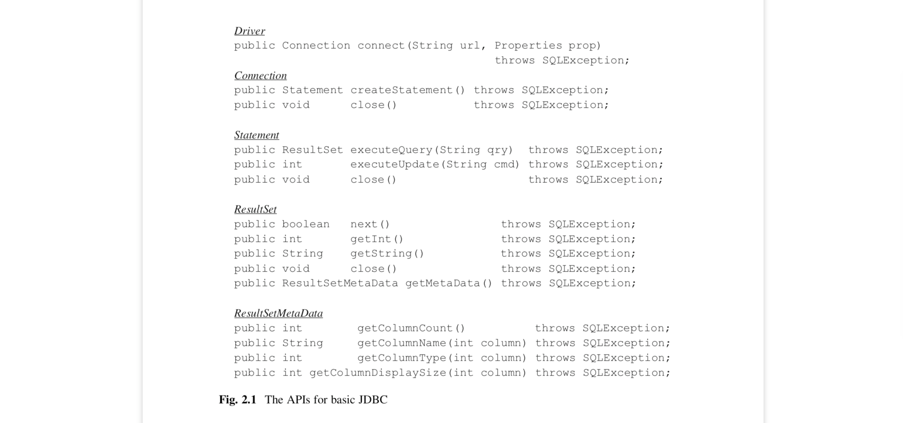
<div align="center">[图2.1]</div>

本节的样例程序展示了这些方法的使用.第一个样例程序是CreateTestDB,展示了一个程序怎么与一个Derby引擎连接和断开.它的代码在图2.2,JDBC相关的代码都加粗高亮了.接下来的小节会仔细考察这段代码.

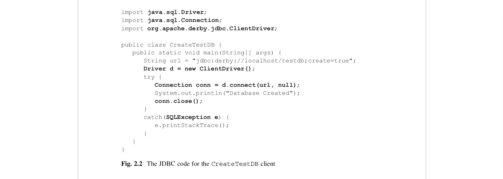
<div align="center">[图2.2]</div>

### 2.1.1 连接一个数据库引擎

每一个数据库引擎都会有它自己的(可能是专有的)客户端连接机制.相反,客户端想尽可能做到服务端是通用的. 也就是说,客户端不想关心怎么连接一个一个数据库引擎;它想引擎提供一个类给客户端调用.那样的类被称为驱动(driver).

JDBC驱动类实现了Driver接口.Derby和SimpleDB各自有两个驱动类:一个给服务端连接的和一个给内嵌连接的.一个Derby服务端连接使用ClientDriver类,而内嵌连接用EmbeddedDriver类.这两个类都在org.apache.derby.jdbc包下.一个SimpleDB服务端连接使用NetworkDriver(在simpledb.jdbc.network包下),而一个内嵌连接用EmbeddedDriver类(在simpledb.jdbc.embedded包下).

客户端通过调用Driver对象的connect方法连接数据库引擎.比如,图2.2的以下三行代码创建了一个连接到Derby数据库的服务端连接.
```java
String url = "jdbc:derby://localhost/testdb;create=true";
Driver d = new ClientDriver();
Connection conn = d.connect(url, null);
```
Connect方法使用两个参数.第一个参数是URL,它指定驱动,服务器(面向服务端连接),和数据库.这个URL被称为连接字符串,和第一章的ij(或SimpleIJ)服务端连接字符串有同样的语法.图2.2的连接字符串包含4部分:
*	子字符串”jdbc:derby:”描述了客户端使用的协议.这里的协议说明这个客户端是Derby客户端使用JDBC协议.
*	子字符串”//localhost”描述了服务端所在机器.你可以替换localhost为任务域名或ip地址.
*	子字符串”/testdb”描述了服务端的数据库路径.对于一个Derby服务端,路径起始于服务端启动的目录.路径的结尾(在这里是”testdb”)是这个数据库所有文件所存储的目录.
*   连接字符串的剩下部分包含发送到引擎的属性值.这里,子字符串”;create=true”告诉引擎创建一个新的数据库.一般来说,都会传几个属性值到Derby引擎.比如,如果引擎要求用户认证,那么会定义username和password属性值.用户”einstein”的连接字符串可能像这样: "jdbc:derby://localhost/testdb;create=true;user=einstein;
password=emc2"
 
Connect方法的第二个参数是Properties类型的一个对象.这个对象提供另一种传属性值到引擎的方法.在图2.2,这个参数的值是null,因为所有的属性都定义在连接字符串里了.另外你可以像下面这样把属性值放在第二个参数里:
```java
String url = "jdbc:derby://localhost/testdb";
Properties prop = new Properties();
prop.put("create", "true");
prop.put("username", "einstein");
prop.put("password", "emc2");
Driver d = new ClientDriver();
Connection conn = d.connect(url, prop);
```
每一个数据库引擎有它自己的连接字符串语法.SimpleDB的连接字符串不同于Derby的地方在于它只包含协议和机器名称.(在连接字符串里定义数据库的名称是没有意义的,因为在SimpleDB服务端启动的时候数据库就已经被定义好了.而且连接字符串不定义属性,因为SimpleDB服务端不支持任何属性)比如,下面的三行代码创建了一个SimpleDB服务端的连接:
```java
String url = "jdbc:simpledb://localhost";
Driver d = new NetworkDriver();
conn = d.connect(url, null);
```
尽管驱动类和连接字符串是厂商特定的,但是剩下的JDBC程序确是厂商中立的.比如,考虑图2.2的变量d和conn.它们相应的JDBC类型是Driver和Connection接口.你可以从代码中分辨出变量d被赋值了一个ClientDriver对象.但是,conn是被赋值了从connect方法返回的Connection对象,且没有方法知道它真实的类.这种场景对所有JDBC程序都适用.查了驱动类名称和它的连接字符串,一个JDBC程序只关心通用的JDBC接口.因此,一个基础JDBC客户端会导入两个包:
*	自带的java.sql包,以获取通用的JDBC接口定义
*	数据库厂商提供的包含驱动类的包

### 2.1.2 从数据库引擎断开连接

在一个客户端连接数据库引擎期间,引擎会分配资源给客户端使用.比如,一个客户端可能向服务端请求锁,以阻塞其他客户端访问数据库的部分数据.甚至于连接上引擎的能力也可以看作是一种资源.一个公司的商业数据库系统可能有限制同一时间连接数的网站许可,这意味着持有一个连接可能使其他客户端连接不上.因为连接持有宝贵的资源,当不需要数据库的时候客户端应当立即断开连接.一个客户端程序通过调用Connection对象的close方法断开和引擎的连接.close的调用可以在图2.2看到.

### 2.1.3 SQL Exceptions
客户端和引擎之间的交互可能因为许多原因产生错误.正如下面这些例子:
*  客户端让引擎执行了一个错误的SQL或访问不存在的表的SQL或比较两个不可比较的值.
*  引擎禁止了客户端的连接,因为它和另外的并发客户端之间的死锁
*  引擎代码里有一个bug
*  客户端不能访问引擎(针对服务端连接).可能服务端名称是错的,或着访问不了服务端

不同的数据库引擎有它们自己的方式处理这些错误.比如,SimpleDB对于网络问题会抛出RemoteException,对于SQL语句问题会抛出BadSyntaxException,对于死锁抛出BufferAbortException或LockAbortException,对于服务端问题会抛出通用的RuntimeException.

为了使错误处理通用,JDBC提供了它自己的错误类,叫做SQLException.当一个数据库引擎遇到内部错误,会把它包装到一个SQLException里,并发给客户端程序.

SQL exception带有的消息会显示导致它的内部错误.每一个数据库引擎都可以自定义它们的消息.比如Derby有900个错误消息,而SimpleDB把所有可能出现的问题归并为6种消息:“network problem”,“illegal SQL state-ment”,“server error”,“operation not supported”,和两种形式的“transaction abort”.

大多数JDBC方法(图2.1所有的方法)抛出一个SQL exception.SQL exception是编译型的,这意味着客户端必须显示的处理它们,要么通过try catch,要么向上抛出.图2.2的那两个JDBC方法是在try块里运行的.如果其中某个方法抛出异常,则会打印堆栈并返回.

注意图2.2的代码有一个问题,当一个错误被抛错的时候,它的连接没有被关闭. 这是资源泄露的例子,客户端出错以后,引擎不能轻易的回收连接的资源.修复这个问题的一个方法是在catch块中关闭连接.然而,close方法需要在try块里就被调用,也就意味着图2.2的catch块应该看起来想这样:
```java
catch(SQLException e) {
  e.printStackTrace();
  try {
    conn.close();
  }
  catch (SQLException ex) {}
}
```
这就开始看起来有点丑了.另外,如果close方法抛出了错误客户端需要做什么?上面的代码忽略了它,但是看起来不是特别合适.

一个更好的解决方案是让Java自动关闭连接.通过它的try-with-resource语法.要使用它,你需要在try关键字后的括号里创建Connection对象.当try块结束后(正常结束或异常结束),Java会在内部隐式地调用对象的close方法.改进后的图2.2的try块看起来像这样:
```java
try (Connection conn = d.connect(url, null)){
  System.out.println("Database Created");
}catch (SQLException e) {
  e.printStackTrace();
}
```
这段代码正确处理了所有错误,且没有失去图2.2的简洁性.

### 2.1.4 执行SQL语句

一个连接可以认为是与数据库引擎的一次会话(session),在会话期间引擎处理来自客户端的SQL语句.JDBC是像接下来描述那样支持这种方式的.一个连接对象有createStatement方法,它会返回Stament对象.Statement对象有两种方式执行SQL语句:executeQuery和executeUpdate方法.它也有close方法,为了释放它所占用的资源.

图2.3展示了一个客户端程序调用executeUpdate方法去修改Amy的学生记录的MajorId值.这个方法的参数是一个SQL更新语句的字符串;这个方法返回被修改记录的数量.

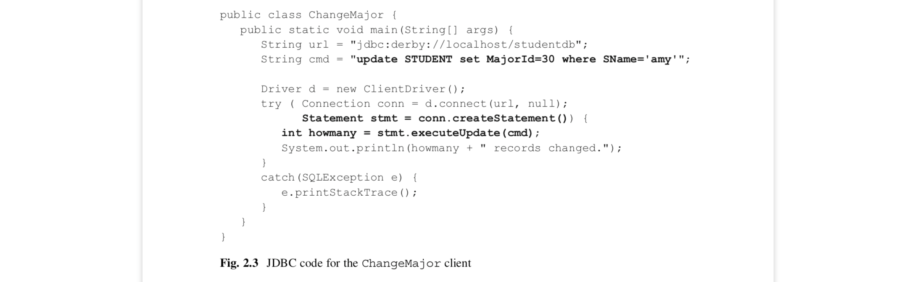
<div align="center">[图2.3]</div>

Statement对象,像Connection对象一样,需要被关闭.最简单的方案就是在try块里自动关闭两个对象.

SQL命令的定义展示了一个有趣的点.因为命令是以Java字符串的形式保存的,它包装在双引号之间.另一方面,SQL里的字符串用的是单引号.这种区别使你的编程更容易,因为你不必担心引号有两种含义---SQL字符串用单引号,Java字符串用双引号.

图2.3的ChangeMajor的代码假定名为"studentdb"数据库存在.SimpleDB的分发包里包含CreateStudentDB类,这个类创建数据库并在其中创建图1.1的表.当使用大学数据库的时候,它应该是第一个被调用的程序.它的代码如图2.4所示. 它的代码执行了建表和插入数据到其中的SQL语句.为了简单,只展示了针对STUDENT表的代码.

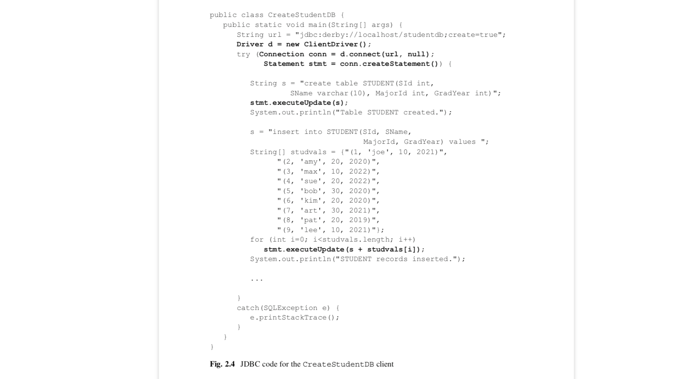
<div align="center">[图2.4]</div>

### 2.1.5 结果集(Result Sets)

一个stement的executeQuery方法执行一个SQL查询语句.这个方法的参数代表一个SQL查询语句,且它返回一个ResultSet类型的对象.一个ResultSet对象代表查询的输出记录.客户端可以遍历结果集来处理这些记录.

为了展示结果集的用法,思考图2.5的StudentMajor类这个例子.它调用executeQuery方法后返回包含每个学生的名称和专业的结果集.接下来的while循环打印结果集中的每一条记录.

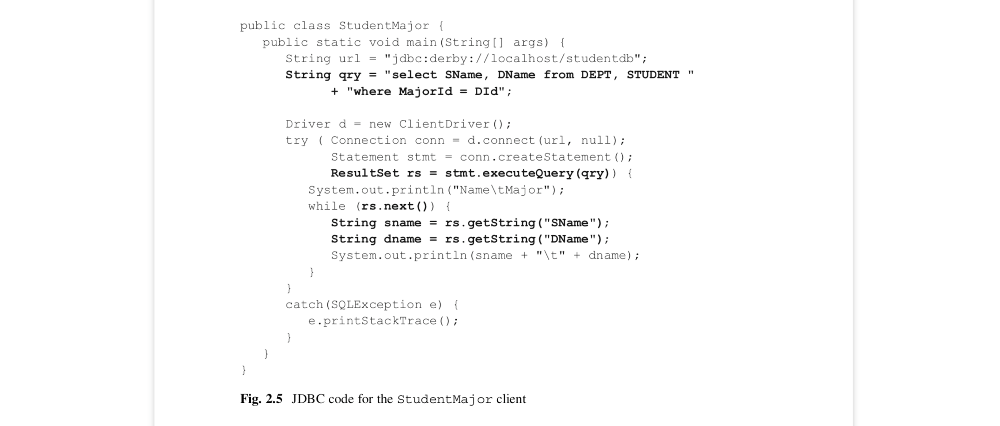 
<div align="center">[图2.5]</div>

一旦一个客户端获取了一个结果集,它会通过调用next方法遍历输出记录集.这个方法移动到下一个记录,如果成功移动返回true,如果没有记录了则返回false.通常,一个客户端用一个循环遍历所有记录,依次处理每一条记录.

一个新的ResultSet对象总是定位到第一条记录之前.所以在可以查看第一条记录之前,你需要调用next方法.因为有这个要求,通常像下面这样遍历这些记录:
```java
String qry = "select ...";
ResultSet rs = stmt.executeQuery(qry);
while (rs.next()) {
  ... // process the record
}
```
这样循环的例子在图2.5里有. 在循环n次以后,rs遍历会定位在结果集的第n条记录.当没有记录处理时循环则会结束.

当处理一条记录,客户端用getInt和getString方法接受它的字段的值.每一个方法带有一个字段名作为参数,并返回该字段的值.图2.5的代码,接受并打印每一条记录的SName和DName字段的值.

结果集绑定着引擎上宝贵的资源.close方法释放这些资源给其他客户使用.因此客户端应该争当"好市民",尽可能快地关闭结果集.一个选择是在while循环结束后显式调用close方法.另一种方式是用Java的自动关闭机制.

2.1.6 使用查询元数据
结果集的结构被定义为每个字段的名称,类型和展示大小.这些信息可以通过接口ResultSetMetaData获取.

当一个客户端执行了一个查询,它通常预先就知道了输出表格的结构.比如,从StudentMajor客户端里的硬编码,就知道它的结果集包含两个字符串字段Sname和DName.

然而,假设客户端程序允许用户提交的查询作为输入.该程序可以调用结果集的getMetaData方法,它会返回ResultSetMetaData类型的对象.然后他可以调用这个对象的方法来判断输出表格的结构.比如,图2.6使用ResultSetMetaData来打印一个结果集的结构.

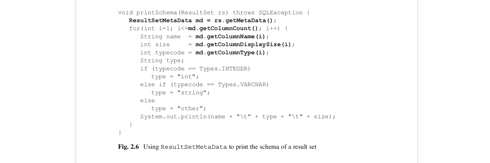 
<div align="center">[图2.6]</div>

这段代码展示了ResultSetMetaData对象的典型用法.它首先调用getColumnCount方法获得结果集的字段数量;然后调用getColumnName,getColumnType和getColumnDisplaySize来判定每列的名称,类型和字段大小.注意列数是从1开始,而不是0.

getColumnType这个方法返回一个整数代表字段类型的代号.这些代号被定义为常量在JDBC类Types中.这个类包含30多种不同的类型的代号,这可以让你想象SQL语言的扩展性是怎样的.这些类型的真实值并不重要,因为一个JDBC程序应该总是用名称来引用这些代号,而非其值.

一个使用元数据比较好的客户端的例子是命令解释器.第一章的SimpleIJ程序就是这样的程序;它的代码展示在图2.7中.因为这可能是你第一个不简单的JDBC客户端的例子,你应该仔细考察它的代码.
 
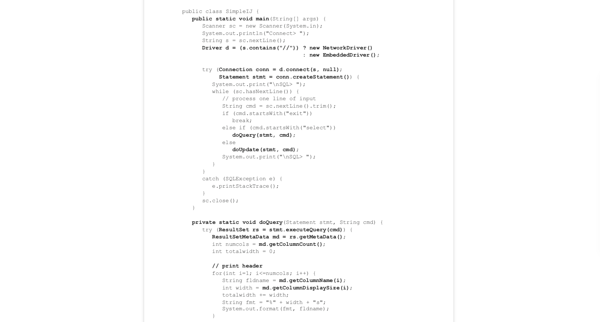
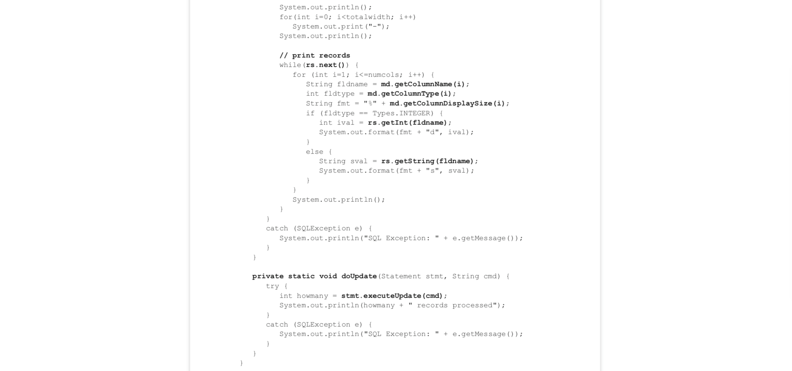  
<div align="center">[图2.7]</div>

main方法一开始读取用户输入的连接字符串,然后用它选择正确的驱动.有代码在连接字符串里查找"//"符号.如果那些符号出现,那么这个字符串肯定定义的是服务端连接,否则是内嵌连接. 这个方法然后通过传递连接字符串给驱动的connect方法建立起连接.

Main方法在while循环之间每次处理一行文本.如果这行文本是SQL语句,视情况doQuery或doUpdate方法会被调用. 用户可以通过输入”exit”退出循环,同时程序也退出.

doQuery这个方法执行查询,然后获得结果集和输出表的元数据.方法的大部分都与判定值的合适空间有关.getColumnDisplaySize的调用会返回每个字段的空间大小需求.图2.7的代码用这些数字来构造字符串格式,以正确排列字段的值.这段代码的复杂性展示了”魔鬼在细节中”的极致.换句话说,多亏ResultSet和ResultSetMetaData的方法,抽象性的比较难的任务是比较容易编码的,然而排列对齐数据这样琐碎的任务却用了更多的编码.

doQuery和doUpdate方法通过打印错误消息来捕获处理错误.这样的错误处理策略允许main方法里的循环可以持续接受sql语句直到用户输入”exit”命令.

## 2.2 高级JDBC
基础JDBC是相对而言比较容易使用的,但它提供了相当有限的方式与数据库引擎交互.本小节考虑JDBC所提供的一些额外的,能让客户端在数据库的访问上有更多控制权的特性.

### 2.2.1 隐藏驱动
在基础JDBC,一个客户端通过获得一个Driver对象并调用connect方法来连接数据库引擎.这种策略的问题在于它将依赖数据库厂商特定的代码放到了客户端程序里了.JDBC包含两种将驱动信息与客户端代码分离的,厂商中立的类:DriverManager和DataSource.让我们依次来看它们.

``使用驱动管理器(DriverManager)``
DriverManager类持有驱动的集合.它包含能添加驱动到集合和搜索能处理指定连接字符串的驱动的静态方法.2个这样的方法如图2.8所示.


<div align="center">[图2.8]</div>

思路是一个客户端为每一个它可能使用的数据库调用registerDriver方法注册它的驱动.当客户端向连接一个数据库,它只需要调用getConnection方法并提供连接字符串参数.驱动管理器不断地让集合中的驱动去尝试解析处理连接字符串,直到某个驱动返回不是null的连接对象.

比如,思考图2.9的代码.头两行代码注册服务端的Derby和SimpleDB的驱动到驱动管理器里.最后两行建立了到Derby服务端的连接;它仅仅定义了连接字符串.驱动管理器决定使用哪个注册了的驱动.

 
<div align="center">[图2.9]</div>

图2.9里DriverManager的使用也不是特别的舒服,因为驱动信息还是没有被隐藏,它出现在registerDriver的调用上.JDBC可以通过允许将驱动定义在系统属性文件里来解决这个问题.比如,Derby和SimpleDB驱动能通过添加下面的文本行到指定文件来注册:
```properties
jdbc.drivers=org.apache.derby.jdbc.ClientDriver:simpledb.remote.NetworkDriver
```
定义驱动信息文件到属性文件里是一种从客户端代码移除驱动配置的优雅的方式.通过改变这一个文件,你就可以改变所有客户端所使用的的驱动信息,而不用重新编译任何代码.

使用数据源(DataSource)
尽管驱动管理器可以从JDBC客户端隐藏驱动,但是他不能隐藏连接字符串.特别是,上面的例子里的连接字符串包含”jdbc:derby”.所以哪个驱动会被使用已经很明显了.JDBC的一个最近新增的特性是javax.sql包下的DataSource接口.这是现在比较流行的管理驱动的策略.

一个DataSource对象封装了驱动和连接字符串两者,因此使得客户端可以不必知道任何连接引擎的细节.要创建Derby的数据源,你需要Derby提供的类 ClientDataSource (面向服务端连接) 和 EmbeddedDataSource(面向内嵌连接),二者都实现了DataSource接口.客户端代码可能像下面这样:
```java
ClientDataSource ds = new ClientDataSource();
ds.setServerName("localhost");
ds.setDatabaseName("studentdb");
Connection conn = ds.getConnection();
```
每一个数据库厂商都提供了它自己的DataSource实现类.因为这些是厂商特定的,它们可以封装驱动的细节,例如驱动名称和连接字符串的语法.使用它们的程序只需要提供必要的值.

使用数据源的好处是客户端不再需要知道驱动的名称或连接字符串的语法.尽管如此,这些实现类依旧是厂商特定的,因此客户单代码仍然不是厂商中立的.这个问题能用多种方式解决.

一个解决方案是数据库管理员将DataSource对象保存在文件里.DBA可以创建对象并用Java序列化将其写到文件里.一个客户端可以通过读文件反序列化的方式来获得数据源对象.这种方式类似于使用属性文件.一旦一个DataSource对象保存在文件里,它就能被任何JDBC客户端使用.而且DBA可以通过简单更换文件内容的方式修改数据源.

第二个解决方案是使用域名服务器替换文件.DBA将DataSource对象放到域名服务器,然后客户端可以从服务器请求数据源.域名服务器是许多计算机环境的基础部分,这种方案是非常容易实现的,虽然细节超出了这本书的范畴.

### 2.2.2 显式的事务处理
每个客户端都是运行一系列的事务.因此,一个事务即是一个工作单位,把所有数据库交互看成一个单元.比如,如果一个事务的某个更新操作失败了,引擎会保证该事物所引起的改变全部失败.

当前的工作单元成功完成之后,事务才会提交.数据库引擎通过将所有修改持久化并释放分配给事务的所有资源(例如锁)来实现提交操作.一旦提交完成,引擎便可以开始新的事务.

当事务不能提交时,事务会回滚.数据库引擎通过撤销事务造成的改变,释放锁来实现回滚.一个事务提交了或回滚了,那么可以说这个事务完成了.

在基础JDBC中,事务是隐式的.数据库引擎根据每一个事务的边界,决定一个事务应该提交还是回滚.这种情况被称为自动提交(autocommit).

自动提交期间,引擎在它自己的事务里执行每一条SQL语句.如果sql执行成功引擎则提交事务否则回滚.只要executeUpdate方法完成,则更新命令就完成;当查询的结果集关闭了,则一个查询命令就完成了.

事务占有锁直到事务提交或回滚后才释放.因为这些锁会导致其他事务等待,更短的事务能提高并发.这个原则也意味着以自动提交模式运行的客户端应该尽可能快地释放结果集.

对于JDBC客户端,自动提交是一个合理的默认模式.一个sql绑定一个事务带来更短的事务,这往往也是正确的.然而,有很多时候一个事务应当包含几条sql.

自动提交是不可取的一种情况是,当一个客户端需要同一时间内执行两个sql.比如考虑图2.10的代码块.这段代码首先执行了获取所有课程的查询.然后循环遍历结果集,针对每一个课程询问用户是否需要删除.如果需要,则执行SQL删除语句.

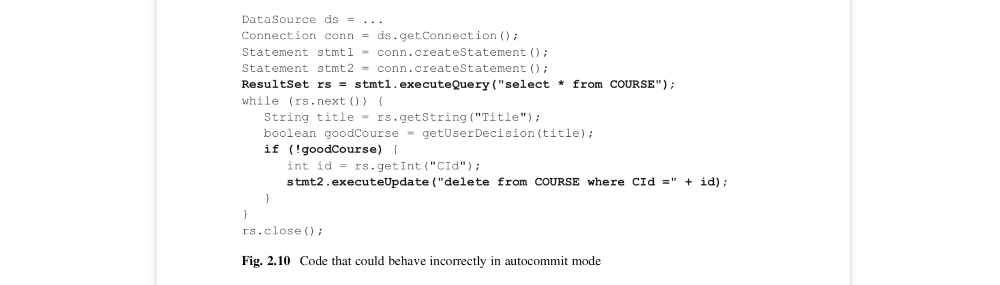
<div align="center">[图2.10]</div>

这段代码的问题是,当结果集还打开的时候,删除语句会被执行.因为一个连接一次仅支持一个事务,它必须在它能创建新事务之前提交查询事务.而且因为查询事务已经提交,访问剩下的结果集则没有意义.这段代码要么抛错要么产生不可能预知的行为.

当多个对数据库的修改操作需要同时发生时,自动提交也是不可取的.图2.11提供了一个样例代码块.这段代码的意图是交换43课程和53课程的教授.然而,如果引擎在第一次调用executeUpdate后第二次调用前崩溃,数据库会变得不正确.这段代码需要两个sql语句发生在同一个事务里,以至于它们要么一起提交要么一起回滚.

 
<div align="center">[图2.11]</div>

自动提交也可能是不方便的.假设你的程序正在执行多个插入操作,比如从一个文本文件加载数据.如果程序运行的时候引擎崩溃了,那么就会出现一些记录被插入了,一些没有被插入的情况.这种情况下,要判断程序在哪个地方失败了,然后只插入缺失的那部分数据是非常耗时且繁琐的.一个更好的选择是将所有插入命令都放在同一个事务里.那么在系统崩溃后所有操作都会回滚,且大概率可以简单重新运行客户端.

Connection接口包含三个允许客户端显式处理事务的方法.图2.12给出了它们的API.一个客户端通过setAutoCommit(false)来关闭自动提交.客户端根据需要通过调用commit或rollback来完成事务,然后开启新的事务.

![<div align="center">[图2.12] 1]</div>(images/e5222d1ba5e5d92a3a76b62659b511bbb40c98fe78b43b4831b67fa9d20a2787.png)  
<div align="center">[图2.12]</div>

当客户端关闭自动提交时,它就承担回滚失败SQL语句的责任.尤其是在事务中有错误抛出了,那么这个客户端必须在错误处理的代码里回滚它.

比如,再次思考图2.10的错误代码块.它的正确版本如图2.13所示.图2.13的代码在sql执行完成后立即调用commit.catch块里包含rollback的调用.rollback的调用需要放在属于它的try块里,以防它自己抛出错误.

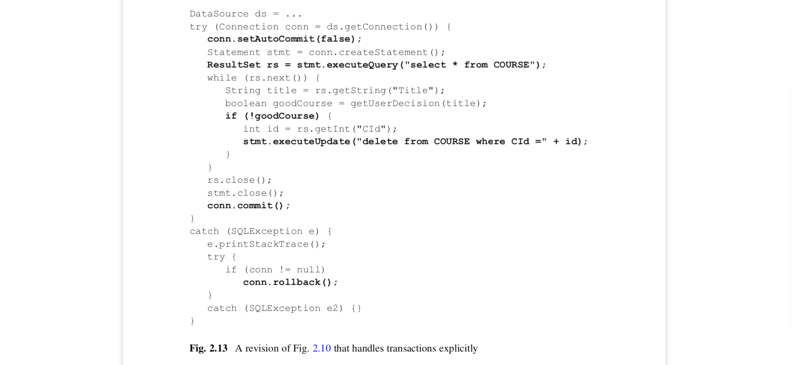 
<div align="center">[图2.13]</div>

乍看起来,回滚期间发生错误会像图2.11那样破坏数据库.幸运的是,数据库回滚算法被设计成能处理那种可能性.第五章包含更深的细节.因此,因为知道数据库引擎会让事情回归正轨,图2.13的代码可以大胆地忽略一个失败的回滚.

### 2.2.3 事务隔离级别
一个数据库服务端通常同一时间有几个客户端在线,每个都运行着它们自己的事务.通过并发执行这些事务,服务端可以提高它们的吞吐和响应时间.因此,并发是一个好东西.然而不受控制的并发可能导致问题,因为一个事务可以通过不合理的方式修改其他事务使用的数据来干扰其他事务.下面展示了这种问题可能出现的三个例子.

``例1:读取未提交的数据``

再次考虑图2.11那个交换上课教授的代码,假设这段代码作为一个事务运行(比如,关闭了自动提交).称这个事务为事务T1吧.同时假设这所大学决定基于开课数量来发放奖金;因此,用户会执行一个统计每一个教授的开课数的事务T2.并且,这两个事务刚好并发运行.尤其是假设T1的第一个更新语句执行后T2开始并马上执行结束.结果是比起他们应得的,教授Brando多了一个课程,教授Einstein少了一个课程,这会影响他们的奖金.

哪里错了?隔离的每个事务都是正确的,但是融合在一起他们会导致这所大学发出错误的奖金.问题在于T2错误地认为它读取的记录是一致的.然而,一个未提交事务写的数据可能不总是一致的.T1的例子里,不一致性发生在两个更新语句中仅一个更新执行了的时间点.当T2在那个时间点读取了未提交的修改后的数据,不一致性导致它做出了错误的运算.

``例2:对存在记录的意外改变``
比如,假设STUDENT表包含一个表示学生饭卡的余额"MealPlanBal"字段.思考图2.14的两个事务.当Joe购买了10$的午餐,事务T1执行了.该事务运行了查找他目前余额的查询语句,确认余额足够后,准确地扣减了他的余额.当Joe的父母给它的饭卡充了1000$时事务T2执行了.该事务简单运行了更新语句增加Joe的余额.

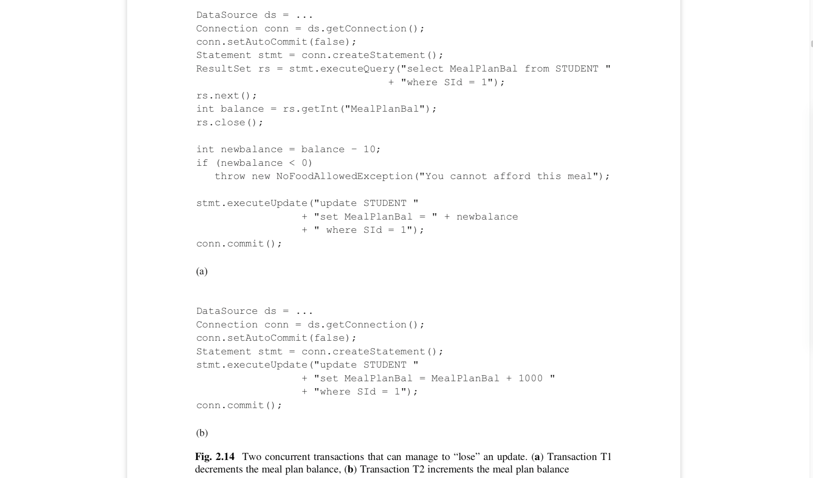
<div align="center">[图2.14]</div>

现在假设在Joe有50$余额时这两个事务同时运行了.尤其是假设在T1调用rs.close之后T2立马开始运行到结束.然后T2先提交,修改余额为1050$.然而,T1并没有感知到这一变化,仍然认为余额是50$.因此它修改余额为40$并提交.结果是1000$并没有加到它的余额上,也就是说更新丢失了.

这里的问题在于T1错误的认为在T1读值和修改值之间的时间里饭卡的余额没有改变.这种假设的正式说法是可重复读(repeatable read),因为事务假设从数据库重复读取一条数据返回的都是同样的值.

``例3:记录数的意外修改``
假设这所大学的晚餐服务去年产生的利润是100,000$.这所大学对从学生那收取过多的费用感觉不太好,所以决定把利润平分给学生们.也就是说,如果目前有1000位学生,那么这所大学会给每位学生的饭卡增加100$.代码如图2.15所示:

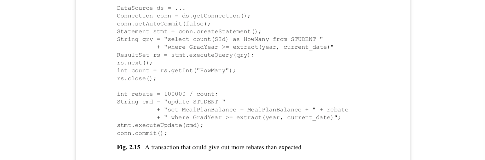 
<div align="center">[图2.15]</div>

这里的事务的问题在于,它认为在计算退还数量计算和STUDENT记录更新之间学生数量不会出现改变.但是假设在记录集关闭和更新语句执行之间,有几个新的STUDENT记录添加到数据库里了.这些新纪录会得到之前计算的退款,然后这所大学到头来花了不只100,000$在退款上.这些新的记录被称为phantom records,因为它们在事务开始后神不知鬼不觉地出现了.

这些例子展示了当两个事务交错时可能会产生这些类型的问题.保证任意事务都不会有这样的问题的唯一方法就是于其他事务隔离执行.这种隔离的形式被称为串行(serializability),在第五章会更详细讨论.

不幸的是,串行的事务可能允许非常慢,因为它们要求数据库引擎极大地减少了其所允许的并发量.因此JDBC定义了以下4个隔离级别,以允许客户端指定事务的隔离级别:

*	读未提交(Read-Uncommited)隔离级别意味着没有隔离.这样的事务可能遭受上面三个例子的任何问题.
*	读已提交(Read-Committed)隔离禁止事务访问未提交的值.不可重复读和幻读依然可能出现.
*	可重复读(Repeatable-Read)隔离级别扩展了读已提交,所以总是可重复读.唯一可能出现的问题是幻读.
*	串行化(Serializable)隔离级别保证没有问题发生.

一个JDBC客户端通过Connection的setTransactionIsolation方法定义它想要的隔离级别.比如,下面的代码块定义了隔离级别为serializable:
```java
DataSource ds = ...
Connection conn=ds.getConnection();
conn.setAutoCommit(false);
conn.setTransactionIsolation(Connection.TRANSACTION_SERIALIZABLE);
```
这4个隔离级别展示了执行速度和潜在问题之间的取舍.换句话说,你想更快地执行事务,你就得接受更大的事务出错概率.这个风险能通过客户端的详尽分析减轻.

比如,你能说服自己幻读和不可重复读不是问题.下面可能是那样的案例,比如,如果你的事务只有插入操作,或只是删除指定存在的记录(例如"delete from STUDENT where SId = 1").在这个案例中,读已提交的隔离级别会快且正确.

再举个例,你能说服你自己任何可能的问题是不太引起注意的.假设你的事务是计算一年里的平均成绩.你断定即使在事务执行过程中出现改变,那些改变也不太可能大到足以影响统计结果.在这个案例中,你可以合理地选择读已提交,甚至读未提交.

许多数据库的默认隔离级别都是读已提交(包括Derby,Oracle,和Sybase).这个级别适合于以自动提交模式发送的简单请求.但是,如果你的程序运行严格的任务,那么你也必须同样严格小心地选择合适的隔离级别.程序员在关闭自动提交模式之后一定要小心地为每一个事务选择合适的隔离级别.

### 2.2.4 预编译语句(Prepared Statements)

许多JDBC客户端程序都是参数化的,从这个意义上说,客户端从用户那接受参数值,然后基于该参数执行SQL语句.图2.16的FindMajor是这种客户端的一个例子.

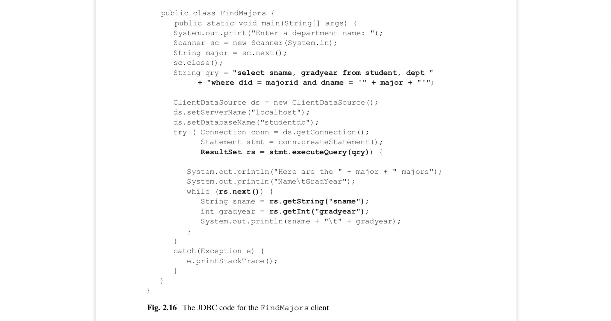
<div align="center">[图2.16]</div>

这个客户端以询问用户一个部门名称开始.然后他将这个名称插入SQL查询语句里执行.比如,假设用户输入值"math".那么生成的SQL查询会像下面这样:
```sql
select SName, GradYear from STUDENT, DEPTwhere DId = MajorId and DName = 'math'
```
注意这段代码是怎么在部门名称两边加上单引号的.作为动态生成SQL语句的替代,客户端使用一个参数化的SQL语句.一个参数化的SQL是带有表示缺失参数值的'?'符号的语句.一个SQL语句可以有好几个参数,每个都用'?'代表.每一个参数都有一个索引值与它在字符串中的位置对应.比如,下面的参数化语句删除了所有还未定义的毕业年份和专业的学生记录.GradYead的索引值是1,MajorId的索引值是2.
```sql
delete from STUDENT where GradYear = ? and MajorId = ?
```
JDBC类PreparedStatement处理参数化的语句.一个客户端用三个步骤处理一个预编译语句:
*	创建一个PreparedStatement给定义好的参数化SQL语句.
*	赋值给参数
*	执行预编译语句

比如,图2.17修改了FindMajors客户端,让它使用预编译语句.修改部分加粗了.最后三条加粗的代码与上面的三点相对应.第一,客户端通过调用prepareStatement并传预编译的sql语句作为参数.第二,客户端调用setString方法赋值一个值给第一个(且唯一)的参数.第三,调用executeQuery执行语句.

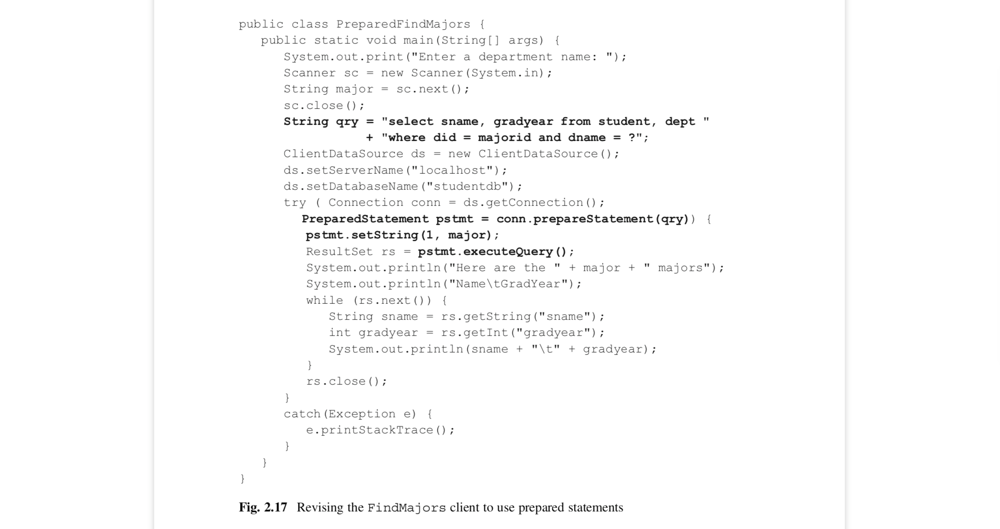 
<div align="center">[图2.17]</div>

图2.18给出了常见的PreparedStament方法的API.executeQuery和executeUpdate方法和Statement中相应的方法类似.区别在于它们不要任何参数.setInt和setString方法给参数赋值.在图2.17中,setString的调用赋值一个部门名称给第一个参数.注意setString方法自动给值两边加上单引号,所以客户端不需要做这个操作.

 
<div align="center">[图2.18]</div>

许多人发现比起显示地创建SQL语句,使用预编译语句更方便.类似于图2.19所示,当在一个循环中生成sql语句时,预编译语句是一个更高效的选择.理由在于数据库引擎可以在不知道参数值的情况编译一个预编译语句.它只用编译一次,然后在循环中重复执行,而不用重新编译.

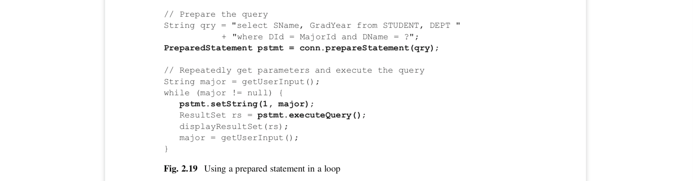 
<div align="center">[图2.19]</div>

### 2.2.5 可滚动和可更新的结果集(Scrollable and Updatable Result Sets)
基础JDBC的结果集是只能向前且不可更新的.完整的JDBC允许结果集可滚动和可更新.客户端可以定位该结果集到任意记录,更新当前记录和插入新记录.图2.20给出了这些新增方法的API.

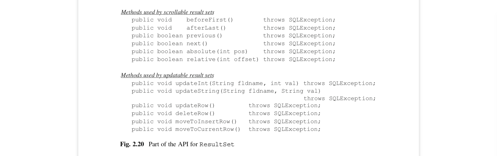
<div align="center">[图2.20]</div>

beforeFirst定位结果集在第一个记录之前,afterLast方法定位结果集在最后的结果集之后.absolute方法定位结果集到指定记录位置,如果没有该记录则返回false.relative方法定位到结果集到一个相对位置.特别地,relative(1)和next等同,relative(-1)和previous相同.

updateInt和updateString方法修改当前记录指定字段.然后,修改不会发送到数据库,直到updateRow被调用.需要调用updateRow感觉有点怪怪的,但是这样就可以让JDBC用一次发给引擎的请求批量更新一个记录的多个字段更新.

插入是用 insert row 这个概念处理的.这行记录不存在于表中(例如,你不能滚动到该行).它的目的是作为新记录的暂存区.客户端调用moveToInsertRow定位结果集到新增的记录,然后调用updateXXX等方法设置它各字段的值,然后调用updateRow插入该记录到数据库中,最后调用moveToCurrentRow定义结果集到插入操作之前的位置.

默认结果集是只向前且不可更新的.如果一个客户端想要更强大的结果集,它可以在Connection的createStament方法里定义.除了基础JDBC的无参方法createStament之外,也有让客户端定义可滚动和可更新的带两参数的方法.比如思考下面的语句:

Statement stmt =conn.createStatement(ResultSet.TYPE_SCROLL_INSENSITIVE,ResultSet.CONCUR_UPDATABLE);

以这个对象产生的所有结果集都是可滚动和可更新的.常量TYPE_FORWARD_ONLY定义一个不可滚动的结果集,CONCUR_READ_ONLY定义一个不可更新的结果集.这些常量可以混合匹配以获得想要的滚动和更新.

比如,回忆图2.10的代码,它允许用户遍历COURSE表,删除指定的记录.图2.21修改该代码以使用可更新结果集.注意一个被删除的记录还留在当前位置上,直到调用next方法.

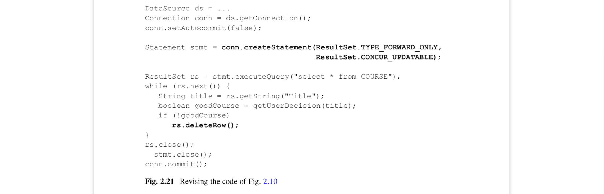 
<div align="center">[图2.21]</div>

一个可滚动的结果集只有有限的作用,因为大多数时间客户端都知道它想要怎么处理输出记录,并不需要处理它们两次.仅仅当客户端允许客户端和一个查询的结果交互,它需要一个可滚动的结果集.比如,思考一个客户端想要展示一个查询的输出作为一个Swing JTable对象.当有太多结果,不能完全显示在屏幕上时,JTable会显示一个滚动条以允许用户通过点击滚动条前后移动记录.这种情况需要客户端提供一个可滚动的结果集给JTable对象,当用户往回滚时它可以接收之前的记录.

### 2.2.6 额外的数据类型
除了integer和string类型,JDBC也包含操作各种类型的方法.比如,思考ResultSet接口.除了getInt和getString方法,也有getFloat,getDouble,getShort,getTime,getDate及其他几个方法.这些方法都是从当前记录的指定字段读取值,并转换(如果可以)成指定的Java类型.通常来说,在数字SQL字段上用数字相关的JDBC方法是理所当然的,其他类型也如此.但是JDBC会将任何SQL值转换为方法所指定的Java类型.特别地,它总是可以将任何类型转成字符串类型.

## 2.3 用Java计算 VS 用SQL
当程序员写JDBC客户端的时候,有一个重要的决定必要做:哪部分的计算应该由数据库引擎来做,哪一个部分应该由Java客户端来做?这节将考察这些问题.

再次思考图2.5的演示客户端StudentMajor.在那个程序中,引擎通过执行SQL查询计算STUDENT和DEPT表的join,承担了所有的计算.客户端只负责接收查询输出并打印它.

相反,你可以像图2.22那样写一个客户端做所有的计算.在那段代码里,引擎只负责创建STUDENT和DEPT表的结果集.客户端做了剩下所有工作,包括计算它们的join和打印结果.

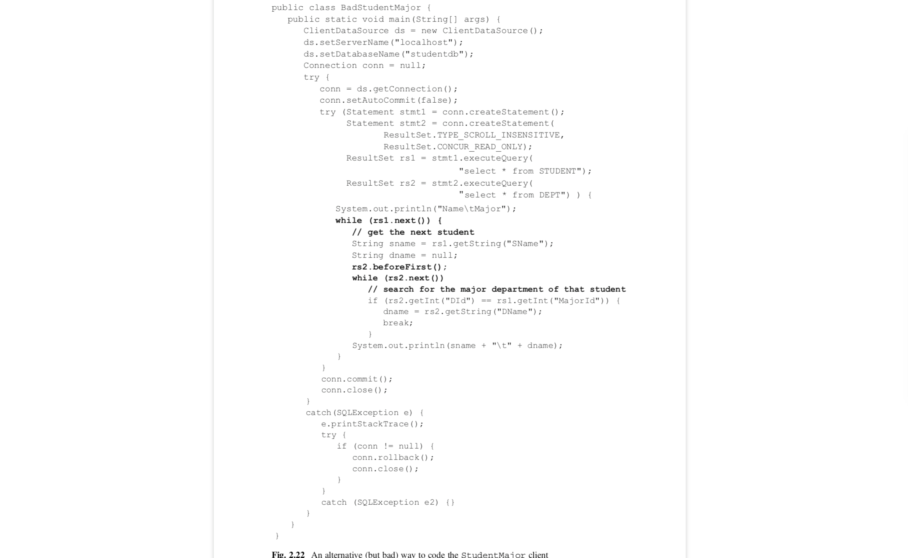 
<div align="center">[图2.22]</div>

这两个版本哪个更好?显然,原来版本更优雅.不仅因为它的代码更少,而且更易读.但是效率怎样呢?一般来说,客户端做的越少效率越高.有两个主要原因:
*	会有更少的数据从引擎传到客户端,如果它们在不同的机器,这点尤其重要.
*	引擎有更详尽的关于每个表是怎样实现的知识和更多计算复杂查询(比如joins)的方法.一个客户端不太可能像引擎那样高效地计算查询.

举个例,图2.22的代码用两个嵌套循环计算join.外层循环遍历STUDENT记录.对每位学生,内层循环搜索与该位学生的专业匹配的系.尽管这是一个合理的join算法,它实在不怎么高效.第13和14章会讨论几个能带来更高效执行的技术.

图2.5和2.22举例说明了一个极好的和一个极端糟糕的JDBC代码,所以比较它们比较容易.但是有时候,这种比较会困难一些.比如,再次思考图2.17的演示客户端PreparedFindMajors的代码,它返回了指定专业系的学生集合.那段代码要求引擎执行join Student和Major表的SQL查询.假设你知道执行一个join可能比较费时.认真思考一番后,你意识到你可以不用join就可以获取你想要的数据.思路就是用两个单表查询.第一个查询扫描DEPT表查询指定专业系的记录,并返回它的DID值.第二个查询在STUDENT表记录搜索有该MajorID的记录.这种算法的代码如图2.23所示.

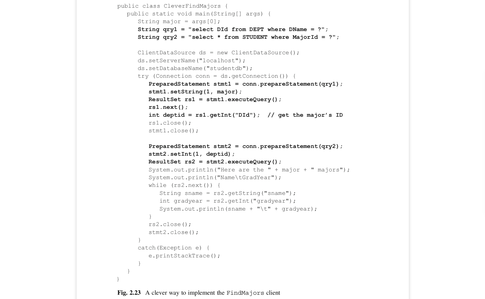  
<div align="center">[图2.23]</div>

这个算法是简单,优雅且高效的.所有它需要做的是顺序扫描每个表,而且应该比join更快.你可以为你的努力而骄傲.

不幸的是,你的努力是徒劳的.新的算法并不是真正的新,只是一个join的聪明实现.特别地,它是一个带有materialized内部表的14章的multibuffer product.一个写的好的数据库引擎会知道这个算法,如果它确实最高效,则会使用它计算join.因此你的所有小聪明早已被数据库引擎强先想到了.这个道理对StudentMajor客户端代码也是一样的:交给引擎去做往往是最高效的策略(也是最简单实现的).

使用JDBC的初级程序员往往犯的错误是他们想在客户端做的太多.他们可能认为自己知道用Java实现查询的聪明方法.或者他们可能不太确定如何用sql来表达一个查询,而用Java实现感觉更舒服.不管是哪种情况,在Java里实现查询的决定大多数都是错误的.程序员一定要信任数据库引擎会做好它的工作.

## 2.4 章节总结
*	JDBC方法管理Java客户端和数据库引擎之间数据的传输.
*	基础JDBC由5个接口构成:Driver,Connection,Statement,ResultSet和ResultSetMetaData.
*	Driver对象封装了连接引擎的底层细节.如果一个客户端想要连接引擎,它必须获得正确的驱动类.驱动类和它的连接字符串是JDBC程序中唯一厂商特定的代码.其他的代码都引用厂商中立的JDBC接口.
*	结果集和连接持有其他客户端可能需要的资源.一个JDBC客户端应该在允许的情况下尽快关闭它们.
*	每个JDBC方法可能抛出SQLException.客户端有责任检查这些错误.
*	ResultSetMetaData接口的方法提供有关输出表的schema信息,也就是每个字段的名称,类型和展示大小.当客户端直接从用户那接受查询时这个信息非常有用,例如在SQL解释器中.
*	基础JDBC客户端直接调用驱动类.完整的JDBC提供DriverManager类和DataSource接口以简化连接流程和使代码更加厂商中立化.
*	DriverManager类持有驱动对象的集合.客户端显式地或通过系统属性文件,用DriverManager注册它的驱动.当客户端想要连接数据库,他提供连接字符串给驱动管理器,然后它为客户端创建连接.
*	DataSource对象是更厂商中立的,因为它封装了驱动和连接字符串.客户端因此可以在不知道任何连接细节的情况下连接数据库引擎.数据库管理员可以创建各种DataSource对象并把他们放在服务器给客户端使用.
*	基础JDBC客户端忽略事务的存在.数据库引擎以autocommit模式执行这些客户端的请求,这意味着每个SQL语句属于它自己的事务.
*	事务中的所有数据库交互都被当成一个单元.当目前单元的工作成功完成,事务才提交.当不能提交时事务会回滚.数据库引擎通过撤销事务产生的所有改变来实现回滚.
*	对于简单不重要的JDBC客户端,自动提交是一个合理的默认模式.如果客户端要执行严格的任务,那么它的程序员就应该谨慎分析它的事务需求.客户端通过调用setAutoCommit(false)来关闭自动提交.这个调用使引其开启一个新的事务.当需要完成当前事务开启新事务时,客户端则调用commit或rollback.当客户端关闭自动提交,它必须处理失败的SQL语句,通过回滚相关的事务.
*	客户端也可以用setTransactionIsolation方法来定义它的隔离级别.JDBC定义了下面四个隔离级别:
	-	Read-Uncommitted(读未提交)隔离意味着完全没有隔离.事务可能因为脏读,不可重复读,幻读问题.
	-	Read-Committed(读已提交)隔离禁止事务访问未提交的值.不可重复读和幻读问题依然可能出现.
	-	Repeatable-Read(可重复读)隔扩展了读已提交,所以总是可重复读.唯一可能的问题是幻读.
	-	Serializable(串行化)隔离保证了没有问题会发生.
*	很明显串行化隔离是优先考虑的,但是它往往会导致事务执行缓慢.程序员必须在客户端分析可能出现的并发错误,并仅在风险可容忍的情况下选择一个更低限制的隔离级别.
*	一个预编译语句有一个相应的带有参数占位符的SQL语句.另外一个预编译语句在参数赋值之前编译,这意味着多次执行一个预编译语句会更高效.
*	完整的JDBC允许结果集可滚动和可修改.默认情况下,结果集是只能向前且不可修改.如果客户端想要更多功能的结果集,它可以在Connection的createStament方法里定义.
*	一般来说写一个JDBC客户端程序的时候要尽可能让引擎做更多的工作.数据库引擎是非常精密的,通常知道获取指定数据最高效的方式.让客户端决定获取指定数据的SQL语句并发给引擎是一个好的想法.简单来说,程序员必须信任引擎的工作.

2.5 建议阅读
一个综合且写的非常好的关于JDBC的书是Fisher et al.(2003),部分内容在http://docs.oracle.com/javase/tutorial/jdbc上作为在线材料.另外,每一个数据库厂商都提供了介绍它们驱动和其他问题的文档.如果你想写一个指定引擎的客户端,建议可以熟悉一下它的文档.

Fisher, M., Ellis, J., & Bruce, J. (2003).JDBC API tutorial and reference(3rd ed.).Addison Wesley.

## 2.6 练习
### 概念练习
2.1 Derby的文档建议你,当执行一连串的插入时关闭自动提交.解释你认为它做这个建议的原因.

### 编程练习
2.2 针对大学数据库写一些SQL查询.针对每一个查询,使用Derby写一个程序执行该查询并打印它的输出表.

2.3 SimpleIJ程序要求每一个SQL语句为一行文本的形式.修改它以至于一个语句可以包含多行且以分号结束,类似于Derby的ij程序.

2.4 为SimpleDB写一个类似于Derby ClientDataSource的类NetworkDataSource.添加这个类到simpledb.jdbc.network包.你的代码不需要实现javax.sql.Datasource接口(及其父类)的所有方法;实际上唯一需要实现的是getConnect()方法.NetworkDataSource应该有哪些厂商特定的方法?

2.5 创建一个包含sql命令的文本文件通常是有用的.这些命令能通过一个JDBC程序批量执行.写一个从指定文本文件读取命令并执行的JDBC程序.假设每一行都是一个独立的命令.

2.6调查一个结果集是怎么用于操作一个Java JTable对象的.(提示:你会需要继承AbstractTableModel类.)然后修改演示客户端FindMajors代码,使其有一个GUI接口展示它的输出在一个JTable里.

2.7为下面的任务写JDBC代码:

(a)	从一个文本文件导入数据到一个存在的表.这个文本文件应该每行有一条记录,并且每条记录的字段以tab分割.文件的第一行应该是各字段的名称.客户端应该以文件名和表名作为输入,然后插入记录到表里.

(b)	导出数据到文本文件里.客户端应该以文件名和表面作为输入,然后将每一条记录的内容写入文件中.文件的第一行应该是这些字段的名称.

2.8本章忽略了null值是有可能出现在结果集的.要检查null值,你可以使用ResultSet里的wasNull方法.假设你调用getInt或getString方法接收一个字段值.如果之后你立即调用wasNull,它会返回true如果收到的数据是null.比如下面的循环会打印毕年份,并假设某些值可能为null:
```java
while(rs.next()) {
	int gradyr = rs.getInt("gradyear");
	if (rs.wasNull())
		System.out.println("null");
	else
		System.out.println(gradyr);
}
```
(a) 在学生名称可能为null的前提下,重写StudentMajor演示客户端的代码
(b) 修改SimpleIJ演示客户端,使其连接Derby(替换SimpleDB).然后基于任何字段值可能为null的前提下重写它的代码.


