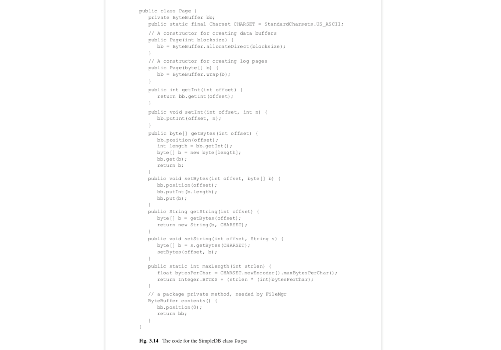

# 第3章 磁盘和文件管理

数据库引擎保存它们的数据在持久化设备上,比如磁盘和闪存.这章调查这些设备的特性和思考能提高速度和可靠性的技术(比如RAID).本章也考察操作系统提供的两个与这些设备交互的接口--block-level接口和file-level接口,而且提出这两个接口的混合使用是最适合数据库系统的.最后,本章仔细思考SimpleDB的文件管理器,学习它的API和它的实现.

## 3.1 持久化数据存储
数据库的内容必须要持久化保存,以至于当数据库系统或计算机崩溃的时候数据不会丢失.这节内容考察2个特别有用的硬件技术:disk drives(磁盘驱动器)和flash drives(闪存驱动器).闪存还没有像磁盘那样普及,尽管随着技术的成熟,它们的重要性会逐渐增长.让我们先来看磁盘.

### 3.1.1 Disk Drives(磁盘驱动器)
一个磁盘包含一个或多个旋转盘片(platters).一个盘片有多个同心圆磁道(track),每一个磁道由一连串的字节构成.字节经由带有读/写头(head)的移动磁盘臂(disk arm)读取.定位磁盘臂到指定的磁道,它下面的磁头可以读取(或写)字节.图3.1描绘了一个盘片的磁盘的俯视图.当然,这张图并没有按照比例去画,因为一般盘片都有几千个磁道.


<div align="center">[图3.1]</div>
现代的磁盘一般都有多个盘片.为了空间利用率,盘片都两两背靠背,结合成看起来像一块的盘片.但是概念上,每一面仍然是一个独立的盘片.这些磁头都不是独立移动的;相反,它们都连接到一个可以同时将它们移动到每个盘片的同一磁道的致动器(actuator).另外,同一时间只有一个读/写磁头在工作,因为只有一条数据总线连到计算机.图3.2描绘了多盘片磁盘的侧视图.


<div align="center">[图3.2]</div>

一个磁盘的大致性能可以用四个值计量:容量,旋转速度,传输率,寻道时间.

一个磁盘的容量是可以存储字节的数量.这个值由盘片的数量,磁道数和每个磁道的字节数决定.

考虑到盘片基本上都趋于标准大小,厂商主要通过提高一个盘片的密度来增加容量,换句话说,就是通过挤出更多磁道和增加每一磁道的字节数来扩容.现在超过40GB的盘片是比较常见的.

旋转速度是盘片旋转的速率,通常以每分钟转速表示.一般从5400rpm到15000rpm.

传输速率是字节从磁头传输到内存或从内存到磁道的速度.比如,整个磁道的字节可以在盘片旋转一周的时间里全部传输完成.因此,传输速率由旋转速度和每磁道字节数决定.100MB/S是常见的.

寻道时间指的是致动器从当前的位置移动磁头到指定磁道的时间.这个值取决于有多少个磁道需要穿过.它可以低至0(如果目标磁道刚好是起点磁道)也可以高至15-20ms(如果目标磁道和起始磁道在盘片的两端).平均寻道时间通常提供致动器速度的一个合理估计.现代磁盘的平均寻道时间为大约5ms.

思考下面的例子.假设一个4盘片的磁盘带有10,000rpm的转速和5ms的平均寻道时间.每一个盘片包括10,000磁道,每一个磁道包含500,000bytes.下面是一些计算的值:

磁盘的容量:
500,000bytes/track x 10,000 tracks/platter x 4 platters/drive = 20,000,000,000bytes, 或大约 20GB

传输速率:
500,000 bytes/revolution * 10,000 revolutions/60 seconds = 83,333,333 bytes/second,或大约83MB/s

### 3.1.2 访问一个磁盘
一次磁盘访问是一个从磁盘读取字节的请求或从内存写一些字节到磁盘.这些字节必须在某个盘片的某个磁道的连续部分上.磁盘驱动器以3个阶段执行一次磁盘访问:
*	移动磁头到指定的磁道.这个时间被称为寻道时间(seek time).
*	等待盘片旋转直到第一个需要的字节在磁头下.这个时间被称为旋转延迟(rotational time)
*	随着盘片继续旋转,它读取磁头下的每一个字节(或写入每个字节),直到最后需要的字节.这个时间被称为传输时间.

执行一次磁盘访问的时间是寻道时间,旋转延迟和传输时间的和.这些时间都由磁盘的机械运动约束.机械移动大大地慢于电子移动,这也是为什么磁盘比RAM那么慢.寻道时间和旋转延迟是特别的烦人.这两个时间没什么意义,但是每一个磁盘都被强迫等待.

计算精确的磁盘访问的寻道时间和旋转延迟是不现实的,因为它需要知道之前磁盘的状态.相反,你可以用它们的平均时间来估计这些时间.你已经知道平均寻道时间.平均旋转延迟是非常容易计算的.旋转延迟可以低至0(如果第一个字节抢号在磁头下),而且可以高至完整的旋转时间(如果第一个字节刚好在磁头前一个位置).平均来说,你需要等1/2旋转知道盘片定位到你期望的位置.因此平均旋转延迟是旋转时间的一半.

传输时间也是非常容易从传输速率计算的.特别地,如果传输速率是r bytes/second 且你正在传输b bytes,那么传输时间是 b / r seconds.

比如,思考磁盘以10,000rpm自转,平均寻道时间5ms和传输速率83MB/s.下面是一些计算出的开销时间:

平均旋转延迟:
60 seconds/minute  x  1minute/10,000revolutions  x  1/2revolution = 0.003 seconds or 3ms

1字节的传输时间:
1byte  x  1second/83,000,000bytes = 0.0000000012seconds or 0.000012ms

1000字节的传输时间:
1,000bytes  x  1second/83,000,000bytes = 0.000012seconds or o.012ms

访问1字节的预估时间
5ms(seek) + 3ms(rotational delay) + 0.000012ms(transfer)=8.000012ms

访问1000字节的预估时间
5ms(seek) + 3ms(rotational delay) + 0.012ms(transfer) = 8.012ms

注意到1000字节的预估访问时间与1字节的基本一样.换句话说,从磁盘访问几个字节没什么意义.实际上,你也不可能做到即使你想.现代磁盘被制造成每个磁道都切分为固定长度的扇区(sector);一个磁盘的读或写都必须一次操作整个扇区.一个扇区的大小可能由磁盘厂商决定,或可以在磁盘格式化的时候选择.一个典型的扇区大小是512字节.

### 3.1.3 优化磁盘访问时间
因为磁盘太慢,所以有几个技术已经被发明出来以帮助优化访问时间.本小节思考三个技术:磁盘缓存,柱面,和磁盘分条.

```磁盘缓存(Disk Caches)```
一个磁盘缓存是绑定磁盘驱动器的内存,且通常是足够大到保存几千个扇区的内容.磁盘读取扇区的任何时候,它都是保存扇区内容到它的缓存中.如果缓存满了,新的扇区将替换老的扇区.当一个扇区被请求访问,磁盘先检查缓存.如果该扇区内容刚好在缓存中,它可以直接返回给计算机,无需实际的磁盘访问.

假设一个应用在一个相对比较短的期间里不止一次请求同一个扇区.第一次请求会将扇区内容加载到缓存中,且接下来的请求会从缓存中得到.然后,这个特性对数据库引擎来说不是特别有用,因为它已经做了自己的缓存(正如你即将在第四章看到的).如果一个扇区被请求多次,引擎会在它自己的缓存里找到,而且不会到磁盘.

磁盘缓存的真正价值在于提前抓取(pre-fetch)扇区的能力.在磁道的其他扇区接下来会被请求的希望下,磁盘会读整个磁道,而不是只读请求的扇区.关键点在于读取整个磁道并不比读一个扇区消耗太多时间.特别地,没有旋转延迟因为磁盘会从当前位置读一圈.比较下面的访问时间:

Time to read a sector = seek time + 1/2 rotation time + sector rotation time
Time to read a track = seek time + rotation + time

也就是说,读单独一个扇区和完整的磁道的时间差小于磁盘旋转时间的一半.如果数据库引擎刚好请求磁道上的其他扇区,那么读取整个磁道到缓存中会节省时间.

```柱面(Cylinder)```
数据库系统可以通过存储相关的信息在相邻的扇区来优化磁盘访问时间.比如,存储一个文件的理想方式是将它的内容放在盘片的同一个磁道.这个策略明显是最好的,如果磁盘是基于磁道做缓存的话,因为整个文件可以通过一次磁盘访问就可以读取完.但是即使没有缓存,这个策略也是好的,因为它省下了寻道时间:每次读取另一个扇区时,磁头刚好已经在正确的磁道上了.

假设一个文件占用了不只一个磁道.一个好的想法是将它的内容保存在盘片的相邻磁道上,这样可以尽可能缩短磁道间的寻道时间.一个更好的策略是将它的内容保存在其他盘片的同一磁道上.因为每一个盘片的读写头都是一起移动,有同样磁道号的所有磁道可以无需额外的寻道时间访问.

有同样的磁道号的磁道集合被称为柱面,因为如果你从磁盘的上面看那些磁道,它们描绘了一个柱面的外沿.实际上,一个柱面可以当成它是一个非常大的磁道,因为它的所有扇区都不需要额外的寻道就可以访问.

```磁盘分条(Disk Stripping)```
另一个优化磁盘访问时间的方法是使用多个磁盘.两个小的驱动器比一个大的驱动器要快,因为它们有两个独立的致动器,因此可以同时相应连个不同扇区的请求.比如,2个20GB磁盘,同时工作会比一个单独的40GB磁盘快1倍.这种加速是成正比的:一般来说,N个磁盘会是单个磁盘的N倍快.(当然,几个小的磁盘也比单个大磁盘更贵,所以增加的效率也是有成本的.)

然而,如果多个磁盘不能保持持续工作,多个小磁盘所带来的效率将会被丢失.假设,比如,一个磁盘包含常被访问的文件,然而其他磁盘包含不常用的归档文件.那么第一个磁盘会做所有的事情,而其他磁盘多数时间都保持空闲.这样的配置跟单个磁盘的效率几乎一样.

所以问题在于怎样平衡多个磁盘间的工作负载.数据库管理员可以尽力去分析文件的使用以最好的方式分散每个磁盘上的文件,但是这种方式不太现实:很难去分析和保证,而且得持续更新评估和修正.幸运的是,有一个更好的策略,被称为disk stripping(磁盘分条).

磁盘分条策略使用一个控制器从操作系统层面隐藏那些小的磁盘,将它们抽象成一个大的磁盘提供给上层访问.控制器映射虚拟磁盘的请求到真实磁盘的扇区请求.这种映射像接下来描述的那样工作.假设有N个小磁盘,每个磁盘有k个扇区.则虚拟磁盘有N*k个扇区;这些扇区交替的指向真实磁盘的扇区.磁盘0包含虚拟扇区0,N,2N等.磁盘1包含虚拟扇区1,N+1,2N+1等等,类似这样.disk stripping(磁盘分条) 这个术语来自于下面的意象:你可以想象每个小磁盘被画上了不同的颜色,那么虚拟磁盘看起来像每个扇区交替的画着不同颜色的彩条.就像图3.3那样.

<div align="center">[图3.3]</div>

### 3.1.4 用镜像优化磁盘的可靠性

数据库的用户期望他们的数据能安全保存在磁盘上,不会丢失或损坏.不幸的是,磁盘并非完全可靠.盘片上的磁性物质可能退化,导致扇区不可读.异或是因为一点灰尘或突然的震动都可能导致读/写磁头刮花正在访问的盘片上的扇区.

最常见的预防磁盘故障方法是保存磁盘内容的副本.比如你可以每晚备份磁盘;当一个磁盘失败,你可以直接买一个新的磁盘并把备份拷贝上去.这种策略的问题是你会失去磁盘的所有在备份和磁盘故障之间的改变.换句话说,你需要保存两个相同版本的磁盘;这些版本互相被称为各自的镜像.

像磁盘分条那样,需要一个管理两个镜像磁盘的控制器.当数据库系统发起一个磁盘读取请求,控制器能访问任意磁盘的指定扇区.当一个磁盘写请求发生时,控制器实现同样的写入操作到两个磁盘.理论上,这些两个磁盘写操作会并发执行,所以不会需要额外的时间.然而,实际上,为了预防系统崩溃按顺序写入镜像是非常重要的.所以如果两个镜像是并发写的,扇区的两份副本可能都会丢失,而如果镜像是顺序写的,那么至少镜像的其中之一不会损坏.

假设互为镜像的磁盘中其中之一出故障了.数据库管理员可以通过下面的流程恢复系统:
1.	关闭系统
2.	用新的磁盘替换出故障的磁盘
3.	从好的磁盘赋值数据到新的磁盘
4.	重启系统

不幸的是,这个流程并不是万无一失的.如果在复制数据到新磁盘期间好的磁盘出现故障了,数据仍然可能丢失.几个小时内两个磁盘都出故障的几率是非常小的(大约是1/60,000),但是如果这个数据库是非常重要的,这么小的风险也是不能接受的.你可以通过使用3个镜像磁盘替代两个磁盘来减少这个风险.在这种情况下,仅当在几个小时内三个磁盘同时出故障了,数据才有可能丢失;那样的可能性,虽然不是0,但也可以忽略不计了.

镜像可以和磁盘分条一起使用.一种常见的策略是做分条磁盘的镜像.比如,用户可以保持40GB的数据在4个20GB的分条磁盘上:2个磁盘会被分条,另外两个则是分条磁盘的镜像.这样的配置是快且可靠.如图3.4所示.

<div align="center">[图3.4]</div>

### 3.1.5 通过存储奇偶校验位来提高磁盘可靠性

镜像的缺点在于它需要两倍的磁盘保存同样的数据. 当使用磁盘分条的情况这个开销就比较显著了.如果你想用15个20GB磁盘保存300GB数据,那么你需要另外买15个磁盘作为镜像.对于大型数据库来说,通过许多小磁盘分条来创建一个大的虚拟磁盘并非罕见,仅仅作为镜像购买相同数量的磁盘是有点令人不快的.如果不用那么多镜像磁盘就可以从一个出故障的磁盘恢复就好了.

实际上,有一种机智的办法可以仅使用一个磁盘就可以恢复任意数量的磁盘.这个策略是通过保存奇偶校验信息在副本上来实现的.对一个字节集合S,奇偶校验位是如下定义的:

*  如果S包含奇数个为1的字节,S的奇偶检验位为1
*  如果S包含偶数个为0的字节,S的奇偶校验为0

换句话说,如果你把奇偶检验位添加到S,那么S总会有偶数个1字节.

奇偶校验位有下面有趣且重要的属性:任意字节的值可以有其他字节的值算出,只要你同时知道它们的奇偶校验位.比如,假设S={1,0,1}.那么S的奇偶校验位为0,因为它有偶数个1.假设你失去了第一个字节的值.因为奇偶校验位为0,{?,0,1}的集合一定有偶数个的1,你可以推算出失去的字节一定是一个1.相似的推算也适用于其他字节(包括奇偶校验位).

奇偶校验位的这种用法延伸到磁盘.假设你有N+1个同样大小的磁盘.你选择其中一个作为奇偶校验磁盘,并让其他N个磁盘保存分条数据.奇偶校验磁盘的每一个字节通过所有其他磁盘的相应字节的奇偶检验值计算出来.如果任何磁盘出故障了(包括奇偶校验磁盘),该磁盘的内容可以通过查找其他磁盘的内容,一个字节一个字节地重新构造出来.看图3.5.

<div align="center">[图3.5]</div>

这些磁盘通过一个控制器管理.读写请求的处理基本与分条磁盘一致.控制器确定所请求扇区所在的和实现读写操作的磁盘.区别在于写请求必须也更新相应的奇偶校验磁盘的扇区.控制器可以通过确定被修改扇区的变化字节来计算出被修改的奇偶校验位.规则是如果一个字节改变了,那么相应的奇偶校验位也必须改变.因此,控制器需要4次磁盘访问来实现一个扇区写入操作.它必须读取该扇区和相应的奇偶校验扇区(为了计算虚拟的奇偶校验字节),而且它必须写入两个扇区的新内容.

奇偶校验信息的使用是有点魔幻的.从一个磁盘就可以可靠地备份任意数量的其他磁盘的这个意义来说.然而这个魔法伴随着两个缺陷.

第一个使用奇偶校验的缺陷在于一个扇区写入是更费时间的,因为它需要从两个磁盘读和写.经验表明使用奇偶校验降低分条效率的20%左右.

第二个缺陷在于数据库对于不可恢复的多磁盘故障更脆弱.思考当一个磁盘出故障时什么会发生:其他所有的磁盘都需要用于故障磁盘的重构,其中的任何一个出故障都是灾难性的.如果数据库有许多小磁盘构成(假设大约100),那么出现下一个故障还是很有可能的.与镜像对比这种场景,镜像从一个故障磁盘恢复仅需要相应的镜像不出故障即可,这种出故障的可能性是更低的.

### 3.1.6 RAID

前面的小节思考了3种方式来使用多磁盘:分条来提高磁盘访问速度,镜像和奇偶校验预防磁盘故障.这些策略使用一个控制器从操作系统层面来隐藏多磁盘的存在,并抽象为一个单独,虚拟磁盘.控制器映射每一个虚拟的读/写操作到底层磁盘的一个或多个操作.控制器可以通过软件或硬件来实现,尽管硬件控制器更普遍.


这些策略是一个被称为RAID的更大策略集合的一部分,RAID是 Redundant Array of Inexpensive Disks的缩写.有7个RAID级别.


*	RAID-0是分条,没有任何针对磁盘故障的保护.如果分条磁盘中的一个磁盘出故障了,那么整个数据库很有可能被毁坏了.

*	RAID-1是镜像分条

*	RAID-2使用字节分条而不是扇区分条,并且一个冗余机制是基于错误纠正而不是奇偶校验.这个策略被证明是难于实现且性能糟糕的.它不再被使用.

*	RAID-3和RAID-4使用分条和奇偶校验.它们的区别在于RAID-3使用字节分条,然而RAID-4使用扇区分条.一般来说,扇区分条更高效,因为它与磁盘访问单元相对应.

*	RAID-5和RAID-4类似,除了它的奇偶校验信息是分散于多个数据磁盘而不是单个独立磁盘.也就是说,如果有N个数据磁盘,那么每个磁盘的第N个扇区都保存奇偶校验信息.这个策略比RAID-4更高效因为不再会有单个奇偶校验磁盘成为瓶颈的情况.看练习3.5.

*	RAID-6与RAID-5类似,除了它保存两种奇偶校验信息.这个策略因此可以处理两个并发的磁盘故障,但是需要另一磁盘保存额外的奇偶校验信息.


最流行的RAID级别是RAID-1和RAID-5.它们之间的选择其实是镜像和奇偶校验的pk.镜像在数据库安装中是更可靠的选择,首先因为它的速度和健壮性,其次因为额外磁盘的成本已经变的很低了.


### 3.1.7 闪存

在目前的数据库系统中,磁盘是更常见的,但是它们有一个难以逾越的缺陷--它们的操作完全依赖于盘片和致动器的机械移动.这个缺陷使得磁盘自然比电子存储慢,也容易因为掉落,震动和其他冲击受到影响.


闪存是更现代的,有潜力替换磁盘的技术.它使用半导体技术,类似RAM,但是不需要不停的电力供应.因为它完全是电子的,所以它可以比磁盘更快地访问数据,且没有会受到损伤的移动部件.


闪存目前的寻道时间是50微秒左右,比磁盘块100倍.目前闪存的传输速率依赖于它连接的总线接口.闪存连接比较快的内部总线,传输速率是不低于磁盘的.然而,外接的USB闪存盘的传输是比磁盘慢的.


闪存会逐渐磨损.每一个字节可以重写的次数是固定的;尝试写一个已经触及它极限的字节会导致闪存出故障.目前,这个最大值是数百万,对大多数数据库系统已经足够高了.高端闪存使用耗损均衡技术,它可以自动将经常写的字节移到很少写的地方;这个技术允许闪存工作知道所有字节都到它们的重写次数极限.


闪存提供基于扇区的接口给操作系统,这使得闪存看起来像磁盘. 和闪存一起使用RAID技术是可能的,尽管分条不是那么重要,因为闪存的寻道时间很低.


采用闪存的主要障碍是它的价格.价格大约是相当的磁盘的100倍.尽管闪存和磁盘的价格会持续下降,最终闪存会便宜到足以成为主流.到那个时候,磁盘可能沦为档案存储器和超大数据库的存储器.


闪存也可以作为一个持久化的前端用来加强磁盘.如果数据库完全可以保存在闪存中,那么磁盘将不会被使用.但是随着数据库逐渐变大,不经常被使用的扇区会迁移到磁盘.


在数据库引擎看来,闪存有跟磁盘一样的属性:它是持久化的,慢的,且以扇区访问的.(它只是刚好没有磁盘那么慢)因此,我会遵循目前的术语,在本书的余下部分使用磁盘("the disk")来指代持久化存储.


## 3.2 磁盘的块级(Block-Level)接口

磁盘可能有不同的硬件特征--比如,它们不需要有同样的扇区大小,而且它们的扇区可能以不同的方式定位.操作系统负责隐藏这些细节,提供一个访问磁盘的简单接口给程序应用.


块(block)的概念是这个接口的核心.块和扇区类似,除了它的大小是由操作系统(OS)定的.所有磁盘的块都有同样的大小.操作系统维护块和扇区的映射.操作系统给磁盘的每块赋值一个块号(block number).给一个块号,操作系统可以确定真实的扇区地址.


块的内容不能直接从磁盘访问.相反,组成块的扇区必须读取到一个内存页(memory page),在那里被访问.要修改一个块的内容,客户端必须读取块到一个内存页,修改页中的字节,然后将页的数据写回磁盘上的块.


一个操作系统通常会提供访问磁盘块的若干方法,比如:

*	readblock(n,p)读取磁盘的块n到内存的p内存页.

*	writeblock(n,p)写内存页p的字节到磁盘的块n.

*	allocate(k,n)在磁盘上查找k个连续未使用的块,标记它们为已使用,并返回第一个的块号.新分配的块应该可能靠近块n.

*	deallocate(k,n)从块n起标记连续k个块为未使用.


操作系统会跟踪磁盘的哪些块是可用于分配的哪些是不能的.它可以采用两种基本的策略:磁盘映射(disk map)或空闲列表(free list).


磁盘映射是一连串的字节,一个字节代表磁盘的一个块.比特值1表示相应的块是空闲的,0代表该块已被分配.磁盘映射是保存在磁盘上的,通常是在前几个块上.操作系统可以简单地改变磁盘映射的n比特位为0来释放块n.它可以通过在磁盘映射中搜索连续值为1的k个比特位并将它们设为0来分配k个连续块.


空闲列表是一个数据块(chunk)的链,其中每一个数据块都是未分配块(block)的连续序列.每个数据块的第一个块保存两个值:数据库(chunk)的长度和链(chain)上的下一个数据块的块号(block number).磁盘的第一个块包含链的第一个数据块的地址.当操作系统被请求分配k个连续块,它在空闲列表中搜索一个足够大的块.然后它有两种选择:从空闲列表移除整个数据块并释放,或者切分出k长度的块且仅分配那些块.当释放数据块时,操作系统只需要简单地将其插入到空闲列表.


图3.6描绘一个应用这两种技术分配块0,1,3,4,8和9的磁盘.a部分展示保存在磁盘0块的磁盘映射;比特值0表示一个分配的块.b部分展示相应的空闲列表.0块包含值2,意味着空闲列表的第一个数据库开始于块2.块2包含两个值1和5,表示该数据库包含1个块且下一个数据块开始于块5.类似地,块5的内容表示它的数据块是3个块长度,且下一个数据块在块10.块10的-1值表示它是最后的数据块,其包含所有剩下的块.

<div align="center">[图3.6]</div>

空闲列表技术需要极少的额外空间;所有你需要的是在块0保存一个整数执行列表的第一个块.另一方面,磁盘映射技术需要空间保存映射.图3.6a假设映射可以完整保存在一个块里.一般来说,会需要几个块;看练习3.7.磁盘映射的优势在于它能更好地给操作系统展示磁盘上的洞("holes")(即空闲的块)在哪.比如,如果操作系统需要支持一次分配多个块,磁盘映射往往会被选择.


## 3.3 磁盘的文件级别(File-Level)接口

操作系统提供另外一个更高级别的接口给磁盘,被称为文件系统(file system).一个客户端视一个文件为被命名的一连串字节.在这一级,没有块(block)的概念.相反,一个客户端可以从文件的任意位置开始读(或写)任意数量的字节.


Java类RandomAccessFile提供了一个典型的API给文件系统.每一个RandomAccessFile对象持有一个文件指针(file pointer)指示下一个会被读或写的字节.这个文件指针可以通过seek的调用来显式地设置.方法readInt(或writeInt)的调用也会移过它读(或写)的整数.


图3.7的代码块是一个例子,其给存储在"junk"文件的字节7992-7995位置的整数增加了1.readInt的调用读取在7992字节位置的整数,并移动文件指针越过它到字节7996位置.接下来的seek的调用将文件指针设回字节7992位置,以便该位置的整数可以被重写.


<div align="center">[图3.7]</div>


注意到readInt和writeInt的调用表现的好像磁盘是被直接访问的,实际上其中隐含着磁盘块必须通过内容页来访问的事实.一个操作系统通常保留若干内存页给自己使用.这些页被成为I/O缓存.当一个文件被打开,操作系统分配一个I/O缓存给该文件,这对客户端是透明的.


文件级别(file-level)的接口使得一个文件可以被想成是一连串的块.比如块是4096字节长(也就是4k 字节),那么字节7992则在文件的块1里(也就是说,它的第二个块).块引用像"block 1 of the file"被称为逻辑块引用,因为它们告诉我们块在文件中的位置,而不是磁盘上的位置.


给一个特殊的文件位置,seek方法确定该位置所在的真实磁盘块.特别地,seek实现以下两种转换:


*	它转换指定的字节位置到一个逻辑块引用

*	它转换逻辑块引用到一个物理的块引用


第一个转换时容易的--逻辑块号就是字节位置除以块大小.比如假设4k字节大小的块,字节7992是在块1因为7992/4096=1(整数除).


第二个转换有点难度,且依赖于一个文件系统是如何实现的.本小节的余下部分思考3个文件实现策略:连续分配(contiguous allocation),基于扩展分配(extent-based allocation),以及索引分配(indexed allocation).这三种策略都将磁盘文件位置信息保存到一个文件系统目录(file system directory).seek方法转换逻辑块引用到物理块引用访问这个目录的块.你可以把这些文件访问想成是文件系统强加的隐含负担.操作系统试图减少这个负担,但是它们不能消除它.


```连续分配 (Continuous Allocation)```

连续分配是最简单的策略,这种策略以一连串的块保存每个文件.为了实现连续分配,文件系统文件夹持有每个文件的长度和第一个块的位置.映射逻辑块到物理块引用是简单的--如果文件起始于磁盘块b,那么块文件的块N则位于磁盘块b+N.图3.8描绘了一个有两个文件的文件夹:一个起始于块32,长度为48块,名为"junk"的文件,和一个起始于块80,长度为16块名为"temp"的文件.


<div align="center">[图3.8]</div>


连续分配有两个问题.第一个问题是一个文件如果在它之后跟着其他文件,它就不能被扩展.图3.8的"junk"文件是这种文件的一个例子.因此,客户端必须以它们可能需要的最大块数来创建文件,当文件没有填满,则会导致空间浪费.这种问题被称为内部碎片.第二个问题是随着磁盘逐渐被占满,会有很多小的未分配块的数据块,但是没有大的数据块.因此,可能出现不能创建大文件的情况,尽管,磁盘包含许多空闲空间.这个问题被称为外部碎片.换句话说:

*	内部碎片是文件内部的浪费空间

*	外部碎片是文件外部的浪费空间


```基于扩展(extent-based)分配```

基于扩展分配策略是连续分配策略的一种变种,其既减少内部也减少外部碎片.基于这种策略,操作系统会将文件保存为一系列的定长扩展(extent),每一个扩展是一连串的数据块.一个文件一次扩大一个扩展.对于这种策略,文件系统文件夹包含文件的每个扩展的第一个块的列表.


比如,假设操作系统以8块大小的扩展来保存文件.图3.9描绘了包含"junk"和"temp"这两个文件的文件系统文件夹的样子.这些文件的大小和之前没变,只是现在被分割成了扩展."junk"文件有6个扩展,"temp"文件有2个扩展.

<div align="center">[图3.9]</div>


为了找到包含文件块N的磁盘块,seek方法在文件系统文件夹里搜索该文件的扩展列表;然后它在扩展列表里搜索包含块N的扩展,在得到的扩展里可以计算出该块的位置.比如思考图3.9的文件夹."junk"文件的块21可以像下面这样计算:

1.	块21在文件的扩展2,因为21/8=2(整除)

2.	扩展2开始于文件的逻辑块2*8=16

3.	所以块21在该扩展的块21-16=5

4.	文件的扩展列表表明扩展2开始于物理块696

5.	因此块21的位置是696+5=701


基于扩展分配减少了内部碎片,因为不会浪费超过一个扩展的空间.而且外部碎片也消除了,因为i所有的扩展都是同样大小.


索引分配

索引分配采用不同的方式--它甚至不试图以连续数据块的方式来分配文件.相反,文件的每一个块都是独立分配的(即以1个块长的扩展,如果你这样想的话).操作系统通过分配一个特殊的索引块(index block)给每个文件,这个索引块持续跟踪分配给该文件的磁盘块.也就是说,一个索引块ib可以看成一个整数数组,ib[N]的值代表文件的逻辑块N的磁盘块.因此计算任意逻辑块的位置是轻而易举的--你只需要在索引库里查找即可.


图3.10a描绘了包含"junk"和"temp"这两个文件的文件夹信息."junk"的索引块是块34.图3.10b给出了该块的前几个整数.从这个图可以非常容易看出"junk"文件的块1是在磁盘块103.


<div align="center">[图3.10]</div>

这种方式的优势是一次分配一个块,所以没有碎片产生.它主要的问题在于文件有一个最大大小限制,因为它们的大小受限于索引块的大小.UNIX文件系统通过支持多级索引块来解决这个问题,从而允许最大的文件可以是非常大的.看练习3.12和3.13


## 3.4 数据块系统和操作系统

操作系统提供支持磁盘访问的两种级别:块级支持和文件级支持.数据块引擎应该选择哪种级别?


选择使用块级的优势在于能给引擎对磁盘块使用的完全控制权.比如,常被使用的块可以保存在磁盘的中间,在那寻道时间为少一些.类似地,往往被一起访问的块可以保存在相邻的位置.另一个优势在于数据库可以不受操作系统在文件上的限制约束,从而支持大于操作系统限制或跨越多个磁盘的表.


另一方面,块级接口的使用有几个劣势:这种策略比较难以实现;它需要磁盘挂载为原始磁盘,也就是说,磁盘块不属于文件系统;而且它需要数据库管理员熟悉块访问方式相关的知识,以对系统进行微调.


另一个极端是让数据库引擎尽可能地使用操作系统文件系统.比如,每一个表可以保存在单独的文件里,然后引起会使用文件级操作来访问记录.这个策略是更容易实现的,而且它允许操作系统对数据库系统隐藏真实的磁盘访问.这种场景是不可接受的,有两个原因.首先,数据库系统需要知道块的边界在哪,这样它就可以高效地组织和获取数据.第二,数据库系统需要管理它们自己的页,因为操作系统管理I/O缓存的方式不适合数据库查询.你会在后面的章节遇到这些问题.


一个面向数据库系统的组合策略是保存它所有的数据在一个或多个操作系统文件里,但是把它们当作原始磁盘那样.也就说,数据库系统使用逻辑文件块来访问它的"磁盘",操作系统通过seek方法,负责映射每一个逻辑块引用到它相应的物理块.因为检查文件夹时,seek可能引起磁盘访问,数据库系统不能完全控制磁盘.然而,和数据库访问的大量块比起来,这些额外的块通常不是很大.因此,数据库系统能使用高级接口的同时,对磁盘访问保持不错的控制.


这种组合策略别用于许多数据库系统.微软的Access保存所有东西在一个单独的.mdb文件里,然而,Oracle,Derby,和SimpleDB使用多个文件.


## 3.5 SimpleDB文件管理器

数据库引擎和操作系统交互的部分被成为文件管理器(file manager).这一节考察SimpleDB的文件管理器.3.5.1节考察客户端如何使用文件管理器;3.5.2节考察它的实现.


### 3.5.1 使用文件管理器

一个SimpleDB数据库保存在多个文件里.每一个表,索引以及日志文件和目录文件都有各自的文件.SimpleDB的文件管理器通过simpledb.file包,给这些文件提供块级的访问.这个包有3个类:BlockId,Page和FileMgr.这些API展示在图3.11.


<div align="center">[图3.11]</div>

一个BlockId对象通过文件名和逻辑块号标识指定块.比如,下面的声明,创建了一个到student.tbl文件的块23的引用.filename和number方法分别返回它的文件名和块号.


BlockId blk = new BlockId("student.tbl",23)


一个Page对象持有一个磁盘块的内容.它的第一个构造函数创建从操作系统I/O缓存获取内存的页;这个构造函数被缓存管理器使用.它的第二个构造函数创建从一个Java数据获取内存的页;这个构造函数主要被日志管理器使用.各种get和set方法使客户端可以在页的指定位置保存或访问数据.一个页可以有3值类型值:ints,strings,和"blobs"(比如,任意字节数组).如果需要的话,可以添加额外类型的相应方法;看练习3.17.一个客户端可以在页的任意偏移位保存值,但是有责任知道哪些值保存在哪里.从错误的便宜位置尝试获取一个值会引发不可预料的结果.


FileMgr类处理和操作系统的文件系统真实的交互.它的构造函数带有两个参数:一个字符串代表数据库的名称和一个整数代表每一个块的大小.数据库名称作为包含该数据库所有文件的文件夹名称;这个文件夹位于引擎的当前文件夹.如果没有该文件夹,那么一个新数据库的文件夹会被创建.这种情况,isNew方法会返回true,否则返回false. 对于一个新数据的正确初始化,这个方法是需要的.


read方法读取指定块的内容到指定的页.write方法实现相反的操作,写入一个页的内容到指定的块.length方法返回指定文件的块数.


引擎有一个FileMgr对象,它会在系统启动的时候被创建.SimleDB类创建这个对象,且它的fileMgr返回这个对象.


图3.12的FileTest类展示了这些方法的使用.这个方法有3块.第一个块初始化了SimpleDB对象;3个参数规定引擎应该使用名为"studentdb"的数据库,使用400字节长的块和8个buffer的缓冲池.400字节块大小是SimpleDB的默认.它是人为地弄小了,以便你可以轻易创建有许多块的演示数据库.在一个商业数据库系统,这个值会设置成操作系统定义的块大小;一个典型的块大小是4K字节.缓冲池会在章节4讨论.


<div align="center">[图3.12]</div>


图3.12的第二块写入字符串"abcdefghijklm"到"testfile"文件的第二块的88字节位.然后它调用maxLength方法确定该字符串的最大长度,以便确定接着该字符串的位置.然后写入整数345到该位置.


第3块读取这个块到另一页并从它抽取那两个值.


### 3.5.2 实现文件管理器

这小节考察三个文件管理类的实现


```BlockId类```

BlockId如图3.13所示.fileName和number方法之外,它也实现了equals,hashCode,和toString.


<div align="center">[图3.13]</div>

```Page类```

Page类的实现代码如图3.14所示.每个page用Java的ByteBuffer对象来实现.一个ByteBuffer对象包装一个字节数组带有在数组的任意位置读和写的方法.这些值可以是基本类型数据(比如整数)也可以是更小的字节数组.比如,Page的setInt方法通过调用ByteBuffer的putInt方法来保存整数在页里.Page的setBytes方法保存一个blob为两个值:第一个是指定blob的字节数,然后是字节本身.它调用ByteBuffer的putInt方法来写整数,调用put方法来写字节.


ByteBuffer类没有方法读和写字符串,所以Page选择将字符串写为blobs.Java的String类有一个方法getBytes,它转换一个字符串为一个字节数组;它也有一个转换字节数组为字符串的构造器.因此,Page的setString方法调用getBytes将string转换为bytes,然后写为一个blob.类似的Page的getString方法苍一个字节缓存读取一个blob,然后转换这些字节为一个字符串.


字符串和它的字节呈现由字符编码决定.有几个标准编码存在,比如ASCII和Unicode-16.Java的Charset类包含实现许多这些编码的实现类.String的构造器和它的getBytes方法带有一个Charset参数.在图3.14你可以看出Page使用ASCII编码,但是你可以改变CHARSET常量为你想要的编码.



<div align="center">[图3.14]</div>


一个字符集选择每个字符串需要编码多少字节.ASCII每一个符串使用一个字节,然而Unicode-16每个字符使用2到4个字节.因此,一个数据库引擎不能精确地知道一个给定的字符串到底需要多少个字节.Page的maxLenghth方法计算一个包含指定数量字符的字符串对应的blob的最大字节数.它通过乘以字符数和一个字符的最大字节数,并添加写入字节数组时需要的整数的4个字节.


一个ByteBuffer对象里的字节数组可以来自一个Java数组或来自操作系统I/0缓存.Page类由两个构造器,每一个对应一个不同种类的字节数组.因为I/O缓存是一个有价值的资源,第一个构造器的使用是非常小心地被缓存管理器控制的,下一章节会讨论这个.数据库引擎的其他组件(比如日志管理器)使用其他的构造器.


```FileMgr类```

FileMgr类的代码如图3.15所示.它的主要任务是实现从磁盘块读和写页.它的read方法寻找指定文件的合适位置,并读取该块的内容到指定页的字节缓存(byte buffer).write方法是类似的.append方法寻找文件的末尾并写一个空数组字节到里面,这会导致操作系统自动扩展文件.注意到文件管理器总是读或写一个块大小字节数组,且总是以块为界限.这样做,文件管理器保证每一个read,write,或append的调用只会引发一次磁盘访问.


<div align="center">[图3.15]</div>


每一个在 "openFiles" map里RandomAccessFile对象都对应一个打开的文件.注意到文件是以"rws"模式打开的."rw"

定义文件是为了读和写打开的."s"定义操作系统不应该延迟磁盘I/O,以便优化磁盘访问性能;相反,每一个write操作必须马上写入磁盘.这个特性保证数据库引擎精确地知道磁盘写什么时候发生,这对第五章讨论的数据恢复算法特别重要.


read,write,和append方法是同步的,这意味着一次只有一个线程能执行它们.当方法共享可修改对象,比如RandomAccessFile对象的时候,同步需要用来维护一致性.比如,如果read不是同步的下面的场景会发生:假设两个JDBC客户端,每个运行在它们自己的线程里,试图从同一个文件读取不同的块.线程A首先运行.它开始执行read,但是调用f.seek后被打断,也就是说,它以及设置了文件位置,但是还没有从文件读取.线程B接下来运行并执行read到完成.当线程A继续,文件位置以及改变了,但是线程不会注意到它;因此,它会从错误的块读取.


在SimpleDB里仅仅有一个FileMgr对象,其会在包simpledb.server的SimpleDB构造函数里创建.FileMgr构造器判断指定数据库文件夹是否存在,如果需要的话则创建.这个构造器也移除第13章讨论的物化操作创建的任何临时文件.


## 3.6 章节总结

*	一个磁盘驱动器包含一个或多个旋转盘片.一个盘片有同心磁道,且每一个磁道由扇区构造.一个扇区的大小由磁盘生厂商决定;常见的扇区大小是512字节.

*	每一个盘片由它自己的读/写磁头.这些磁头并非独立移动;相反,它们都连接到一个单独的致动器,致动器同时移动磁头到每个盘片的统一磁道.

*	一个磁盘驱动器以三个阶段执行一次磁盘访问:

	-- 致动器移动磁盘头到指定的磁道.这段时间被称为寻道时间(seek time).

	-- 驱动器等待盘片转动直到第一个所需的字节在磁盘头下面.这段被称为旋转延迟(rotational delay)

	-- 磁头下的字节被读(或写).这段时间被称为传输时间

*	磁盘驱动器的速度是慢的因为它们的操作是机械式的.访问时间可以通过磁盘缓存(disk caches),柱面(cylinders),磁盘分条(disk stripping)来实现.一个磁盘缓存允许磁盘一次通过读取整个磁道来提前读取多个扇区.一个柱面由每一个盘片的相同磁道号的磁道构成.同样柱面的块可以不用额外的寻道时间被访问.磁盘分条分散一个虚拟磁盘的内容到几个小磁盘里.加速可以实现是因为小的磁盘可以同时操作.

*	RAID技术可以用于提高磁盘可靠性.基本的RAID级别如下:

	--RAID-0是分条,没有额外的可靠性.如果一个磁盘出故障,整个数据库实际上都被毁掉了.

	--RAID-1增加镜像到分条磁盘.每一个磁盘有一个同等镜像磁盘.如果一个磁盘出故障,它的磁盘可以被用于重构它.

	--RAID-4使用分条带有额外磁盘保存冗余的奇偶校验信息.如果一个磁盘出故障,它的内容可以通过组合其他磁盘和奇偶检验磁盘的信息来重构.


*	RAID技术需要一个控制器从操作系统层面隐藏多个磁盘的存在,并提供一个单独的虚拟磁盘的假象.控制器映射每一个虚拟读/写操作到底层磁盘的一个或多个操作.

*	磁盘技术正在被闪存所挑战.闪存是持久化的但是比磁盘快,因为它是完全电子化的.然而,因为闪存仍然比内存RAM慢很多,操作系统对待闪存和磁盘一样.

*	操作系统通过提供基于块级的接口给客户端来隐藏闪存和磁盘的物理细节.一个块(block)和一个扇区类似,除了它的大小是OS定义的.客户端通过块号来访问一个设备的内容.操作系统通过使用磁盘映射或一个空闲列表来跟踪磁盘上的可用块.

*	一个页是一个块大小的内存区域.一个客户端通过读取它的内容到页,修改页然后把页协会块来修改一个块.

*	操作系统也提供一个文件级的接口到磁盘.一个客户端看待一个文件为一连串被命名的字节.

*	操作系统可以使用连续分配(contiguous allocation),基于扩展分配(extent-based allocation),或索引分配来显示文件.连续分配保存每个文件作为一连串的相邻块.基于扩展分配保存一个文件为一连串的扩展,其中每一个扩展都是一连串的数据块(chunk of blocks).索引分配单独分配文件的每一个块.每个文件都保存着一个特殊的索引块,以便追踪分配到该文件的磁盘块.

*	一个数据库系统可以选择使用块级或文件级接口来操作磁盘.一个好的折衷是以文件的形式保存数据,但以块级接口访问文件.


## 3.7 建议阅读

文章  Chen et al. (1994) 提供了一个各种RAID策略和它们的性能特征的调查.一本讨论基于UNIX的文件系统的书是 von Hagen(2002),一本讨论Windows NTFS的是Nagar(1997).各种文件系统的实现的概要能在许多操作系统的梳理找到,比如ilberschatz et al. (2004).


闪存有一个性质是覆写一个存在的值比写一个新的值慢.因此,有许多关于不覆写值的闪存文件系统的研究.这样的文件系统保存更新在一个日志里,类似于第四章的日志.文章Wu and Kuo(2006) , Lee and Moon(2007)考察这些问题.


Chen, P., Lee, E., Gibson, G., & Patterson, D. (1994) RAID: High-performance,reliable secondary storage.ACM Computing Surveys, 26(2), 145–185.


Lee, S., & Moon, B. (2007) Design offlash-based DBMS: An in-page loggingapproach.Proceedings of the ACM-SIGMOD Conference, pp. 55–66.


Nagar, R. (1997)Windows NTfile system internals.O’Reilly.Silberschatz, A., Gagne, G., & Galvin, P. (2004)Operating system concepts.Addison Wesley.


von Hagen, W. (2002)Linuxfilesystems. Sams Publishing.


Wu, C., & Kuo, T. (2006) The design of efficient initialization and crash recovery forlog-basedfile systems overflash memory.ACM Transactions on Storage, 2(4),449–467.


## 3.8 练习

```概念练习```

3.1 思考一个包含50,000磁道并以7200rpm转速的单盘磁盘.每一个磁道包含500扇区,且每一个扇区包含512字节.


	(a)	盘片的容量是多少?

	(b)	平均旋转延迟是多少?

	(c)	最大传输率是多少?

3.2思考一个7200rpm转速,100MB/s传输率的80GB的磁盘.假设每个磁道包含同样数量的字节.

(a)每一个磁道包含多少个字节?磁盘包含多少个磁道?

(b)如果磁盘的转速为10,000rpm,传输速率会是多少?


3.3 假设你有10个20GB的磁盘,每个磁道有500扇区.假设你想用分条小磁盘来创建一个虚拟的200GB磁盘,以磁道的大小而不是扇区的大小来分条.

	(a) 假设控制器接受到一个针对虚拟扇区M的请求.给出计算相应的实际磁盘和扇区号的公式.

	(b)给出一个理由为什么磁道大小的分条可能会比扇区大小分条高效.

	(c)给出一个理由为什么磁道大小的分条可能会比扇区大小分条慢.

3.4 本章讨论的所有的失败恢复步骤在磁盘替换的同时都要求关闭系统.许多系统不能容忍任何停机,同时它们也不想丢失数据.

	(a)思考基本的镜像策略.给出不用停机保存失败镜像的算法.你的算法增加了第二磁盘失败的风险了吗?减少这个风险应该做什么?

	(b)修改奇偶校验策略以近似消除停机时间.你怎么处理第二个磁盘故障的风险?

3.5 RAID-4奇偶校验策略的一个结果是每个写操作会访问奇偶校验磁盘.一个建议的优化是省去奇偶校验磁盘,改为用奇偶校验信息分条数据磁盘.比如,磁盘0的扇区0,N,2N,等等会包含奇偶校验信息,同样磁盘1的扇区1,N+1,2N+1等等,以此类推.这种优化被称为RAID-5.

(a)假设一个磁盘出故障.解释它怎么被恢复的.

(b)证明使用这种优化,磁盘读和写依然需要和RAID-4同样数量的磁盘访问.

(c)解释为什么这种优化反而导致更高效的磁盘访问.


3.6 思考图3.5,并假设分条磁盘的其中一个出故障.展示如何用奇偶校验盘重构它的内容.


3.7 思考保存在一个块带下为4KB的文件里的一个1GB的数据库.

	(a)这个文件会包含多少块?

	(b)假设数据库系统使用一个磁盘映射去管理它的空闲块.需要多少额外的块来持有磁盘映射?


3.8 思考图3.16. 画一个在以下操作执行后的磁盘映射的图:

allocate(1,4); allocate(4,10); allocate(5,12);


<div align="center">[图3.16]</div>


3.9 图3.16描绘了一个RAID-4系统,其中一个磁盘以及出故障了.使用奇偶校验盘来重构它的值.

3.10 空闲列表分配策略可能导致两个连续数据块出现在空闲列表上.

	(a)解释如何修改一个空闲列表技术,以便连续数据库可以被合并.

	(b)解释为什么当文件是连续分配时合并未分配数据库是一个好的想法.

	(c)解释为什么合并对于基于扩展或索引分配不重要

3.11 假设操作系统使用基于扩展的文件分配,使用大小12的扩展,并假设一个文件的扩展列表为[240,132.60,252,12,24].

	(a)这个文件的大小是?

	(b)计算文件的逻辑块2,12,23,34和55的物理磁盘块.

3.12 思考使用索引分配的文件实现.假设块大小是4KB,文件的最大可能大小是?


3.13 在UNIX,一个文件指针指向磁盘块的文件夹入口被成为inode.inode的一个实现是,块的开头持有各种头信息,且它的最后60字节包含15个整数.这些整数的前12个整数是前12个数据块的物理位置.接下来的两个整数是2个索引块(index blocks)的位置,并且最后的整数是一个两级索引块(double-index block)的位置.一个索引块包含文件接下来所有数据块的块号.一个两级索引块包含块大小数量的索引块的块号(它的内容指向数据块).


	(a)再次假设块大小是4KB,一个索引块可以指向多少个数据块?

	(b)忽略两级索引块,最大可能的UNIX文件大小是?

	(c)一个两级索引块可能指向多少个数据块?

	(d)UNIX文件最大可能是多大大小?

	(e)读取一个1GB文件的最后的数据块需要多少块访问?

	(f)给一个算法来实现一个UNIX文件的seek方法


3.14 电影和歌曲" On a clear day you can see forever" 被偶然误引用为"On a clear disk you can seek forever".评论一下这个双关语的聪明之处和准确之处.


```编程练习```

3.15. 一个数据库系统通常包含诊断程序.

	(a)修改类FileMgr,以使它保存有用的统计信息,比如读/写的块数量.添加会返回这些统计信息新的方法到这个类.

	(b)修改RemoteConnectionImpl(在simpledb.jdbc.network包)的方法commit和rollback,以使它们打印这些统计信息.对EmbeddedConnection(在simpledb.jdbc.embedded包)做同样的修改.结果是引擎会打印它所执行的每一个SQL.


3.16 Page类的setInt,setBytes和setString方法没有检查新的值是否适配页的大小.

	(a)修改代码以实现这些检查.你应该做什么如果检查失败了?

	(b)给一个理由为什么执行这些检查是合理的.


3.17 Page类有 获取/设置(get/set) integers,blobs,和strings的多个方法.修改该类以处理其他类型,比如short integers,booleans,和dates.


3.18 Page类通过从字符串的字符创建一个blob来实现对于字符串的操作.另一个实现字符串操作的方式是单独写每一个字符,添加一个分隔符在末尾.一个合理的在Java里的分隔符是'\0'.按照这种方式修改该类.


