# 第4章 内存管理

本章研究数据库引擎的两个组件:日志管理器和缓存管理器.它们各自负责相应的文件:日志管理器负责日志文件,缓存管理器负责数据文件.

这两个组件都会遇到如何高效地管理内存和磁盘块间的读写问题.数据库的内容通常比内存大的多,所以这些组件可能需要在磁盘块和内存之间来回写入读出.本章考察它们的内存需求和使用的内存管理算法.日志管理器仅支持顺序访问日志文件,并有一个简单的,高效的内存管理算法.另一方面,缓存管理器必须支持对用户文件的随机访问,这是更难的挑战.

## 4.1 数据库内存管理的两个原则

回想一下,数据库引擎读取磁盘上的值的唯一方式是将含有该值的块读到内存页中,写入一个磁盘值的唯一方式是将修改后的页写回它的磁盘块中.在磁盘和内存之间移动数据时,数据库引擎遵循两个重要原则:减少磁盘访问,和不依赖虚拟内存.

原则1:减少磁盘访问
思考这样一种应用程序,它从磁盘读取数据,搜索数据,实现各种计算,做了一些修改,并写回数据.你如何估算这会消耗多少时间? 内存操作比闪存快1000倍,比磁盘快100000倍.这意味着在大多数实际场景,从磁盘读写数据花费的时间比在内存中处理块的时间大的多.因此,数据库能做的最要的事就是减少磁盘访问. 减少磁盘访问的一种方式是避免多次访问一个磁盘块.这种问题在很多计算机领域都有,并且有一个标准的解决方案,被称为"缓存"(caching).比如,一个CPU有一个本地硬件缓存,缓存之前执行过的指令;如果下一个指令在缓存中,则CPU就不需要从内存里加载.举另外一个例子,浏览器会缓存之前访问过的网页;如果用户请求了刚好在缓存中的页面(比方说,通过点击浏览器的回退按钮),浏览器会避免从网络中检索它.

一个数据库引擎会用内存页来缓存磁盘块.通过追踪哪些页包含哪些块的内容,引擎可以通过使用已存在的页来响应客户端请求,从而可以避免磁盘访问.类似地,引擎仅在需要的时候将页写回磁盘,希望能通过一次磁盘写来实现多次的修改.

减少磁盘访问的需求是非常重要的,以致于它渗透到数据库引擎的整个实现里.比如,被引擎使用的检索算法是因为其节制的访问磁盘方式而被专门选取的.并且当一个SQL查询有几种可能检索策略时,优化器会选择它认为会需要最少磁盘访问的策略.

原则2:不要依赖虚拟内存
现代的操作系统支持虚拟内存.操作系统给每个进程一种假象,一种每个进程都有非常大的内存来保存代码和数据的假象.一个进程可以任意地在它的虚拟内存空间分配对象;操作系统映射每个虚拟页到物理内存的真实页.

操作系统支持的虚拟内存空间往往比计算机的实际物理内存大的多.因为不是所有虚拟页都可以映射到物理内存,操作系统必须保存它们中的一部分到磁盘上.当一个进程访问一个不在内存里的虚拟页,一个页交换变发生.操作系统选择一个物理页,写入该页到磁盘(如果它已经被修改),并从磁盘中读取保存的虚拟页内容到该物理页中.

对数据库引擎来说,最直接管理磁盘块的方式是给每一个块它自己的虚拟页.比如,它可以为每一个文件保存一个页的数组,每个偏移对应文件的每个块.这些数组会是巨大的,但是它们正好与虚拟内存一一对应.随着数据库系统访问这些页,虚拟内存机制会根据需要交换磁盘和物理内存之间的数据.这是一个简单的,容易实现的策略.不幸的是,它有一个严重的问题,即是操作系统,而非数据库引擎管理着物理页写入到磁盘的时机.有两个问题浮现了.

第一个问题,操作系统的页交换策略会损害数据库引擎在系统崩溃后恢复的能力.正如你会在第五章看到的那样,原因在于一个修改的页会产生日志记录,并且这些日志记录必须在这些页之前写入.(否则,日志记录不能帮助数据库在系统崩溃后恢复).因为操作系统并不知道日志,它可能会交换一个修改的页,而不将里面的日志记录写入磁盘,从而违背了恢复机制.

第二个问题在于操作系统对哪些页在使用,哪些页数据库引擎不再关注,没有想法.操作系统可能会做一个猜测,比如选择交换最近被访问的页.但是如果操作系统猜的不正确,它会交换一个会被再次需要的页,导致两次不需要的磁盘访问.数据库引擎,另一方面,有一个更好的关于哪些页是被需要的的策略,而且能更智能的猜测.

因此,一个数据库引擎必须管理它自己的页.它通过分配一个比物理内存相对较少数量的页来管理;这些页被称为数据库的缓存池.引擎跟踪哪些页能被交换.当一个块需要被读到一个页,数据库引擎(并非操作系统)从缓存池里选择一个可用的页,根据需要写入它的内容(和它的日志记录)到磁盘,之后再读取指定的块到页中.

## 4.2 管理日志信息
任何时候当用户修改数据库时,数据库引擎必须跟踪那个修改以防止其需要被撤销.描述修改的值都被保存在一个日志记录里,且日志记录是保存在日志文件里的.新的日志记录是被添加到日志的末尾.

日志管理器是数据库引擎负责写入日志记录到日志文件的组件.日志管理器不懂日志记录的内容,内容是第五章介绍的恢复管理器的责任.相反,日志管理器只把日志当作一个永远递增序列的日志记录.

本节考察随着写入日志文件到日志文件中,日志管理器是如何管理内存的.思考图4.1的算法,它是添加一个记录到文件最直接的方式.

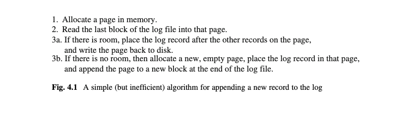

[图4.1]

对每一个增加的日志记录,这个算法需要一次磁盘读和一次磁盘写.它是简单的但是不高效.图4.2描绘了该算法的3a步骤的一半.日志文件包含3个块,含有8个记录,标记为r1到r8.日志记录可以有不同的大小,这就是为什么4条记录填充了块0但是仅3条记录就填充了块1.块2没有饱和,并且只包含一个记录.内存页包含块2的内容.除了记录r8,一个新的日志记录(记录r9)已经被放入其中.

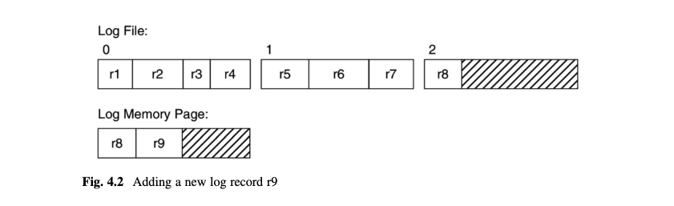

[图4.2]

假设现在日志管理器通过写入页到文件的块2.当日志管理器最终被要求添加另一个日志记录到该文件中,它会实现该算法的步骤1和步骤2,并读取块2到一个页.但是注意到这个磁盘读是完全不需要的,因为已经存在的日志页已经包含了块2的内容!因此,算法的步骤1和步骤2是不需要的.日志管理器仅仅需要永久地分配一个页来容纳最后一个日志块的内容.因此,所有的磁盘读都省略了.

减少磁盘写也是可能的.在上面的算法中,每次一个新的记录被添加到页中,日志管理器就写入它的页到磁盘中.看图4.2,你可以看出,没有必要立即写记录r9到磁盘.只要页有空间,每一个新的页记录可以直接添加到页里.当页变满,日志管理器可以写入页到磁盘,清空它的内容,并开启一个新的.这个新的算法的结果是,每个日志块仅需要一次磁盘写,这明显是最优的.

这个算法有一个瑕疵:在超越日志管理器的控制的情形下,一个日志页可能需要在它满之前写入磁盘.问题在于缓存管理器不能写入一个修改了的页到磁盘直到该页相关的日志记录已经写入磁盘.如果那些日志记录碰巧在日志页里但没在磁盘里,那么日志管理器必须写入它的页到磁盘,无视该页是否满.这个问题会在第五章解决.

图4.3给出了最终的日志管理器算法.这个算法有两个内存页被写入磁盘的地方:当一个日志记录需要被强制刷新到磁盘和当内存是满的时候.因此,一个内存页可能多次写入同一个日志块.但是因为这些磁盘写是绝对需要的且不能被避免,你可以总结出这个算法是最优的.

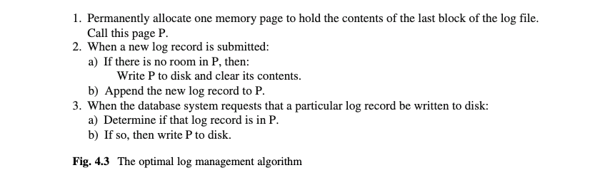

[图4.3]

图4.3的翻译:
最优日志管理算法:
1.永久分配一个内存页来保存日志文件的最后一个块的内容.称这个页为页P.
2.当一个新的日志记录被提交了:
	a)如果P中没有空间,那么:
		写P到磁盘中,并清空它的内容.
	b)添加新的日志记录到P.
3.当数据库系统要求指定日志记录写入到磁盘:
	a)判断该日志记录是否在P中.
	b)如果在,则写P到磁盘.

## 4.3 SimpldDB的日志管理器
本节考察SimpleDB数据库系统的日志管理器.4.3.1节描述了日志管理器的使用.4.3.2节考察了它的实现.

### 4.3.1 日志管理器的API 
SimpleDB日志管理器的实现类在包 simpledb.log下.这个包发布了LogMgr类,它的API如图4.4所示

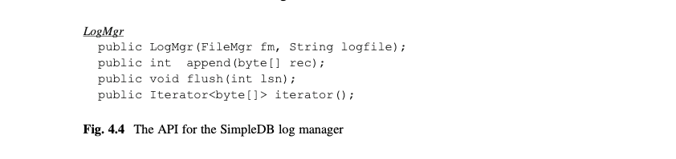

[图4.4]

数据库引擎有一个LogMgr对象,其是在系统启动的时候创建的.构造器的参数是文件管理器的引用和日志文件的名称.

方法append增加一个记录到日志中并返回一个整数.对日志管理器来说,一条日志记录是一个任意大小的字节数组;它保存这个数组在日志文件,但是并不知道它的内容是什么.唯一的约束是该数组的大小必须小于一个页的大小.append方法返回的值标识新增的日志记录;这个标识被称为它的日志序列号(log sequence number 或缩写 LSN).

增加一条记录到日志并不保证该记录一定会写入到磁盘;相反,正如图4.3的算法所示,日志管理器选择什么时候写入日志记录到磁盘.一个客户端可以强制写入一个指定的日志记录到磁盘,通过调用flush方法.flush方法的参数是日志记录的LSN;这个方法保证这个日志记录会被写入磁盘.

一个客户端调用iterator方法来读取日志中的记录;这个方法返回日志记录的Java迭代器.每次调用该迭代器的next方法会返回下一个日志记录的字节数组.iterator方法返回的记录是倒序的,起始于最近添加的日志并向后移动这个日志文件.以倒序的方式返回日志是因为恢复管理器想这样查看它们.

图4.5的类LogTest提供了一个如何使用日志管理器API的例子.这段代码创建了70个日志记录,每一个由一个字符串和一个整数构成.整数是记录号N,字符串是值"recordN".这段代码在前35个日志记录被创建后打印这些日志记录,并在70个日志记录创建完后再次打印.

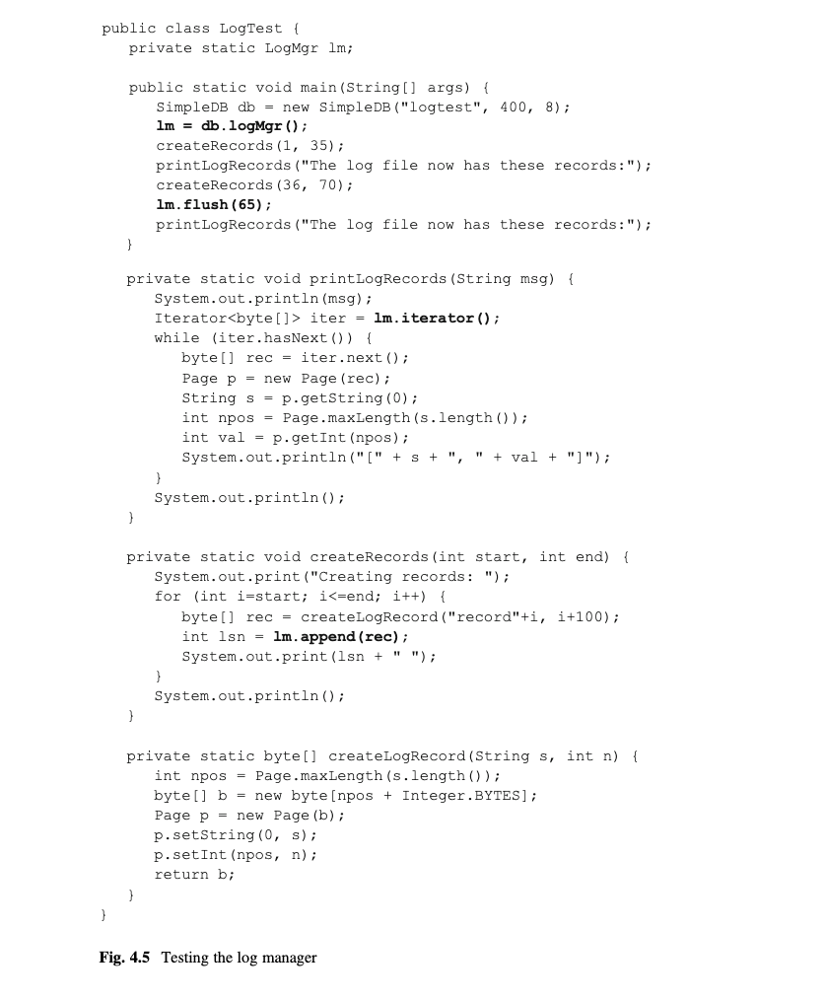

[图4.5]

如果你运行这段代码,你会发现第一次调用printLogRecords只有20个日志被打印.理由是那些日志填充了第一个日志块,并当第21个日志被创建时刷新到了磁盘.其他的15个日志记录继续存在于内存日志页并没有被刷新.第二次调用createRecords创建记录36到记录70.flush的调用告诉日志管理器确保记录65在磁盘上.但是因为66-70和记录65在同一页里,它们也会被写入磁盘.因此,第二次调用printLogRecords会以倒序打印所有70个日志.

注意到createLogRecord方法是如何分配一个字节数组成为日志记录的.它创建一个Page对象来包装那个数组,以便它可以使用page的setInt和setString方法来放置字符串和整数到日志记录的合适偏移上.这个方法然后返回这个字节数组.类似地,printLogRecords创建了一个Page对象来包装日志记录,以便它可以从记录中抽出字符串和整数.

### 4.3.2 实现日志管理器
LogMgr的代码如图4.6所示.它的构造器使用被提供的字符串作为日志文件的名称.如果日志文件是空的,构造器则增加一个空块到其中.构造器也分配一个单独的页(被称为logPage),并初始化它来保存日志文件的最后一个日志块的内容.

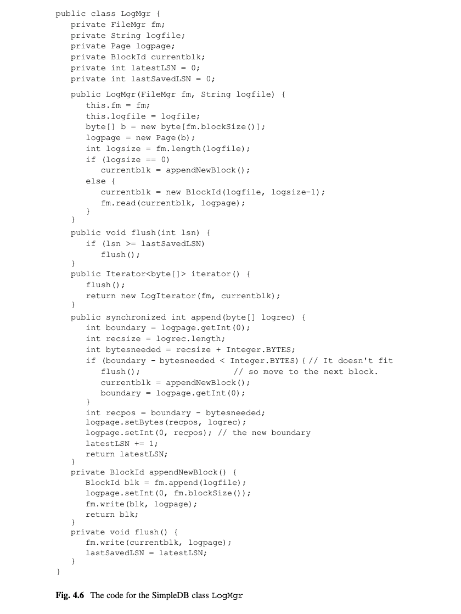

[图4.6]

再次说明下,一个日志序列号(LSN)标识一个日志记录.append方法使用latestLSN变量,从1开始顺序分配LSNs.日志管理器追踪下一个可用的LSN和最近被写入磁盘的LSN.flush方法比较最近写入日志LSN和指定的LSN.如果指定的LSN是较小的,那么相应的日志记录一定已经被写入到磁盘了;否则,logPage被写入磁盘,最近写入日志的LSN会被更新.

append方法计算日志记录的大小以判断其是否能完整保存到当前页.如果不能,它会写当前页到磁盘并调用appendNewBlock方法来清空页并增加当前为空的页到日志文件.这个策略跟图4.3的算法有点不一样;也就是说,日志管理器通过增加一个空页来扩大日志文件,而不是通过一个完整的页.这个策略更容易被实现,因为它允许flush方法默认相关的块已经在磁盘上.

注意到append方法是从右到左放置日志记录的.变量boundary代表最近新增的记录的偏移.这个策略使得日志迭代器可以从左到右读数据来实现日志的倒序读取.界限值被写入页的前4个字节,方便迭代器知道记录的开始位置.

iterator方法刷新日志(为了确保整个日志都在磁盘上),然后返回一个LogIterator对象.类LogIterator是一个package-private访问级别的,实现iterator接口的类;它的代码如图4.7所示.一个LogIterator对象分配一个页来保存一个日志块的内容.构造器定位迭代器到日志文件的最后一个块的第一条记录处(即,记住,最后的日志记录写入的位置).next方法移动到页的下一条记录;当没有记录时,它读取前一个块到页中,并返回它的第一条记录.hasNext方法返回false,当没有更多记录在页中且没有块可读了.

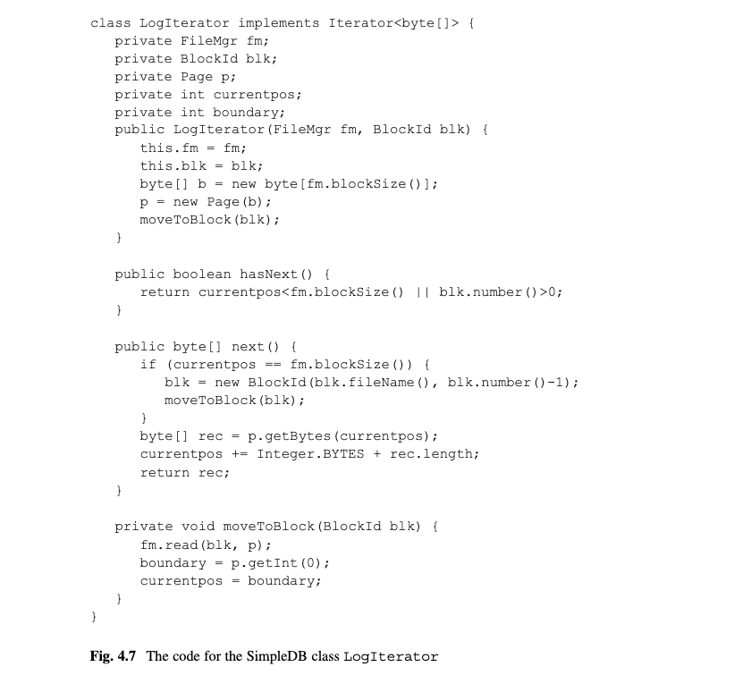

[图4.7]

## 4.4 管理用户数据
日志记录以一个有限的,非常好理解的方式被使用.日志管理器因此可以优化它的内存使用;特别地,它能用一个专用的页来完成它的工作.类似地,每一个LogIterator对象仅需要一个页.

另一方面,JDBC应用,完全是以不可预测的方式访问它们的数据.没有方法知道一个应用接下来会访问哪个块,也没有方法知道它是否会再次访问前一块.甚至一个应用已经访问完所需的块了,你也不能知道另一个应用是否会在近期访问那些块中的某些块.本节描述在这样的场景下,数据库引擎是如何高效管理内存的.

### 4.4.1 缓存管理器
缓存管理器是数据库引擎中负责管理持有数据的页的组件.缓存管理器分配一个固定的页集合,被称为缓存池.正如本章开始提到的那样,缓存池应当能填充进计算机的物理内存,并且这些页应该来自于操作系统的I/O缓存.

为了访问一个块,客户端按照图4.8给出的协议与缓存管理器交互.

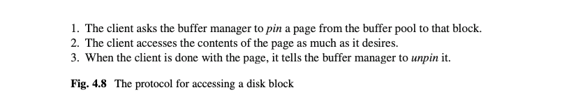

[图4.8]

一个页如果客户端正在钉住它,则说它为"被钉住了"(pinned);否则,该页"被解钉了"(unpinned).缓存管理器有义务保留一个可用页给客户端,只要该页被钉住了.相反,一旦一个页被解钉了,缓存管理器可以将其指派给另一个块.

当一个客户端请求缓存管理器钉住一个页到一个块,缓存管理器会遇到这四种可能中的一个.
*	该块的内容在缓存中的某一个页,且:
	-	该页被钉住了
	-	该页被解钉了

*	该块的内容不在任何缓存中,且:
	-	至少有一个被解钉的页在缓存池中.
	-	缓存池中的所有页都被钉住了.

当一个或多个客户端正在访问该块的内容,第一种情况发生.因为一个页可以被多个客户端钉住,缓存管理器直接增加一个钉到该页上,然后返回该页给客户端.每一个正在钉住该页的客户端可以自由并发读和修改它的内容.缓存管理器并不关心可能出现的冲突;该责任属于第五章的并发管理器.

第二种情况发生在当正在使用该缓存的客户端已经用完了该页,但是该页还没有被重新指派.因为块的内容仍在缓存页中,缓存管理器可以通过直接钉住它并返回给客户端来重新使用它.

第三种情况要求缓存管理器从磁盘读取块到缓存页中.涉及到几个步骤.缓存管理器必须首先选择一个没有被钉住的页来重新使用(因为被钉住的页仍然被客户端使用着).其次,如果被选择的页被修改了,那么缓存管理器必须写入页的内容到磁盘;这个动作被称为刷新(flushing)页.最后被请求的块可以读到被选择的页,且该页可以被钉住.

第四种情况发生在当缓存池被重度使用的时候,比如在14章的查询处理算法的场景.这种情况,缓存管理器不能满足客户端请求.对于缓存管理器最好的解决方案是将客户端放在一个等待列表里直到一个被解钉的缓存页变得可用了.

### 4.4.2 缓存
缓存池里的每一个页都有相关的状态信息,比如它是否被钉住了,如果是,则它被指派给某个块了.一个缓存是包含这种信息的对象.缓存池中的每一个页有一个相关的缓存.每一个缓存观察它的页的变化,并负责写入被修改的页到磁盘.就像日志那样,一个缓存可以减少磁盘访问,如果它可以延迟写入它的页.比如,如果页被修改了多次,那么在做了多次修改后,一次写入是更高效的.一个合理的策略是延迟缓存写它的页到磁盘直到该页被解钉了.

实际上,缓存可以等待更久.假设一个被修改的页被解钉了,但是还没有被写入磁盘.如果该页再次被钉到同一个块(正如上面的第二种情况),客户端会看到它解钉后同样的修改内容.这跟页写入磁盘然后再读出来一样的效果,但是没有磁盘访问.

某种意义上来说,缓存页是它的磁盘块的内存版本.任何客户端想使用该块会直接导向该缓存页,客户端可以读或修改而不用产生任何磁盘访问.

实际上,仅有两个原因一个缓存会需要写入一个修改页到磁盘:要么该页被替换了因为该缓存被钉到一个不同的块(像上面的第三种情况)或恢复管理器需要写入它的内容到磁盘以防止可能出现的系统崩溃(会在第五章讨论).

### 4.4.3 缓存替换策略
缓存池的页初始为未分配.随着钉(pin)请求到来,缓存管理器指派被请求的块到未分配的页.一旦所有的页都被分配了,缓存管理器会开始替换页.缓存管理器可能选择缓存池中任意未钉住的页来替换.

如果缓存管理器需要替换一个页,且所有缓存页都被钉住了,那么请求的客户端必须等待.因此,每一个客户端有责任"当一个好市民",当不要页的时候立即解钉它.

当多于一个页被解钉了,缓存管理器必须决定替换哪一个.这个选择会有一个巨大的影响在数据库系统的效率上.比如,最差的选择会是替换接下来被访问的页,因为缓存管理器会立即需要替换另外一个页.事实证明最好的选择是总是替换最长时间不会使用的页.

因为缓存管理器不能预测哪个页接下来会被访问,它必须猜.这里,缓存管理器处于几乎和操作系统在切换页到虚拟内存时同样的场景.然而有一个大的不同:不像操作系统,缓存管理器知道一个页是否正在使用,因为正在使用的页即是被钉住的页.不能替换被钉住的页的负担事实证明是好事.客户端,通过钉住页,让缓存管理器避免做出不好的猜测.缓存替换策略仅需要从目前没有需要的页中选择,这是不太重要的.

给出未钉住的页集合,缓存管理器需要决定当中的哪个页是最长时间不会被需要的.比如,一个数据库通常有几个页(比如第七章的目录文件)在数据库的生命周期里经常被使用.缓存管理器理应避免替换那些页,因为它们几乎肯定马上又会被钉住.有几个试图做出最好选择的替换策略.本节思考其中的4个:Naive,FIFO,LRU,和 Clock.

图4.9引入了比较这些替换策略行为的一个例子.(a)部分给出了一系列的钉住和解钉一个文件的5个块的操作,(b)部分描绘了缓存池的结果状态,假设包含4个缓存.当第5个块(比如,块50)被钉住时,唯一的页替换发生了.然而,因为仅仅一个缓存被解钉了,缓存管理器别无选择.换句话说,缓存池会像图4.9b那样,无论是怎样的页替换策略.

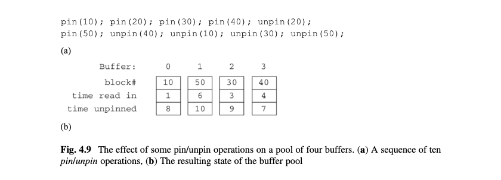

[图4.9]

图4.9b的每一个缓存持有3种信息:块号,读到缓存的时间,被解钉的时间.图中的时间与图4.9a中的操作的位置对应.

图4.9b的缓存全都被解钉了.假设限制缓存管理器接受2个钉请求:

pin(60);pin(70);

这时,缓存管理器需要替换两个缓存.所有的缓存都是可用的;它应该选择哪个?下面的每个替换算法都给出了不同的答案.

简单策略(The Naive Strategy)
最简单的替换策略是顺序遍历缓存池,替换第一个发现的未被钉住的缓存.使用图4.9的例子,块60会被指派给缓存0,块70会指派给缓存1.

这个策略是容易实现的但是也没有其他可称赞的了.比如再次思考图4.9的例子,并假设一个客户端重复钉住和解钉块60和块70,像这样: pin(60);unpin(60); pin(70); unpin(70); pin(60); unpin(60);..

简单替换策略会用缓存0给两个块,这意味着那两个块每次它们被钉住的时候都需要从磁盘读取.问题在于缓存池没有均匀地被利用起来.假设替换策略选择两个不同的缓存给块60和70,那么这些块只会从磁盘中读取一次,这是一个巨大的效率提升.

先进先出策略(The FIFO Strategy)
简单策略仅基于方便选择一个缓存.先进先出策略试图变得更智能,通过选择最先替换掉的缓存,也就是说,在缓存池待的最久的页.这种策略通常比简单策略工作的更好,因为更老的页比最近抓取的页更可能不被需要.图4.9中,最老的页是那些有着最小读入时间(time read in)的页.因此,块60会被指派给缓存0,且块70会被指派给缓存2.

先进先出是一个合理的策略,但是它并不总是做出正确的选择.比如,一个数据库通常有一些经常使用的页,比如第7章的目录页.因为这些页几乎被每个客户端使用,可以的话尽量不替换它们.然而,这些会最终变成缓存池中最老的页,而且先进先出策略会选择它们来替换.

先进先出策略可以以两种方式实现.一种方式是像图4.9b那样,让每个缓存持有它的页被替换的时间.替换策略会扫描缓存池,选择由最早替换时间未被钉住的页.另一种,更高效的方式是缓存管理器来保存以替换时间排序的缓存的指针列表.替换算法搜索列表;发现的第一个解钉的页被替换,并且将它的指针移到列表的最后.

最近最少使用策略(The LRU Strategy)
先进先出策略基于页被添加到缓存池的时间.一个类似的策略是基于页最近被访问的时间,其原理在于一个页最近未被使用,则近期也不太会被使用.这个策略被称为LRU,代表least recently used.在图4.9的例子,解钉时间(time unpinned)对应缓存最后使用的时间.因此块60会指派给缓存3,并且块70会被指派给缓存0.

LRU策略倾向于成为一个高效的通用策略,避免替换经常被使用的页.FIFO的两种实现选择适用于LRU.唯一需要做的改变是每次一个页被解钉了,缓存管理器必须更新时间戳(对第一个选择)或更新列表(对第二个选择),而不是在被替换的时候.

时钟策略(The Clock Strategy)
这个策略是以上策略的一个有趣组合,它有一个简单直接的实现.像简单策略那样,时钟替换算法扫描缓冲池,选择它发现的第一个未被钉住的页.不同点在于该算法总是开始于上一个被替换页来扫描.如果你将缓冲池看作一个时钟,这个替换算法就像一个类似时钟的指针扫描这个缓冲池,当一个页被替换了则停下,当另一个替换被请求时又开始扫描.

图4.9b的例子没有显示该时钟的位置.但是最后的替换是缓存1,这意味着这个时钟被立即定位在其后.因此,块60会被指派到缓存2,并且块70会被指派给缓存3.

时钟策略尝试尽可能地均匀地适用缓存.如果一个页被钉住了,时钟策略会跳过它,且不会再次考虑它直到检查了所有其他缓存.这个特点使得这种策略又一种LRU的味道.它的想法是如果一个页被经常使用,当替换轮到它的时候很大可能它已经被钉住了.如果是那样的话,它会被跳过并又有了另一次不被替换的机会.

## 4.5 SimpleDB的缓存管理器
本节考察SimpleDB数据库系统的缓存管理器.4.5.1节覆盖了缓存管理器的API并给出了使用样例.然后4.5.2节展示了这些类如何用Java实现.

### 4.5.1 缓存管理器的API
SimpleDB的缓存管理器是通过包simpledb.buffer实现.这个包发布了两个类BufferMgr和Buffer;它们的API如图4.10所示.

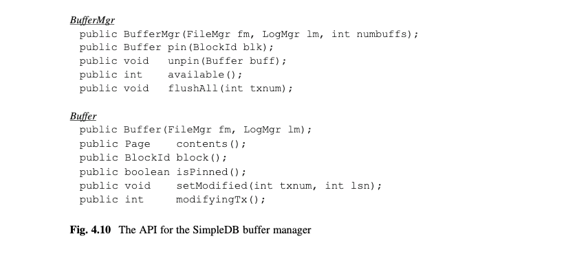

[图4.10]

每一个数据库系统有一个BufferMgr对象,它在系统启动的时候创建.它的构造器有三个参数:缓存池的大小和文件管理器的引用,以及日志管理器的引用.

一个BufferMgr对象有钉住和解钉一个页的方法.pin方法返回一个钉住一个包含指定块的被钉住的页的Buffer对象,并且unpin方法解钉这个页.available方法返回未被钉住缓存页的数量.flushAll方法确保被指定事务修改的所有页会被写入磁盘.

给出一个Buffer对象,一个客户端可以调用它的contents方法来获取相关的页.如果客户端修改该页,那么它也负责生成一个相应的日志记录,并调用缓存的setModified方法.这个方法有两个参数:标识正在修改的事务的整数和生成的日志记录的LSN.

图4.11的代码测试Buffer类.你第一次执行它,它会打印"The new value is 1",并且每一个后续的执行增加了打印值.这段代码表现的像这样.它创建一个拥有3个缓存的SimpleDB对象.它钉住一个页给块1,增加在偏移80处的整数,并调用setModified方法表明该页已经被修改.setModified方法的参数应该是事务号和产生的日志记录的LSN.这两个值的细节会在第5章讨论.

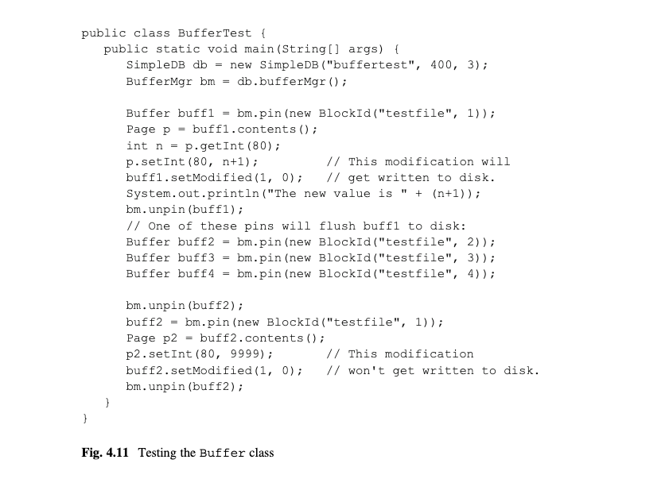

[图4.11]

缓存管理器对客户端隐藏了真实的磁盘访问.客户端根本不知道发生了多少次磁盘访问和什么时候发生的.一个磁盘读仅发生在一次pin的调用,且当指定块并不在缓存中.一个磁盘写仅发生在pin或flushAll的调用.如果替换的页已经被修改了,pin的一次调用会导致一次磁盘写,且flushAll的一次调用会导致指定事务所修改的页的磁盘写.

比如,图4.11的代码包含块1的两个修改.这些修改并没有显式地写入磁盘.执行这段代码显示第一个修改会被写入磁盘但是第二个不会.思考第一个修改.因为仅有3个缓存在缓存池中,缓存管理器需要替换块1的页(因此会写入它到磁盘)来为块2,3,和4钉住页.另一方面,第二次修改后,块1的页不需要被替换,所以该页并没有被写入磁盘,然后它的修改被丢失了.丢失的修改问题会在第五章讨论.

假设数据库引擎有许多客户端,它们都使用许多缓存.每个页都可能被钉住了.这种情况下,缓存管理器不能马上满足一个pin请求.相反,它将客户端放在一个等待列表.当一个缓存变的可用,缓存管理器从等待列表取下客户端以便它完成pin请求.换句话说,客户端不会意识到缓存的竞争;客户端仅会注意到引擎看起来变慢了.

有一种情况下缓存竞争会导致一个严重的问题.思考客户端A和B都需要两个缓存,但只有两个缓存可用的场景.假设客户端钉住第一个缓存.现在有一个竞争在第二个缓存上.如果客户端A在客户端B之前获得它,那么B会添加到等待列表.客户端A会最终完成并解钉缓存,那时客户端可以钉住它们.这是一个好的场景.现在假设相反的情况,客户端B在客户端A之前获得了第二个缓存.那么A和B都会在等待列表上.如果在系统里仅有两个客户端,那么没有缓存会被解钉,A和B会永远呆在等待列表上.这是一个糟糕的场景.客户端A和B被说成是死锁了(deadlocked).

在一个有着几千个缓存和几百个客户端的数据库系统,这种死锁是不太可能的.然而,缓存管理器必须准备应对处理这种可能性.SimpleDB采取的解决方案是追踪一个客户端端已经等待一个缓存多久了.如果它等太久了(假设,10秒),那么缓存管理器认为客户端已经处于死锁了并抛出BufferAbortException的错误.客户端负责处理这个错误,通常通过回滚事务和可能重启它来处理.

图4.12的代码测试了缓存管理器.它又创建一个仅有3个缓存的SimpleDB对象,然后调用缓存管理器来钉住它们的页到"testfile"文件的块0,1,和2.然后它解钉块1,重钉块2,并再次钉住块1.这三个动作不会引发任何磁盘读,并且不会剩下可用的缓存.尝试钉住块3会将当前线程在等待列表上.然而,因为线程已经拥有了所有缓存,不会又缓存被解钉,等待10秒钟以后缓存管理器会抛出一个错误.程序捕获这个错误并继续.它解钉块2.钉住块3的尝试会成功,因为一个缓存已经变得可用.

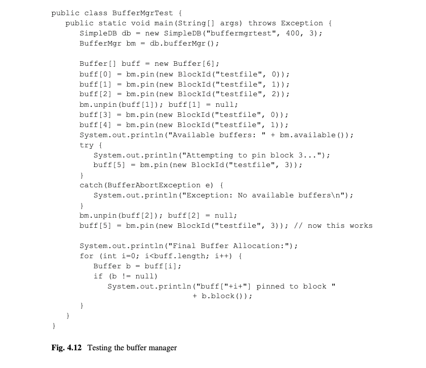

[图4.12]

### 4.5.2 实现缓存管理器
图4.13包含类Buffer的代码.一个Buffer对象追踪4种有关它的页的信息:
*	被指派到它的页的引用.如果没有块被指派,那么该值为null.
*	该页被钉住的时间戳.每次钉住则钉住计数(pin count)会增加,反之则减少.
*	一个表明该页是否被修改的整数.-1值表明该页没有被改变;否则为标识做出改变事务的整数.
*	日志信息.如果该页被修改了,那么该缓存持有最近添加的日志记录的LSN.SLN值永远不会是负的.如果一个客户端使用一个负数的LSN调用setModified,它表明该修改没有生成日志记录.

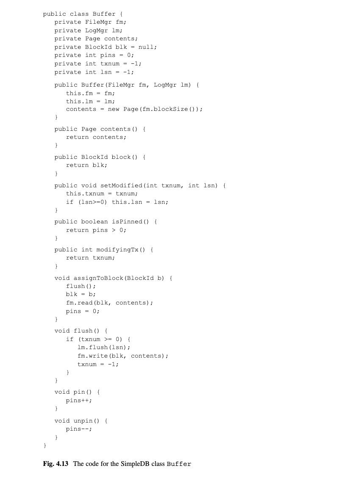

[图4.13]

flush方法确保缓存所指派的磁盘块与它的页有同样的值.如果该页没有被修改,那么这个方法不需要做任何事.如果它已经被修改,这个方法首先会调用LogMgr的flusha来确保相应的日志记录在磁盘上;然后它写入该页到磁盘.

assignToBlack方法关联缓存和一个磁盘块.缓存首先被刷新,这样对之前块的所有修改都会保留下来.该缓存然后被关联到指定块,从磁盘读取它的内容.

BufferMgr的代码如图4.14所示.pin方法指派一个缓存到一个指定块.它通过私有方法tryToPin方法来实现.那个方法有两个部分.第一部分,findExistingBuffer,试图寻找一个已经被指派指定块的缓存.如果被找到则返回该缓存.否则使用算法的第二部分,chooseUnpinnedBuffer,使用简单替换策略选择一个未被钉住的缓存.被选择的缓存的assignToBlock方法被调用,它处理已经存在的页到磁盘的写(如果需要)和从磁盘读取新页.这个方法返回null如果它不饿能找到一个未被解钉的缓存.

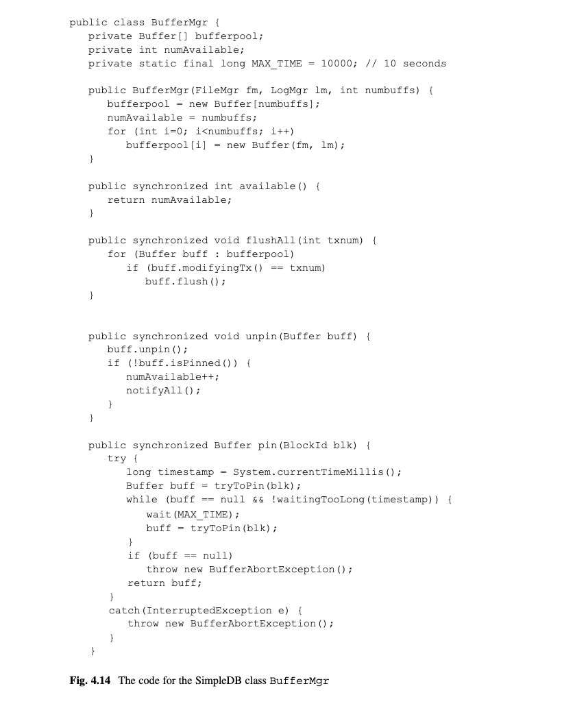
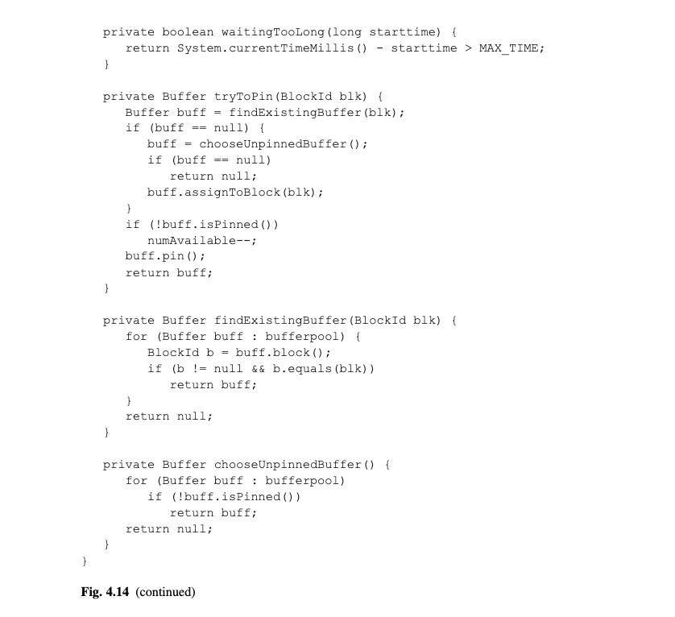

[图4.14]

如果tryToPin方法返回null,pin方法会调用Java方法wait.在Java中,每一个对象有一个等待列表.对象的wait方法停止调用线程的执行,并放置其到那个列表上.在图4.14中,该线程会待在那个列表直到下面两种条件的一个发生:
*	另一个线程调用notifyAll(其发生在uppin的调用里)
*	MAX_TIME毫秒已经经过了,这意味着该线程已经等的太久了.

当一个等待线程恢复,它继续在它的循环中,试图获取一个缓存(和正在等待的其他线程一起).该线程会被放回等待列表直到要么它获得缓存或它已经超过了时间限制.

unpin方法解钉指定的缓存,并且检查该缓存是否仍被钉着的.如果没有,那么调用notifyAll从等待列表移除所有客户端线程.那些线程会竞争该缓存;被首先调度的线程则获胜.当其中一个线程被调度,它可能发现所有的缓存仍然被钉着的;如果那样的话,它会被放回到等待列表里.

## 4.6 章节总结
*	数据库引擎必须尽量减少磁盘访问.因此它仔细地管理用于保存磁盘块的内存页.管理这些页的数据库组件是日志管理器(log manager)和缓存管理器(buffer manager).
*	日志管理器负责保存日志记录在日志文件.因为日志记录总是被添加到日志文件中,且永远不会被修改,所以日志管理器可以非常高效.它仅需要一个内存页,并且有一个尽可能减少写入该页到磁盘的算法.

*	缓存管理器分配几个页,被称为缓存池(buffer pool),来处理用户数据.在客户端请求的时候,缓存管理器钉住(pins)和解钉(unpins)缓存页到磁盘块.在钉住页之后客户端访问一个缓存页,并且完成后解钉该缓存.
*	在两种情况下,一个修改了的缓存会被写入磁盘:当这个页被替换的时候和当恢复管理器需要它在磁盘的时候.
*	当客户端请求钉住一个页到一个块,缓存管理器选择合适的缓存.如果针对那个块的页已经在一个缓存中,那么那个缓存则被使用;否则,缓存管理器替换一个存在缓存的内容.
*	选择哪个缓存来替换的算法被称为缓存替换策略.4个有趣的替换策略是:
	-	简单(Naive):选择它发现的第一个未被钉住的缓存.
	-	先进先出(FIFO):选择最先被替换的缓存
	-	最近最少使用(LRU):选择最先被解钉的缓存
	-	时钟(Clock):从上一次替换的缓存顺序扫描;选择最先被发现的未被钉住的缓存

## 4.7 建议阅读
Effelsberg et al. (1984)文章包含了一个写的非常好的且有着比较综合的处理方式的缓存管理器,其扩展了本章提到的很多思想.Gray and Reuter (1993) 的第13章包含一个缓存管理器的深入讨论,使用一个基于C实现的典型缓存管理器来描述他们的讨论.

Oracle的默认缓存替换策略是LRU.然而,当扫描大表时,它使用FIFO替换策略.理由是一个表扫描在解钉一个块后通常不再需要它,所以LRU会导致保存错误的块.细节可以Ashdown et al. (2019)的第14章找到.

有几位研究员已经调查了如何使缓存管理器更智能.基本的思路是一个缓存管理器可以追踪每一个事务的钉住请求.如果它检测到一种模式(假设,该事务重复读取一个文件的同样N块),他会避免替换那些页,即使它们没有被钉住.文章Ng et al. (1991)更详细地描述了该思路,并提供了一些模拟结果.

Ashdown, L., et al. (2019).Oracle  database  concepts. Document E96138-01,Oracle Corporation. Available from https://docs.oracle.com/en/database/oracle/oracle-database/19/cncpt/database-concepts.pdf

Effelsberg, W., & Haerder, T. (1984). Principles of database buffer management.ACM Transactions on Database Systems, 9(4), 560–595.

Gray, J., & Reuter, A. (1993).Transaction processing: concepts and techniques.Morgan Kaufman.

Ng, R., Faloutsos, C., & Sellis, T. (1991). Flexible buffer allocation based onmarginal gains.Proceedings of the ACM SIGMOD Conference, pp. 387–396.

## 4.8 练习
概念练习
4.1 LogMgr.iterator的代码调用flush.这个调用是必须的吗?请解释.

4.2 解释为什么BufferMgr.pin方法是同步的.如果它不是的会发生什么问题?

4.3 多个缓存可以指派给同一个块吗?请解释.

4.4 当查找可用缓存时,本章的缓存替换策略不区分修改的和未修改的页.一个针对缓存管理器可能的优化是任何时候都替换一个未修改的页.
	(a)给出一个理由为什么这个建议会减少缓存管理器产生的磁盘访问的次数.
	(b)给出一个理由为什么这个建议会增加缓存管理器产生的磁盘访问的次数.
	(c)你认为这个策略有价值吗?请解释.

4.5 另一种可能的缓存替换策略是 least recently modified:缓存管理器选择持有最小LSN的页.解释为什么这种策略是可行的.

4.6 假设一个缓存页已经被修改很多次但没有写入磁盘.缓存仅保存最近修改的LSN并仅发送这个LSN给日志管理器当该页最终被刷新时.解释为什么缓存不需要发送其他的LSN到日志管理器.

4.7 和附加的pin(60);pin(70)操作一起,思考图4.9a的 pin/unpin 场景例子.针对文章中给出的四种替换策略,画出缓存的状态,假设缓存池包含5个缓存.

4.8 从图4.9b的缓存状态开始,分别给出一个场景满足下面的条件:
	(a)FIFO策略需要最少的磁盘访问
	(b)LRU策略需要最少的磁盘访问
	(c)时钟策略需要最少的磁盘访问
4.9假设两个不同的客户端想要钉住同一个块,但因为没有可用缓存而被放在等待列表上.思考SimpleDB类BufferMgr的实现.展示当一个缓存可用时,两个客户端都能使用它.

4.10思考这个谚语"virtual is its own reward"(原文是 virtue is its own reward 善有善报的意思),评论双关语的妙处,并讨论它对于缓存管理器的应用.

编程练习
4.11 SimpleDB日志管理器分配它自己的页并显式地写入磁盘.另一种设计选择是让缓存管理器去钉住最后一个块的缓存,并让其处理磁盘访问.
	(a)对这个选项写出一个设计.什么问题需要解决?这是一个好的想法吗?
	(b)修改SimpleDB以实现你的设计.

4.12 每一个LogIterator对象都分配一个页来持有它访问的日志块.
	(a)解释为什么使用一个缓存更高效而不是使用一个页.
	(b)修改代码以使用缓存而不是页.缓存应该如何被解钉.
4.13这个练习考察一个JDBC程序是否能恶意地钉住缓存池里所有的缓存.
	(a)写一个JDBC程序来钉住SimpleDB缓存池里所有的缓存.当所有的缓存被钉住后会发生什么?
	(b)Derby数据库系统实现缓存管理的方式与SimpleDB有点不一样.当一个JDBC客户端请求一个缓存,Derby钉住该缓存,发送该缓存的拷贝到到客户端,并解钉该缓存.解释为什么你的代码不会对其他Derby客户端有恶意性.
	(c)Derby通过从引擎复制页给客户端来避免SimpleDB的问题.解释这种方式的结果.相比SimpleDB的方式你更喜欢它吗?
	(d)另一种避免恶意客户端独占所有缓存的方式是允许每一个事务钉住不超过一定比例(比如,10%)的缓存.实现并测试这个修改到SimpleDB的缓存管理器.

4.14 修改类BufferMgr以实现每种本章描述的其他替换策略.
4.15 练习4.4建议了一个选择未修改的页而不是已修改的页的页替换策略.实现这个替换策略.
4.16.练习4.5建议了一个选择有最小LSN修改页的页替换策略.实现这个策略.
4.17当搜索缓存时SimpleDB缓存管理器顺序遍历缓存池.当有几千个缓存在缓存池时,这种搜索会非常耗时.修改相应的代码,增加优化搜索时间的数据结构(比如特殊用途的lists和hash tables).
4.18 在练习3.15,你被要求写维护磁盘使用统计的代码.扩展这段代码以让它也提供关于缓存使用的信息.

