# 第5章 事务管理
缓存管理器允许多客户端并发访问同一缓存,任意读和写缓存的数据.结果可能是混乱的:每次客户端查询时一个页可能有不同的(甚至是不一致的)值,这使得客户端不能获得数据库正确的图像.或着两个客户端可能无意地覆盖了相互的数据,从而损害了数据库.因此,一个数据库引擎有一个并发管理器和一个恢复管理器,它们的工作是维护秩序和确保数据库的完整性.每一个客户端程序被写为一连串的事务.并发管理器调整这些事务的执行顺序,使得它们的运行具有一致性.恢复管理器读和写记录到日志文件中,以便未提交的事务做出的改变在需要的时候能被撤销.本章覆盖这些管理器的功能和被用于实现它们的技术相关的内容.

## 5.1 事务
思考一个机票预订数据库,其有两个表并有以下字段:
SEATS(FlightId, NumAvailable, Price)
CUST(CustId, BalanceDue)

图5.1 包含了为指定顾客购买指定航班机票的JDBC代码.尽管这段代码没有bug,当它被多个客户端并发使用或当服务器崩溃的时候各种问题会出现.以下三种场景描绘了这些问题.
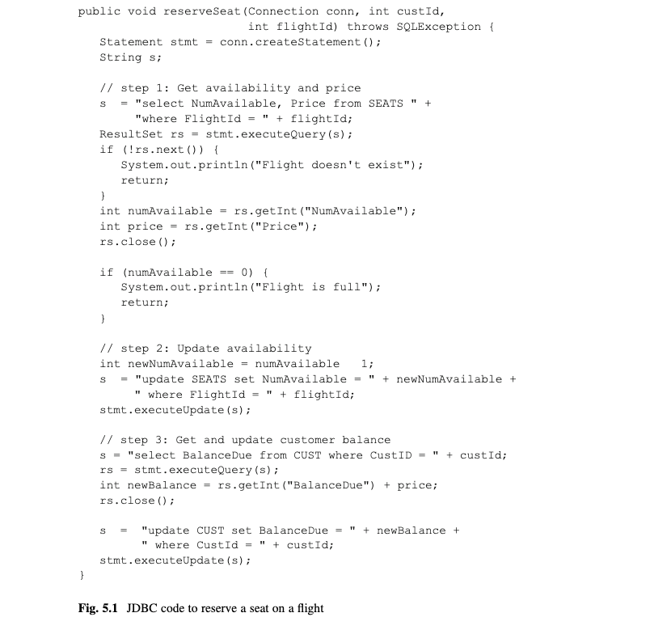

[图5.1]

第一个场景,假设两个客户端A和B以下面的动作顺序并发运行这段JDBC代码.

* 	客户端A执行了步骤1的所有代码,然后被打断了.
*	客户端B执行到完成
*	客户端A完成它的执行

在这个场景下,两个线程会使用numAvailable的同一个值.结果是两个座位会被卖掉,但是可用座位数仅减少1.

第二场景,假设一个客户端正在运行这段代码,步骤2执行后服务器崩溃了.在这种场景下,座位会被预订,但是客户却不会被收费.

第三个场景,假设一个客户端运行这段代码直到完成,但是缓存管理器没有及时将修改的页写入磁盘.如果服务端崩溃(可能几天以后),那么没有方法直到哪个页最终被写入了磁盘.如果第一个修改被写入了,但是第二个没有,那么顾客得到一张免费的机票;如果第二个更新被写入了但是第一个没有,那么顾客则会为不存在的机票买单.如果都没有写入,那么整个交互会被丢失.

上面的场景展示了当客户端程序盲目地运行时数据会如何被丢失和损坏.数据库引擎通过强制客户端程序以事务的方式构成.一个事务是一组作为单独操作的集合.作为单独操作的意思可以描述成以下的所谓的ACID性质:原子性,一致性,隔离性和持久性.

*	原子性意味着一个事务是”全部或全不”,也就是说,要么所有操作成功(事务提交)要么所有失败(事务做一个回滚).
*	一致性意味着每一个事务完成后,数据库都保持着一个一致性的状态.这表明每一个事务是一个可以独立于其他事务完整执行的工作单元.
*	隔离性意味着一个事务表现地好像它是使用引擎的唯一线程.如果多个事务正在并发运行,那么它们的结果应该和它们以某种顺序串行执行的结果一样.
*	持久性意味着一个提交事务所做的改变被确保是永久的.

以上场景的每一种的结果违背了部分ACID属性.第一个场景违背了隔离属性,因为两个客户端读到了numAvailable的同样值,然而在任何串行执行中,第二个客户端会读取由第一个客户端写的值.第二个场景违背了原子性,然后第三个场景违背了持久性.

原子性和持久性描述了提交和回滚操作的正确行为.一个已提交事务必须是持久化的,一个未提交事务(要么因为一个显式的回滚要么因为系统崩溃)必须完全撤销它的改变.这些特性是恢复管理器的责任,这是5.3节的话题.

一致性和隔离性描绘了并发客户端的正确行为.数据库引擎必须避免客户端之间的冲突.一个典型策略是检测什么时候冲突会发生,并让其中一个事务等待直到该冲突不再可能发生.这些特性是并发管理器的责任,这是5.4节的话题.

## 5.2 在SimpleDB中使用事务

在进入恢复和并发管理器是如何工作的细节之前,有一个对客户端是如何使用事务的感觉是有帮助的.在SimpleDB里,每一个JDBC事务有它自己的Transaction对象;它的API如图5.2所示.

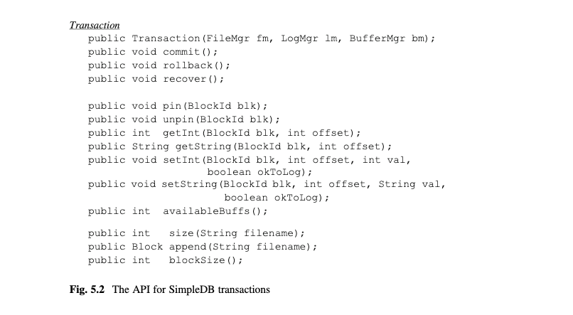

[图5.2]

Transaction类的方法分为三类.第一类是跟事务的生命周期相关的.构造器开始一个新的事务,commit和rollback方法结束它,并且recover方法回滚所有未提交事务.commit和rollback方法自动解钉事务钉住的缓存页.

第二类是访问缓存相关的.事务对客户端隐藏了缓存的存在.当一个客户端调用pin在一个块上,事务在内部保存缓存,并且不把它返回给客户端.当客户端调用一个方法,比如getInt,它传递一个BlockId引用.事务查找相应的缓存,调用getInt方法在缓存页上,并返回结果给客户端.

事务对客户端隐藏缓存,以便它可以按需调用并发和恢复管理器.比如,setInt的代码会获取合适的锁(为了并发控制)并且在修改缓存之前把当前在缓存里的值写入到日志(为了恢复).setInt和setString的第四个参数是一个布尔值,表示是否更新应该被写入日志.这个值通常是true,除了几个确定场景以外(比如新建一个块或撤销一个事务)日志是不适合的,且该值应该是false.

第三类由三个跟文件管理器相关的方法构成.size方法读取文件标识的末尾,append方法修改它;这些方法必须调用并发管理器来避免潜在的冲突.blockSize方法是为了某些客户端可以方便调用.

图5.3描绘了Transaction方法的简单使用.代码由4个事务组成,执行了类似图4.11的BufferTest类的任务.4个事务都访问了"testfile"文件的块1.tx1事务初始化了偏移80和40位置的值;这些修改没有被写入日志.tx2事务读取并打印了增加的值.然后它设置该整数到9999然后回滚.tx4事务读取该整数以确认回滚确实发生了.
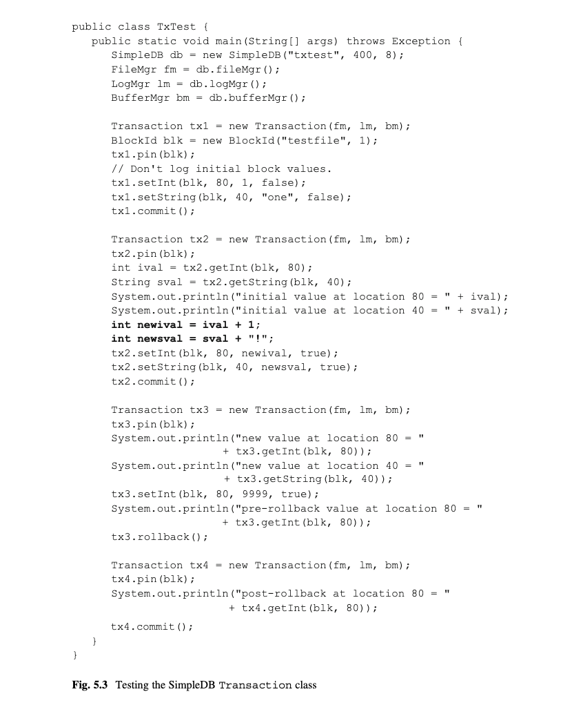

[图5.3]

和第四章的代码比较这段代码可以看出Transaction类为你做了什么:它管理你的缓存;它为每个更新生成日志记录并将它们写入日志文件;并且根据需要它能回滚你的事务.但是同样重要的是这个类是如何在背后确保代码满足ACID属性的.比如假设你在程序运行的时候随机中止它.当你接下来重启数据库引擎的时候,所有已提交事务的修改会在磁盘上(持久性),并且当时碰巧正在运行的事务做出的修改会被回滚(原子性).

此外,Transaction类也确保这个程序会满足ACID的隔离性.思考tx2事务的代码.参数newival和newsval(看加粗的代码)是如下这样初始化:

int newival = ival + 1;
String newsval = sval + "!";

这段代码假设在块的80和40位置的值没有被改变.然而,没有并发控制的话,这个假设可能不是正确的.问题是2.2.3节的"non-repeatable read"场景.假设tx2在初始化ival和sval后被立即中断了,并且另一个程序修改了在偏移80和40的值.然后ival和sval的值现在是过期了的,并且tx2必须再次调用getInt和getString来获取它们的正确值.Transaction类负责确保那种可能不会发生,因此这段代码保证是正确的.

## 5.3并发管理器
恢复管理器是数据库引擎中读取和处理日志文件的组件.它有3个方法:写日志记录的,回滚事务的,和在系统崩溃后恢复数据库的.本节调查这些方法的细节.

### 5.3.1 日志记录
为了能够回滚一个事务,恢复管理器记录关于事务操作的信息.特别地,每次一个可记录日志的活动发生时它会写一个日志记录.有4种基础类型的日志记录: 开始日志(start records),提交日志(commit records),回滚日志(rollback records),和更新日志(update records).我会遵循SimpleDB并假设有两种更新日志:一种整型的更新和一种字符串的更新.

日志记录由以下的可记录操作生成:
*	当一个事务开始时一条开始日志被写入
*	当一个事务完成时一条提交或回滚记录被写入
*	当一个事务修改一个值时一条更新记录被写入

另一个潜在的可记录操作是增加一个块到文件的末尾.然后如果相应的事务回滚的话,被append分配的新块可以从文件中释放.为了简洁,我直接忽略了这种可能.练习5.48旨在解决这个问题.

作为一个例子,思考图5.3的代码,并假设tx1的id是1,以此类推.图5.4展示了由该代码生成的日志.
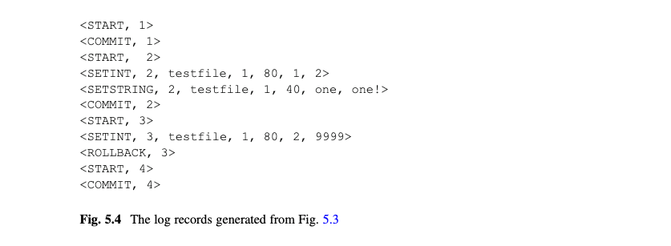

[图5.4]

每一条日志记录包含日志类型的描述(START,SETINT,SETSTRING,COMMIT,或ROLLBACK)和事务的id.更新记录包含5种额外的值:被修改文件的名称和块号,修改发生的偏移,该偏移处的旧值,该偏移处的新值.

通常,多个事务会并发写日志,所以给定事务的日志记录会分散在日志文件中.

### 5.3.2 回滚(Rollback)
日志文件的一个用处是帮助恢复管理器回滚一个指定事务T.恢复管理器通过撤销它的修改来回滚一个事务.因为这些修改是被记录在更新日志里的,所以扫描日志找到每一个更新日志,并重新保存每个修改值的原值是相对简单的.图5.5展示了该算法.

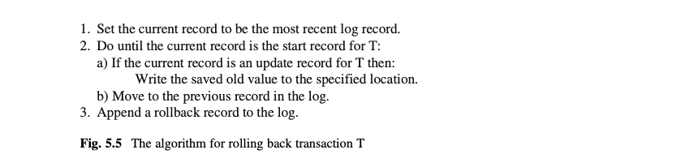

[图5.5]

为什么这个算法是从后往前读取日志文件而不是从前往后读取,有两个原因.第一个原因是日志文件的开始会包含很久以前完成的事务的日志.你正在查找的日志很大可能是在日志的末尾,因此从末尾读是更高效的.第二,更重要的原因是确保正确性.假设同一个位置的值被修改了多次.那么会有多个日志记录,每一个有不同的值.被重新存储的值应该来自于这些记录中最早的.如果日志记录是以倒序处理的,那么这会确保发生.

### 5.3.3 恢复(Recovery)
日志文件的另一用处是恢复数据库.每一次数据库启动的时候,恢复操作会执行.它的目的是修复数据库到一个合理的状态.合理的状态意味着两件事:
*	所有的未完成事务应该被回滚.
*	所有的已提交事务应该写入它们的值到磁盘.

当一个数据库引擎是在正常关闭之后启动时,它应该已经处于一个合理的状态,因为正常关闭步骤会等到直到运行的事务完成并且刷新了所有缓存.然而,如果一个崩溃已经导致引擎意外地关闭,那么会有事务的操作消失的情况.因为引擎没有办法完成它们,它们的修改必须被撤销.也有可能已提交的事务的修改还没有被刷新到磁盘;它们的修改必须被重做.

如果日志文件里有事务的提交或回滚记录,恢复管理器则认为该事务已经完成了.所以如果一个事务在系统崩溃前已经提交了但是它的提交日志没有写入日志文件,那么恢复管理器会把它当作未完成的事务.这种情况可能看起来不公平,但是恢复管理器真的没有其他可做的了.它只知道日志文件里包含的东西,该事务相关的其他东西都在系统崩溃时消失了.

实际上,恢复一个已提交事务不仅是不公平的;它甚至违背了ACID属性的持久性(durability).因此,恢复管理器必须确保那样的场景不会发生.它通过在完成提交操作之前刷新提交日志到磁盘里来实现.再次说明,刷新一个日志记录也会刷新所有之前的日志记录.所以当恢复管理器发现一个提交日志在日志中,它知道该事务的所有更新日志也在日志中.

每一个更新日志既包含旧值也包含新值.当你想撤销修改时旧值被使用,当你想重做修改时新值被使用.图5.6展示了恢复算法.

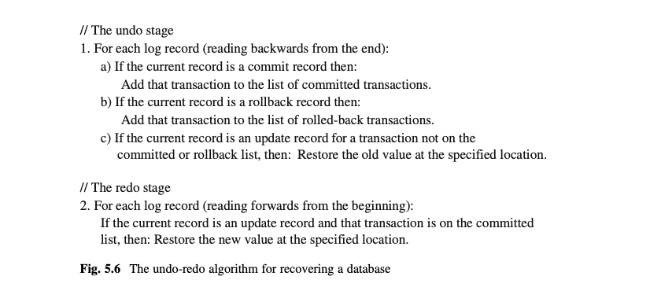

[图5.6]

阶段1撤销了未修改的事务.就像使用回滚算法,日志必须从末尾往回读以确保正确性.往回读日志也因为一个提交日志总会在它的更新日志之前被发现;所以当该算法遇到一个更新日志时,它就知道该记录是否需要被撤销.

对阶段1来说读取整个日志是重要的.比如,最初的事务可能在进入一个无限循环之前对数据库做了一个修改.除非你读取日志的开头否则该更新日志不会被找到.

阶段2重做已提交事务.因为恢复管理器不能判断哪些缓存被刷新了,哪些没有,它重做由所有已提交事务造成的
改变.

恢复管理器通过从头往前读取日志来实现阶段2.恢复管理器知道哪些更新日志需要被重做,因为它在阶段1计算了已提交事务的列表.注意到在重做阶段日志必须往前读.如果几个已提交事务碰巧修改了同一值,那么最终的恢复值应该是由最近的修改产生的.

恢复算法不关心数据库的当前状态.它写旧或新值到数据库,不关心那些位置的当前值是什么,因为日志明确地告诉它数据库的内容应该是什么.这个特性有两个结果:
*	恢复操作是幂等的
*	恢复操作可能造成比需要的更多的磁盘写

对于幂等性,我想表达的是多次运行恢复算法和运行一次有同样的结果.特别地,你会得到同样的结果,即使只运行了一部分之后立即再次重新运行这个恢复算法.这个性质对于该算法的正确性是极其重要的.比如,假设在恢复算法执行的中途系统崩溃了.当数据库系统重启时,它会从开头重新运行恢复算法.如果这个算法不是幂等的,那么重新运行它会损害数据库.

因为这个算法不看当前数据库的内容,它可能产生不需要的修改.比如,假设一个已提交事务造成的修改已经写入磁盘;那么在阶段2重做这些修改会设置为原本就有的值.这个算法可以修改以便它不会产生不必要的磁盘写;看练习5.44.

### 5.3.4 仅撤销(Undo-Only)和仅重做(Redo-Only)恢复
前一节的恢复算法既实现了撤销也实现了重做操作.一个数据库引擎可能选择简化这个算法,仅实现撤销操作或仅实现重做操作,也就是说,它要么执行阶段1或阶段2,要么都不.

#### 5.3.4.1 仅撤销恢复(Undo-Only Recovery)
如果恢复管理器确定所有的已提交修改操作已经被写入磁盘,阶段2可以被忽略.恢复管理器可以通过在写入提交日志到文件之前强制刷新缓存.图5.7以算法形式表述了该方法.恢复管理器必须以给出的顺序遵循这个算法的步骤.

[图5.7]

仅撤销恢复(Undo-Only)或撤销-重做(undo-redo)恢复,哪个更好?仅撤销恢复更快,因为它只需要扫描日志文件一次,而不是两次.日志文件也可以更小,因为更新日志不再需要包含新的修改值.另一方面,提交操作会更慢,因为它必须刷新修改的缓存.如果你认为系统崩溃是很少发生的,那么撤销重做(undo-redo)恢复胜出.不仅因为事务提交更快,而且会有更少的磁盘写,因为延迟的缓存刷新.

#### 5.3.4.2 仅重做(Redo-Only)恢复
如果未提交的缓存从不写入磁盘那么阶段1可以被省略.恢复管理器可以通过让每个事务保持它的缓存被钉着直到事务完成来确保这个性质.一个钉着的缓存不会被选择来替换,因此它的内容不会被刷新.另外,一个恢复的事务会需要它的修改的缓存被擦出.图5.8给出了对恢复算法的必要的修改.

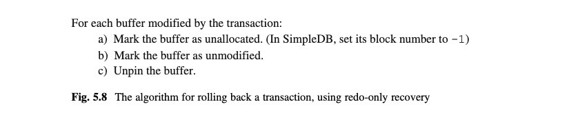

[图5.8]

仅重做恢复比撤销重做算法更快,因为没有提交的事务可以被忽略.然而它要求每个事务保持它修改的块的缓存被钉着,这会增加了系统里的缓存的竞争.在一个大的数据库,这个竞争可能会严重影响所有事务的性能,这使得仅重做恢复是一个有风险的选择.

思考是否有可能混合仅撤销和仅重做技术,创建一个不需要阶段1和2的恢复算法是有趣的.请看练习5.19.

### 5.3.5 提前记录日志
图5.6的恢复算法的步骤1需要更多的考察.再次说明这个阶段会遍历日志,针对来自未提交事务的更新日志执行一个撤销操作.为了确保该步骤的正确性,我做了以下假设:针对一个未提交事务的所有更新会有一个相应的日志记录在日志文件中.否则,数据库会被损害因为没有办法去重做修改.

因为系统会在任何时候崩溃,满足这个假设的唯一方式是只要有产生更新日志就刷新.但是正如4.2节描述的,这个策略是极其低效的.一定有一个更好的方式.

让我们来分析可能出问题的事情.假设一个未提交事务修改了一个页并创建一个相应的日志记录.如果服务器崩溃了,有4种可能:
(a)	页和日志记录都别写入磁盘了
(b)	仅页写入磁盘了
(c)	仅日志记录写入磁盘了
(d)	都没写入磁盘

按顺序思考每一种可能.如果(a),那么恢复算法会发现日志记录并撤销磁盘上的改变;没有问题.如果(b),那么恢复算法将找不到日志记录,所以它不会撤销数据库的修改.这是一个严重的问题.如果(c),那么恢复算法会发现日志记录并撤销块里不存在的修改.因为该块并没有真正的被修改,所以这是浪费时间,但是并不是不正确的.如果(d),那么恢复算法会找不到日志,但是因为块没有修改,反正也没有需要撤销的;没问题.

因此(b)是唯一有问题的情况.数据库引擎通过在刷新被修改缓存页之前刷新更新日志到磁盘.这个策略被称为使用一个提前写日志(write-ahead log).注意日志可能描述了根本没有发生到磁盘上的修改(如上面(c)的情况),但是如果数据库确实被修改了,该修改的日志记录总是会在磁盘上.

实现一个提前写日志的标准方法是让每一个缓存追踪它最近的修改日志的LSN.在一个缓存替换修改页之前,它告诉日志管理器刷新相应LSN及其以下的日志.作为结果,一个修改在保存到磁盘前,所对应的日志记录总会在磁盘上.

### 5.3.6 静态检查点
日志包含了数据库修改历史.随着时间流逝,日志文件会变得非常大--在某些情况下,可能会比数据文件还要大.恢复期间读取整个日志文件并撤销/重做每一个修改到数据库中,消耗会是巨大的.因此,恢复策略被设计成仅读取日志的一部分.基本的思路是只要恢复算法知道到下面的两件事,它就可以停止检索日志文件了:
*	更早的日志记录都是由已完成事务写入的.
*	那些事务的缓存都刷新到磁盘了.

第一个要点可应用到恢复算法的撤销阶段.它确保没有更多的未提交事务来回滚.第二个要点可应用于重做阶段,并保证所有更早的已提交事务不需要重做.注意到如果恢复算法实现仅撤销恢复,那么第二个要点总是正确的.

在任何时间段,恢复管理器可以实现一个静态检查操作,如图5.9所示.该算法的步骤2确保第一个要点被满足,且步骤3确保第二个要点被满足.

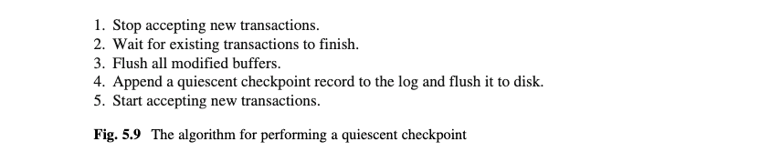

[图5.9]

静态检查点记录在日志记录里表现为一个标志.当恢复算法的第一个阶段在它往回遍历日志时遇到检查点记录,它就知道更早的日志记录可以忽略;它因此可以从该处开始阶段2,并向前移动.换句话说,恢复管理器不用看检查点记录之前的日志记录.

写一个检查点记录的好时机是在系统启动的时候,在恢复操作已经完成并在新事务开始前.因为恢复算法刚完成处理日志文件,检查点记录确保它不再需要检查那些日志记录.

比如,思考图5.10的日志.这个样例日志描述了三件事:第一,一旦检查点操作开始时没有新的事务可以开始;第二,最后的事务一完成,检查点记录会被写入,并且缓存被刷新;第三,检查点记录写入后其他事务就可以开始.

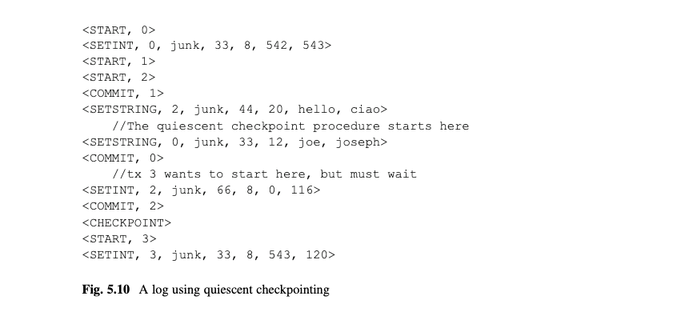

[图5.10]

### 5.3.7 非静态检查点(Nonquiescent Checkpointing)
静态检查点是容易实现的且容易理解.然而,在恢复管理器等待所有运行事务完成期间,它需要数据库是不可用的.在许多数据库应用,这是一个严重的缺陷--公司不想要它们的数据库在任意时间段偶尔停止响应.因此,不需要静止的检查点算法被开发出来了.该算法如图5.11所示.

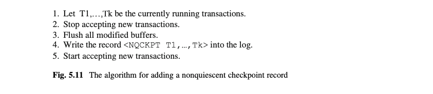

[图5.11]

这个算法使用一个不同种类的检查点记录,被称为非静态检查点记录.一个非静态检查点记录包含一个当前运行事务的列表.

恢复算法是如下修改的.算法的阶段1和之前的一样往回读取日志,并追踪已完成事务.当它遇到一个非静态检查点记录<NQCKPT T1,...,Tk>,它判断其中哪些事务仍在运行.然后他可以继续往回读取日志直到遇到哪些事务最早的开始记录.这个开始记录之前的所有记录都可以被忽略.

举个例子,再次思考图5.10的日志.带有非静态检查点的日志如图5.12所示.注意到日志中的<NQCKPT..>记录出现在图5.10检查点开始处理的位置,且声明了事务0和2在那个时间点正在运行.这个记录和图5.10不同的是事务2从未提交.

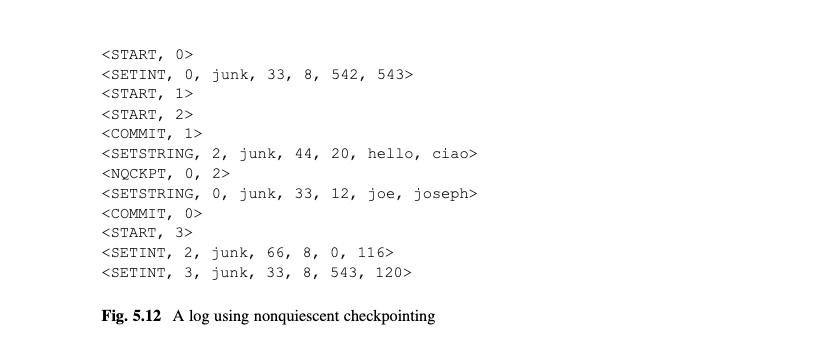

[图5.12]

如果恢复算法在系统启动时看到这个日志,它会进入阶段1并像下面这样继续.

*	当它遇到<SETINT,3,...>日志记录,它会查看事务3是否在已提交事务列表上.因为该列表目前是空的,该算法会执行一个撤销操作,写入整型543到"junk"文件的块33的偏移8处.
*	日志记录<SETINT,2,...>会被类似地处理,写入整型0到"junk"文件块66的偏移8处.
*	<COMMIT,0>日志记录会导致0被添加到已提交事务列表里.
*	<SETSTRING,0,...>日志记录会被忽略,因为0是在已提交事务列表里.
*	当它遇到<NQCKPT 0,2>日志记录,它知道事务0已经提交了,因此它可以忽略所有在事务2的开始记录之前的所有日志.
*	当它遇到<START,2>日志记录,它进入阶段2并开始向前遍历日志文件.
*	<SETSTRING,0,...>日志记录会被重做,因为0是在已提交事务列表里,'joseph'值会被写入"junk"文件的块33的偏移12处.

### 5.3.8 数据项粒度
本节的恢复管理算法使用值作为日志记录的单元.也就是说,每个修改的值会创建一个包含旧值和新值的日志记录.这种日志记录单元被称为一个恢复数据项(recovery data item).一个数据项的大小被称为粒度(granularity).

恢复管理器可以选择使用块或文件,而不是值来作为数据项.比如,假设块被选来作为数据项.在这种情况下,每次一个块被修改,一个包含旧的和新的块值的更新日志会被创建.

记录块日志的优势是如果你使用仅撤销恢复更少的日志记录会被需要.假设一个事务钉住一个块,修改了几个值,然后解钉它.你可以保存该块的内容到一个日志记录里,而不是为每个修改的值写一个日志记录.劣势在于,很明显,更新日志记录现在是非常大的;块的整个内容会被保存,无视它的值有多少被实际修改.因此,日志记录块仅当事务倾向于对每个块做许多修改操作时才有意义.

现在思考使用文件作为数据项会意味着什么.一个事务会对一个修改了的文件生成一个更新日志记录.每一个日志记录会包含该文件的整个原始内容.为了回滚该事务,你只需要用它们的原始版本替换目前的文件.这种方式比使用值或块更不实际,因为每一个事务会产生整个文件的拷贝,不管多少值被修改了.

尽管文件粒度的数据项对于数据库系统是不实际的,它们经常被非数据库应用使用.假设,比如,当你正在编辑一个文件时你的电脑崩溃了.在系统重启时,一些文本处理软件会展示给你两种版本的文件:你最近保存的版本和系统崩溃时存在的版本.原因是哪些文字处理软件并不直接将你的修改写入原始文件中,而是写入一个拷贝中;当你保存时,修改的文件会复制到原始的文件.这个策略是一个粗糙版本的基于文件的日志.

### 5.3.9 SimpleDB的恢复管理器
SimpleDB的恢复管理器是通过在包simpledb.tx.recovery里的RecoveryMgr类实现的.RecoveryMgr的API如图5.13所示.

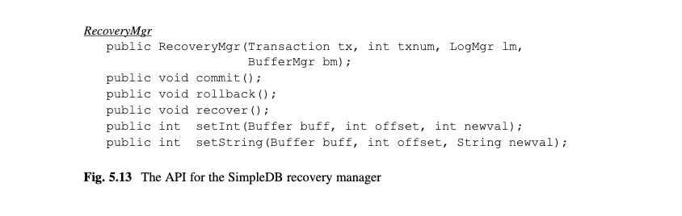

[图5.13]

每一个事务有它自己的RecoveryMgr对象,它的方法为该事务写入合适的日志记录.比如,构造器写入一个开始日志记录到日志中;commit和rollback方法写入相应的日志记录;并且setInt和setString方法从指定缓存提取旧值.并写入一个更新记录到日志文件中.rollback和recover方法实现了回滚(或恢复)算法.

一个RecoveryMgr对象使用值粒度数据项的仅撤销恢复.它的代码可以分为两类:实现日志记录的,和实现回滚和恢复算法的.

#### 5.3.9.1 日志记录
如4.2节提到的,日志管理器把每个日志记录看作一个字节数组.每一种日志记录有它自己的类,负责嵌入合适的值到字节数组里.每一个数组的第一个值会是一个整数,代表该日志的操作数;操作数可以是常量 CHECKPOINT,START,COMMIT,ROLLBACK,SETINT,或SETSTRING中的某个.剩下的值由操作数决定--一个静态检查点记录没有其他值,一个更新记录有5个其他值,其他类型分别有一个其他值. 

每一个日志记录类实现了LogRecord接口,它的代码如图5.14所示.这个接口定义了3个抽取日志记录的各部分的方法.op方法返回日志的操作数.txNumber方法返回写入该日志记录的事务ID.这个方法对所有日志记录有用,除了检查点记录,其返回一个假ID值.undo方法重新保存存储在该记录的修改.仅setint和setstring日志记录会有一个不为空的undo方法.那些记录的方法会钉住一个缓存到指定块,写入指定值在指定偏移,并解钉缓存.

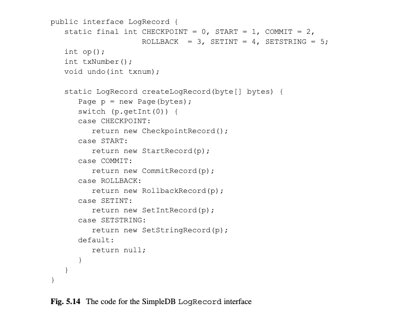

[图5.14]

不同种类的日志记录类都有类似的代码:考察一种就够了,比如 SetStringRecord,它的代码如图5.15所示.

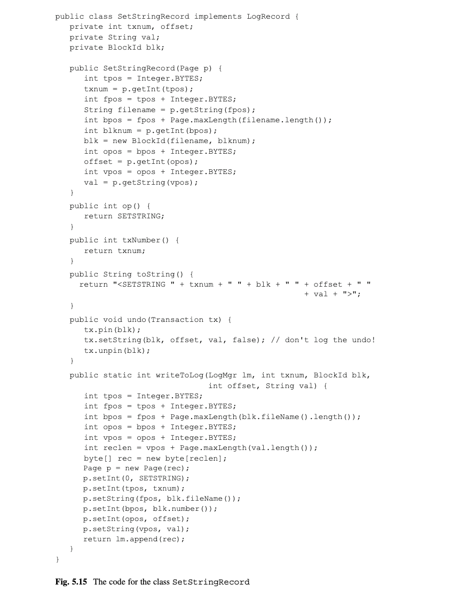

[图5.15]

这个类有两个重要的方法:一个静态方法writeToLog,它把一个SETSTRING日志记录转为一个字节数组,和构造器方法,它从字节数组抽取那6个值.思考writeToLog的实现.它先计算字节数组的大小和每个值的偏移.然后它创建那个大小的字节数组,将其包装在一个Page对象里,并使用page的setInt和setString方法来写入值到相应的位置.构造器是类似的.它判断在页中每个值的偏移并抽取它们.

undo方法有一个参数,它是实现撤销的事务.这个方法让该事务钉住该日志代表的块,写入旧值,并解钉相应的块.调用undo的方法负责刷新缓存内容到磁盘.

#### 5.3.9.2 回滚和恢复
RecoveryMgr类实现仅撤销恢复算法;它的代码如图5.16所示.commit和rollback方法在写入它们日志记录之前刷新事务缓存,并且doRollback和doRecover方法在日志文件里作了一个往回的移动.

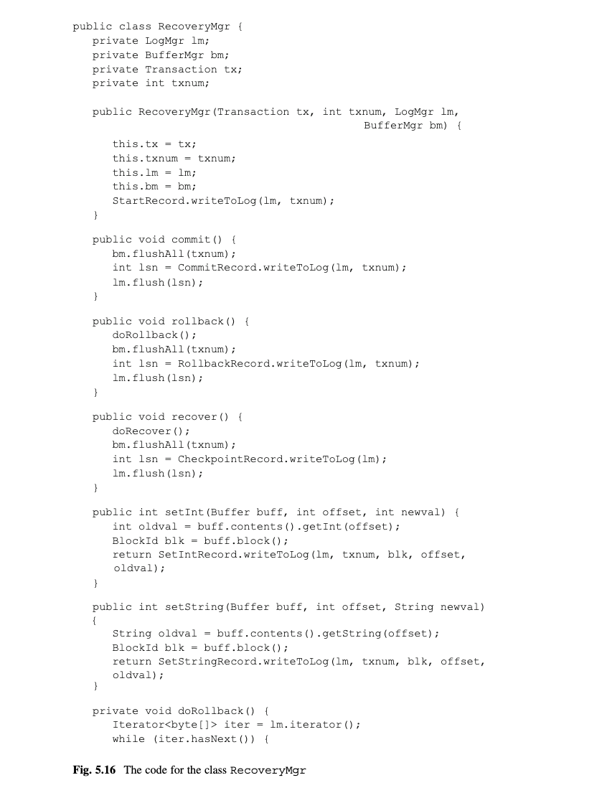
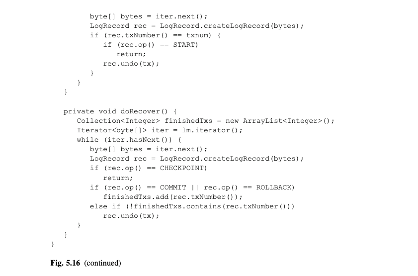

[图5.16]

doRollback方法遍历日志记录.每次它发现相应事务的日志记录,它调用undo方法.当它遇到该事务的开始记录停止.

doRecover方法的实现是类似的.它读取日志知道它遇到一个静态检查点或到达日志的结尾,同时保存着已提交事务号的列表.它跟rollback一样撤销未提交的更新记录,不同的是它处理所有未提交的事务,而不仅是一个指定的.这个方法和图5.6的恢复算法有点不同,因为它会撤销已经被撤销事务的操作.尽管这点差异不会产生错误,但是它降低了效率.练习5.5要求你优化它.

## 5.4 并发管理器
并发管理器是数据库引擎中负责并发事务的正确执行的组件.本节考察执行正确意味着什么,并研究一些确保正确性的算法.

### 5.4.1可串行化调度
一个事务的历史是一系列调用访问数据库文件的方法--特别是,get/set方法.比如图5.3的每一个事务的历史可以写作如图5.17a那样.另一种表达一个事务的历史的方式是从被影响块的方面,如图5.17b所示.比如tx2的历史声明它从读取块blk两次,并写入块blk两次.

形式上,一个事务的历史是一连串的由事务产生的数据库动作.数据库动作是有意使用的含义模糊的词.图5.17的(a)部分把数据库动作当成一个值的修改,(b)部分把它当成一个磁盘块的读/写.其他的粒度是可能的,这会在5.4.8节讨论.在那之前,我会假设一个数据库动作是一个磁盘块的读或写.

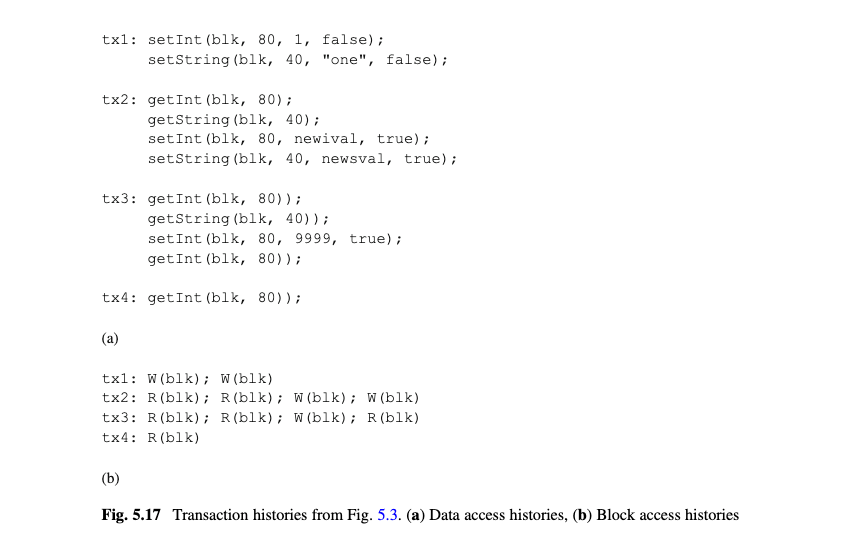

[图5.17]

当多个事务正在并发运行,数据库引擎会交错它们的线程的执行,周期性地打断一个线程并继续另外一个.(在SimpleDB里,Java的运行环境会自动做这个事).因此,由并发管理器执行的操作顺序会是一个不可预测的事务历史的交错.该交互被称为一个调度(schedule).

并发控制的目的是确保仅正确的调度会被执行.但是正确是什么意思?思考最简单的调度--所有的事务都是串行运行(比如图5.17).这个调度里的操作不会被交互,也就是说,这个调度会简单地成为每个事务背靠背的执行顺序.这种调度被称为串行调度(serial schedule).

并发控制是基于串行调度肯定是正确的基础上来预测的,因为没有任何并发.在串行调度方面定义正确性的有趣的地方在于同样事务的不同串行调度可以给出不同的结果.比如,思考两个事务T1和T2,有如下相同的流程:
T1:W(b1);W(b2)
T2:W(b1);W(b2)

尽管这些事务有同样的流程(比如,它们都是先写块b1然后块b2),但是它们作为事务并不一定等同--比如,T1可能写一个"X"在每一个块的开头,然而T2可能写一个"Y".如果T1在T2之前执行,那些块就会包含T2写的值,但是如果它们以相反的顺序执行,那么那些块会包含T1写的值.

在这个例子里,T1和T2对于块b1和块b2应该包含的内容有不同的选择.而且在数据库引擎的眼里所有事务都是平等的,所以没办法说一个结果比另外一个更正确.因此,你得承认任意一个串行调度的结果是正确的.也就是说,可能有多种正确的结果.

一个非串行调度被称为可串行化的,如果它和某些串行调度产生同样的结果.因为串行调度是正确的,那么可串行化的调度也一定是正确的.比如,思考上里事务的如下非串行调度:
W1(b1);W2(b1);W1(b2);W2(b2)
这里,W1(b1)意味着事务T1写入块b1,依次类推.这个调度的结果是,先执行T1的前半部分,T2的前部分,然后是T1的后半部分,T2的后半部分.这个调度是可串行化的,因为它等同于先执行T1然后T2的结果.另一方面,思考如下的调度:

W1(b1);W2(b1);W2(b2);W1(b2)

这个调度先执行T1的前半部分,然后是T2的所有,最后是T1的后半部分.这个调度的结果是块b1包含由T2写的值,但是块b2包含由T1写的值.这个结果不可能被任何串行调度产生,所以这个调度被说成是不可串行化的.

再次说明ACID中的隔离性说到,每一个事务都应该像系统里只有它在执行一样.一个不可串行化调度没有这个性质.因此,你得承认不可串行化调度是不正确的.换句话说,一个调度是正确的如果且仅当它是可串行化的.

### 5.4.2 锁表(The Lock Table)
数据库引擎负责确保所有的调度是可串行化的.一个常用的技术是使用锁来延迟一个事务的执行.5.4.3节会查看锁是如何被用于确保串行化的.本节简单的考察基本的锁机制是如何工作的.

每一个块有两种锁--一个共享锁(或slock)和一个排他锁(或xlock).如果一个事务由一个排他锁在一个块上,那么没有其他事务可以在其上拥有任何锁;如果事务持有一个共享锁在一个块上,那么其他事务仅允许在其上持有共享锁.注意到这些约束只适用于其他事务.一个单独事务是允许在一个块上持有共享锁和排他锁.

锁表(lock table)是数据库引擎中负责授权锁给事务的组件.SimpleDB类LockTable实现了锁表.它的API如图5.18所示.

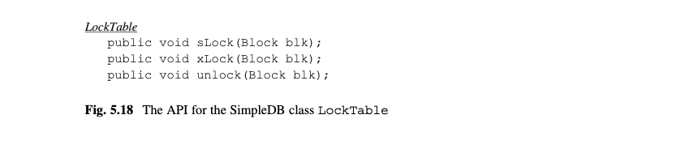

[图5.18]

sLock方法在指定块上请求共享锁.如果一个排他锁已经存在在该块上,这个方法会等待直到排他锁被释放.xLock方法请求排他锁.这个方法等待直到没有其他事务在该块上持有任何锁.unlock方法释放块上的锁.

图5.19展示类ConcurrencyTest,其展示了锁请求间的交互.

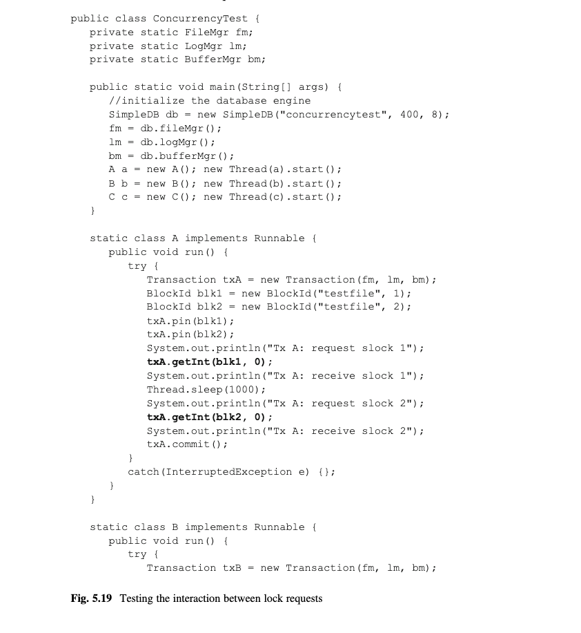
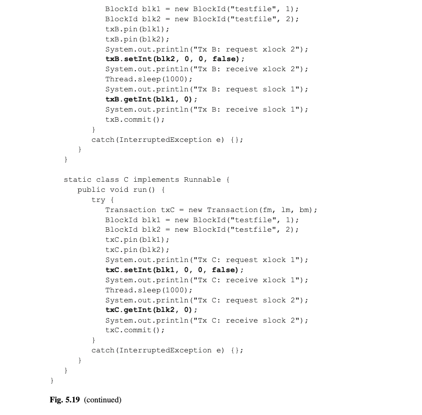

[图5.19]

main方法执行3个并发线程,一一对应A,B和C三个类.这些线程不显式锁和解锁块.相反,Transaction的getInt方法获得一个共享锁,它的setInt方法获得一个排他锁,且它的commit方法释放所有和它相关的锁.每一个事务的锁住和解锁流程看起来像下面这样:

txA: sLock(blk1); sLock(blk2); unlock(blk1); unlock(blk2)
txB: xLock(blk2); sLock(blk1); unlock(blk1); unlock(blk2)
txC: xLock(blk1); sLock(blk2); unlock(blk1); unlock(blk2)

线程有睡眠机制来强迫切换事务的锁请求.可能发生如下的实际顺序:
1.线程A获得blk 1上的共享锁.
2.线程B获得blk 2 上的排他锁.
3.线程C不能获得blk1上的排他锁,因为其他的事务有锁在该块上.因此线程C等待.
4.线程A不能获得blk2上的共享锁,因为其他事务持有排他锁在该块上.因此线程A也等待.
5.线程B可以继续.它获得一个共享锁在blk1块上,因为没有事务持有排他锁在其上.(线程C在等待该块的排他锁,这并不妨碍)
6.线程B解锁块1上的锁,但是这没有唤醒任何等待的线程.
7.线程B解锁blk2块上的锁.
8.线程A现在可以继续并获得在blk2块上的共享锁.
9.线程A解锁blk1上的锁
10.线程C最终能获取到blk1块上的排他锁.
11.线程A和C可以以任意顺序继续直到它们完成.

### 5.4.3 锁协议
是时候解答锁是如何被用于确保所有的调度都是可串行化的问题了.思考有如下执行历史的事务:

T1: R(b1); W(b2)
T2: W(b1); W(b2)

是什么导致它们的串行调度有不同的结果?事务T1和T2二者都写入同一块b2,这意味着这些操作的顺序造成差异--哪个事务后写便是"胜者".操作序列{W1(b2),W2(b2)}被说成是冲突了(conflict).一般来说,两个操作是冲突的如果他们的执行顺序不同可以产生不同的结果.如果两个事务有冲突的操作,那么它们的串行调度可能会有不同(但同样正确)的结果.

这个冲突是一个写-写(write-write)冲突的例子.第二种冲突是一个读-写(read-write)冲突.比如,操作{R1(b1),W2(b1)}冲突--如果R1(b1)首先执行,那么T1读取块b1的一个版本,然而如果W2(b1)首先执行,那么T1读到一个块b1的不同版本.注意到两个读操作不会冲突,当然不同块的操作也不会.

关心冲突的原因是因为它们影响调度的可串行化.在非串行调度中冲突操作执行的顺序决定等价串行调度的执行顺序.在上面的例子中,如果W2(b1)在R1(b1)之前执行,那么任何等价的串行调度必须让T2在T1之前执行.一半来说,如果你思考T1中所有于与T2冲突的操作,那么要么它们都必须在T2的任何冲突操作之前执行,要么都在它们之后执行.非冲突操作可以以任意顺序执行.

锁可被用来避免写-写(write-write)和读-写(read-write)冲突.特别地,假设所有的事务根据图5.20的协议来使用锁.

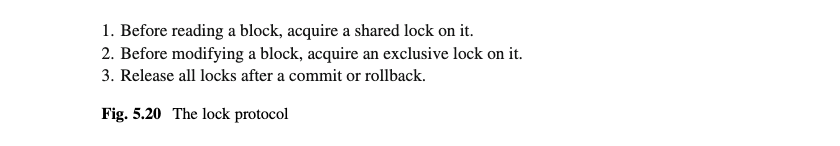

[图5.20]

从这个协议,你可以推导出两个重要的事实.首先,如果一个事务持有一个块的共享锁,那么没有其他在运行的事务会写入该块(否在,某些事务仍然会持有一个排他锁在该块上).第二,如果一个事务获得一个排他锁在该块上,那么没有其他运行的事务会在该块上持有锁).这些事实表明一个事务的操作永远不会和上一个由另外一个事务执行的操作冲突.换句话说,如果所有的事务遵循该锁协议,那么:

*	最终的结果调度总会是可串行化的(而且是正确的)
*	等价的串行调度是由事务提交的顺序决定的

通过强制事务来持有它们的锁直到它们完成,锁协议大大地限制了系统的并发.如果事务可以在不需要的时候释放锁就好了,那么其他事务也不需要等待那么久了.然而,如果事务在完成之前释放锁,两个严重问题会出现:它可能不是可串行化的,且其他事务可以读取它未提交的修改.接下来会讨论这些问题.

#### 5.4.3.1 串行化问题
一旦事务释放块上的锁,它就不再可以不影响串行化的同时对块加锁.为了看出为什么,思考一个事务T1在对块y加锁前释放块x的锁.

T1:...R(x);UL(x);SL(y);R(y);...

假设T1在解锁x和对y加共享锁期间被打断了.在这个点,T1是极其脆弱的,因为x和y都被解锁了.假设另一个事务T2加入,锁住x和y,写入它们,提交然后释放锁.下面的情况可能发生:T1必须在T2之前在串行顺序里,因为T1读取T2写之前块x的版本.另一方面,在串行顺序里T1也必须在T2之后,因为T1会读取T2写后y块的版本.因此,结果调度是不可串行化的.

反过来是正确的--如果一个事务在释放锁之前获取所有需要的锁,结果调度被确保是可串行化的(看练习5.27).这种锁协议被称为两阶段锁(two-phase locking).这个名称来源于协议下的事实,一个事务有两个阶段--积累锁的阶段和释放锁的阶段.

尽管两阶段锁理论上是一个更通用的协议,但是数据库引擎却无法简单地利用好它.通常一个事务已经完成访问最后块时(也是锁最终能被释放的时候),不管怎样它已经准备提交了.

#### 5.4.3.2 读未提交数据
提前释放锁(即使使用两阶段协议)带来的另外一个问题在于事务可以读取未提交数据.思考以下部分调度:
...W1(b);UL1(b);SL2(b);R2(b);...

在这个调度,T1写入块b然后释放锁;之后事务T2加锁然后读取块b.如果T1最终提交,那么没有问题.但是假设T1回滚了.那么T2也必须回滚,因为它的执行是基于不再存在的更改.并且如果T2回滚了,又会导致其他事务回滚.这种现象被称为级联回滚(cascading rollback).

当数据库引擎让一个事务读取未提交数据时,能得到更多的并发,但是它得接受写了数据的事务可能不会提交的风险.当然,回滚往往不太频繁,级联回滚则更甚.问题在于数据库引擎是否想要承受任何可能回滚不需要的事务的风险.大多数数据库系统不愿意承受这个风险,因此总会等待直到事务完成才释放排他锁.

### 5.4.4 死锁
尽管锁协议确保调度会是可串行化的,但是它不保证所有的事务会提交.特别是,事务之前可能会产生死锁.

4.5.1节给出了一个死锁的例子,描述的是两个客户端线程互相等待对方释放缓存.一个类似的可能性存在于锁中.死锁发生于事务之间出现锁请求环的时候,即第一个事务等待第二个事务持有的锁,第二个事务等待第一个事务持有的锁.在那样的情况下,没有事务可以继续,所有事务都可能永远等待着.举一个简单的例子,思考下面两个操作历史,事务虽然写入的是同样的块,但是是以不同顺序的.
T1:W(b1);W(b2)
T2:W(b2);W(b1)

假设T1首先获取在块b1上的锁.限制有一个对于块b2的锁竞争.如果T1先得到锁,那么T2会等待,T1最终会提交并释放它的锁,然后T2能继续.这没问题.但是如果T2先得到在块b2上的锁,那么死锁会发生--T1等待T2释放块b2的锁,T2等待T1释放块b1的锁.两个事务都没法继续.

并发管理器能通过维护一个"waits-for"图数据来检测死锁.这个图数据针对每一个事务有一个节点,并且如果T1正在等待T2持有的锁则会有一个边(edge);每一个边会被打上事务所等待的块的标签.每次一个锁被请求或释放,图会被更新.比如,上面的死锁场景相应的waits-for图如图5.21所示.

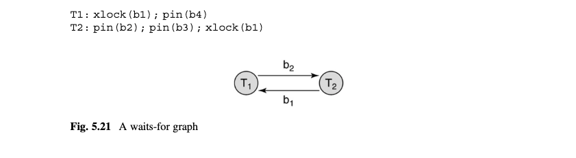

[图5.21]

很容易看出如果有环存在则死锁存在;看练习5.28.当事务管理器检测到死锁出现,它可以通过简单地回滚处于环中的任意一个事务来解开死锁.一个合理的策略是回滚造成环的事务,尽管其他策略是可能的;请看练习5.29.

如果你除了等待锁的线程还要考虑等待缓存的线程,那么检测死锁会变得相当复杂.比如假设缓存池仅包含两个缓存,并思考下面的场景:
T1:xlock(b1);pin(b4)
T2:pin(b2);pin(b3);xlock(b1)

假设事务T1在获得块b1上的锁之后被打断了,然后T2钉住块b2和b3.T2会在xlock(b1)的等待列表里,T1会在一个缓存的等待列表里.存在一个死锁,即使waits-for图没有环.

为了在那样的场景下检测死锁,锁管理器不仅需要维护一个waits-for图,也需要知道那些事务在等哪些缓存.在死锁检测算法中包含这个额外的考虑会是相当困难的.鼓励喜欢挑战的读者尝试练习5.37.

使用waits-for图来检测死锁的问题在于这个图是有点难于维护的,并且检测图中的环的处理是费时的.因此,更简单的策略被开发出来以达到类似死锁检测的效果.这些策略是保守的,它们总会检测到死锁,但同时它们也可能把非死锁情况当成死锁.本节思考两个可能的策略;练习5.33会考虑另外一个.

第一个接近的策略被称为wait-die,它的定义如图5.22所示.这个策略确保没有死锁会发生,因为waits-for图仅会包含从老的事务到新的事务的边.但是这个策略也将每一个可能的死锁当成回滚的缘由.比如假设事务T1比T2老,然后T2请求当前被T1持有的锁.尽管这个请求可能不会立即导致死锁,但是有潜在的可能.因为在之后的时间点,T1可能会请求T2持有的锁.因此wait-die策略会抢先回滚T2.

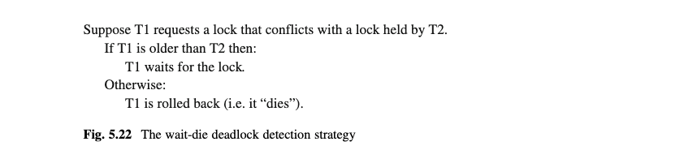

[图5.22]

第二个接近的策略是用一个时间限制来检测一个可能的死锁.如果一个事务已经等待提前设置的时间长度,那么事务管理器会认为它陷入死锁了,并会回滚它.请看图5.23.

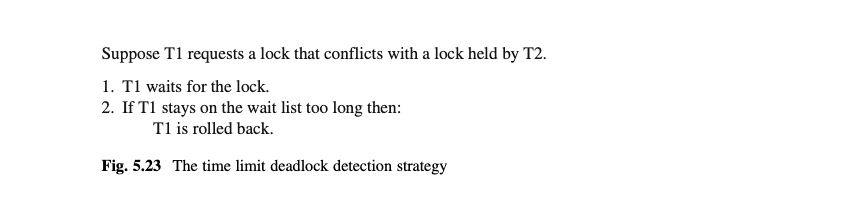

[图5.23]

不管是什么死锁检测策略,并发管理器必须通过回滚一个运行的事务来解开死锁.这一切的希望是通过释放回滚事务的锁,那么剩下的事务就可以获取锁完成执行了.一旦那事务回滚,并发管理器抛出一个错误;在SimpleDB,这种错被称为LockAbortException.和第四章的BufferAbortException一样,这个错被回滚事务的JDBC客户端捕获,然后该客户端决定如何处理它.比如,客户端可以选择直接退出,或它可以尝试重新运行事务.

### 5.4.5 文件级别冲突和幻读(File-Level Conflicts and Phantoms)
本章目前为止思考了来自于块的读和写的冲突.另一种冲突包含size和append方法,它们读和写文件末尾标识.这两个方法明显互相冲突:假设事务T1在事务T2调用size之前调用append;那么在任何串行顺序里T1必须在T2之前.

这个冲突的一个结果被称为幻读问题(phantom problem).假设T2重复读取一个文件的整个内容,并在每次遍历之前调用size以确定有多少块需要读取.另外,假设在T2第一次读取文件之后,事务T1添加了一些额外的块到文件中,填充了一些值,并提交.下次遍历这个文件的时候,T2会看到这些新增的值,这违背了ACID的隔离性.这些新增的值被称为幻读(phantoms),因为T2,它们神秘的出现了.

这些并发管理器如何避免这些冲突?锁协议要求T2在它读的每一个块上加锁,所以T1不能写入新值到这些块里.然而,这个方法在这不会工作,因为它会要求T2在T1创建它们之前加锁!

解决方案是让事务对文件末尾标记加锁.特别是,一个事务需要对标记加排他锁以调用append方法,并且它需要对它加共享锁以调用size方法.在上面的场景中,如果T1首先调用append,那么T2就不能确定文件的大小直到T1完成;相反,如果T2已经确定文件大小,那么T1会被阻塞添加直到T2提交.不管是那种情况,幻读都不会发生.

### 5.4.6 多版本锁
在许多数据库应用里事务大多是只读的.只读事务和数据库引擎相处非常好,因为它们共享锁且从不需要互相等待.然而,它们和更新事务相处的不是特别好.假设一个更新事务正在写入块.那么所有的想读该块的只读事务必须等待,不单单是等到块被写了而是要等到更新事务完成了.相反,如果一个更新事务想写一个块,它需要等待直到所有读取该块的只读事务完成.

换句话说,当只读事务和更新事务冲突时,许多等待会发生,不论哪个事务先获得锁.这种场景是常见的常见,研究者们已经开发出减少等待的策略.其中一种被称为多版本锁.

#### 5.4.6.1 多版本锁的原则(The Principle of Multiversion Locking)
正如它的名字那样,多版本锁是通过存储每个块的多个版本来工作的.基本的思路如下:
*	每个块的每个版本都被打上事务写入时的时间戳.
*	当一个只读事务从一个块读取值时,并发管理器使用事务开始前最近提交的版本.

换句话说,一个只读事务看的时事务开始时已经提交数据的快照.注意到"已提交数据"这个词.事务看到的是在它开始之前提交的事务写的数据而不是之后事务写的数据.

思考下面的多版本锁的例子.假设四个事务由以下操作历史:
T1:W(b1);W(b2)
T2:W(b1);W(b2)
T3:R(b1);R(b2)
T4:W(b2)

并且它们根据以下的调度执行:
W1(b1); W1(b2); C1; W2(b1); R3(b1); W4(b2); C4; R3(b2); C3; W2(b1); C2

这个调度假设一个事务开始于它的第一个操作并在需要锁的时候立即获得它们.Ci操作表示事务Ti提交的时间.更新事务T1,T2和T4遵循锁协议,你可以从这个调度确认.事务T3是一个只读事务且不需要遵循这个协议.

并发管理器为每个写入块的更新事务保存块的版本.因此,会有两个版本的b1和3个版本的b2,如图5.24所示.

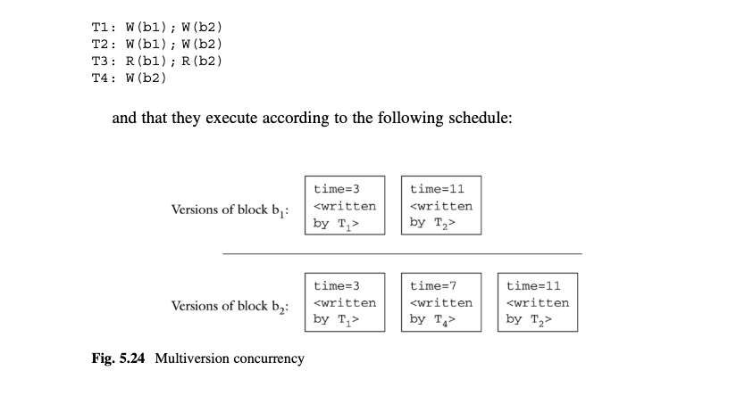

[图5.24]

每一个版本的时间戳是事务的提交时间,而不是写入发生的时间.假设每个操作消耗一个时间单元,那么T1在时间3时提交,T4在时间7,T3在时间9,T2在时间11.

现在思考只读事务T3.它开始于时间5,意味着它应该看到的是在那之前提交的值,也就是,T1提交的修改,而不是T2或T4的.因此,它会看到被打上时间戳3的b1和b2的版本.注意到T3不会看到时间戳7版本的b2,即使该版本已经在读发生之前提交了.

多版本锁的妙处在于只读事务不需要获取锁,因此不需要等待.并发管理器根据事务的开始时间选择请求块的合适版本.一个更新事务可以并发地更新同一块,但是一个只读事务不需要关心,因为它看的是一个该块的不同版本.

多版本锁只适用于只读事务.更新事务需要遵循锁协议,根据需要获取共享锁和排他锁.理由是每个更新事务都是读和写当前版本的数据(而不是之前的版本),因此冲突是可能发生的.但是记住这些冲突仅发生在更新事务而不是只读事务间.因此,假设有相对比较少的更新事务,那么等待则会比较少发生.

#### 5.4.5.2 实现多版本锁
现在你已经明白多版本锁应该如何工作,让我们考察并发管理器是如何做它需要做的.基本问题是怎么维护每个块的版本.一个直接但有点不同的方式是直接保存每个版本到一个版本文件.一个不同的方式是用日志来重新构造任何所需版本的块.它的实现是像下面这样工作的.

每一个只读事务在开始时得到一个时间戳.每一个更新事务在提交时得到一个时间戳.更新事务的commit方法被修改包含如下的动作:
*	恢复管理器写入事务的时间戳作为提交日志记录的一部分
*	对于每个事务持有的排他锁,并发管理器钉住块,写入时间戳到块的开头,然后解钉缓存.

假设一个有时间戳的只读事务t请求块b.并发管理器按照下面的步骤来重构正确的版本:
*	它复制当前版本的块到一个新的页.
*	它从后往前读取日志3次,如下:
	-	它构造一个时间t后提交的事务列表.因为事务以时间戳顺序提交,当发现一个提交记录的时间戳小于t并发管理器可以停止读取日志.
	-	它通过查找没有提交或回滚记录的事务的日志来构造一个未完成事务的列表.当遇到一个静态检测点记录或非静态检测点记录中的事务的最早的开始记录它可以停止读取日志.
	-	它用更新记录来撤销b的拷贝中的值.当遇到一个由以上列表中的事务写入的b的更新记录,它执行一个撤销.当它遇到以上列表里的事务的最早开始记录时它可以停止读取日志.
*	被修改的拷贝的b被返回给该事务

换句话说,并发管理器通过撤销在t之前未提交事务的修改来重构在t时间的块的版本.这个算法为了简洁适用了3次遍历.练习5.38要求你重写算法以只用一次遍历.

最后,事务需要需要指定它是否是只读的或不是,因为并发管理器对待这两种是不同的.在JDBC,这个设置是通过Connection接口的setReadOnly方法来实现的.比如:
Connection conn = ... // obtain the connection
conn.setReadOnly(true)

setReadOnly的调用对数据库引擎是一个提示.系统可以选择忽略这个调用如果它不支持多版本锁.

### 5.4.7 事务隔离级别(Transaction Isonlation Levels)
强迫可串行化会导致一个相当长的等待,因为锁协议要求事务持有它们的锁直到完成.因此,如果一个事务T1刚好只需要一个与T2持有的锁冲突的锁,那么T1不能做任何事只能等到T2完成.

多版本锁是非常有诱惑力的因为它运行只读事务没有锁的情况下执行,因此不会有必须得等的麻烦.然而,多版本锁的实现是有点复杂且需要额外的磁盘访问来创建版本的.另外,多版本锁不适用于更新数据库的事务.

对于事务有另外一种方式来减少等待锁的时间--它可以设置成它不需要完成的串行化.章节2考察了4个JDBC的隔离级别.图5.24总结了这些级别和它们的性质.

章节2关联了这些隔离级别到可能发生的各种问题.图5.25的新的地方在于它关联了这些级别到共享锁使用的方式上.可串行化隔离要求非常严格的共享锁,然而未提交读隔离甚至不用共享锁.明显,锁越不严格,等待越少发生.但是更少的严格锁也引入更多的不准确性到查询结果里:一个事务可能看到幻读,或它可能在不同的时间看到两个不同的值,或它可能看到由一个未提交事务写入的值.

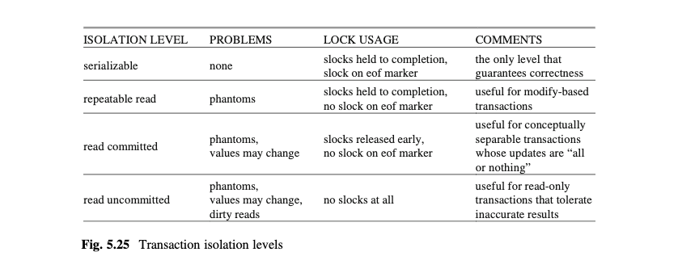

[图5.25]

我想强调这些隔离级别仅适用于数据读操作.所有事务,不论它们的隔离级别,都应该在写数据上表现正确.它们必须获得相应的排他锁(包括文件末尾标志的排他锁)并持有它们直到完成.理由是一个单独的事务可以选择忍受查询的不准确,但是一个不准确的更新会毒害整个数据库,这是不可忍受的.

读未提交级别和多版本锁比起来怎么样?二者都适用于只读事务,且都不带锁操作.然而,一个用读未提交隔离级别的事务看到的是块的当前值,不管哪个事务写入或什么时候写入.它甚至不接近于可串行化.另一方面,适用多版本锁的事务看到的是在某个时间点提交的内容且是可串行化的.

### 5.4.8 数据项粒度(Data Item Granularity)
本章已经假设并发管理器对块加锁.但是其他锁粒度也是可以的:并发管理器可以对值加锁,对文件,或着甚至对整个数据库.锁的单位被称为并发数据项.

并发控制的原则不被数据项的粒度所影响.本章所有的定义,协议和算法适用于任何数据项.粒度的选择因此是一个根据实际需要的,它需要平衡效率和灵活性.本节考察某些折衷.

并发管理器对每个数据项保留一个锁.一个更小的粒度是有用的,因为它允许更多的并发.比如,假设两个事务希望并发修改同一块的不同部分.使用值粒度锁时这些并发修改是可能的,但是块粒度锁则不行.

然而,一个更小粒度需要更多的锁.值粒度往往会产生不实际的小数据项,因为它们会需要很多数量的锁.另一个极端情况,使用文件作为数据项只需要很少的锁但对并发影响比较大--客户端需要对整个文件加排他锁以更新它的部分.使用块作为数据项是一个合理的折衷.

顺便提一下,注意一些操作系统(比如MacOS和Windows)使用文件粒度锁来实现一种简单的并发控制.特别地,一个应用在没有文件的排他锁的情况下不能写入一个文件,并且他不能获得排他锁,如果那个文件正被另一个应用使用.

一些并发管理器支持多种粒度的数据项,比如块和文件.只准备访问一个文件的几个块的事务可以分别对它们加锁;但是如果事务准备访问整个(或大部分)文件,它则获取一个单独的文件粒度锁.这种方法混合了小粒度数据项的灵活性和高级别数据项的方便性.

另一种可能的粒度是使用数据记录作为并发数据项.数据记录是由记录管理器处理的,这是下一章的主题.因为SimpleDB的构造方式,并发管理器不理解记录因此无法对它们加锁.然而,一些商业系统(比如Oracle)是构造成并发管理器能够理解记录管理器的形式,并且能够调用记录的方法.在这情况下,数据记录会是一个合理的并发数据项.

尽管数据记录粒度看起来很有魅力,但是它引入额外的幻读问题.因为新的数据记录能插入到已存在的块里,一个从块里读取所有记录的事务需要一种方式来避免其他事务插入记录到该块中.解决方案是让并发管理器也支持粗糙力度的数据项,比如块或文件.实际上,一些商业系统通过直接强制事务在插入操作之前对文件加排他锁.

### 5.4.9 SimpleDB的并发管理器
SimpleDB的并发管理器是通过simpledb.tx.concurrency包里的ConcurrencyMgr类来实现的.并发管理器使用块级粒度来实现锁协议.它的API如图5.26所示.

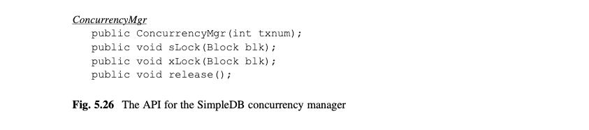

[图5.26]

每个事务有它自己的并发管理器.并发管理器的方法和锁表的方法类似但是是事务专有的.每一个ConcurrencyMgr对象追踪事务持有的锁.仅当事务没有的情况下,sLock方法和xLock方法会从锁表请求锁.release方法会在事务的最后调用来释放它的所有锁.

ConcurrencyMgr类利用LockTable类,LockTable类实现了SimpleDB的锁表.本节的剩余部分会考察这两个类的实现.

5.4.9.1 LockTable类
LockTable类的代码如图5.27所示.LockTable对象持有一个叫做locks的Map.这个map包含块和被分配锁的映射记录.映射的值是整型对象;-1值代表一个排他锁被指派了,然而一个整数值代表当前分派的共享锁数量.

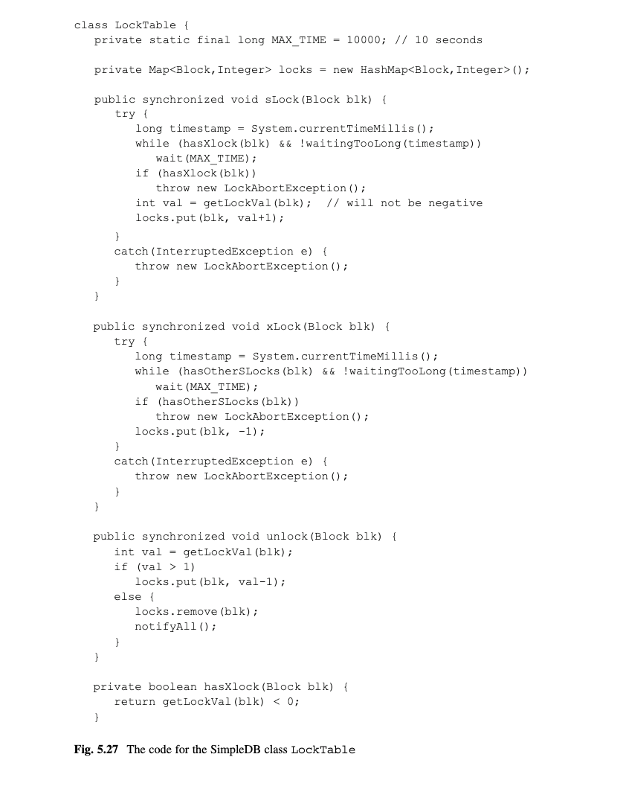
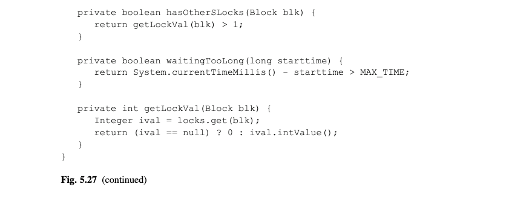

[图5.27]

sLock和xLock方法和BufferMgr的pin方法工作方式非常类似.每个方法在一个循环中调用Java的wait方法,这意味着只有满足循环条件客户端线程会放在等待列表上.sLock的循环条件调用hasXlock方法,如果相应的块上有带有-1值得映射记录hasXlock方法会返回true.xLock得循环条件调用hasOtherLocks方法,如果相应得块在locks里有值大于1得记录则返回true.基本原理是并发管理器总会在请求xlock之前获去共享锁,所以比1大得值意味着一些其他事务也在该块上持有锁.

unlock方法要么从locks移除指定锁或着减少仍然在共享该锁得事务得数量.如果锁从集合中移除,该方法则调用Java得notifyAll方法,这会移动所有等待的线程到调度的预备列表上.内部的Java线程调度器以不定顺序恢复每个线程.可能有多个线程等待同一个块.一个线程恢复的时候,它可能发现它想要的锁是不可用的,那么它会把它再次放到等待列表上.

这段代码中管理线程提醒的方式不是特别高效.notifyAll方法移动素偶又等待线程,这当中包含等待其他锁的线程.那些线程,当被调度时,会(当然)发现它们的锁仍然是不可用的并且会把它们放回等待列表.另一方面,如果只有相对少的数据库线程在并发允许那么这个策略不会有太多消耗.另一方面,一个数据库引擎应该应该是比这更复杂的.练习5.53-5.54要求你来优化等待/提醒(wait/notification)机制.

#### 5.4.9.2 ConcurrencyMgr类
ConcurrencyMgr类的代码如图5.28所示.尽管每一个事务有一个并发管理器,它们都需要使用同样的锁表.这个需求是让每个ConcurrencyMgr对象共享一个静态LockTable变量来实现的.事务持有的锁的信息是保存在本地私有locks变量里.这个变量持有一个map为每一个块持有一条映射记录.映射记录关联的值要么是"S"或"X",取决于是否有一个共享锁或排他锁在该块上.

sLock方法首先检查是否事务已经有一个锁在该块上;如果有,则没有必要访问锁表.否则,它调用锁表的sLock方法并等待锁被授予.如果该事务已经有一个排他锁在该块上,xLock方法则不需要做任何事务.如果没有,这个方法首先获得该块的一个共享锁然后获取排他锁.(再次说明锁表的xLock方法假设事务已经持有一个共享锁了).一个事务持有一个块的排他锁也意味着持有该块的共享锁,从这个意义上来说,排他锁比共享锁更强大.

## 5.5 实现SimpleDB的事务
5.2节引入了针对类Transaction的API.现在可以讨论它的实现了.Transaction类利用BufferList类来管理它钉住的缓存.一次讨论每一个类.

Transaction类
Transaciton类的代码如图5.29所示.每一个Transaction对象创建它自己的恢复管理器和并发管理器.它也创建myBuffers对象来管理器当前钉住的缓存.

commit和rollback方法实现了以下操作:

*	它们解钉了任何剩下的缓存.
*	它们调用恢复管理器来提交(或恢复)事务
*	它们调用并发管理器来释放锁

getInt和getString方法首先从并发管理器获取指定块的共享锁,然后返回缓存里的值.setInt和setString方法首先从并发管理器获取一个排他锁,然后调用恢复管理器里相应的方法来创建相应的日志记录并返回它的LSN.这个LSN可以被传参到缓存的setModified方法.

size和append方法把文件末尾标志当作一个块号为-1的假的块.size方法获取块的共享锁,append方法获取块的排他锁.

BufferList类
BufferList类为事务管理当前被钉住的缓存列表;看图5.30.一个BufferList对象需要知道两件事:哪个缓存被指派给了哪个块,和钉住了多少块.代码使用一个map来确定缓存,一个列表来确定钉住数量.该列表BlockId对象列表.每次块被解钉了,一个实例从这个列表移除.

当一个事务提交或回滚时unpinAll方法实现缓存相关的操作--它让缓存管理器刷新所有被事务修改的缓存并解钉任何仍被钉住的缓存.

## 5.6 章节总结
*	当客户端程序能够随意运行时数据可能丢失或损害.数据库引擎强制客户端程序以事务(transactions)的形式构建.
*	一个事务是作为一个操作的组合.它满足原子性(atomicity),一致性(consistency),隔离性(isolation)和持久性(durability)的ACID性质.
*	恢复管理器(recovery manager)负责确保原子性和持久性.它是服务器中读取和处理日志的组件.它有3个方法:写日志记录,回滚一个事务,和在系统崩溃后恢复数据库.
*	每个事务写一个开始记录(start record)到日志表示开始的事件,写一个更新日志(update records)来表示它做的修改,写一个提交(commit)或回滚(rollback)日志表示它完成的时间.另外,恢复管理器可以在不同的时间端写检查点记录(checkpoint records)到日志.
*	恢复管理器通过从后往前读取日志来回滚事务.它使用事务的更新记录来撤销修改.
*	恢复管理器在系统崩溃后恢复数据库.
*	撤销-重做恢复算法撤销有未提交事务造成的修改,重做由已提交事务造成的修改.
*	仅撤销恢复算法假设已提交事务造成的修改在事务提交前被刷新到磁盘.因此,它只需要撤销由未提交事务造成的修改.
*	仅重做恢复算法假设事务知道事务提交时才刷新缓存.这个算法要求事务保持缓存被钉住直到它完成,但是它避免了撤销未提交事务的需要.
*	提前写(write-ahead)日志策略要求在刷新数据页之前刷新日志记录到磁盘.提前写日志确保数据库的修改总会在日志里保存,因此不需要撤销操作.
*	检查点记录添加到日志以减少恢复算法需要考虑的日志部分.当没有事务正在运行时,一个静态检查点记录可以被写入;一个非静态检查点记录能在任何时间被写入.如果撤销-重做(或者仅重做)恢复被使用,那么恢复管理器在写一个检查点记录前必须刷新被修改的缓存到磁盘.
*	一个恢复管理器可以选择记录值,记录,页,文件等级别的日志.日志单元被称为恢复数据项.数据项的选择涉及一个折衷:一个大粒度数据项会需要更少的更新日志记录,但是每个日志记录会变得更大.
*	并发管理器是数据库引擎里负责并发事务正确执行的组件.
*	在引擎里事务间的操作执行序列被称为调度.一个调度是可串行化的如果它等价于一个串行调度.仅可串行化调度是正确的.
*	并发管理器使用锁来确保调度是可串行化的.特别是,它要求所有事务遵循锁协议,该协议声明:
	-	在读块之前,获取该块的共享锁.
	-	在修改块之前,获取该块的排他锁.
	-	提交或回滚后释放所有的锁.
*	如果在事务之间存在一个环,即每个事务在等待下一事务持有的锁.并发管理器可以通过维护一个waits-for图数据和检查环来检测死锁.
*	并发管理器也可以使用算法来达到解决监测死锁的效果.如果事务需要一个由老事务持有的锁,等待-死(wait-die)算法会强制它回滚.时间-限制(time-limit)算法会强制一个算法回滚,如果它已经等待超过预期的时间.当死锁存在时这两个算法都会移除死锁,但是也可能回滚一个不需要的回滚的事务.
*	当一个事务正在检查一个文件,另一个事务可能添加新的块到其中.那些块的值被称为幻读(phantoms).幻读是让人讨厌的,因为它违背了事务的隔离性.一个事务可以通过锁住文件末尾标志来防止幻读.
*	需要用来保证隔离性的锁会极大地减少并发.多版本锁策略允许只读事务不需要锁就可以运行(因此不需要等待).并发管理器通过关联时间戳到每个事务并使用那些时间戳来重构某一时刻的块的版本.
*	另一种减少由锁带来的等待时间的方法是移除隔离性的要求.一个事务可以定义成四种隔离级别中的一种:可串行化(serializable),可重复读(repeatable read),读已提交(read commited),或读未提交(read uncommited).每一个不可串行化隔离级别减少由锁协议带来的共享锁的限制,结果是减少了等待但同等程度增加了读问题的严重性.选择不可串行化隔离级别的开发者一定要仔细思考不正确结果会发生的影响程度和这种不正确性的可接受性.
*	正如恢复管理器那样,并发管理器会选择锁值,记录,页,文件等等.锁的单元被称为并发数据项目.数据项的选择涉及到一个折衷.一个大粒度数据项会要求更少的锁,但是更大的锁单元需要更少的锁,但是更大的锁会更容易冲突,因此会减少并发.

## 5.7 建议阅读
一个事务的概念对于分布式计算的许多领域都是基本的,不单单是数据库系统.研究者已经开发出了大量的技术和算法;本章的一些思路只能算是冰山一角. Bernstein andNewcomer (1997) 和 Gray and Reuter (1993).这两本优秀的书展示了这个领域的概况.ernstein et al. (1987)对许多并发控制和恢复算法进行了综述. 有一个被广泛采用的恢复算法叫做ARIES,在Mohan et al.(1992)有所描述.

Oracle的可串行化隔离级别的实现被称为快照隔离,它扩展了多版本并发控制以包含更新.细节可以在shdown et al. (2019)的第九章找到.注意到Oracle称这个隔离级别为"串行化(serializable",尽管它跟一般的串行化有点区别.快照隔离比锁协议更高效,但是它不保证序列化.尽管许多调度是可串行化的,有一些确定的场景会导致不可串行化的行为.文章Fekete et al.(2005) 分析了这些场景并展示了如何修改风险应用以确保可串行化.

Oracle实现撤销-重做恢复,但是它分开了撤销信息和重做信息(新写的值).重做信息保存在一个重做日志,它的管理和本章的描述类似.然而,撤销信息不保存在日志文件而是在特殊的撤销缓存.理由是,Oracle使用之前的被覆盖的值来做多版本并发和恢复.细节可以在Ashdown et al. (2019)的第九章找到.

把一个事务想成是由多个更小的,相互协调的事务构成,这通常会很有用.比如,在一个嵌套事务中,一个父事务会产生一个或多个子事务;当一个子事务完成时,它的父事务再决定做什么.如果子事务中止,父事务可以选择中止所有子事务,或者通过产生另一个事务来替代中止的事务继续.嵌套事务的基本原理可以再Moss(1985)里找到.文章Weikum (1991) 定义了多级事务,它和嵌套事务类似;不同点在于一个多级别事务使用子事务并发执行来提高性能.

书籍资料相关:
Ashdown, L., et al. (2019).Oracle database concepts. Document E96138-01,Oracle Corporation. 可从这个链接获取: https://docs.oracle.com/en/database/oracle/oracle-database/19/cncpt/database-concepts.pdf

Bernstein, P., Hadzilacos, V., & Goodman, N. (1987).Concurrency control andrecovery in database systems. Reading, MA: Addison-Wesley.

Bernstein, P., & Newcomer, E. (1997).Principles of transaction processing. SanMateo: Morgan Kaufman.

Fekete, A., Liarokapis, D., O’Neil, E., O’Neil, P., & Shasha, D. (2005). Makingsnapshot isolation serializable.ACM Transactions on Database Systems, 30(2),492–528.

Gray, J., & Reuter, A. (1993).Transaction processing: concepts and techniques. SanMateo: Morgan Kaufman.

Mohan, C., Haderle, D., Lindsay, B., Pirahesh, H., & Schwartz, P. (1992). ARIES: Atransaction recovery method supportingfine-granularity locking and partial roll-backs using write-ahead logging.ACM Transactions on Database Systems,17(1), 94–162.

Moss, J. (1985).Nested transactions: An approach to reliable distributed comput-ing. Cambridge, MA: MIT Press.

Weikum, G. (1991). Principles and realization strategies of multilevel transactionmanagement.ACM Transactions on Database Systems, 16(1), 132–180.

## 5.8 练习
概念练习
5.1 假设图5.1的代码正在被两个用户运行,但是没有使用事务.给出一个场景,其中两个座位被预定了但是只有一张票被记录了.

5.2 软件配置管理器比如Git或Subversion允许用户提交一系列的修改到一个文件和回滚一个文件到之前的状态.它们也允许多用户来并发修改一个文件.
	(a)在这种系统事务的概念是什么?
	(b)这种系统如何保证串行化?
	(c)这种方式对数据库系统有用吗?请解释.

5.3 思考一个执行几个不相关的且不修改数据库的SQL查询的JDBC程序.程序员决定因为没有东西被更改,事务的概念不重要;因此整个程序在一个单独的事务里运行.
	(a)解释为什么事务的概念对于只读程序是重要的.
	(b)以一个大的事务运行整个程序有什么问题.
	(c)提交一个只读事务会有多少负荷?对于该程序每次查询以后都提交有意义吗?

5.4 当每个事务开始时恢复管理器写一条开始记录.
	(a)保存开始记录在日志里有什么实际意义?
	(b)假设一个数据库系统决定不写开始记录到日志里.恢复管理器仍热能正常运行吗?什么能力被影响了?

5.5 SimpleDB的rollback方法在返回前写入一个回滚日志到磁盘中.这是必须的吗?它是一个好的想法吗?

5.6 假设恢复管理器被修改成回滚方法完成时不写入回滚日志记录.会有问题吗?这是一个好的想法吗?

5.7 思考图5.7的仅撤销算法.解释它为什么交换算法的步骤1和2是不正确的.

5.8 展示如果系统在一个回滚和恢复之间崩溃了,那么重做回滚(或恢复)仍然是正确的.

5.9 有任何理由在回滚和恢复之间记录数据库的修改吗?

5.10 一个非静态检测点算法的变种是仅在检查点记录中记录一个事务,也就是,那个时间点的最老的运行事务.

5.11 如果回滚方法遇到一个静态检查点日志记录,它应该做什么?如果遇到一个非静态检查点日志记录呢?请解释.

5.12 非静态检查点的算法不允许在写入检查点记录时开始新的事务.请解释为什么这对于正确性是重要的.

