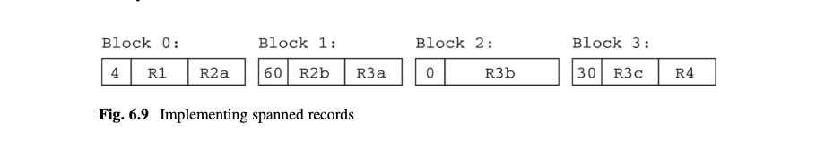
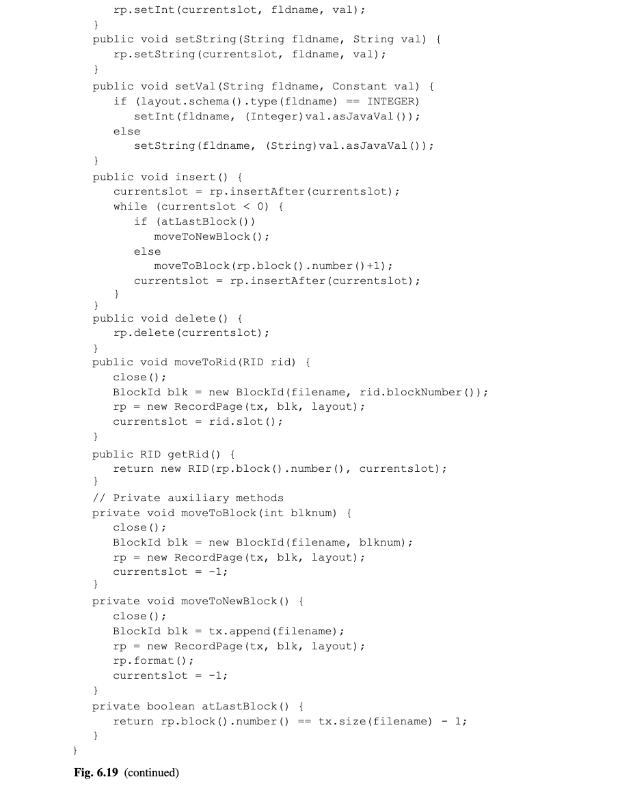

# 第6章 记录管理

事务管理器能够在磁盘的指定位置读和写值.然而,它对于在块里的是什么值,那些值可能放在哪里的是没有概念的.这个责任是属于记录管理器的.它组织一个文件为一个记录的集合,并有方法遍历记录和放置值在其中.本章研究由记录管理器提供的功能和用来实现该功能的技术.

## 6.1 设计一个记录管理器
一个记录管理器必须解决几个问题,比如:
*	每条记录都应该完整地放在一个块里吗?
*	一个块里的所有记录都应该来自于同样的表吗?
*	每个字段都使用预先设定的字节数吗?
*	每个字段值应该被放在它的记录的哪个位置?

本节讨论这些问题和它们的折衷.

### 6.1.1 跨块和非跨块记录
假设记录管理器需要插入4个300字节的记录到一个文件里,块的大小是1000字节.3条记录完美地填充到了块的前900字节.但是记录管理器应该如何对待第4条记录?图6.1描述了两个选项.

在图6.1a,记录管理器创建一条跨块记录,也就是值跨越2个或更多跨的记录.它保存前100字节到已存在的块中,保存后200字节到新的块中.在图6.1b,记录管理器保存整个第4条记录到新的块中.

[图6.1]

记录管理器必须决定是否创建跨块记录.非跨块记录的一个缺点是它们浪费磁盘空间.在图6.1b,每个块的100字节是被浪费的.一个更糟糕的情况是如果每条记录包含501字节--那么一个块则会只包含一条记录,并且差不多50%的空间会被浪费.另一个缺点是一个非跨块记录的大小是被限制到块大小的.如果记录可能比一个块还大,那么跨块是必须的.

跨块的主要缺点是它们增加了记录访问的复杂性.因为一个跨块记录被分割到几个块中,读取它会要求多次块访问.另外,跨块记录可能需要通过读取它到一个独立的内存区域来重新构造出来.

### 6.1.2 同类的 VS 非同类的文件
一个文件是同类的如果它的所有记录都来自同一个表.记录管理器必须决定是否允许非同类文件.这种折衷又是一种效率和灵活性的折衷.

比如,思考来自图1.1的STUDENT和DEPT表.一个同类的实现会将所有STUDENT记录放到一个文件,所有的DEPT记录放到另一个文件.这种放法使得单表SQL查询更容易响应--记录管理器只需要扫描一个文件的块.然而,多表查询则变得低效.思考一个联合这两个表的查询,比如"查找学生和它们的专业系的名称".这个记录管理器需要来回搜索STUDENT记录的块和DEPT记录的块(如第八章会讨论的那样),查找匹配的记录.即使查询可以不用过度搜索(比如,通过12章的索引联合),磁盘驱动仍必须多次寻道因为它交替地读取STUDENT和DEPT的块.

一个非同类组织会保存STUDENT和DEPT记录在同一个文件中,把每个学生记录保存在专业系记录旁边.图6.2描述了这种组织的前两个块,假设每个块3条记录.这个文件由一条DEPT记录和该专业的所有STUDENT记录构成.这个组织要求更少的块访问来记录联合(join),因为联合的(joined)记录聚集在同一块上.

[图6.2]

聚集优化了联合聚集表的查询性能因为匹配记录都保存在一起.然而,聚集会导致单表查询变得更低效,因为每个表的记录是分散在多个块.类似地,联合其他非聚集表也会变得低效.因此,仅在大多数重度使用的查询是通过聚集编码表的,聚集才会高效.

### 6.1.3 固定长度 对比 可变长度字段
一个表的每个字段都有一个定义类型.基于该种类型,记录管理器决定是否使用一个固定长度或可变长度展现该字段.一个固定长度字段使用精确的同样大小的字节来保存每个字段值,然而一个可变长度字段是基于存储数据来扩大或缩小.

许多类型是固定长度的.比如,整形和浮点型都可以保存为4字节值.实际上,所有的数字形和日期/时间类型是固定长度的.Java类型String是典型的可变长度类型,因为字符串可以是任意长度的.

可变长度会导致显著的复杂性.思考一下,比如,一个记录保存在一个装满了的块的中间,然后假设你修改它的其中一个字段值.如果该字段是固定长度的,那么那条记录会保持同样大小,并且该字段可以在原地修改.然而,如果该字段是可变长度的,那么该记录可能变得更大.为了腾出空间给更大的记录,记录管理器可能需要重新编排块中记录的位置.实际上,如果被修改记录变得很大,那么一条或多条记录可能需要从该块中移除,并放置到其他块.

因此,记录管理器在可能的情况下尽量使用固定长度.比如,记录管理器可以选择3种字符串的不同长度.

*	可变长度的方式,以这种方式记录管理器会在记录种分配字符串需要的精确大小
*	固定长度的方式,以这种方式记录管理器会把字符串保持在记录之外的地方,并保存一个指向该地址的固定长度的引用在记录中
*	另一种固定长度的方式,以这种方式记录管理器对记录中的字符串都分配同样大小空间,不论它的长度是多少

[图6.3]

这些长度的展示如图6.3所示.(a)部分展示了3个COURSE记录,其中Title字段是使用一个可变长度实现的.这些记录是省空间的,但是有刚才讨论的问题.

(b)部分展示了同样的3条记录,但是是将Title字符串放到一个单独的"字符串区域".这个区域会是一个单独的文件或者(如果字符串非常大)一个文件夹,其中每个字符串都保存在它自己的文件里.不管哪种情况,这个字段包含一个引用指向字符串在该区域的位置.这种方式使得记录既是固定大小同时也是比较小的.小记录是好的,因为它们可以保存在更少的块里,因此需要更少的块访问.这种方式的缺点是从一个记录读取字符串值要求额外的块访问.

(c)部分展示了使用长度Title字段的两条记录.这种实现的优势是记录是固定长度且字符串是保存在记录里的.然而,缺点是一些记录会比它们需要的大.如果字符串之间的大小差异比较大,那么空间浪费会比较大,这会导致一个更大的文件和相应的更多的块访问.

没有哪种实现是明显比其他的更好.作为一种帮助记录管理器选择合适的长度的方式,标准SQL提供3个不同的字符串数据类型:char,varchar,和clob.char(n)类型定义字符串大小为n个字符.varchar(n)类型和clob(n)类型定义字符串大小最大为n个字符.它们的区别是预期大小n.对于varchar(n),n是比较小的,比如不大于4K.另一方面,在clob(n)中的n值可以在GB字符的范围(缩略语CLOB代表"character large object").举一个clob字段的例子,假设大学数据库添加一个Syllabus字段到SECTION表,目的是这个字段会包含每个课程的教学大纲文本.假设教学大纲不会超过8000个字符,你可以合理地定义这个字段为clob(8000).

char类型的字段大致对应于图6.3a.因为n会相对比较小,放置字符串在记录不会使记录太大.另外,字符串大小的差异意味着固定长度会浪费空间.因此,可变长度是最好的选择.

如果n刚好比较小(比如,小于20),那么记录管理器可能选择使用第三种长度展现来实现一个varchar字段.理由是相比固定长度的好处空间浪费是微不足道的.

clob类型的字段对应于图6.3b,因为那种长度展示处理大字符串最佳.通过在记录外面存储大字符串,记录可以变得更小和更容易管理.

### 6.1.4 放置字段在记录中
记录管理器确定记录的结构.对于固定长度记录,它确定每个字段在记录中的位置.最直接的策略是紧挨着保存字段.然后记录的大小会是各字段大小的和,并且每个字段的偏移是前一个字段的末尾.

紧凑地打包字段在记录中对于基于Java的系统是合适的(比如SimpleDB和Derby),但是会在其他地方引发问题.问题在于必须确保值在内存里是对齐的.在大多数计算机里,访问一个整形的机器码要求那个整形是保存在一个4的倍数的内存位置.整形是以4字节为界限对其.记录管理器因此必须确保每个页的每个整形是以4字节界限对齐的.因为操作系统的页总是以2的足够大的N次方字节大小为界限,每个页的第一个字节会被正确地对齐.因此,记录管理器必须确保页中的每个整形的偏移是4的倍数.如果前一个字段不是以4的倍数的位置结束,那么记录管理器必须补充足够的字节来满足.

比如,思考STUDENT表,它由3个整形字段和一个varchar(10)字符串字段构成.整形字段是4的倍数长度,所以它们不需要补充.然而,字符串字段需要14个字节(假设是3.5.2节的SimpleDB的展示);因此它需要补充4个额外的字节以便接下来的字段可以以4倍字节数对齐.

一般来说,不同类型可能需要不同大小的补充字节.Double精度的浮点数,比如,通常以8字节界限对齐,并且小的整型通常以2字节大小界限对齐.记录管理器负责确保这些对齐.一个简单的策略是以它们被声明的顺序放置这些字段,补充每个字段以确保下一个字段正确的对齐.一个更聪明的策略是重排字段的顺序使得只需要最少的字节补充.比如思考下面的SQL表声明:
create table T(A smallint,B double precision, C smallint, D int, E int)

假设字段以给定的顺序存储.那么字段A需要补充6个额外的字节,字段C需要用2个额外的字节补充,导致记录长度为28字节;请看图6.4a.另一方面,如果字段是以[B,D,A,C,E]的顺序存储,那么不需要补充字节,记录长度仅为20字节,如图6.4b所示.

除了补齐字段,记录管理器也必须补齐每条记录.思路是每个记录需要以k字节界限结束,其中k是最大的可支持对齐,所以页中的每个记录和第一个记录有同样的对齐长度.再次思考图6.4a的字段格式,它是一个28字节长度的记录.假设第一个记录开始于块的0字节处.那么第二条记录会开始于块的28字节,这意味着第二条记录的B字段会开始于块的36字节处,这是错误的对齐.每条记录都开启于8字节边界是非常重要的.在图6.4的例子里,(a)部分和(b)部分的记录需要补充额外的4个字节.

[图6.4]

一个Java程序不需要思考补齐,因为它不直接以字节数组访问数值.比如,从一个页读取一个整数的方法是ByteBuffer.getInt.这个方法不调用机器码指令来获取整数,而是从4个指定字节构造整形.这个操作比单独的机器码指令低效,但是它避免了对齐问题.

## 6.2 实现一个记录文件
上一节思考了记录管理器必须得解决的决策.本节思考这些决策是如何实现的.它开始于最直接的实现:一个包含同类的,非跨块的,固定长度记录的文件.然后本节思考其他设计决策是如何影响这个实现的.

### 6.2.1 一个直接实现
假设你想创建一个同类的,非跨块的,固定长度记录的文件.事实是,记录是非跨块的意味着你可以把文件当成一连串的块,其中每个块包含它自己的记录.记录是同类的且固定长度意味着你可以在一个块中为每个记录分配同样大小的空间.换句话说,你可以把每个块当成一个记录的数组.SimpleDB称这种块为一个记录页(record page).

一个记录管理器可以如下实现记录页.它切割一个块为多个槽(slot),其中每个槽都是足够大地足以存放一个记录加一个额外的字节.这个字节的值是一个表示该槽是空的或在用的标记;假设0表示"空",1表示"在用".

比如,假设块大小是400,并且记录大小是26;那么每个槽是27字节长,那么该块则持有14个槽,剩余22的空余字节.图6.5描述了这种场景.这张图展示14个槽中的4个;槽0和13目前包含记录,然而槽1和2是空的.

[图6.5]

记录管理器需要能够在一个页记录中插入,删除,和修改.为此,它使用以下关于记录的信息:
*	槽的大小
*	每种记录的每个字段的名称,类型,长度,和偏移

这些值组成了记录的格式(layout).比如,思考图2.4的STUDENT表.一个STUDENT记录包含3个整型加一个10字符长度的varchar字段.假设SimpleDB的存储策略是,每个整形需要4个字节且一个10字符长度字符串需要14字节.让我们假设字节补齐是不需要的,varchar字段通过分配固定空间大小给最大可能的字符串,且空/在用的标记在每个槽的开始占用一个字节.图6.6给出了这个表的最终格式.

[图6.6]

给出一个格式,记录管理器可以确定在页中每个值的位置.偏移k的记录开始于RL*k位置,其中RL是记录的长度.记录的"空/在用"标记在RL*k位置,记录的F字段是在RL*k+Offset(F)处.

记录管理器可以非常容易地处理插入,删除,修改,和检索:
*	插入一条新的记录,记录管理器会检查每个槽的"空/在用"标记直到找到一个是0的槽.然后将该标记设置为1,返回那个槽的位置.如果所有的标记值都是1,那么块是满的,无法插入.
*	删除一条记录,记录管理器直接设置它的"空/在用"标记为0即可.
*	修改一条记录的字段值(或者初始化一条新记录的一个字段),记录管理器确定该字段的位置然后写入值到该位置.
*	在页中检索记录,记录管理器会检查每个槽的"空/在用"标志.每次它发现1,它就知道那个槽包含一个存在的记录.

记录管理器也需要一种方法来在一个记录页中识别一条记录.当记录都是固定长度的,最直接的记录标识是它的槽号.

### 6.2.2 实现可变长度字段
固定长度字段的实现也是非常简单的.本节思考可变长度字段的引入是如何影响该实现的.

一个问题在于记录中的字段偏移不再是定长的.特别地,记录间的所有跟着可变长度字段的字段的偏移都是不同的.确定那些字段的偏移的唯一方法是读取前一个字段,查看它的结束位置.如果记录的第一个字段是可变长的,那么为了确定第n个字段的偏移需要读取该记录的前n-1字段.因此,记录管理器通常把定长字段放在每个记录的前面,从而使得它们可以以预计算得偏移来访问.可变长字段是放在记录得末尾.第一个可变长字段会有一个固定的偏移,但是剩余的不会有.

另一个问题是修改一个字段值会导致一条记录的长度变化.如果新值更大,那么块中从修改值到右边的值必须被迁移以制造空间.极端情况下,被迁移的记录会溢出整个块;这种情况可以通过分配一个溢出块(overflow block)来处理.

一个溢出块是从被称为扩展区域(overflow area)分配的新块.任何从原始快溢出的记录都会从该块移出,添加到一个溢出块了.如果许多这种修改发生,那么可能需要多个溢出块链.链中每个块会包含下一个溢出块的引用.因此,原始和溢出块一起组成一个单独大记录页.

比如,思考COURSE表,假设课程标题是以可变长度保存的.图6.7a描绘了一个包含该表的前三个记录的块.(Title字段已经被移到该记录的末尾因为其他字段是定长的).图6.7b描绘了修改标题"DbSys"到"Database Systems Implementation"的结果.假设块大小是80字节,第三条记录不再能放到该块里,因此它被放到一个溢出块里.原始块包含一个到该溢出块的引用.

[图6.7]

第三个问题是关于把槽号作为一个记录的标识.不再可能像使用固定长度记录那样,通过槽大小除以块号来计算.查找一条有指定id的记录的开始位置的唯一方式是从块的开始读取记录.

把槽号用于记录的标识也使记录插入复杂化了.图6.8展示了这个问题.

[图6.8]

和图6.7a一样,(a)部分描绘了一个包含前3条COURSE记录的块.课程22的记录删除设置该标记为0(对于"空"),且完整保留了该记录,如(b)部分展示的那样.这个空间限制对于插入是可用的.然而,一条记录仅当它的Title字段有9个或更少的字符时可以插入到该空间.一般来说,一条新记录可能不能填充到块中即使有多个通过删除小记录留下来的空间.这种块被说成是碎片化了.

一种减少这种碎片的方法是迁移剩下的记录,从而使得它们都被集合在块的末尾.然而,那么做会改变被迁移记录的槽号,这会不幸地改变了它们的id.

这个问题的解决方法是使用一个ID表来分离记录的槽号和它在页中的位置.一个ID表是一个保存在页开头的整数数组.数组中的每个偏移代表了一个记录id.数组中的值是有该id的位置;0值表示没有记录有该id.图6.8c描绘了和图6.8b同样的数据,但是是使用一个ID表.该ID表包含3条记录:其中两条指向该块的偏移63和43,且其他都是空的.位置63的记录有id 0,位置43的记录有id 2.目前没有id为1的记录.

ID表提供了一种间接的方式使记录管理器可以在一个块中移动记录.如果记录移动,它在ID表中的记录也会被相应调整;如果该记录被删除,它的记录会被设置为0.当一个新的记录被插入,记录管理器在数据中查找一个可用记录,然后指派它作为新记录的id.通过这种方式,ID表允许可变长度记录可以在块中移动,同时提供给每条记录固定的标识.

ID表随着块中的记录数增加而扩充.该数组的大小必须是不受限制的,因为一个块可以拥有不同数量的可变长度记录.通常,ID表是放在块的一边,记录是放在另一边,然后它们朝相互的方向增长.这种情况如图6.8c所示,其中块里的第一条记录是在它的最后端.

一个ID表使得"空/在用"标志变得不需要.一条记录是在用的,如果ID表中的一条记录指向它.空记录有一个0的id(实际上述它甚至都不存在).ID表也使得记录管理器能在块中快速查找每一条记录.记录管理器直接使用存在该ID表里的记录,来移动一条有指定id的记录;记录管理器扫描ID表直到找到下一个非0记录来移动下一条记录.

### 6.2.3 实现跨块记录
本节思考跨块记录是可以如何实现的.当记录不是跨块的,每块的第1条记录总是起始于同样的位置.使用跨块记录,这种情况不再是确定了的.因此,记录管理器必须在每块的开始位置保存一个整数来保存第一条记录的偏移.

比如,思考图6.9.块0的第一个整数是一个4,表示第1条记录R1开始于偏移4(刚好在该整数之后).记录R2跨越块0和1,并且在块1的第一条记录是R3,其开始于偏移60.记录R3跨越块2到块3.记录R4是块3的第一条记录.注意到块2的第一个整数是0,表示没有记录起始于该块.

[图6.9]

记录管理器可以选择用两种方式切割一个跨块记录.第一种方式在块界限上切割,即尽可能地填充块;剩下的字节被放到文件的下一块.第二种方式是一个值一个值的写记录;当页变满时,写操作在一个新页继续.第一种方式的优点是它完全不浪费空间但是缺点在于跨块切割一个值.记录管理器必须通过组合两块的字节重构值,来访问被切割的值.

### 6.2.4 实现非同类记录
如果记录管理器支持非同类记录,那么它也需要支持可变长记录,因为不同表的记录不需要是同样大小的.有两个问题跟在一个块里有非同类记录相关:
*	记录管理器需要知道块中的每种类型的格式.
*	给出一条记录,记录管理器需要知道它来自哪个表.

记录管理器可以通过保存一个格式的数组,每个值对应于每个可能的表来解决第一个问题.记录管理器可以通过增加一个额外的值到每条记录的开头来解决第二个问题;这个值,有时被称为一个标签值(tag value),是一个在该格式数组的下标,它定义了该块所属的表.

比如,再次思考图6.2,它描绘了来自DEPT和STUDENT表的非同类块.记录管理器会保存一个包含来自这两个表的格式信息的数组;让我们假设DEPT的信息是在该数组下标0处,STUDENT的信息是在下标1处.那么来自DEPT的每条记录的标签值都会是0,且每条STUDENT记录的标签值会是1.

记录管理器的行为不需要多少改变.当记录管理器访问一条记录时,它从标签值来确定是哪个表.然后他可以使用那张表来读或写任何字段,和在同类情况下一样.

SimpleDB的日志记录是一个非同类记录的例子.每条记录的第一个值表示该日志记录的类型.恢复管理器使用该值来确定如何读取记录的剩下部分.

## 6.3 SimpleDB的记录页
接下来的两节考察了SimpleDB的记录管理器,它实现6.2.1节的基础的记录管理器.本节覆盖记录页的实现,下节覆盖如何实现一个记录页的文件.章节末尾的一些练习要求你来修改它以处理其他设计决策.

### 6.3.1 管理器记录信息
SimpleDB的记录管理器使用类Schema和Layout来管理记录的信息.它们的API如图6.10所示.

[图6.10]

一个Schema对象持有一个记录的schema,也就是,每个字段的名称和类型,和每个字符串字段的长度.这个信息和用户创建表时定义的相对应,并且没有物理信息.比如,一个字符串的长度时允许字符的最大长度,而不是它的字节数.

一个schema可以被认为是一个[字段名称,类型,长度]3要素组合的数组.Schema类包含5个添加3要素到列表中的方法.addField方法显式地添加一个3要素.addIntField,addStringField,add和addAll方法是方便的方法;这些方法的前两个计算3要素,后两个是从一个存在的shema复制. 该类也有剪刀方法来获取字段名集合,确定是否一个指定字段在该集合中,和获取一个指定字段的类型和长度.

Layout类额外包含关于一条记录的物理信息.它计算字段和偏移大小,和槽中的字段偏移.该类有两个构造器,和创建一个Layout对象的两个理由对应.当一个表创建时,第一个构造器被调用;它基于给出的schema计算格式信息.第二个构造器在表已经被创建后调用;客户端直接提供提前计算的值.

图6.11的代码块展示了这两个类的使用.该代码块的第一部分创建了一个包含COURSE表的3个字段的schema,然后用它创建了一个Layout对象.改代码块的第二部分打印了每个字段的名称和偏移.

[图6.11]

### 6.3.2 实现Schema和Layout
Schema类的代码是简单直接的,如图6.12所示.在内部,该类以字段名为键保存字段3要素到一个map里.和字段名关联的对象属于私有类FieldInfo,其封装了该字段的长度和类型.

[图6.12]

类型是以常量INTEGER和VARCHAR来表示,和在JDBC类Types里定义的方式一样.一个字段的长度仅对于字符串字段有意义;addIntField方法给整形的长度值是0,但是这个值是不重要的,因为它永远不会被访问.

Layout的代码如图6.13所示.第一个构造器以它们在schema中的顺序定位字段的位置.它以字节来确定每个字段的长度,计算槽大小为字段长度和加上一个整形大小的"空/在用"标识的4字节大小.它指派该标记在槽的偏移0处,指派每个字段的偏移在前一个字段结束处(假设,没有补充对齐).

[图6.13]

### 6.3.3 在一个页中管理记录
RecordPage类在一个页中管理记录.它的API如图6.14所示.

[图6.14]

nextAfter和insertAfter方法为指定记录搜索页.nextAfter方法返回第一个在指定槽后被使用的槽,跳过任何空槽.一个返回的负值标识所有剩余的槽都是空的.insertAfter方法查找第一个指定槽后的空槽.如果一个空槽被发现,该方法将它的标记设为USED,然后返回槽号.否则,该方法返回-1.

get/set方法返回在指定记录中的指定字段的值.delete方法设该页的标记为EMPTY.format方法给页中的所有记录槽默认的值.它设置每个"空/在用"标记为EMPTY,所有的整数为0,所有的字符串为" ".

RecordTest类展示RecordPage方法的运用;它的代码如图6.15所示.它定义了一个有两个字段的schema:一个字段A和一个字符串字段B.然后它为一个新块创建一个RecordPage对象,并格式化它. 那个for循环使用insertAfter方法用随机值记录来填充页.(每个A值是一个0到49之间的随机值,且B值是一个该数子的字符串版).那两个while循环使用nextAfter方法来搜索页.第一个循环删除选定的记录,第二个循环打印了剩余记录的内容.

[图6.15]

### 6.3.4 实现记录页(Record Page)
SimpleDB实现了图6.5的有槽页结构.唯一的区别是"空/在用"标记是以4字节整数实现的而不是单个字节(理由是SimpleDB不支持字节大小的值).类RecordPage的代码如图6.16所示.

[图6.16]

私有方法offset使用槽大小来计算一个记录槽的开始位置.get/set方法通过添加字段的偏移到记录的偏移来计算指定字段的位置.nextAfter方法和insertAfter方法调用私有方法searchAfter方法来查找一个有指定标记USED或EMPTY的槽.
searchAfter方法不断增加指定槽直到它要么发现一个有指定标记的槽,要么用完了所有槽.delete方法设置指定槽的标记为EMPTY,insertAfter设置被发现槽的标记为USED.

## 6.4 SimpleDB的表扫描
一个记录页管理一个记录块.本节考察表扫描(table scans),表保存任意数量的一个文件的多个块中.

### 6.4.1 表扫描
TableScan类用一个表管理记录.它的API如图6.17所示.

[图6.17]

一个TableScan对象追踪一个当前记录(current reord),它有方法改变当前记录和访问当前记录的内容.beforeFirst方法定位当前记录在文件的第一条记录之前,next方法定位当前记录在文件中的下一个记录.如果当前块没有更多的记录,那么next方法会读取文件里后续的块直到发现另一条记录.如果没有更多的记录能被发现,那么next的调用返回false.

get/set和delete方法应用于当前记录.insert方法从当前记录的块开始,插入一个新的记录在文件的某处.不像RecordPage的插入方法,这个插入方法总是会成功的;如果它不能找到一个地方来插入该记录到文件中存在的块中,它会添加一个新的块到文件中,并插入该记录到那里.

文件中的每条记录可以通过一对值来标识:它在文件中的块号和在块中的槽.这两个值被称为记录标识(record identifier)(或 rid).RID类实现这些记录标识.它的类构造器保存两个值;剪刀方法blockNumber和slot获取它们.

TableScan类包含2个与rid交互的方法.moveToRid方法定位当前记录到指定rid,且currentRid方法返回当前记录的rid.

TableScan类提供了一个与目前你看过的类非常不同的抽象级别.即,Page,Buffer,Transaction和RecordPapge的方法只适用于特定的块.TableScan类,另一方面,对它的客户端隐藏了块结构.一般来说,一个客户端不会知道(或关心)哪个块当前正在被访问.

图6.18的TableScanTest类展示了表扫描的运用.这段代码和RecordTest类似,除了它插入50条记录到文件中.ts.insert的调用会分配需要数量的块来保存记录.在这种情况,3个块会被分配(以每块18条记录).然而,这段代码并不知道这会发生.如果你多次运行这段代码,你会观察到另外50条记录会插入到该文件中,且它们会填充到之前被删除的记录的槽中.

[图6.18]

### 6.4.2 实现表扫描
TableScan类的代码如图6.19所示.一个TableScan对象为它当前块持有一个记录页.get/set/delete方法直接调用记录页的相应方法.当当前块改变时,moveToBlock方法被调用;该方法关闭当前页并为指定块打开另一个页,并定位在它的第一个槽之前.

[图6.19]

next方法的算法如下:
1.	移到当前记录页的下一条记录.
2.	如果没有更多的页在该页,那么移到到文件的下一块并获取它的下一条记录.
3.	继续直到要么下一条记录被发现要么遇到文件的末尾了.

一个文件的多个块都是空的,这是可能的(看练习6.2),所以next的调用可能需要在多个块中遍历.

insert方法尽量在当前记录后面插入一个新的记录.如果当前块满了,那么它移动到下一个并继续直到她发现一个空的槽.如果所有块都是满的,那么它会添加一个新的块到文件中并插入记录到那.

TableScan实现UpdateScan接口(也实现了Scan,通过继承).这些接口是查询执行的核心,并在第8章讨论.getVal和setVal方法也会在第8章讨论.它们获取并设置Constant类型的对象.一个常量是一个值类型的抽象(比如int或String),使得表达一个查询更容易,因为无需直到一个给定字段的类型.

RID对象是一个两个整数的简单组合:一个块号和一个槽号.RID类的代码因此是直接的,如图6.20所示.

[图6.20]

## 6.5 章节总结
*	记录管理器是数据库系统中在文件中保存记录的组件.它有3个基本责任:
	-	放置字段在记录中
	-	放置记录在块中
	-	提供文件中记录的访问.

当设计一个记录管理器时有几个问题必须被解决.
*	一个问题是是否支持可变长度字段.固定长度记录可以很容易实现,因为可以原地修改.修改一个可变长度字段会导致记录溢出一个块,且被放到一个溢出块中.
*	SQL有3个不同的字符串类型:char,varchar,和clob.
	-	char类型是使用定长实现的
	-	varchar类型是使用可变长度实现的
	- 	clob类型是使用一个定长标识来引用保存在辅助文件中的字符串.

*	一个可变长度记录的通用实现是使用一个ID表.该表中的每条记录指向页中一条记录.一条记录可以只通过改变在ID表中的记录来在页中移动.

*	第二个问题是是否创建跨块记录.跨块记录是有用的因为它们不浪费空间,且支持大记录,但是它们是更难以实现的.
*	第三个问题是是否支持在文件中保存非同类记录.非同类记录允许相关记录聚集在一个页中.聚集可以带来更高效的join,但是往往使得其他查询的代价更高.记录管理器可以通过保存一个标签字段在每条记录的开始来实现非同类记录;该标签代表该记录属于的表.
*	第四个问题是如何确定一个记录中每个字段的偏移.记录管理器可能需要对字段补充字节以至于它们以合适的字节边界对齐.每个定长记录中字段都有相同的偏移.在一个可变长记录搜索字段的起始位可能是需要的.

