# 第7章 元数据管理(Metadata Management)

前一章考察了记录管理器是如何在文件中保存记录的.然而,正如你看见的,单独一个文件是没用的;记录管理器也需要知道记录的格式以"解码"块中的内容.这个记录格式是元数据(metadata)的一个例子.本章考察数据库引擎支持的元数据的种类,它们的目标和功能,以及引擎在数据库引擎中保存元数据的方式.

## 7.1 元数据管理器
元数据是描述数据库的数据.数据库引擎维护各种各样的元数据.比如:
*	表(Table)元数据描述表记录的结构,比如长度,类型和每个字段的偏移.记录管理器使用的格式便是这种元数据的一个例子.
*	视图(View)元数据描述每个试图的属性,比如它的定义和创建者.这种元数据帮助计划期处理与视图相关的查询.
*	索引(Index)元数据描述定义在表上的索引(将在12章节讨论).计划器使用这个元数据来看一个查询是否可以使用索引来计算.
*	统计(Statistical)元数据描述每个表的大小和它的字段值的分布.查询优化器使用这种元数据来估算一个查询的消耗.

前三种元数据是在一个表,视图,或索引创建的时候生成的.统计元数据是在每次数据库被更新的时候生成的.

元数据管理器是数据库引擎种保存和检索元数据的组件.SimpleDB的元数据管理器是由4个独立的管理器构成,与4种元数据类型一一对应.本章的剩余小节将深入这些管理器的细节.

## 7.2 表元数据(Table Metadata)
SimpleDB类TableMgr管理表数据.它的API如图7.1所示,由一个构造器和两个方法构成.这个构造器在系统启动期间被调用一次.createTable方法将表名和schema作为参数;这个方法计算记录偏移,并保存在元数据目录里.getLayout方法到元数据目录抽取指定表的元数据,并返回一个包含该元数据的Layout对象.

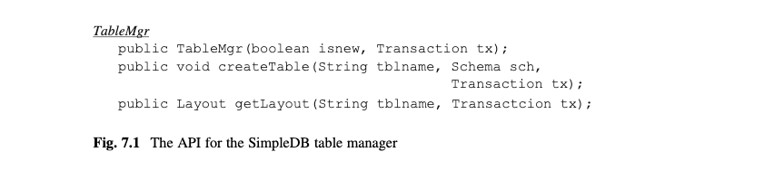

[图7.1]

图7.2的TableMgrTest类展示了这些方法.它首先定义一个schema,包含一个名为"A"的整形字段和一个名为"B"的字符串字段.然后它调用createTable,用这个schema来创建一个名为"MyTable"的表.然后这段代码调用getLayout来获取被计算好的格式(layout).

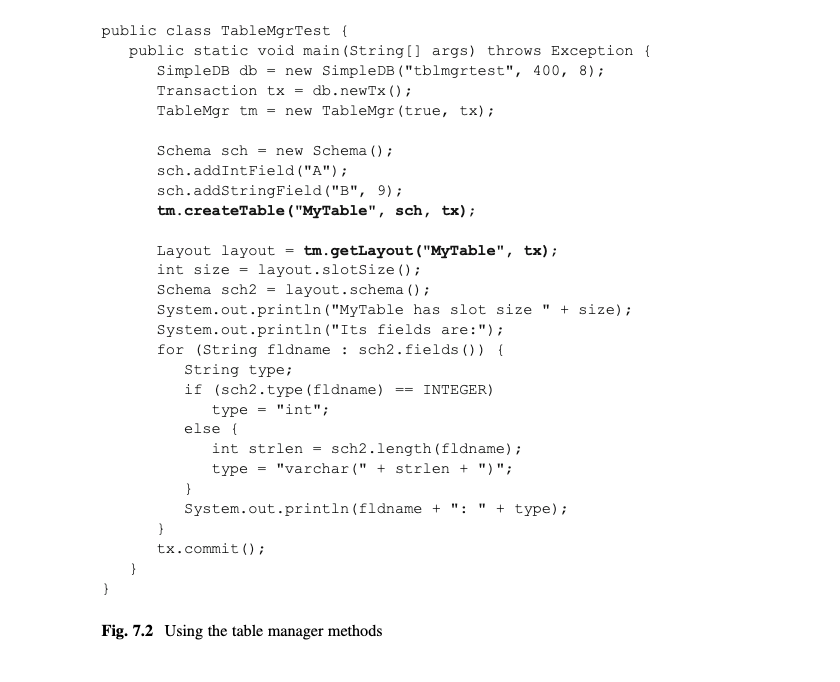

[图7.2]

元数据管理器保存它的元数据在数据库中被称为目录(catalog)的部件中.但是它如何实现这个目录呢?最常用的策略是保存目录信息在数据库表中.SimpleDB使用两个表来保存他的表元数据:表tblcat保存每个定义到表的元数据,fldcat表保存定义到每张表的每个字段的元数据.这些表有以下的字段:

tblcat(TblName,SlotSize)
fldcat(TblName,FldName,Type,Length,Offset)

一张表对应tblcat中的一条记录,每张表的每个字段对应fldcat中的一条记录.SlotSize字段给出的是字节层面的槽(slot)的长度,和Layout计算的一样.Length字段给出字段在字符层面的长度,和表的shema里定义的一样.比如,图1.1的大学数据库相对应的目录表如图7.3所示.注意表的格式(layout)信息是如何展开成一系列的fldcat记录的.在fldcat表的Type值包含值4和12;这些值是定义在JDBC类Types里的类型INTEGER和VARCHAR的编码.

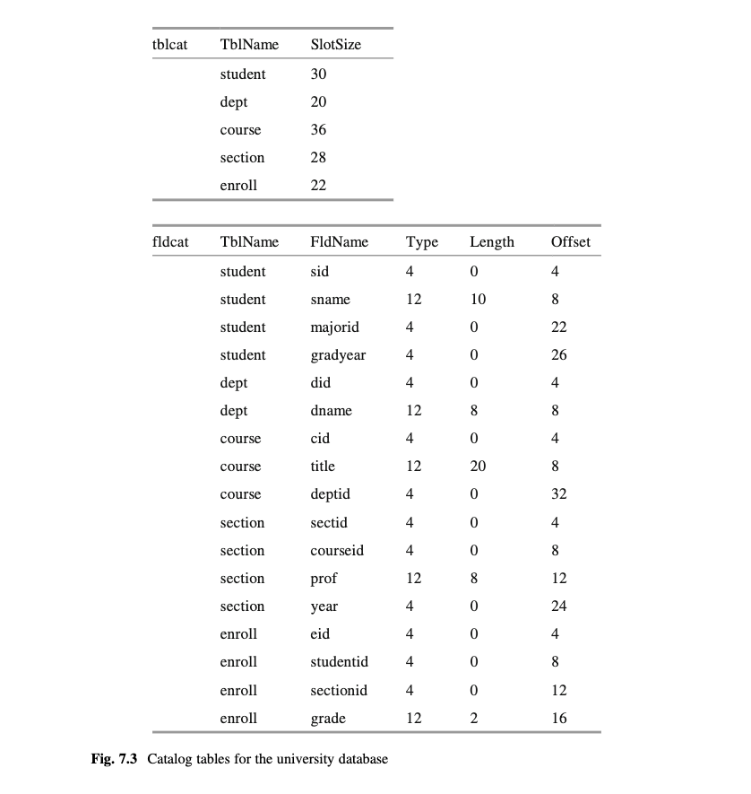

[图7.3]

目录表可以像任何用户创建的表那样访问.比如,图7.4的SQL查询检索STUDENT表中的所有字段的名称和长度.

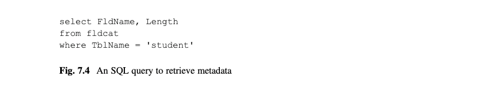

[图7.4]

目录表甚至包含描述它们自己的记录.这些记录没有在图7.3里展示.相反,练习7.1要求你来查明它们.图7.5展示CatalogTest类的代码,它打印每张表的记录长度,每个字段的偏移.如果你运行这段代码,你会看见目录表的元数据也会被打印.

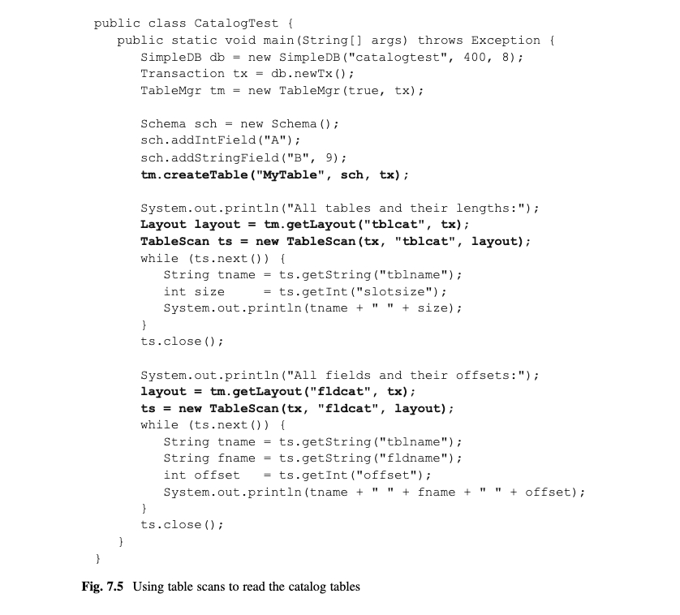

[图7.5]

图7.6给出了TableMgr类的代码.它的构造器创建tblcat和fldcat的schema,并计算它们的Layout对象.如果数据库是新创建的,它也会创建这两个目录表.

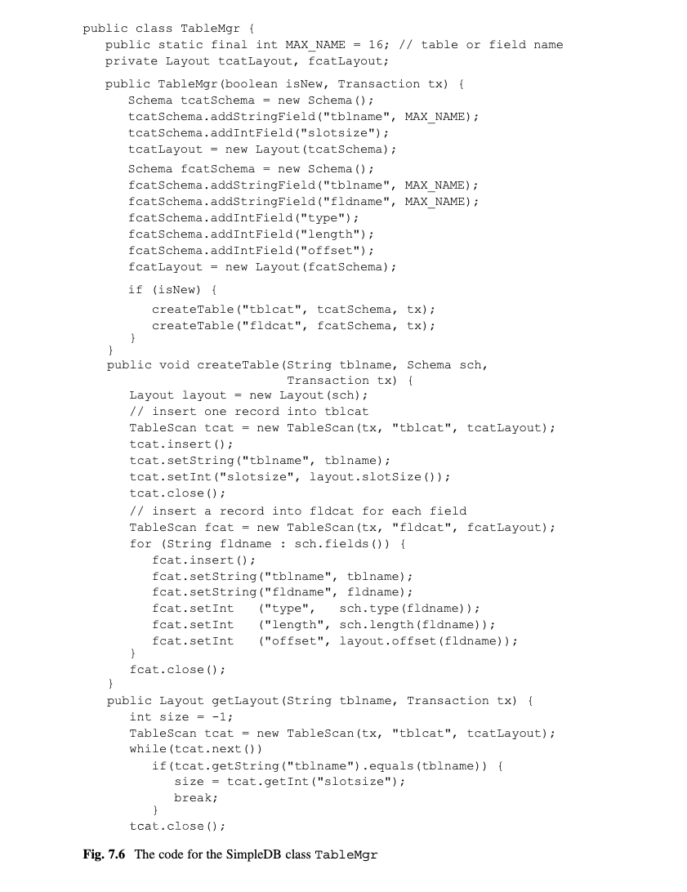
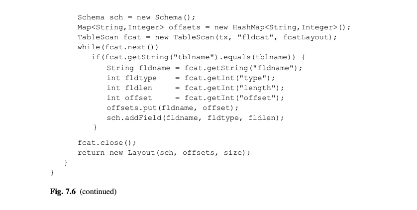

[图7.6]

createTable方法使用一个表扫描来插入记录到目录中.它为每张表插入一条记录到tblcat,为表里的每个字段插入一条记录到fldcat表.

getLayout方法打开这两个目录表的表扫描并扫描来获取指定表名响应的记录.然后它从那些记录构造所请求的Layout对象.

## 7.3 视图元数据

一个视图是一种根据查询动态计算记录的表.该查询被称为视图的定义,并且是在视图创建时指定的.元数据管理器保存每个新建视图的定义,并按需获取它的定义.

SimpleDB类ViewMgr负责这方面的处理.这个类保存视图定义在目录表viewcat种,一个视图一条记录.这个表有以下字段:

viewcat(ViewName,ViewDef)

ViewMgr的代码如图7.7所示.它的构造器是在系统启动期间调用,如果数据是新建的则创建viewcat表.createView和getViewDef都使用表扫描来访问目录表--createView插入一条记录到表里,getViewDef遍历该表查找指定视图名称响应的记录.

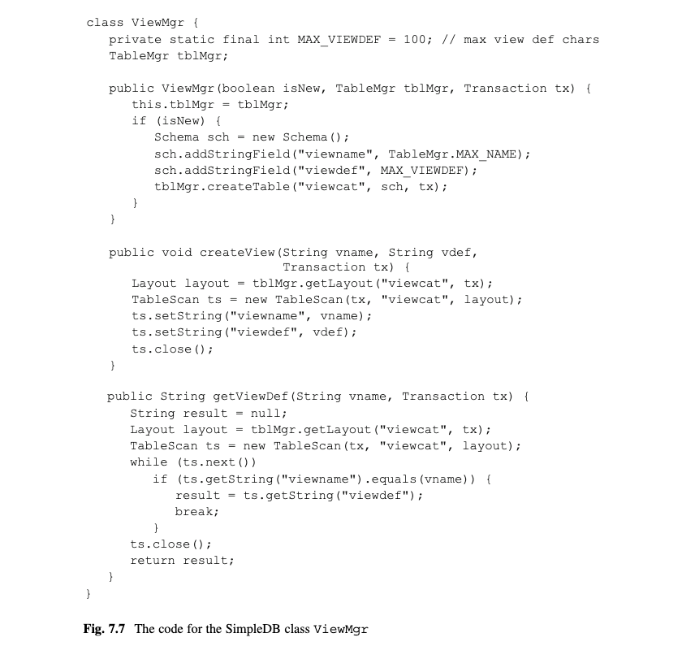

[图7.7]

视图定义是以varchar字符串保存的,这意味着有一个相对比较小的限制在视图定义的长度上.当前的限制是100个字符,当然,这显然不现实,因为一个视图定义可以是几千个字符.一个更好的策略是将ViewDef设为clob类型,比如clob(9999).

## 7.4 统计元数据
另一种由数据库系统管理的元数据是关于数据库里的每张表的统计信息,比如表有多少记录,它们的字段值的分布是怎样的.这些统计信息会被查询规划器用来估算消耗.经验显示一个好的统计集合可以显著地优化查询的执行时间.因此,商业元数据管理器往往会维护详尽的,多种统计信息,比如每张表里的每种字段的值和范围桶(histogram)以及不同表的字段间的关联信息.

为了简便,本节仅考虑以下3种统计信息:
*	每张表T使用的块数
*	每张表T的记录数
*	表T的字段F的在表T中不重复值得数量

这些统计信息分别用B(T),R(T),和V(T,F)来表示.图7.8给出了大学数据库的一些统计例子.这些值对应于一个一年招收900学生,一年提供500课程的大学;这个大学已经保存了最近50年的这种信息.图7.8的值尽量贴近现实,不需要对应于图1.1计算的值.相反,这些图假设10条STUDENT记录适配一个块,20条DEPT记录适配一个块,以此类推.

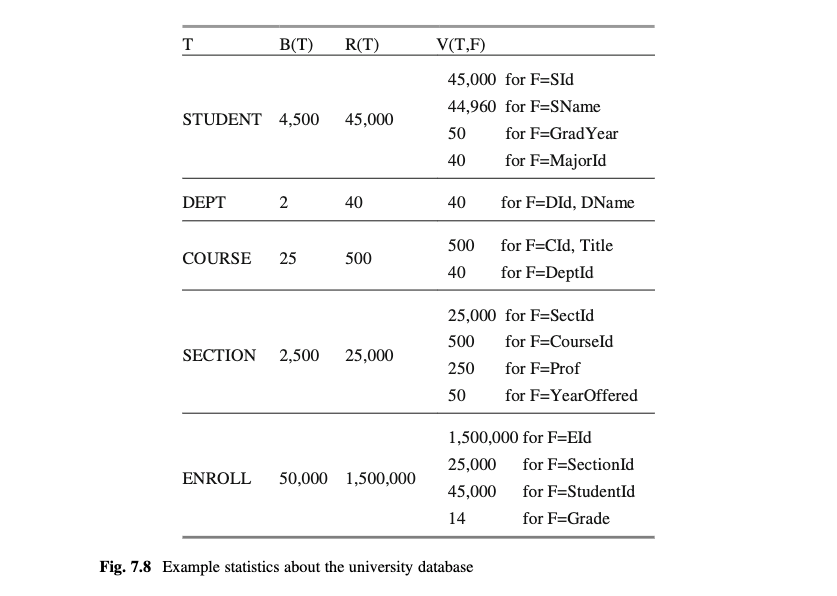

[图7.8]

看STUDENT表的V(T,F)值.实际上SId是STUDENT的一个键值,意味着V(STUDENT,SId)=45,000. V(STUDENT,SName)=44960的等式意味着45,000位学生中的40位有重复的名字.V(STUDENT,GradYear)=50意味着最近50年每年至少有一位毕业学生.V(STUDENT,MajorId)=40的等式意味着40个系在某个时间至少都有一个专业.

SimpleDB的类StatMgr管理器这些统计信息.数据库引擎保存一个StatMgr对象.这个对象有一个getStatInfo方法,它为每个表返回一个StatInfo对象.StatInfo对象持有对应表的统计信息,并且有blocksAccessed,recordsOutput和distinctValues方法,它们分别实现了B(T),R(T),和V(T,F)的统计方法.这些类的API如图7.9所示.

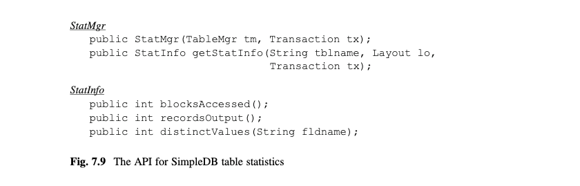

[图7.9]

图7.10的代码块展示了这些方法的典型运用.这段代码获取STUDENT表的统计信息并打印B(STUDENT),R(STUDENT),和V(STUDENT,MajorId)的值.

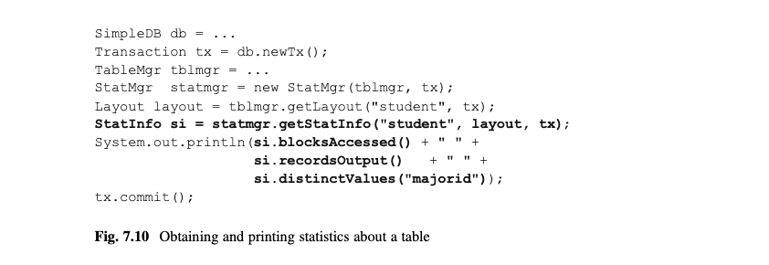

[图7.10]

一个数据库引擎可以用两种方法来管理器统计信息.一种是保存信息在数据库目录中,当数据库变更时修改.另一种是在保存在内存中,当引擎初始化时计算.

第一种方式相当于创建两张目录表,tblstats和fldstats,它们有以下字段:
tblstats(TblName,NumB locks,NumRecords)
fldstats(TblName,FldName,NumValues)

tblstats表针对每张表有一条记录,包含B(T)和R(T)的值.fldstats表里每张表T的每个字段F对应一条记录,包含V(T,F)的值.这种方式的问题是保持统计信息实时性的消耗.每次调用insert,delete,setInt和setString都有可能需要更新这些表.可能需要额外的磁盘访问来写入修改页到磁盘.另外,并发量会减少--每次对表T的修改会锁住包含T的统计记录的块,这会迫使需要读取T的统计信息的事务等待.

这个问题的一个可行解决发案是让事务不用获取锁就可以读取统计信息,就像以5.4.7的读未提交级别那样.正确性的缺失是可容忍的,因为数据库系统只是使用这些统计信息来比较查询计划的预估执行时间.这种统计信息因此不需要一定准确,只要它们得出的估计是合理的.

第二个实现策略是忽略目录表,直接保存统计信息在内存中.统计数据相对比较小,应该比较容易放到内存中.唯一的问题是每次服务端启动的时候,统计信息需要从头计算.这个计算需要扫描数据库中的每张表以计算记录,块,和值的数量.如果数据库不是太大,这个计算不会延迟系统启动太久.

这种内存策略有两种选择用于处理数据库更新.第一种选择每次数据库更新时更新统计信息,像之前那样.第二种选择是保持统计信息未更新的状态,但是不时从头计算它们.第二种选择再次依据准确的统计信息是不必要的现实,所以在重新刷新之前让统计信息过期一段时间也是可以忍受的.

SimpleDB采用第二种方式的第二种选择.StatMgr类拥有一个变量,称为tableStats,它持有每个表的成本信息.这个类有一个对指定表返回成本值公共方法statInfo,有重新计算成本值得私有方法refreshStatistics和refreshTableStats.这个类的代码如图7.11所示.

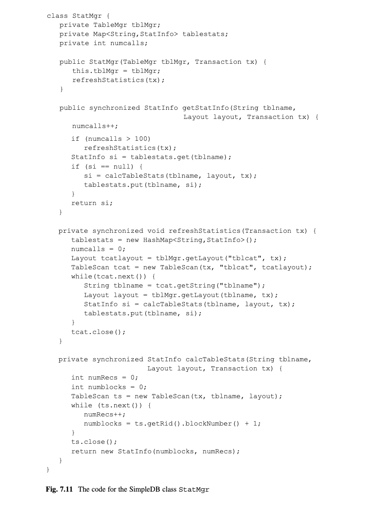

[图7.11]

StatMgr类持有一个计算变量,每次statInfo被调用时它就增加.如果这个计算到达一个特殊的值(这是是100),那么refreshStatistics会被调用以重新计算所有表的成本值.如果statInfo是被调用来计算一个未知值得表,那么refreshTableStats会被调用以计算该表的统计信息.

refreshStatistics的代码遍历tblcat表.循环体抽取表的名称并调用refreshTableStats来计算该表的统计信息.refreshTableStats方法遍历改变的内容,计数记录,并调用size来确定使用块的数量.为了简洁性,这个方法不计数字段值.相反,StateInfo对象基于表的记录数,对一个字段的不重复值数量做一个大致的猜测

StatInfo类的代码如图7.12所示.注意到distinctValues没有使用传入的字段值,因为它单纯地假设字段的1/3的值是不重复的.无需解释,这个假设是糟糕的.练习7.12要求你来改正这种情况.

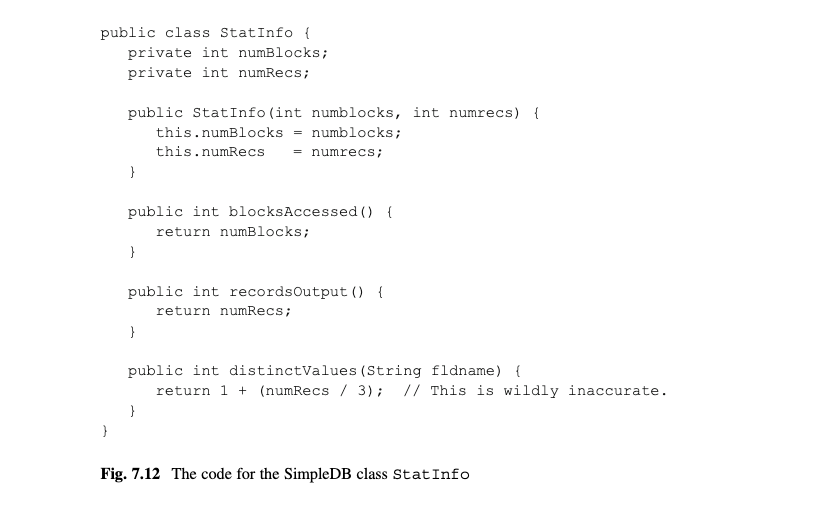

[图7.12]

## 7.5 索引元数据(Index Metadata)
一个索引的元数据由它的名称,它索引的表名,它索引的字段列表构成.索引管理器(index manager)是保存和检索这个元数据的系统组件.SimpleDB的索引管理器由两个类,IndexMgr和IndexInfo构成.它们的API如图7.13所示.

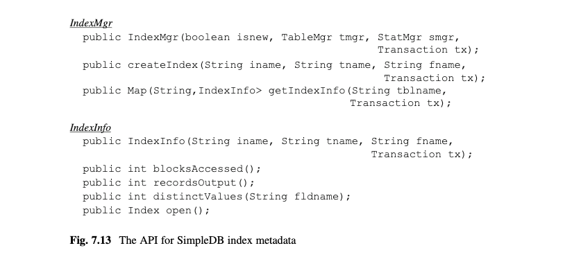

[图7.13]

一个索引的元数据有它的名称,索引的表名,它索引的字段构成.IndexMgr类的方法createIndex保存这个元数据在目录里.getIndexInfo方法为指定表的所有索引检索元数据.特别是,他返回一个以索引字段为键值的,Indexinfo对象的map.这个map的keyset方法告诉你该表有可用索引的字段.IndexInfo的方法提供关于所选索引的统计信息,类似于StatInfo类.blocksAccessed方法返回搜索索引所需要的块访问次数(不是索引的大小).recordsOutput和distinctValues方法返回索引里的记录数和索引字段的不重复值数量,它们和索引表里的值是一样的.

一个IndexInfo对象页有open方法,它为索引返回Index对象.Index类包含索引的类,且会在章节12讨论.

图7.14的代码块展示了这些方法的使用.这段代码在STUDENT表上创建了两个索引.然后它获取它们的元数据,打印每个索引的名称和搜索成本.

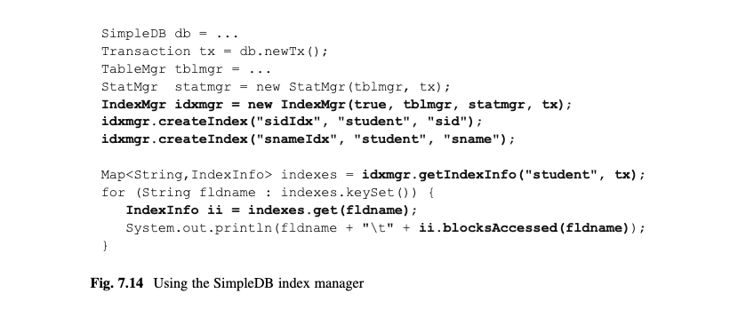

[图7.14]

图7.15给出IndexMgr的代码.它保存索引元数据在目录表idxcat里.这个表对每个索引有一条记录,有3个字段:索引名称,索引表的名称,索引字段的名称.

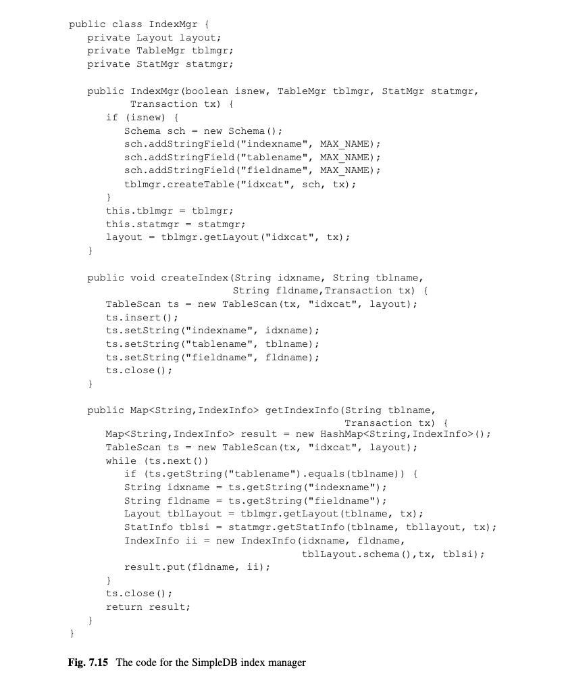

[图7.15]

IndexMgr的构造器在系统启动时被调用,并且如果数据库是新建的则创建相应的目录表.createIndex和getIndexInfo方法的代码是简单的.两个方法都对目录表打开一个表扫描.createIndex方法插入一条新的记录到表中.getIndexInfo方法为由指定表名的记录搜索表,然后把它们放到map中.

IndexInfo的代码如图7.16所示.它的构造器接受索引名称和索引字段,还有持有相应表的格式记统计元数据的变量.这个元数据允许IndexInfo对象为索引记录构造shema和估计索引文件的大小.

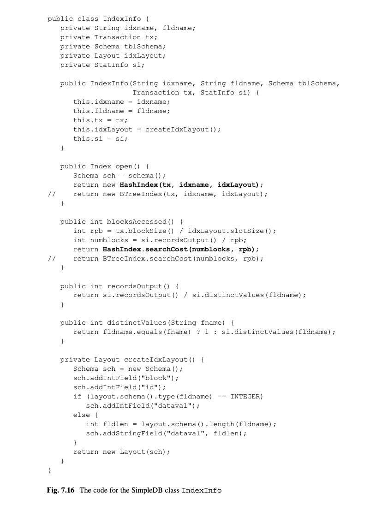

[图7.16]

open方法通过传递索引名称和shema到HashIndex的构造器来打开索引.HashIndex类实现了一个静态hash索引,会在章节12讨论.可以替换被注释的构造器来使用B-Tree索引作为替代.blocksAccessed方法估算索引的搜索成本.它首先用索引的Layout信息来确定每个索引记录的长度,然后估计索引的每个块的记录数(RPB)和索引文件的大小.然后它调用索引专用的方法searchCost来计算该索引类型的块访问次数.recordsOutput方法估算匹配一个搜索key的索引记录数.并且distinctValues方法返回和索引表里同样的值.

## 7.6 实现元数据管理器
SimpleDB通过因此4个独立管理器类TableMgr,ViewMgr,StatMgr,和IndexMgr类来简化元数据管理器的用户接口.相反,客户端使用MetadataMgr类作为获取元数据单独的入口.MetadataMgr代码的API如图7.17所示.

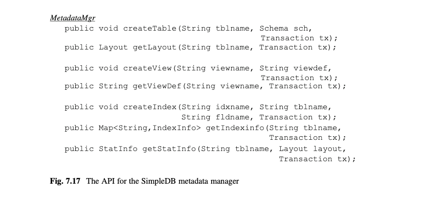

[图7.17]

这个API对每种元数据类型有两个方法:一个生成和保存元数据的方法,和一个获取它的方法.唯一例外是对统计元数据,它的生成方法是在内部调用,因此是私有的.

图7.18给出类MetadataMgrTest类的代码,它展示这些方法的使用.

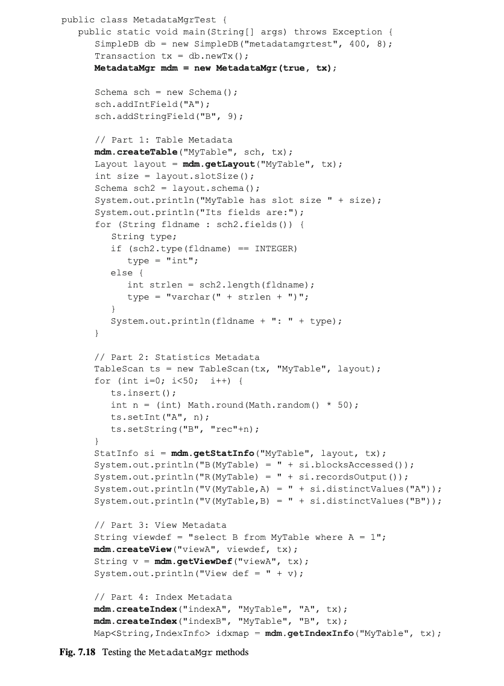
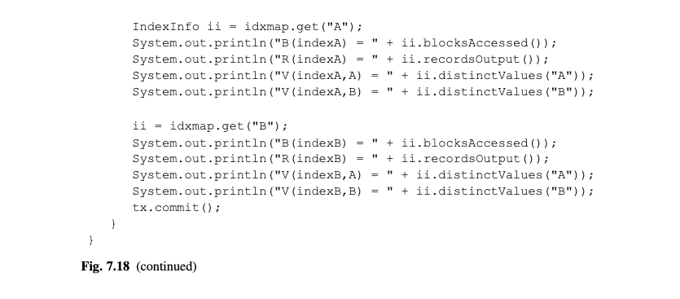

[图7.18]

部分1展示了表元数据.它创建了MyTable表并打印它的格式(layout),如图7.2所示.部分2展示了统计管理器.它插入几条记录到MyTable,并打印最终的表统计信息.部分3展示了视图管理器,创建了一个视图并获取相应的视图定义.部分4展示了索引管理器.它创建了字段A和B的索引,并打印每个索引的属性.

MetadataMgr类被称为外观类(facade class).它的构造器创建这四个管理器对象并保存它们在私有变量里.它的方法调用了各个独立管理器的公共方法.客户端一旦调用元数据管理器的一个方法,那个方法则调用对应的本地管理器来做相应的工作.它的代码如图7.19所示.

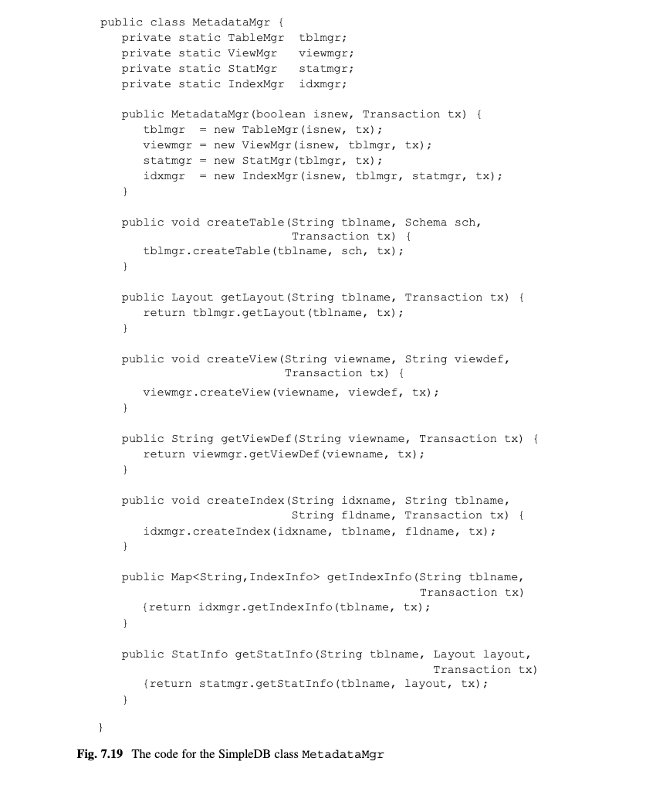

[图7.19]

目前的所有测试程序都调用了SimpleDB的三个参数构造器.那个构造器使用提供的块大小和缓冲池大小来配置系统的FileMgr,LogMgr和BufferMgr对象.它的目的是帮助调试系统的底层,且没有创建MetadataMgr对象.

SimpleDB有另外一个只有一个参数的构造器,即数据库名称.这个构造器是用于非调试情况.它首先创建文件,日志和使用默认值的缓存管理器.然后它调用恢复管理器来恢复数据库(以防需要恢复)并创建元数据管理器(如果数据库是新建的,也会创建目录文件).这两个SimpleDB的构造器代码如图7.20所示.

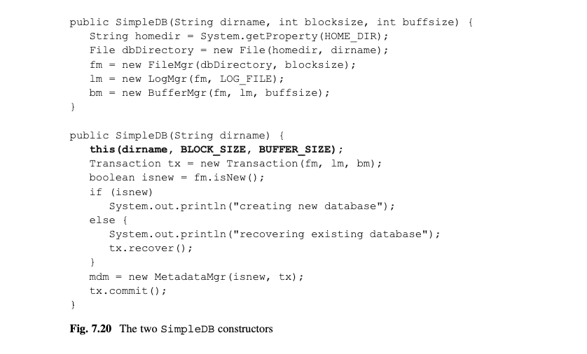

[图7.20]

使用一个参数构造器,图7.18的MetadataMgrTest的代码可以重写的更简单,如图7.21所示.

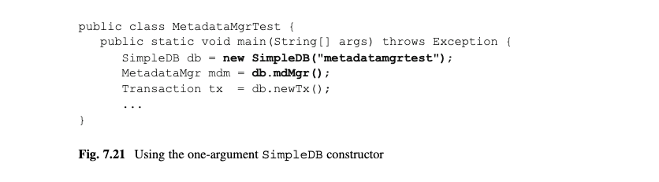

[图7.21]

## 7.7 章节总结
*	元数据是关于数据库除了内容外的信息.元数据管理器是数据库系统中保存和检索元数据的组件.
*	SimpleDB的数据库元数据分为4种:
	-	表元数据,描述表记录的结构,比如每个字段的长度,类型,偏移.
	-	视图元数据,描述每个视图的属性,比如它的定义和创建者.
	-	索引元数据,描述定义在表中的索引.
	-	统计元数据,描述每个表的大小和它的字段值的分布.

*	元数据管理器保存它的元数据在系统目录种(system catalog).该目录通常以数据库的表的形式实现,被称为目录表(catalog tables).目录表可以像数据库中的其它表那样查询.
*	表元数据可以保存在两个目录表中:一个表保存表信息(比如槽大小),另一个表保存字段信息(比如名称,长度,和类型)
*	视图元数据主要由视图定义构成,并且可以保存在它自己的目录表里.视图定义会是一个任意长度字符串,所以一个可变长度字段是合适的.
*	统计元数据保存关于每个表的大小和值分布的信息.商业数据库系统往往维护详尽的,综合的统计信息,比如每张表的每个字段的值和范围桶(histogram),以及不同表的不同字段之前的关联.
*	一个基础的统计由3个部分构成:
	-	B(T)返回表T使用的块数量.
	-	R(T)返回表T的记录数
	-	V(T,F)返回T中的F字段不重复值的数量

*	统计信息可以保存在目录表中,或每次数据库重启时重新计算.前一个选择避免了长时间的启动时间但是会减慢事务的执行.
*	索引元数据持有每个索引的名称,被索引表名,和被索引字段的信息.

