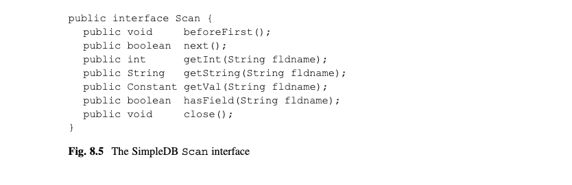
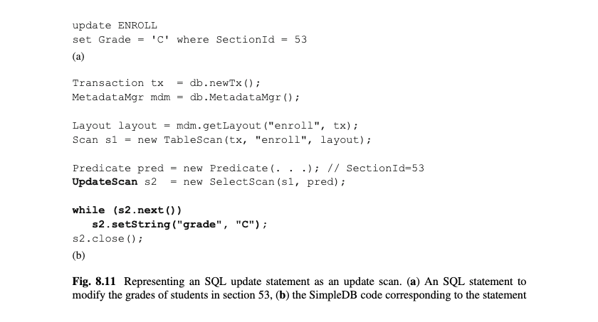

# 第8章 查询处理

接下来的三章考察数据库引擎如何执行SQL查询.主要问题在于SQL查询只是指定了返回数据,但没有指定如何获取数据.解决方案是让引擎实现一系列被称为关系代数(relational algebra)的数据检索操作.引擎可以转换一个SQL查询到一个之后可执行的关系代数查询.本章介绍关系代数查询和它们的实现.接下来的两章会考察SQL到关系代数的转换.

## 8.1 关系代数
关系代数由一系列的操作(operators)构成.每个操作实现一个特定的任务,接收一个或多个表为输入,并生成一个输出表.复杂的查询可以以不同的方式来组合这些操作构成.

SimpleDB版本的SQL可以用三个操作来实现:
*	选择(select),它的输出表的字段和它的输入表一样,但是有一些行被移除了.
*	投影(project),它的输出表的行和输入表的一样,但是有些列被移除了.
*	积(product),它的输出表有2个输入表的行的所有可能组合构成.

这些操作会在接下来的子节里考察.

### 8.1.1 选择 (Select)
select操作接收两个参数:一个输入表和一个谓语(predicate).输出表有满足谓语(predicate)的输入记录构成.一个选择查询总是返回一个有和输入表一样的schema但只有输入表记录的子集的输出表.

比如,查询Q1返回一个毕业于2019的学生列表  
Q1=select(STUDENT,GradYear=2019)

一个谓语(predicate)可以是任意布尔条件的组合,对应于SQL中的where分句.比如查询Q2查询毕业于2019的学生,并且系是系10或20的.  
Q2 = select(STUDENT, GradYear=2019 and (MajorId=10 or MajorId=20))  
一个查询的输出表可以是任意查询的输入.比如,查询Q3和Q4都和Q2等同:  
Q3 = select(select(STUDENT, GradYear=2019), MajorId=10 or MajorId=20)  
Q4 = select(Q1, MajorId=10 or MajorId=20)  

在Q3,最外层查询的第一个参数是另一个和Q1相同的查询,它查询毕业于2019年的学生.外层查询从那些记录中检索,系是10或20的学生.查询Q4也是类似的,除了它使用Q1的名称代替它的定义.

一个关系代数查询可以以图案方式表示成一个查询树.一个查询树里SQL查询中一个表有一个节点,一个操作数一个节点.表节点是树的叶子节点,操作节点是非叶子节点.一个操作节点有一个子节点给每个它的输入表.比如,Q3的查询树如图8.1所示.

[图8.1]

### 8.1.2 投影 (Project)
project操作接收两个参数:一个输入表和一系列的字段名称.输出表和输入表有同样的记录,但是它的shema仅包含那些指定的字段.比如查询Q5返回所有学生的名称和毕业年份:  
Q5 = project(STUDENT, {SName, GradYear})  

一个查询可以由project和select操作构成.查询Q6返回系10的所有学生的名称列表:  
Q6 = project(select(STUDENT, MajorId=10), {SName})  

Q6的查询树如图8.2所示.  

[图8.2]

一个project查询的输出表可能有重复的记录.比如,如果有3个叫做"pat"的学生是系10的,那么Q6的输出会包含3个"pat".

不是所有的操作组合都是有意义的.比如,思考改写Q6的查询:  
Q7 = select(project(STUDENT, {SName}), MajorId=10) // 不合法!

这个查询是说不通的,因为内部查询的输出表不包含筛选字段MajorId.

### 8.1.3 积 (Product)
select和product操作是在单表上操作.product操作可以从多表组合和比较信息.这个操作接收两个输入表作为参数.它的输出由输入表的行的所有组合组成,且它的schema由输入表的shema联合组成.输入表必须有不重合的字段名称,以便输出表不会有相同名称的2个字段.

查询Q8返回STUDENT和DEPT表的product:  
Q8 = product(STUDENT, DEPT)

图1.1的大学数据库展示了STUDENT表的9条记录和DEPT表的3条记录.图8.3展示了那些输入表的Q8的输出.输出表有27条记录,1条记录对应于一条学生记录和一条系记录的组合.一般来说,如果STUDENT表中有N条记录,DEPT表中有M条记录,那么输出表会包含N*M条记录(这,顺便说下,是这个操作被称为"product"的理由吗).

[图8.3]

查询Q8不是特别有意义,因为它没有考虑每个学生的专业.这个意图可以用一个筛选谓语来表达,如查询Q9和图8.4展示的那样.  
Q9 = select(product(STUDENT, DEPT), MajorId=Did)

[图8.4]

这个查询的输出表仅包含STUDENT和DEPT中满足该谓语的记录.因此在27条可能的组合中,只会剩下那些学生的专业id和系的id相同的记录--换句话说,结果表会有学生和它们的专业系构成.输出表现在有9条记录,而不是27条记录.

## 8.2 扫描 (Scans)
一个扫描是一个展示一个关系代数查询输出的对象.Scans在SimpleDB中实现Scan接口;请看图8.5.Scan接口的方法是TableScan类的方法的子集,并且它们有同样的行为.这个对应不应该值得惊讶--因为一个查询的输出是一个表,所以自然查询和表是以同样的方式访问的.

[图8.5]

比如,思考图8.6的printNameAndGradYear方法.这个方法遍历它的扫描,打印每条记录的字段sname和gradyear的值

[图8.6]

这个例子的关键点在于这个方法对于扫描代表什么查询(或表)没有想法.它可以代表STUDENT表,或者可能代表一个选择有指定系的学生的查询,或者上教授Einstein的课程的学生.唯一的要求是扫描的输出表得包含一个学生名和毕业年份.

一个Scan对象和查询树的一个节点对应.SimpleDB对每个关系操作有一个Scan类.那些类的对象构成查询树的内部节点,TableScan对象代表树的叶子节点.图8..7展示表和3个SimpleDB支持的基本操作的扫描构造器.

[图8.7]

SelectScan构造器接收2个参数:一个基础的扫描和一个谓语.基础扫描是选择操作的输入.因为Scan是一个接口,SelectScan对象不知道它的输入是一个表还是另一个查询的输入.这种情况和一个关系操作的输入可以是任意表或查询的现实相对应.

传给SelectScan构造器的选择谓语是Predicate类型.8.6节会讨论SimpleDB如何处理谓语的细节;在那之前,我会在这个问题上保持一些悬念.

查询树是通过组合扫描来建立的.树的每个节点会有一个扫描.比如,图8.8给出了图8.2的查询树的SimpleDB的代码(省略了选择谓语上的细节).Scan类型变量s1,s2和s3都与查询树的一个节点相对应.这个树是从底往上建的:首先表扫描被创建,然后选择(select)扫描,最后投影(project)扫描.变量s3持有最终的查询树.while循环遍历s3,打印每个学生名.

[图8.8]

图8.9给出了对应于图8.4的树的查询的SimpleDB代码.这段代码包含4个扫描,因为查询树有4个节点.变量s4持有最终的查询树.注意到while循环和之前的几乎一样.为了节省空间,循环只打印了每条输出记录的3个字段值,但是它可以修改为打印所有6个字段值.

[图8.9]

最后,注意到close方法只在查询树的外层被调用.关闭一个扫描会自动关闭它下面的扫描.

## 8.3 更新扫描 (Update Scans)
一个查询定义一个虚拟表.Scan接口有允许客户端读取虚拟表的方法但是没有更新它的方法.不是所有的扫描可以被更新的.如果扫描中的每个输出记录r在下面的数据库表中有一个对应的记录r',那么这个扫描是可更新的.这种情况,一个对r的更新是被定义为一个对r'的更新.

可更新扫描支持UpdateScan接口;请看图8.10.该接口的前5个方法是基础的修改操作.另外两个方法涉及该扫描的当前记录对应的存储记录的标识.getRid方法返回该标识,moveToRid定位该扫描到指定存储记录的位置.

[图8.10]

SimpleDB中唯一实现UpdateScan的两个类是TableScan和SelectScan.作为它们的使用例子,请思考图8.11.(a)部分展示了一个改变每个上课程53的学生的年级的SQL语句,(b)部分给出了实现该语句的代码.该代码首先创建一个对课程53的注册学生的表扫描;然后它遍历这个扫描,改变每条记录的年级.

[图8.11]

变量s2调用setString方法,所以它一定是以一个可更新扫描定义的.另一方面,SelectScan的构造器的第一个参数是一个scan,这意味着扫描参数可以不用声明为可更新扫描.相反,对s2的setString的代码会转换它的基础扫描(比如,s1)为一个可更新扫描;如果那个扫描不是可更新的,一个ClassCastException会被抛出.

## 8.4 实现扫描(Implementing Scans)
SimpleDB引擎包含4个Scan类:TableScan类和select,project,product操作各自一个类.章节6考察了TableScan.接下来的子节会讨论这三个操作类.

### 8.4.1 选择扫描(Select Scans)
SelectScan的代码如图8.12所示.该构造器接收底层输入表的扫描.一个扫描的当前记录和它底层扫描的当前记录相同,这意味着大多数方法可以直接调用底层扫描的相应方法来实现.

[图8.12]

唯一不一样的方法是next.这个方法的工作是建立一个新的当前记录.next的代码循环遍历底层的扫描,查找满足相应谓语的记录.如果那样的记录被找到,则它会变成当前记录,且该方法返回true.如果没有那样的记录,那么while循环会完成,且该方法会返回false.

选择扫描是可更新的.UpdateScan接口的方法假设底层扫描也是可更新的;特别时,它们假设它们可以转换底层扫描为UpdateScan而不会导致一个ClassCastException.因为由SimpleDB创建的扫描更新计划器仅涉及表扫描和选择扫描,那样的错误应该不会发生.

### 8.4.2 投影扫描(Project Scans)
ProjectScan类的代码如图8.13所示.输出字段列表被传入到构造器,且用来实现hasField方法.其他的方法直接转发它们的请求到底层扫描的相应方法.getVal,getInt,和getString方法查看指定字段名是否在字段列表里;如果不是,一个错误会生成.

[图8.13]

ProjectScan类没有实现UpdateScan接口,尽管投影(projections)是可更新的.练习8.12要求你来完成这个实现.

### 8.4.3 积扫描(Product Scans)
ProductScan类的代码如图8.14所示.一个积扫描需要能够遍历来自它的底层扫描s1和s2的记录的所有组合.它先从s1的第一条记录开始,遍历s2的每条记录,然后移到s1的第二条记录再遍历s2,以次类推.概念上,它就像一个嵌套循环,外层循环遍历s1,内循环遍历s2.

[图8.14]

next方法如下实现这个"嵌套循环"想法.每次调用next方法移到s2的下一条记录.如果s2有那样的记录,那么它会返回ture.否则,s2的遍历则完成了,然后该方法移到s1的下一条记录,s2的第一条记录.如果这可以实现,那么它返回true;如果没有s1记录可遍历了,那么扫描则完成,next返回false.

getVal,getInt和getString方法直接访问匹配的底层扫描的字段.每个方法查看指定字段是否是再扫描s1中.如果是,那么访问s1;否则访问s2.

## 8.5 管道式查询处理(Pipelined Query Processing)
这三个关系代数操作的实现通常有两个特征:
*	它们根据需要一次生成一条输出记录.
*	它们不保存它们的输出记录,也不保存任何中间计算.

这种实现被称为管道式的(pipelined).本节分析管道实现和它们的性质.

思考一个TableScan对象.它持有一个记录页,该页持有一个缓存,该缓存持有一个包含当前记录的页.当前记录只是那个页的一个地址.该记录不需要从它的页中移出;如果一个客户端请求一个字段的值,那么记录管理器直接从页中抽取值并返回给客户端.每次调用next定位表扫描到它的下一条记录,这可能会导致它持有一个不同的记录页.

现在思考一个SelectScan对象.每次调用它的next方法会不断调用那个底层扫描的next方法知道底层扫描的当前记录满足该谓语.但是当然,没有真正的"当前记录"--如果底层扫描是一个表扫描,那么当前记录只是表扫描持有的页中的一个地址.而且如果底层扫描是另一种扫描(比如图8.4和8.9的积扫描),那么当前记录的值是从那个节点的子节点的表扫描的当前记录确定.

每次一个管道扫描处理next的调用时,它从之前的位置开始搜索.作为结果,扫描只请求它从底层扫描需要的记录以确定下一条输出记录.

一个管道扫描不需要追踪它选择的记录.因此,如果客户端第二次请求同一记录,扫描会需要再次做整个搜索.

"管道"这个术语指的是从查询树往下调用方法的流程和从查询树往上返回结果的流程.比如,思考getInt方法的调用.树中的每个节点传递那个调用到子节点直到到达一个叶子节点.那个子节点(是一个表扫描)从它的页抽取想要的值并从树里往上返回值.或者思考next方法的调用.每个节点对它的子节点调用一次或多次next(还可能调用beforeFirst,在一个积节点的场景)直到它的子节点包含下一个记录的内容.然后它返回成功给它的父节点(或失败,如果没有那样的记录存在).

管道实现会是非常快的.比如,思考图8.15的查询树,它检索毕业于2020年专业系是10的所有学生的名称.

[图8.15]

树中的投影(project)和选择(select)节点不会导致对STUDENT表超过表扫描所需要的额外的块访问.为了明白原因,首先思考投影(project)节点.每次在该节点调用next都会在它的子节点调用next,并传回返回的值到那个节点.换句话说,投影节点不改变由剩下查询所做的块访问次数.

现在思考选择节点.在外层选择节点调用next会对内部选择节点调用next.内部节点会不断在它的子节点调用next直到当前记录满足"MajorId=10"的谓语.内部选择节点然后返回true,并且外部选择节点会监测当前记录.如果它的毕业年份不是2020,那么外部节点会对内部节点调用next并等待另一条当前记录.让外部节点返回true的唯一办法是当那个当前记录同时满足那两个谓语.每次外部节点调用next时,这个处理就会继续,底层表扫描会继续移动它的下一条记录直到两个谓语都满足.当表扫描意识到没有更多的STUDENT记录,它的next方法会反回false,且false这个值会往树的上面传播.换句话说,STUDENT表仅扫描一次,这就好像这个扫描只执行了一个表扫描一样.结果是这个查询的选择节点是没有成本的.

尽管在这些场景下,管道实现是非常高效的,也有它们不是非常好的情况.一种那样的情况是一个选择节点是在一个积节点的右边,其中它会多次执行.与其一次次实现选择操作,使用物化(materializes)输出并保存它们在一个临时表的实现更好.那杨的实现是章节13的话题.

## 8.6 谓语(Predicates)
一个谓语规定一个对扫描的每一行返回true或false的条件.如果该条件返回true,则说该行满足该谓语.一个SQL谓语的结构如下:
*	一个谓语是一个项(term)或布尔项的组合.
*	一个项(term)是一个两个表达式的比较.
*	一个表达式(expression)由常量和字段名的比较操作构成.
*	一个常量(constant)是一个提前确定的类型的值,比如整数和字符串.

比如,思考下面的标准SQL里的谓语:
(GradYear > 2021 or MOD(GradYear,4) = 0) and MajorId = DId

这个谓语由3个项构成.前两个项比较字段GradYear和一个常量,第三个项比较两个字段.每个项包含两个表达式.比如,第二个项包含表达式MOD(GradYear,4)和0.

SimpleDB极大地简化了可允许的常量,表达式,项和谓语.一个SimpleDB常量只可以是一个整数或字符串,一个表达式只可以是一个常量或一个字段名,一个项只可以比较等式,一个谓语只可以创建项的联合.练习8.7-8.9要求你来扩展SimpleDB的谓语,使它变得更具有更多的表达性.

思考以下的谓语:
SName='joe' and MajorId=DId

图8.16的代码块展示了如何在SimpleDB中创建这个谓语.注意到这个谓语是如何从内到外创建的,开始于常量和表达式,然后是项,最后是谓语.

[图8.16]

图8.17给出了Constant类的代码.每个Constant对象包含一个Integer变量和一个String变量.这些变量只有一个会是非null的,由哪个构造器被调用决定.equals,compareTo,hasCode,和toString方法使用非null的变量的相应的方法.

[图8.17]

Expression类的代码如图8.18所示.它也有两个构造器,一个是给常量表达式,一个给字段名表达式.每个构造器指派一个值给它相关的变量.isFieldName方法提供了一个方便的方法来确定表达式是否代表一个字段名或不是.evaluate方法返回一个扫描的当前输出记录中相关表达式的值.如果表达式是一个常量,那么扫描是无关的,该方法直接返回常量.如果表达式是一个字段,该方法会从该扫描返回该字段的值.appliesTo方法是查询规划器用来确定表达式的范围.

[图8.18]

f
在SimpleDB项(term)是通过Term接口是是实现,它的代码如图8.19所示.它的构造器接收两个参数,它们代表左边和右边的表达式.最重要的方法是isSatisfied,如果两个表达式在给出的扫描里是同样的值,它会返回true.剩下的方法帮助查询计划器确定项的作用和范围.比如,reductionFactor方法确定满足谓语的预计记录数,且会在章节10深入讨论.equatesWithConstant方法和equatesWithField方法帮助查询计划器决定什么时候使用索引且会在章节15讨论.

[图8.19]

Predicate类的代码如图8.20所示.一个谓语是作为项的列表实现地,然后一个谓语的方法通过调用它的项的相应方法来响应的.这个类有两个构造器.一个构造器没有参数,并创建一个没有项的谓语.那样的谓语总是满足的,相当于谓语true.两一个构造器创建一个有一个项的谓语.conjoinWith方法添加来自谓语参数的项到指定谓语中.

[图8.20]

## 8.7 章节总结
*	一个关系代数查询是由多个操作构成的.每个操作实现一个特定任务.一个查询的操作的组合可以写成一个查询树(query tree).
*	描述这三个操作的章节对于理解和转换SimpleDB版本的SQL是由帮助的.它们是:
	-	select,它的输出表的字段和它的输入表一样,但是有一些行被移除了.
	-	project,它的输出表的行和输入表的一样,但是有些列被移除了.
	-	product,它的输出表有2个输入表的行的所有可能组合构成.

*	一个扫描是一个代表一个关系代数查询树的对象.每个关系操作有一个相对应的实现Scan接口的类;来自那些类的对象组成了查询树的内部节点.也有一个针对表的扫描树,它的对象构成了树的叶子节点.
*	Scan接口的方法和TableScan类中的大致一样.客户端遍历一个扫描,从一个输出记录到下一个,并检索字段值.扫描通过在记录文件中合适地移动,和值比较来管理着查询的实现.
*	如果每个在扫描中的记录r都有一个记录r'在底层的数据库表中,那么这个扫描是可更新的(updatable).在这种情况,一个对虚拟记录r的更新是定义为对存储记录r'的更新.
*	每个扫描类的方法实现相应操作的意图.比如:
	-	一个选择扫描检查底层扫描的每条记录并只返回那些满足谓语的记录.
	-	一个积扫描返回它的两个底层扫描的记录的所有组合.
	-	一个表扫描对指定表打开记录文件,它钉住缓存并按需获取锁.
*	这些扫描实现被称为管道(pipelined)实现.一个管道实现并不试图往前读,缓存,排序或是提前处理它的记录.

*	一个管道实现并不构造输出记录.查询树的每个叶子节点都是一个表扫描,包含持有该表当前记录的缓存.该操作的当前记录是从每个缓存的记录确定的.获取字段值的请求是沿着树往下传递到合适的表扫描;结果是从表扫描沿着树往上返回给根节点.

*	使用管道实现的扫描是基于一个"需要知道"的基础上操作的.每个扫描只会从它的子节点请求它需要用来确定它的下一条记录相应的数量的记录.

