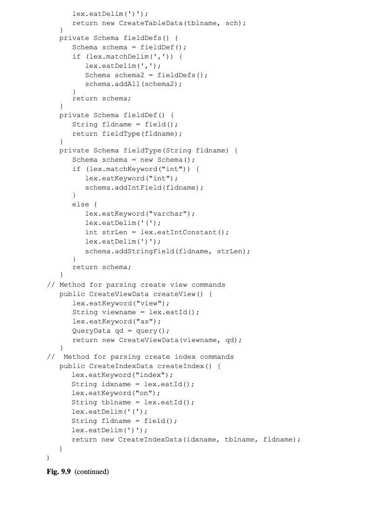

# 第九章 SQL解析(Parsing)

一个JDBC客户端以字符串的形式提交一个SQL语句给数据库引擎.引擎必须从这个字符串抽取需要用来创建查询树的信息.这个抽取过程有两个阶段:一个基于语法阶段,被称为解析,和一个语义阶段,被称为计划.本章覆盖解析的内容.计划会在章节10讨论.

## 9.1 语法 (Syntax) vs 语义(Semantics)
一个语言的语法(syntax)是一个描述"字符串可能是有意义的语句"的规则的集合.比如,思考下面的字符串:
select from tables T1 and T2 where b - 3

为什么这个字符串不是一个合法的字符串,有几个理由:
*	select分句必须包含某些东西.
*	tables标识不是一个关键字,会被当成一个表名.
*	表名需要用逗号隔开,而不是关键字and.
*	字符串"b-3"不代表一个谓语.

这些问题都导致这个字符串不是一个有意义的SQL语句.引擎没有办法执行它,无论tables,t1,t2和b标识符刚好代表什么.

一个语言的语义(semantics)具体说明了一个语法正确的字符串的真实意义.思考下面合法的字符串:
select a from x, z where b = 3

你可以推断这个语句是一个从两个表(名为x和z)请求一个字段(名为a)并有谓语b=3的查询.因此,这个语句可能是有意义的.

这个语句是否真正有意义依赖于关于x,z,a和b的语义信息.特别是,x和z必须是表名,这两个表包含一个叫a的字段和一个叫b的数字字段.这种语义信息可以从数据库的元数据判断.解析器不知道元数据的事,因此无法计算出一个SQL语句的意义.相反,检查元数据的责任属于计划器,这会在章节10讨论.

## 9.2 词法分析(Lexical Analysis)
解析器的第一个任务是分割输入字符串为被称为"词条"的块.解析器中执行这个任务的组件被称为词法分析器(lexical analyzer).

每个词条有一个类型和一个值.SimpleDB的词法分析器支持5种类型:
*	单字符分隔符,比如逗号
*	整数常量,比如123
*	字符串常量,比如'joe'
*	关键字,比如select,from,和where
*	标识符,比如STUDENT,x,和glop34a

空格字符(空格,tab,和换行)通常都不算词条;唯一的例外是在字符串常量中.空格的目的是加强可读性和相互之间隔开词条.

再次思考之前的SQL语句:
select a from x, z where b = 3

词法分析器为它创建10个词条,如图9.1所示.


<div align="center">[图9.1]</div>

概念上,一个词法分析器的行为是简单的--它一次读取输入字符串的一个字符,当前确定下一个词条已经读取了则停下.一个词法分析器的复杂性是和词条类型的种类数成正比的:要查找的词条类型越多,实现越复杂.

Java支持2种不同的内建的分词器:一个在StringTokenizer类,一个在StreamTokenizer.字符串分词器更容易使用,但是它只支持两种词条:分隔符和单词(分隔符之前的子字符串).这不适用于SQL,尤其是因为字符串分词器不理解数字和被加引号的字符串.另一方面,流分词器(stream tokenizer)有一个扩展词条类型集合,支持在SimpleDB中使用的5种类型.

图9.2给出了TokenizerTest类的代码,它展示了StreamTokenizer的使用.这段代码分词了一个输入的文本行,并打印每个词条的类型和值.


<div align="center">[图9.2]</div>

tok.ordinaryChar('.')的调用告诉分词器把点号解释为一个分隔符.(尽管点号没有在SimpleDB中使用,把它们识别为分隔符可以防止它们被当成标识符的一部分).相反,``tok.wordChars('_','_')``的调用告诉分词器把下划线解释为标识符的部分.tok.lowerCaseMode(true)的调用告诉分词器转换所有的字符串词条为小写,这让SQL对于关键词和标识符是大小写不敏感的.

nextToken方法定位分词器到流中的下一个词条;一个TT_EOF的返回值表示没有更多的词条了.分词器的公共变量ttype保存当前词条的类型.TT_NUMBER值表示一个数字常量,TT_WORD代表一个标识符或关键字,加单引号的整数代表一个字符串常量.一个单字符分隔符词条的类型是那个字符的整数值.

## 9.3 SimpleDB的词法分析器
StreamTokenizer类是一个通用的词法分析器,但是它是比较难以使用的.SimpleDB类Lexer提供一个让解析器更容易访问词条流的方法.解析器可以调用两种方法:请求当前词条的方法和告诉词法分析器吃掉当前词条,返回它的值并移到下一个词条的方法.每一个词条类型有一对相对应的方法.这10个方法的API如图9.3所示.


<div align="center">[图9.3]</div>

前5个方法返回关于当前词条的信息.如果当前词条是一个有指定值的分隔符matchDelim方法返回true.类似地,如果当前词条是一个有指定值的关键词,matchKeyword返回true.如果当前词条是一个匹配类型的值,其他的3个matchXXX方法返回true.

最后5个方法"吃掉"当前词条.每个方法调用相应的matchXXX方法.如果相应方法返回false,那么一个错误会被抛出;否则,下一个词条变成当前词条.另外,eatIntConstant,eatStringConstant, 和eatId方法返回当前词条的值.

图9.4的LexerTest类展示了这些方法的使用.这段代码读取输入文本行.它期待每一行都是"A=c"或"c=A"的形式,其中A是一个标识符,c是一个整形常量.任何其他形式的输入文本行会产生一个错误.


<div align="center">[图9.4]</div>

Lexer类的代码如图9.5所示.它的构造器配置了流分词器.eatIntConstant,eatStringConstant,  和eatId方法返回当前词条的值.initKeywords方法构造了一个在SimpleDB中使用的SQL版本的关键字集合.


<div align="center">[图9.5]</div>

StreamTokenizer类的方法nextToken抛出一个IOException.Lexer类的方法nextToken把这个错误转成一个BadSyntaxException,传回给客户端(然后会转成一个SQLException,正如章节11会讨论的那样).

## 9.4 语法(Grammars)
一个语法是一个描述词条可以如何合法的组合的规则集合.下面是一个语法规则的例子:
```
<Field>:=IdTok
```
一个语法规则的左边规定一个语法种类(syntactic category).一个语法种类代表一个在语言中的特殊概念.在上面的规则中,``<Field>``代表一个字段名称的概念.一个语法规则的右边是一个规定属于该语法总类的字符串集合的模式.在上面的例子中,该模式只是简单的IdTok,匹配任何标识符词条.因此``<Field>``包含对应于标识符的字符串集合.

每个语法种类都可以看作为它自己的迷你语言.比如"SNname"和"Glop"是``<Field>``的成员.记住标识符不需要有意义--它们只需要是标识符.所以"Glop"是一个完美的``<Field>``成员,即使在SimpleDB的大学数据库中也是.然而,"select"不会是``<Field>``的成员,因为它是一个关键字词条,而不是一个标识符词条.

在一个语法规则的右边的模式既可以包含词条也可以包含语法种类.有熟知的值的词条(比如,关键字和分隔符)是直接出现的.另一些词条(标识符,整形常量,和字符串常量)是分别写作Idtok,IntTok,和StrTok.三个元字符('[',']',和'|')是用作标点符号;这些字符不是分隔符,所以它们可以用于帮助表达模式.为了演示,思考下面的4个额外的语法规则:
```
<Constant>   := StrTok | IntTok
<Expression> := <Field> | <Constant>
<Term>      := <Expression> = <Expression>
<Predicate> := <Term> [ AND <Predicate> ]
```
第一个规则定义``<Constant>``种类,它代表任何常量--字符串或整数.元字符'|'表示"或".因此``<Constant>``种类匹配字符串词条或整形词条,并且它的内容(作为一个语言)涵盖所有字符串常量和所有整形常量.

第二个规则定义``<Expression>``种类,它代表没有操作符的表达式.这个规则规定一个表达式要么是一个字段要么是一个常量.

第三个规则定义``<Term>``种类,它代表简单的表达式间的等式项(在SimpleDB类Term里的一样).比如,下面的字符串属于`<Term>``:

DeptId=DId
'math'=Dname
SName=123
65='abc'
再次说明解析器不检查类型的一致性;因此最后两个字符串语法上是正确的,即使它们语义上是不正确的.

第4个规则定义<Predicate>种类,它代表一个布尔项的组合,类似于SimpleDB的Predicate类.元字符'['和']'表示某些东西是可选的.因此,规则的右边匹配要么是一个``<Term>``,或是一个``<Term>``后跟着一个AND关键字再跟着(递归地)另外一个``<Predicate>``.比如,下面的字符串属于``<Predicate>``:

DName = 'math'
Id = 3 AND DName = 'math'
MajorId = DId AND Id = 3 AND DName = 'math'

第一个字符串是``<Term>``的形式.后两个字符串是``<Term>AND<Predicate>``的形式.

如果一个字符串属于某个语法种类,你就可以画一个解析树来描述为什么属于该语法.一个解析树有作为内部节点的语法种类和作为叶子节点的词条.一个种类的子节点和一个语法规则对应.比如,图9.6包含下面字符串的解析树:  
DName = 'math' AND GradYear = SName


<div align="center">[图9.6]</div>

在这张图中,这个树的叶子节点出现在树的底部,以便更容易阅读输入字符串.从根节点开始,这个树确定整个字符串是一个``<Predicate>``因为"DName='math'"是一个``<Term>``且"GradYear=SName"是一个``<Predicate>``.你可以类似地展开每个子树.比如,"DName='math'"是一个``<Term>``因为"DName"和"'math'"属于``<Expression>``

图9.7列出了SimpleDB支持的SQL子集的所有语法.这些语法规则分为9部分:一部分是基本的构造比如谓语(predicates),表达式(expression),和字段(fields);一部分是面向查询;还有7部分是面向不同种类的更新语句.


<div align="center">[图9.7]</div>

元素列表经常在SQL中出现.在查询中,比如,select分句包含一个逗号分割的字段列表,from分句包含一个逗号分隔的标识符列表,where分句包含一个AND分隔的项列表.在语法规则中定义的每个列表都使用你在``<Predicate>``看到的同样的递归技巧.也要注意"可选方框"符号是如何用在``<Query><Delete>``,和``<Modify>``规则中,允许它们拥有可选的where分句的.

我提醒过,解析器不能强制类型兼容性,因为它无法知道它看到的标识符的类型.解析器也不能保障列表大小的兼容性.比如,一个SQL insert语句的值数量必须和字段名的数量一致,但是``<insert>``的语法规则只要求字符串有一个``<FieldList>`` 和一个``<ConstantList>``.计划器必须负责确定这些列表是同样大小的(且是类型兼容的).

## 9.5 递归下降(Recursive-Descent)解析器

一个解析树可以被看做是一个字符串是否是合法的证据.但是你如何确定解析树?数据库引擎如何确定一个字符串是一个语法合法的?

计算机语言研究者为了这个目标已经开发了许多解析算法.一个解析算法的复杂度往往和它支持的语法的复杂度成正比.对于我们来说是幸运的,我们的SQL语法太简单了,所以可以使用最简单的解析算法,被称为递归下降(recursive descent).

在一个基础的递归下降解析器里,每个语法种类是通过一个void方法实现的.这种方法的一次调用会"吃掉"那些组成那种语法的解析树的词条并返回.当词条和那种语法的解析树不对应时,这些方法会抛出一个错误.

思考图9.7的前5个语法规则,它们形成了子集SQL的谓语.一个对应于这种语法的类如图9.8所示.


<div align="center">[图9.8]</div>


思考field方法,它产生一次调用到词法分析器(并忽略任何返回值).如果下一个词条是一个标识符,那么这个调用会成功返回,且那个词条会被吃掉.如果不是,那么这个方法抛出一个错误给调用者.类似地,思考term方法.它第一次调用expression会吃掉相当于一个单独SQL表达式的词条,它的eatDelim的调用吃掉对应的词条,且它的第二次expression调用吃掉相当于另外一个SQL表达式的词条.如果这些方法调用没有找到期望的词条,它们会抛出一个错误,term方法会把它传给调用者.

包含可选的语法规则是使用if语句来实现的.if语句的条件查看当前词条以决定做什么.举一个简单的例子,思考constant方法.如果当前词条是一个字符串常量,那么该方法会吃掉它;否则,该方法试着吃掉一个整型常量.如果当前词条既不是一个字符串常量也不是一个整型常量,那么lex.eatIntConstant的调用会产生错误.举一个稍微难的例子,思考expression方法.
这里该方法知道如果当前词条是一个标识符,那么它一定是一个字段;否则它一定是一个常量.

predicate方法展示了一个递归规则是如何实现的.它首先调用term方法,然后查看当前词条是否是一个关键字AND.如果是,它会吃掉AND词条并递归调用它自己.如果当前词条不是一个AND,那么它知道它已经查看了列表中最后的项,然后返回.因此,一次predicate的调用会从词条流吃掉尽可能多的词条--如果它看到一个AND词条,它会继续往前,即使它已经看到一个有效的谓语.

关于递归下降的有趣的事情是方法调用的顺序决定输入字符串的解析树.练习9.4要求你来修改每个方法的代码来打印它的名称,正确地缩进;结果会组成一个向一边侧着的解析树.

## 9.6 添加动作到解析器(Adding Actions to the Parser)
当输入字符串是语法有效的,基本的递归向下解析算法会正常返回.尽管这种行为是有点有趣,但它不是特别有用.到最后,基本解析器需要修改以返回计划器需要的信息.这种修改被称为添加动作到解析器.

一般来说,一个SQL解析器应该从SQL语句抽取比如表名,字段名,谓语,和常量信息.什么被抽取依赖于SQL语句的种类.
*	对于一个查询:字段名的列表(从select分句),表名集合(从from分句),和一个谓语(从where分句)
*	对于一个插入:一个表名,字段名列表,值列表
*	对于一个删除:一个表名和一个谓语
*	对于一个修改:一个表名,要修改字段名,一个代表新字段值的表达式,和一个谓语
*	对于一个表创建:一个表名和它的schema
*	对于一个视图创建:一个表名和它的定义
*	对于索引创建:一个索引名,一个表名,和索引字段名

这些信息可以通过Lexer的方法返回的值来从词条流抽取.因此,修改每个解析器方法的策略是简单的:从eatId,eatStringConstant, 和eatIntConstant的调用获取返回值,组装它们为一个合适的对象,并返回给方法的调用者.

图9.9给出类Parser的代码,它的方法实现了图9.7的语法.接下来的子节考察这些代码细节.




<div align="center">[图9.9]</div>

### 9.6.1 解析谓语和表达式
解析器的关键是处理5个定义谓语和表达式的语法,因为它们是用来解析不同种类的SQL语句的.那些在Parser的方法和在PredParser中的一样(在图9.8),除了它们现在包含动作和返回值.尤其是,field方法从当前词条抓取字段名并返回它.constant,expression,term和predicate方法是类似的,分别返回一个Constant对象,一个Expression对象,一个Term对象和一个Predicate对象.

### 9.6.2 解析查询
query方法实现语法种类``<Query>``.随着解析器解析一个查询,它获取计划器需要的3个项目--字段名列表,表名列表,和谓语--并把它们保存在一个QueryData对象里.QueryData类通过fields,tables,和pred方法使这些值可用.请看图9.10.这个类也有一个toString方法,它重建了查询字符串.当处理视图定义时这个方法会被需要.


<div align="center">[图9.10]</div>

### 9.6.3 解析更新
解析器方法updateCmd实现语法种类``<UpdateCmd>``,它代表不同SQL更新语句的联合.这个方法会在JDBC方法executeUpdate执行期间被调用,来确定更新命令代表的种类.该方法使用字符串的开始词条来识别命令,然后转发给指定解析器方法.每个更新方法有一个不同的返回类型,因为每个从命令字符串抽取不同的信息;因此,方法updateCmd返回类型Object的值.

### 9.6.4 解析插入
解析器方法insert实现语法种类``<Insert>``.这个方法抽取三个项目:表名,字段列表,值列表.InsertData类,如图9.11所示,持有这些值,通过访问方法使这些值可用.


<div align="center">[图9.11]</div>

### 9.6.5 解析删除
删除语句是由方法delete处理的.这个方法返回一个DeleteData类的对象;请看图9.12.该类的构造器从指定删除语句保存表名和谓语,并提供方法tableName和pred来访问它们.


<div align="center">[图9.12]</div>

### 9.6.6 解析修改
修改语句是由方法modify处理的.这个方法返回一个ModifyData类的对象,如图9.13所示.这个类和DeleteData类似.区别在于这个类也保存赋值信息:赋值左边的字段名和右边的表达式.额外的方法targetField和newValue返回这个信息.


<div align="center">[图9.13]</div>

### 9.6.7 解析表,视图,和索引创建
语法种类``<Create>``规定3个SimpleDB支持的SQL创建语句.表创建语句由语法种类``<CreateTable>``和它的方法createTable处理的.fieldDef和fieldType方法抽取一个字段的信息并保存在它自己的Schema对象里.然后fieldDef方法添加这个schema到表的schema里.表名和schema是在保存在一个CreateTableData对象里返回的,它的代码如图9.14所示.


<div align="center">[图9.14]</div>

视图创建语句是由方法createView处理的.这个方法抽取视图的名称和定义并把它们封装在一个CreateViewData类型对象里返回;请看图9.15.视图定义的处理是不一般的.它需要解析成一个``<Query>``,以检查错误形式的视图定义.然而,元数据管理器不需要保存这个定义的解析形式;它想要真实的查询字符串.因此,CreateViewData构造器通过调用QueryData对象的toString来创建视图定义.从效果上看,toString方法反解析了查询.


<div align="center">[图9.15]</div>

一个索引是一个数据库系统用来优化查询效率的数据结构;索引是章节12的主题.createIndex解析器方法抽取索引名,表名,字段名并保存它们在一个CreateIndexData对象里;请看图9.16.


<div align="center">[图9.16]</div>

## 9.7 章节总结
*	一个语言的语法(syntax)是一个描述``字符串可能是有意义的语句``的规则的集合
*	解析器负责确保它的输入字符串是语法正确的.
*	词法分析器是解析器中切割输入字符串为一系列词条的组件.
*	每个词条有一个类型和一个值.SimpleDB的词法分析器支持5种词条类型:
	-	单字符分隔符,比如逗号
	-	整数常量,比如123
	-	字符串常量,比如'joe'
	-	关键字,比如select,from,和where
	-	标识符,比如STUDENT,x,和glop34a

*	每一个词条类型有两个方法:请求当前词条的方法和告诉词法分析器吃掉当前词条,返回它的值并移到下一个词条的方法.

*	一个语法是一个描述``词条可以如何合法的组合``的规则集合
	-	一个语法规则的左边规定一个语法种类(syntactic category).一个语法种类代表一个在语言中的特殊概念.
	-	一个语法规则的右边规定该种类的内容,即满足该语法的字符串集合.
*	一个解析树有作为内部节点的语法种类和作为叶子节点的词条.一个种类节点的子节点和一个语法规则的应用相对应.如果字符串有一个解析树的根节点是某种语法种类,那么它就属于该语法种类.
*	一个解析算法从一个语法合法的字符串构造一个解析树.一个解析算法的复杂度往往和它支持的语法的复杂度成正比.一个简单的解析算法,被称为递归下降(recursive descent).
*	一个递归下降解析器对每个语法规则有一个方法.每个方法调用对应于规则右边项目的方法.
*	递归下降解析器种的每个方法抽取它读取的词条的值并返回它们.一个SQL解析器应该从SQL语句抽取比如表名,字段名,谓语,和常量信息.什么被抽取依赖于SQL语句的种类.
	*	对于一个查询:字段名的列表(从select分句),表名集合(从from分句),和一个谓语(从where分句)
	*	对于一个插入:一个表名,字段名列表,值列表
	*	对于一个删除:一个表名和一个谓语
	*	对于一个修改:一个表名,要修改字段名,一个代表新字段值的表达式,和一个谓语
	*	对于一个表创建:一个表名和它的schema
	*	对于一个视图创建:一个表名和它的定义
	*	对于索引创建:一个索引名,一个表名,和索引字段名


