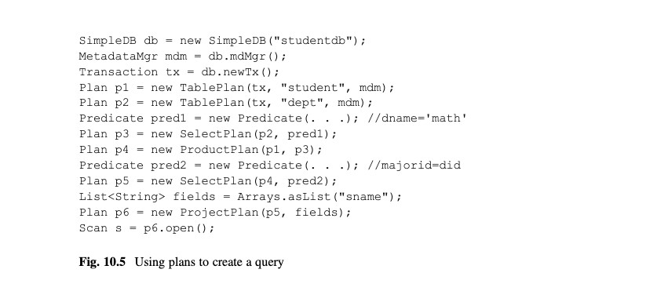

# 第10章 计划(Planning)

在查询处理的第一个阶段,解析器从一个SQL语句种抽取相关的数据.下一个阶段就是要把抽出的数据转换成一个关系代数查询树.这个阶段被称为计划(planning).本章考察基本的计划过程.考察计划器需要做什么来校验一个SQL语句是语义上有意义的,并查看两个基础的计划构造算法.

一个SQL语句可以有许多等价的查询树,它们通常有不同的消耗.一个希望商业可用的数据库系统一定得有一个发现高效计划的计划算法.章节15针对最优计划的主题.

## 10.1 校验
计划器的第一个责任是判断一个给定的SQL语句是否是真正有意义的.计划器需要校验以下关于SQL语句的事:
*	提到的表和字段都存在于目录中.
*	提到字段不冲突.
*	对字段的操作是类型正确的.
*	所有的常量对于它们的字段来说大小和类型都是正确的.

实现这个校验所需的所有信息都可以在所提到表的schema里找到.比如,一个schema不存在意味着所提到的表不存在.类似地,一个字段不存在于任何schema中意味着该字段不存在,一个字段存在多个schema中意味着有可能出现冲突.

计划器也应该通过检查每个提到的字段的类型和长度来判断谓语,修改赋值,和插入值等的类型正确性.对于一个谓语,在一个表达式中每个操作的参数必须是类型兼容的,每个项中的表达式也需要类型兼容.一个字段的修改赋值,类型必须兼容.对于一个插入语句,每个插入值的类型必须和它关联的字段的类型兼容.

一个SimpleDB计划器可以通过元数据管理器的getLayout方法获得需要的表schema.然而,计划器目前没有实现任何明显的校验.练习10.4-10.8要求你来完善这种情况.

## 10.2 计算一个查询树的消耗
一个计划器的第二个责任是为查询构造一个关系代数查询树.一个复杂点在于SQL查询可以有多个不同的查询树实现,每个都有它自己的执行时间.计划器负责选择最高效的一个.

但是执行器要如何计算一个查询树的效率呢?再次说明,一个查询的运行时间的最大头是块访问次数.因此,查询树的消耗被定义为要求用来完成查询扫描遍历的块访问次数.

一个扫描的消耗可以通过递归计算子节点的消耗然后基于扫描类型应用一个消耗公式来计算.图10.1给出了3种消耗的公式.每个关系操作对这些功能有它自己的公式.消耗函数是:
B(s)=要求用来构建扫描s的块访问次数.
R(s)=扫描s的输出记录数.
V(s,F)=扫描s的输出种不同F值的数量.

[图10.1]

这些函数和blocksAccessed,recordsOutput,和distinctValues是相似的.区别在于它们适用于扫描而不是表.

图10.1展示了这三个消耗函数的内在联系.给出一个扫描s,计划器想要计算B(s).但是如果s是两个表的积,那么B(s)的值由两个表的块数和左边扫描的记录数决定.如果左边扫描涉及一个选择操作,那么它的记录数由在谓语中提到的字段的不重复值的数量决定.换句话说,计划器需要这三个消耗函数.

以下的小节内容将推导图10.1中的消耗函数,并给出一个它们是如何用来计算一个查询树的消耗的例子.

### 10.2.1 一个表扫描的消耗
一个查询的每个表扫描持有它自己的当前记录页,这些页都持有一个缓存,这些缓存都会钉住一个页.当在页中的记录被读取,它的缓存就被解钉,第二个块的记录页替代了它的位置.因此,一次表扫描只会访问每个块一次,一次钉住一个缓存.

因此,当s是一个表扫描,B(s),R(s)和V(s,F)的值分别是块,记录,底层表的不重复值的数量.

### 10.2.2 一个选择扫描的消耗
一个选择扫描有一个底层扫描;称它为s1吧. 每次next的调用会导致选择扫描调用s1.next一次或多次;当s1.next返回false时,这个方法会返回false.   getInt,getString或getVal的每次调用直接从s1请求字段值,且不需要块访问.因此,遍历一个选择扫描和它的底层表扫描需要的块访问次数一样.也就是:
B(s)=B(s1)

R(s)和V(s,F)的计算由选择谓语决定.作为一个例子,我会分析一般的情形,其中选择谓语的字段要么等于一个常量要么等于另一个字段.

``基于常量筛选``
假设谓语是对字段A的A=c这种形式.假设A字段的值是均匀分布的,则会有R(s1)/V(s1,A)条记录匹配这个谓语.即:
R(s)=R(s1)/V(s1,A)

均匀分布假设也暗示着其他字段值在输出中仍然是均匀分布的.即:
V(s,A)=1
V(s,F)=V(s1,F) 对于所有其他字段F

``基于一个字段筛选``
现在假设谓语是对字段A和B的A=B这种形式.在这种情况,可以合理地假设字段A的值和字段B的值是有关系的.特别是,假设如果B的值比A多(也即,V(s1,A)<V(s1,B)),那么每个A值会出现在B的某处;如果A值比B多,反着也是正确的.(在A和B有一个外键键值关系的典型场景,这种假设当然是正确的).所以假设B值比A多,思考s1中的任何记录.它的A值有1/V(s1,B)的概率匹配到它的B值.类似地,如果A值比B多,那么它的B值有1/V(s1,A)的概率匹配到它的A值.因此:
R(s)=R(s1)/max{V(s1,A),V(s1,B)}

均匀分布假设也暗示每个A值会同等概率匹配到一个B值,因此,我们有:

V(s, F) = min(V(s1, A), V(s1, B)} 对于 F = A 或 B
V(s, F) = V(s1, F) 对于所有字段 F 除了 A 或 B

### 10.2.3 投影扫描(Project Scan)的消耗
和选择扫描一样,一个投影扫描有一个基础扫描(叫做s1),且要求不超过基础扫描需要的块访问次数.另外,一个投影操作并不改变记录数,也不改变任何记录的值.因此:
B(s)=B(s1)
R(s)=R(s1)
V(s,F)=V(s1,F) 对所有字段F

### 10.2.4 积扫描的消耗
一个积扫描有两个基础扫描,s1和s2.它的输出由来自s1和s2的记录的所有组合构成.随着扫描遍历的时候,基础扫描s1会被遍历一次,对s1的每条记录,基础扫描s2都会被遍历一次.有以下的公式:
B(s)=B(s1)+(R(s1)*B(s2))
R(s)=R(s1)*R(s2)
V(s,F)=V(s1,F) 或 V(s2,F),依赖于F属于哪个schema

有趣和重要的地方是需要意识到B(s)的公式对于s1和s2并不是对称的.也就是说,
Scan s3 = new ProductScan(s1, s2);
上面这条语句可能导致和逻辑上等价的下面这条语句有不同的块访问次数.
Scan s3 = new ProductScan(s2, s1);

会有多少不同呢?定义:
RPB(s)=R(s)/B(s)

即,RPB(s)代表代表扫描s的”每块记录数"—来自s扫描的每块访问的平均输出记录数.那么上面的公式可以重写成下面这样:
B(s) = B(s1) + (RPB(s1)*B(s1)*B(s2))
决定项是RPB(s1)*B(s1)*B(s2).如果你比较这个项目和交换s1,s2后的同一项目,你会发现当s1的RPB最低时积扫描的消耗最低.

比如,假设s1是STUDENT的表扫描,s2是DEPT的表扫描.因为STUDENT记录比DEPT记录要大,更多的DEPT可以填充到一个块,这意味着STUDENT比DEPT有更小的RPB.上面的分析展示了当先扫描STUDENT时块访问次数最少.

### 10.2.5 一个具体的例子
思考一个返回那些数学专业学生的名称的查询.图10.2a描绘了这个查询的查询树.10.2b给出了相关扫描的SimpleDB代码.

[图10.2]

图10.3使用图7.8的统计元数据,计算了图10.2b中的每个扫描的消耗.s1和s2的项直接复用了图7.8中对于STUDENT和DEPT的统计信息.s3的项说明DName上的筛选返回1条记录但是需要搜索DEPT的两个块来找到它.s4扫描返回45,000条STUDENT记录和一条选择的记录的所有组合;输出是45,000条记录.然而,这个操作要求94,500次块访问,因为一条数学系记录必须要查找45,000次且每次需要2个DEPT的块扫描.(另外的块访问来自STUDENT的单独扫描).s5扫描中的MajorId筛选减少输出到1125条记录(45,000学生/40系),但是并没有改变所需的块访问次数.并且,投影当然也没有改变任何事.

[图10.3]

数据库系统以相当大的消耗重新计算了数学系45,000次,这看起来可能有点怪;然而,这是管道查询计算的自然属性.(实际上,这是13章的非管道实现有用的情况.)

查看STUDENT和s3的RPB,你会发小RPB(STUDENT)=10,RPB(s3)=0.5.因为当有更低RPB的扫描在左边时积扫描会更快,一个更高效的策略是如下定义s4:
s4=new ProductScan(s3,STUDENT)

练习10.3要求你来展示在这种情况下,这个操作只会需要4502次块访问.区别在于现在筛选只需要计算一次.

## 10.3 计划
计算一个查询数的消耗的SimpleDB对象被称为计划.计划实现了Plan接口,它的代码如图10.4所示.

[图10.4]

这个接口支持blocksAccessed,recordsOutput和distinctValues方法,分别为查询计算B(s),R(s)和V(s,F)的值.schema方法返回输出表的schema.查询计划器可以使用这个schema来校验类型正确性并找到优化计划的方法.最后,每个计划都有open方法,其创建相应的扫描.

计划和扫描在概念上是相似的,它们都代表一个查询树.区别在于计划访问查询表的元数据,然而扫描访问它们的数据.当你提交了一个SQL查询,数据库计划器会查询创建几个计划并使用它们的元数据来选择最有效的那个.然后它使用计划的open方法来创建想要的扫描.

一个计划的构造和扫描是类似的.每个关系代数操作有个Plan类,加上TablePlan类来处理存储表.比如图10.5的代码检索那些数学专业的学生的名称,和图10.2的查询一样.唯一的区别在于图10.5使用计划来构造查询树,转换最终的计划为一个扫描.

[图10.5]

图10.6,10.7,10.8,10,9给出了TablePlan,SelectPlan,ProjectPlan和ProductPlan类的代码.TablePlan类从元数据管理器获取消耗估算.其他类使用前面小节的公式来计算他们的估算.

[图10.6]

[图10.7]

[图10.8]

[图10.9]

选择计划的消耗估算比其他操作更复杂,因为它的估算依赖于谓语.一个谓语,因此,有reductionFactor和equatesWithConstant方法可以用于选择计划.方法reductionFactor是被recordsAccessed用来计算谓语较少输入表的数量.equatesWithConstant方法是distinctValues用来判断谓语是否是一个指定字段等于一个常量.

ProjectPlan和ProductPlan的构造器从它们的基础计划的schema计算他们的schema.ProjectPlan的schema是通过查找基础字段列表并添加它们的信息到新的schema中来创建的.ProductPlan的schema是基础schema的联合.

这些计划类的open方法都是简单直接的.一般来说,从一个计划构造一个扫描有两个步骤:首先,该方法为每个基础计划递归构造一个扫描.然后,它传递那些扫描给操作的扫描构造器.

## 10.4 查询计划
再次说明,解析器接收一个SQL查询字符串作为输入,返回一个QueryData对象作为输出.本节解决如何从QueryData对象构造一个计划的问题.

### 10.4.1 SimpleDB查询计划算法
SimpleDB支持一个不包含计算,排序,聚合,嵌套,重命名的SQL的子集.因此,它的所有SQL查询都可以用3个操作select,project和product的查询树来实现.创建那样计划的算法如图10.10所示.

[图10.10]

举一个这个查询计划算法的例子,思考图10.11. (a)部分检索得到A且教授是Einstein的学生.部分(b)是由图10.10的算法生成的查询树.

[图10.11]

图10.12展示了一个使用视图的等价查询的查询计划算法.部分(a)给出了视图定义和查询,部分(b)描绘了该视图的查询树,部分(c)描绘了整个查询的树.

[图10.12]

注意最终的树是如何由两个表的积和视图树,跟着一个选择和一个投影构成的.最终的树等同于图10.11b,但是又有点不同.尤其是,原始选择谓语部分已经被推到树的底部,且有一个中间投影.15章节的查询优化技术可以利用这种等价.

### 10.4.2 实现查询计划算法
SimpleDB类BasicQueryPlanner实现基础查询计划算法;它的代码如图10.13所示.代码中的4个步骤实现了图10.10的算法的每个相应步骤.

[图10.13]

基础计划算法是死板且简单的.它以QueryData.tables方法返回的顺序生成积计划.注意到这个顺序完全是随机的—任何其他表顺序会产生同等的扫描.这个算法的性能因此会是不规则的(且通常很差),因为它没有使用计划元数据来帮助判断积计划的顺序.

图10.14展示了对计划算法的一个小优化.它仍然以同样的顺序考虑这些表,但是它现在对每个表创建两个积计划—一个它是在积的左边,和一个在右边—然后保持该计划有最低的消耗.

[图10.14]

这个算法比基本计划算法好,但是它仍然非常依赖查询中表的顺序.商业数据库系统的计划算法是更复杂的.它们不仅分析许多等价计划的消耗;它们也实现额外的可以应用于特殊情况的关系操作.它们的目标是选择最高效的计划.这些技术是章节12,13,14,和15的话题.

## 10.5 更新计划
本节考察计划期应该怎样处理更新语句.SimpleDB的类BasicUpdatePlanner提供一个更新计划的直接实现;它的代码如图10.15所示.这个类包含针对每种更新的方法.这些方法在接下来的小节中讨论.

[图10.15]

### 10.5.1 删除和修改的计划
删除(或修改)语句的扫描是一个检索那些会被删除(或修改)记录的选择扫描.比如,思考以下的修改语句:

update STUDENT
set MajorId = 20
where MajorId = 30 and GradYear = 2020

和下面的删除语句:
delete from STUDENT
where MajorId = 30 and GradYear = 2020

这些语句有同样的扫描,也就是,所有毕业于2020年30系的学生.executeDelete和executeModify方法创建并遍历这个扫描,在每条记录上做出相应的操作.在修改语句的场合,每条记录是被修改的;在删除语句的场合,每条记录是被删除的.

查看相应的代码,你会发现这两个方法创建同样的计划,这个计划和查询计划器创建的类似(除了查询计划器还有一个投影计划).两个方法都打开扫描并以同样的方式遍历.executeDelete方法对每条记录调用delete方法,然而executeModify在每条记录的修改字段上实现一个setVal操作.两个方法都保存受影响记录的计数,其会被返回给调用者.

### 10.5.2 插入计划
一个插入语句的扫描是一个简单的基础表的表扫描.executeInsert方法从插入一个新记录到扫描中开始.然后它并行遍历fields和vals列表,调用setInt或setString来修改记录的指定字段的值.这个方法返回一个1,代表1条记录被插入了.

### 10.5.3 表,视图,索引创建的计划
executeCreateTable,executeCreateView和executeCreateIndex方法的代码和其余的不同,因为它们不要求访问任何数据记录,因此不需要一个扫描. 它们直接使用来自解析器的相应信息,调用元数据方法createTable,createView和createIndex;它们返回0,表示没有记录受影响.

## 10.6 SimpleDB的计划器(Planner)
计划器是数据库引擎中将SQL转换成计划的组件.SimpleDB计划器是通过Planner类实现的,它的API如图10.16所示.

[图10.16]

两个方法的第一个参数是一个代表SQL语句的字符串.createQueryPlan为输入查询字符串创建并返回一个计划.executeUpdate方法为输入字符串创建一个计划,执行,并返回受影响记录的数量.(和JDBC中的executeUpdate方法一样).

一个客户端通过SimpleDB类的静态方法planner获取一个Planner对象.图10.17包含PlannerTest类的代码.它展示计划器的运用.这段代码的部分1 展示了一个SQL查询的处理.查询字符串被传给计划器的createQueryPlan方法,然后返回一个计划.打开那个计划返回一个扫描,它的记录然后被访问和打印.这段代码的部分2展示了一个SQL更新命令.命令字符串传给计划器的executeUpdate方法,它实现所有需要的工作.

[图10.17]

SimpleDB计划器有两个方法:一个处理查询,一个处理更新.这两个方法都类似地处理它们的输入;图10.18列出了它们的步骤.特别是,两个方法都实现了步骤1-3.两个方法主要在它们处理它们创建的计划上不同.createQueryPlan直接返回它的计划,然而executeUpdate打开并执行它的计划.

[图10.18]

图10.19给出了SimpleDB的Planner类的代码.这些方法都是图10.18的直接实现.createQueryPlan方法为输入SQL查询创建一个解析器,调用解析器方法query来解析字符串,校验返回的QueryData对象(至少,这个方法应该),并返回由查询计划器生成的计划.executeUpdate方法是类似的:它解析更新语句字符串,校验解析器返回的对象,并调用相应更新计划器方法来执行.

[图10.19]

更新解析器返回的对象会是InsertData,DeleteData等类型的,根据提交的更新语句是哪种类型的.executeUpdate的代码检查这个类型来确认调用哪个计划器.

Planner对象依赖于它的查询计划器和更新计划器来执行真正的计划.这些对象被传给Planner的构造器,其允许你用不同的计划算法来配置计划器.比如,15章节开发一个精妙的查询计划器叫做HeuristicQueryPlanner;你可以用这个计划器,而不是BasicQueryPlanner,如果你想,直接传递一个HeuristicQueryPlanner对象给Planner构造器即可.

代码使用了Java接口来获得即插即用的能力.Planner构造器的参数实现QueryPlanner接口和UpdatePlanner接口,它们的代码如图10.20所示.BasicQueryPlanner和BasicUpdatePlanner类实现这些接口,在15章里实现了更复杂的查询和更新.

[图10.20]

Planner对象有SimpleDB类的构造器创建.该构造器创建一个新的基本查询计划器和一个新的基本更新计划器并把它们传给Planner的构造器,如图10.21所示.为了重新配置引擎使用一个不同的查询计划器,你只需要修改SimpleDB的构造器以便他创建不同的QueryPlanner和UpdatePlanner对象.

[图10.21]

## 10.7 章节总结
* 为了给一个给定查询创建最高效的扫描,数据库系统需要估算遍历扫描需要的块访问次数.以下是定义给扫描s的估算函数:

   * B(s)=要求用来构建扫描s的块访问次数.
   * R(s)=扫描s的输出记录数.
   * V(s,F)=扫描s的输出种不同F值的数量.

* 如果s是一个表扫描,那么这些函数和表的统计元数据等同.否则,每个操作都有一个公式基于输入扫描计算上述函数值.
* 一个SQL查询可能有多个同等的查询树,每棵树对应于不同的扫描.数据库计划器负责创建有最低预估消耗的扫描.为了实现它,计划器可能需要构造多个查询树并比较它们的消耗.它只对有最低消耗的树创建扫描.

* 为了消耗比较而创建的查询树被称为一个计划.计划和扫描,概念上是相似的,它们都表示一个查询树.区别在于一个计划有预估消耗的方法;它访问数据库的元数据,并非真实的数据.创建一个计划并不导致任何磁盘访问.计划器创建多个计划并比较它们的消耗.然后它选择最低消耗的计划,并从它打开一个计划.

* 计划器是数据库引擎中转换一个SQL语句到一个计划的组件.
* 另外,计划器通过检查以下项目来校验SQL语句是语义上有意义的.
   * 提到的表和字段确实存在于目录中
   * 提到的字段不冲突
   * 字段的操作是类型正确的
   * 所有常量对于它们的字段是大小和类型正确的

* 基本的查询计划是如下创建一个基础计划的:  
   1. 为在from分句的每个表T创建一个计划.
      (a) 如果T是一个存储表,那么计划是一个T的表计划.
      (b) 如果T是一个视图,那么计划是递归调用这个算法在T的定义上得到的结果
   2. 以给出的顺序,接收from分句里表的积
   3. 基于where分句的谓语筛选.
   4. 投影select分句中的字段

* 基本查询计划算法生成一个简单的且通常低效的计划.商业数据库系统的计划算法实现不同同等计划的扩展分析,这会在章节15叙述.

* 删除和修改语句的处理是类似的.计划器创建一个检索那些会被删除(或修改)的记录的选择计划.executeDelete和executeModify方法打开计划并遍历结果扫描,在结果的每个记录上实现相应的操作.在修改语句的情况,每个记录是被修改;在删除语句的情况下,每个记录是被删除.

* 插入语句的计划是一个底层表的表计划.executeInsert方法打开计划,并插入一个新的记录到结果扫描.

* 创建语句的计划不需要创建计划,因为它们不访问任何数据.相反,这些方法调用相应的元数据方法来实现创建.

