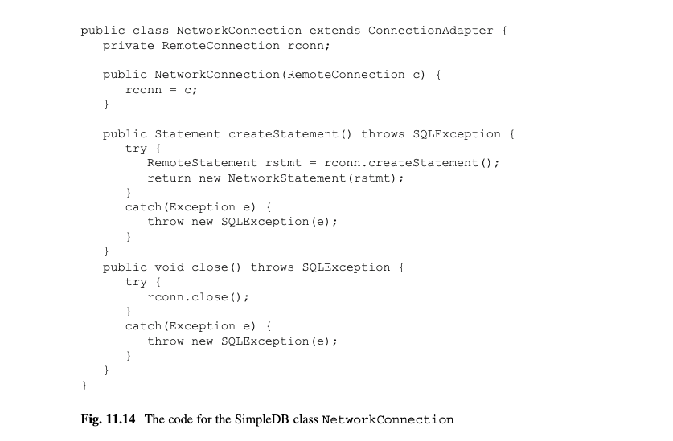

# 第11章 JDBC接口

本章考察如何为一个数据库引擎创建JDBC接口.写一个嵌入接口是相对简单的--你只需要调用引擎相应的JDBC类.写一个服务端的接口要求额外的代码来实现服务端和处理JDBC请求.本章展示了Java RMI的使用是如何简化这些额外的代码的.

## 11.1 SimpleDB 的API
章节2引入了JDBC作为连接数据库的标准接口,其包含了多个JDBC客户端样例.余下的章节,不会使用JDBC.相反,它们包含展示SimpleDB引擎的不同特性的测试程序.然而,那些测试程序也是数据库客户端;它们只是刚好使用SimpleDB 的API来访问SimpleDB引擎而不是使用JDBC API.

SimpleDB API由SimpleDB的公共类(比如SimpleDB,Transaction,BufferMgr,Scan,等等)和它们的方法构成.这种API比JDBC更有扩展性,且可以访问引擎的底层细节.这种底层访问允许应用程序来定制由引擎提供的功能.比如,章节4的测试代码避免事务管理器直接访问日志和缓存管理器.

这样的底层访问会带来一些代价.应用的编写者必须有对目标引擎API的丰富的知识,且移植应用到一个不同的引擎会需要重写它们以适配不同的API.JDBC的目的是提供一个标准的API,除了细节的配置,其他的对所有数据库引擎和配置模式都一样.

为了在SimpleDB中实现JDBC API,只需要观察两种API之间的区别即可.比如,思考图11.1.(a)部分包含一个查询数据库,打印结果集,关闭结果集的JDBC应用.部分(b)给出了使用SimpleDB API的相应的应用.这段代码创建一个新的事务,调用计划器来得到一个SQL查询的计划,然后打开这个计划得到一个扫描,然后遍历扫描,在关闭它.


<div align="center">[图11.1]</div>

图11.b的代码使用了来自SimpleDB的5个类:SimpleDB,Transaction,Planner,Plan,和Scan.JDBC代码使用了Driver,Connection,Statement,和ResultSet接口.图11.2展示了这些构造的关联性.


<div align="center">[图11.2]</div>

图11.2的每行都有一个共同的目标.比如,Connection和Transaction都管理当前事务,Statement和Planner类处理SQL语句,ResultSet和Scan接口遍历查询的结构.这种相关性是实现SimpleDB的JDBC API的关键.

## 11.2 内嵌JDBC
simpledb.jdbc.embedded包包含每个JDBC接口的实现类. EmbeddedDriver类的代码如图11.3所示.


<div align="center">[图11.3]</div>

这个类有一个无参构造器.它的唯一方法,connect,创建一个新的SimpleDB对象给指定数据库,然后把它传给EmbeddedConnection构造器,返回新的对象.注意到JDBC Driver接口强制该方法声明抛出一个SQLException,尽管它不会抛出该错误.

JDBC Driver接口除了connect方法还有更多的方法,尽管没有和SimpleDB相关的.为了确保EmbeddedDriver能实现Driver接口,它扩展了DriverAdapter类,其实现那些方法.DriverAdapter的代码如图11.4所示.


<div align="center">[图11.4]</div>

DriverAdapter通过要么返回一个默认值或抛出一个错来实现所有的Driver接口方法.EmbeddedDriver类覆盖了SimpleDB关注的方法(比如,connect)并使用DriverAdapter实现其他方法.

图11.5 包含了EmbeddedConnnection类的代码.这个类管理事务.大部分工作是由Transaction对象currentTx实现的.比如,commit方法调用currentTx.commit然后创建一个新的事务作为currentTx的新的值.createStatement方法传一个Planner对象还有它自己的引用给EmbeddedStatement构造器.


<div align="center">[图11.5]</div>

EmbeddedConnection不直接实现Connection,而是扩展ConnectionAdapter.ConnectionAdapter的代码提供了所有Connection方法的默认实现,在这忽略不讲.

EmbeddedStatement的代码如图11.6所示.这个类负责执行SQL语句.executeQuery方法从计划器获取一个计划,并传该计划到一个新的RemoteResultSet对象来执行.executeUpdate方法直接调用计划器相应的方法.


<div align="center">[图11.6]</div>

这两个方法也负责实现JDBC自动提交语义.如果SQL语句正确执行,那么它必须提交.更新语句完成时,executeUpdate方法立即告诉connection提交当前事务.另一方面,executeQuery不能立即提交因为它的结果集仍在使用.相反,Connection对象被发送给EmbeddedResultSet对象,所以它的close方法可以提交该事务.

如果在一个SQL语句执行期间发生了错误那么计划器代码会抛出一个运行错误.这两个方法会捕获这个错误,回滚这个事务,并抛出一个SQL错误.

EmbbedResultSet类包含执行查询计划的方法;它的代码如图11.7所示.它的构造器打开给出的Plan对象并保存结果扫描.next,getInt,getString和close方法之间调用它们相应的扫描方法.close方法也提交当前事务,向JDBC自动提交语义要求的那样.EmbeddedResultSet类获取一个来自它的计划的Schema对象.getMetaData方法传递这个Schema对象给EmbeddedMetaData构造器.


<div align="center">[图11.7]</div>

EmbeddedMetaData类包含传给它的构造器的Schema对象;它的代码如图11.8所示.Schema类包含类似ResultSetMeta接口中的方法;区别在于ResultSetMetaData的方法通过列号来查看字段,然而Schema方法通过名称来查看字段.因此EmbeddedMetaData的代码包含转换相互之间的方法调用.


<div align="center">[图11.8]</div>

## 11.3 远程方法调用
本章的剩余部分解决如何实现一个服务端JDBC接口的问题.实现服务端JDBC最难的部分是写服务端的代码.幸运的是,Java库里包含实现大部分工作的类;这些类被称为Remote Method Invocation(or RMI).本章引入RMI.下节展示如何使用它来写服务端JDBC接口.


### 11.3.1 远程接口(Remote Interfaces)
RMI使得Java程序可以在客户端机器和在服务端机器的对象交互.要使用RMI,你必须定义一个或多个继承Java接口Remote的接口;这些被称为它的远程接口(remote interfaces).你也需要为每个接口写一个实现类;这些类会在服务端运行并被称为远程实现类(remote implmentation classes). RMI会自动创建相应的运行在客户端的类;这些被称为存根类(stub).当客户端从一个存根对象调用一个方法,这个方法会通过网路发送到服务端,并在那通过远程实现对象来执行.然乎偶结果会发回给客户端的存根对象.简单的说,一个远程方法是被客户端调用,但是是在服务端执行(使用远程实现对象).

SimpleDB实现包simpledb.jdbc.network里的5个接口: RemoteDriver,RemoteConnection,RemoteStatement,RemoteResultSet,和RemoteMetaData;它们的代码如图11.9所示.这些远程接口是JDBC接口的镜像,但有两点不同:
*	它们仅实现图2.1的基础JDBC方法.
*	它们抛出一个RemoteException(RMI要求的)而不是一个SQLException(JDBC要求的).


<div align="center">[图11.9]</div>

为了对RMI是如何工作的有一个直观感受,思考图11.10的客户端代码块.代码块里的每个变量代表一个远程接口.然而,因为这个代码客户端是在客户端,你知道真实的对象其实是由存根类持有的.这段代码块并没有展示变量rdvr如何获取它的存根的;它通过RMI注册获取的,其会在11.3.2节讨论.


<div align="center">[图11.10]</div>

思考rdvr.connect的调用.这个存根通过网络发送请求到服务端的相应的RemoteDriver实现对象来实现connect方法.这种远程实现对象在服务端执行它的connect方法,这会导致一个新的RemoteConnection实现对象在服务端被创建.新的远程对象的存根被发回给客户端,客户端会保存它作为rconn变量的值.

现在思考rconn.createStament的调用.存根对象发送一个请求到它相应的服务端RemoteConnection实现对象.这个远程对象执行它的createStatement方法.一个RemoteStatement实现对象在服务端被创建,且它的存根被返回给客户端.

### 11.3.2 RMI注册中心(The RMI Registry)
每个客户端存根对象包含一个相应的服务端远程实现对象的引用.一个客户端,一旦有一个存根对象,就可以通过这个对象来和服务端交互,并且那种交互可能会创建其他的存根对象给客户端使用.但是存在一个问题--客户端如何获取它的第一个存根?RMI通过被称为rmi registry的程序的方式来解决这个问题.一个服务端发布存根对象在RMI注册中心,然后客户端从它检索存根对象.

SimpleDB服务端只发布RemoteDriver类的一个对象.发布是由simpledb.server.StartServer程序的三行代码实现的.
```java
Registry reg = LocateRegistry.createRegistry(1099);
RemoteDriver d = new RemoteDriverImpl();
reg.rebind("simpledb", d);
```
createRegistry方法在本机开启RMI注册中心,使用指定的端口.(约定是使用1099端口).  reg.rebind的方法为远程实现对象b创建一个存根,把它保存在rmi注册中心,并以"simpledb"的名称对于客户端可用.

一个客户端可以通过对注册中心调用lookup方法从注册中心请求一个存根.在SimpleDB中,这种请求是通过以下NetworkDriver类的代码行创建的.
```java
String host = url.replace("jdbc:simpledb://", "");
Registry reg = LocateRegistry.getRegistry(host, 1099);
RemoteDriver rdvr = (RemoteDriver) reg.lookup("simpledb");
```
getRegistry方法返回在指定地址和端口的RMI注册中心的引用.reg.lookup的调用是到RMI注册中心,检索名为"simpledb"的存根,并返回给调用者.

### 11.3.3 线程问题(Thread Issues)
当建立一个大型Java程序,清楚在任何时候存在什么线程是很重要的.在SimpleDB的服务端执行过程中,会有两种线程:客户端的线程和服务端的线程.

每个客户端在它的机器上有自己的线程.这个线程存在客户端的整个执行过程中;所有的客户端存根对象都是从这个线程调用.另一方面,每个服务端的远程对象都是在它自己的独立线程中.一个服务端的远程对象可以想成是一个"小型服务端",其一直等待它的存根来连接它.当一个连接被创建,远程对象实现请求的工作,发送返回值给客户端,并耐心等待另一个连接.RemoteDriver对象是由simpledb创建的.server.Startup在一个可以看作"数据库服务端"的线程中运行.

不管什么时候客户端产生一个远程方法调用,客户端都是等待,同时相应的服务端线程运行,当服务端线程返回一个值时客户端再继续.类似地,服务端线程会是安静的直到它的其中一个方法被调用,当方法完成时会继续恢复安静的状态.因此,在任何时候,客户端和服务端都只有一个会做事情.非正式地说,当远程请求产生时,客户端线程看起来像是在客户端和服务端之间来回移动.尽管这种想象可以帮助你来可视化客户端服务端应用之间的控制流程,理解什么正在发生的也是很重要的.

区别服务端和客户端线程的一种办法时打印一些东西.当在客户端线程调用时,System.out.println的调用会展示在客户端机器上,当从服务端线程调用时会展示在服务端机器.

## 11.4 实现远程接口(Implementing the Remote Interfaces)
每个远程接口的实现需要两个类:存根类和远程实现类.按照管理,远程实现类的名称是它的接口名称加上后缀"Impl".你不需要知道存根类的名称.

幸运的是,服务端对象和它们的存根之间的通信对所有的远程接口都是一样的,这意味着所有的通信代码可以由RMI库类提供.程序员只需要提供每个指定接口特定的代码.换句话说,程序员根本不需要写存根类,只需要写远程实现类中为每个方法调用指定服务端的部分.

RemoteDriverImpl类是SimpleDB服务端的入口;它的代码如图11.11所示.仅会有一个RemoteDriverImpl对象会被simpledb.server.Startup引导类创建,且它的存根是唯一发布在RMI注册中心的对象.每次它的connect方法被调用(通过存根),它会创建一个新的RemoteConnectionImpl远程对象在服务端,并在一个新线程中运行.RMI透明地创建相应的RemoteConnection存根对象,并把它返回给客户端.


<div align="center">[图11.11]</div>

注意这段代码仅和服务端对象相关.尤其是,它不包含网络代码或它相关存根对象的引用,并且当它需要创建一个新的远程对象,它只创建远程实现对象(并不是存根对象).RMI类UnicastRemoteObject包含所有需要用来实现那些其他任务的代码.

RemoteDriverImpl的功能和图11.3的EmbeddedDriver基本一样.区别只在于它的connect方法没有参数.这种区别的理由是一个SimpleDB内嵌驱动可以选择数据库来连接,然而,服务端驱动必须连接到远程SimpleDB对象相关的数据库.

一般来说,每个JDBC远程实现类的功能和相应的内嵌JDBC类相同.举另外一个例子,思考RemoteConnectionImpl类,它的代码如图11.12所示.注意close方法和图11.5的EmbeddedConnection的代码的相关性.类RemoteStatementImpl,RemoteResultsetImpl,和RemoteMetaDataImpl相关内嵌同等代码在这就省略了.


<div align="center">[图11.12]</div>

## 11.5 实现JDBC接口(Implementing the JDBC Interfaces)
SimpleDB的RMI远程类的实现提供java.sql包的JDBC接口要求的所有特性,除了两个:RMI方法不抛出SQL错误,且它们不实现接口里的所有方法.也就是说,你有实现接口RemoteDriver,RemoteConnection等的可用类,但是你真正需要的是实现Driver,Connection等的类.这在面向对象编程中是一个常见的问题,解决方案是实现要求的类作为客户端中它们相应存根对象的包装.

为了明白包装是如何工作的,思考NetworkDriver类,它的代码如图11.13所示.它的connect方法必须返回一个Connection类型的对象,在这种情况下它会是一个NetworkConnection对象.为了这样做,它首先从RMI注册中心获取一个RemoteDriver存根.然后它调用存根的connect方法来获取一个RemoteConnection存根.想要的NetworkConnection对象是通过传RemoteConnection到它的构造器来创建的.


<div align="center">[图11.13]</div>

其他JDBC接口的代码是类似的.比如,图11.14给出了NetworkConnection的代码.它的构造器接收一个RemoteConnectin对象,用来实现它的方法.createStatement的代码传新创建的RemoteStatement对象给NetworkStatement构造器,并返回该对象.在这些类里,每当一个存根类抛出一个RemoteException,该错会被捕获并转换成一个SQLException.


<div align="center">[图11.14]</div>


## 11.6 章节总结
*	一个应用程序有两种方法可以访问一个数据库:通过一个内嵌连接和通过服务端连接.SimpleDB,像大多数数据库引擎,为两种连接类型实现JDBC API.

*	SimpleDB中内嵌JDBC连接利用每个JDBC接口有一个相应的SimpleDB类的事实.
*	SimpleDB通过Java Remote Method Invocation(RMI)机制来实现服务端连接.每个JDBC接口有一个相应的RMI远程接口.它们主要的区别是它们抛出RemoteException(RMI要求的)而不是SQLException(JDBC要求的).
*	每个服务端远程实现对象在它自己的线程运行,等待一个存根来联系它.SimpleDB启动代码创建一个RemoteDriver类的远程实现对象并在RMI注册中心保存一个存根.当一个JDBC客户端相应一个数据库系统的连接,它从注册中心获取存根,并调用他的connet方法.
*	connect方法是一个典型的RMI远程方法.它创建一个新的RemoteConnectionImpl对象在服务器,其在它自己线程运行.然后这个方法返回这个对象的一个存根给JDBC客户端.客户端可以调用存根的Connection方法,这会导致服务端的实现对象的相应方法被执行.

*	服务端JDBC客户端不直接使用远程存根,因为它们实现远程接口而不是JDBC接口,相反,客户端对象包装它们相应的存根对象.


