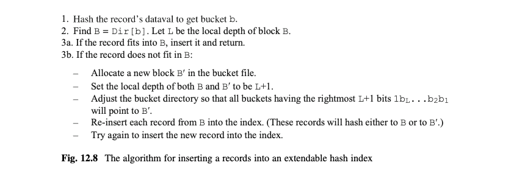
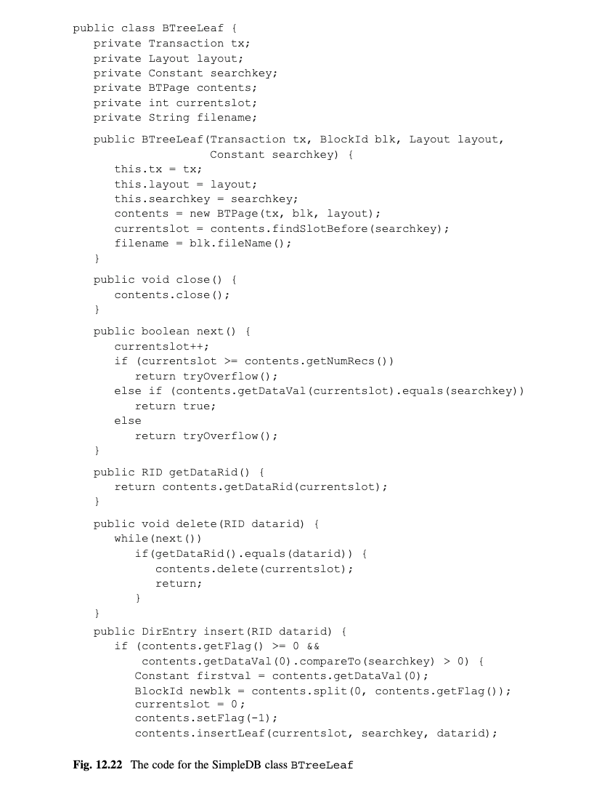

# 第12章 索引(Indexing)
当查询一个表,用户通常只关心它的某些记录,比如有某个字段的指定值的记录.一个索引(index)是让数据库引擎不需要搜索整个表快速定位那种记录的文件.本章思考3种实现索引的通用方式:静态hash,可扩展hash和B树,然后实现利用索引的新的关系代数操作.

## 12.1 索引的价值
本章目前假设表中的记录没有特别的组织.然而,一个合适的表组织可以显著地提高某些查询的效率.举一个这种问题的比较好的例子,思考一个电话簿的页.

一个电话簿基本上相当于一个大表,它的记录列出每个订阅者的名称,地址和电话号码.这个表是根据订阅者的姓,然后根据名来排序的.假设你想检索一个特定的人的电话号码.比如,你可以通过最多log2N(N是总记录数)次检查,即做一个二分查找来定位电话号码.这是极快的.(比如,假设N=1,000,000.那么log2N<20,这意味着在一个一百万人的电话簿里,你只需要不超过20次检查来查找某个人.

尽管一个电话簿对于根据订阅者的姓名来检索是非常棒的,但是它对于其他种类的检索是不太友好的,比如,查找有一个特定电话号码或住在特定地址的订阅者.要获取那种信息的唯一办法是检查列表里的每一条记录.这样的搜索会是非常慢的.

如果你想要根据一个给定的电话号码查找订阅者,那么你需要一个根据电话号码排序的电话簿(被称为"反转电话簿").当然,只当你知道电话号码的时候才有用.如果你有一个反转电话簿,并想知道一个特定订阅者的电话号码,那么你还会需要检查电话簿列表种的每条记录.

这个讨论展示了一个源于表组织明显的但是残酷的事实:一个表一次只能一种方式组织.如果你想根据一个电话号码或订阅者名称来快速检索,那么你需要两份电话簿的拷贝,每份有一个不同的组织.并且,如果你也想根据地址快速检索电话号码,你会需要电话簿的第三份拷贝,根据地址排序的.

这个原则也适用于数据库表.如果你想能够高效地在一个表中查找有指定字段值的记录,你需要根据该字段组织的表的版本.数据库引擎通过支持索引来解决这个需求.一个表可以有一个或多个索引,每个定义在一个单独的字段上.每个索引作为基于该字段组织的表.比如,一个STUDENT的marjorID字段的索引会使得根据一个给定专业查找STUDENT记录变得容易.

特别地,一个索引是索引记录的文件.索引文件对相关表的每条记录有一个索引记录.每个索引记录有两个值:相应记录的标识和该记录的指定字段值.SimpleDB称索引记录的字段为dataid和dataval.图12.1描绘了STUDENT表和它的两个索引--一个基于SId字段,另一个基于MajorId字段.每个方块代表一条记录.一个索引的dataval出现在它的方块中,datarid显示为一个指向相关STUDENT记录的箭头.

[图12.1]

引擎根据它们的datavals组织索引文件中的记录.12.3-12.5节会考察复杂的记录组织.目前,图12.1简单地假设索引记录是根据它们的datavals排序的.这种排序组织可以像下面这样使用.

假设你想要查找Sid的值是6的STUDENT记录.你首先基于SID_IDX做一个二分查找来查找dataval是6的索引记录;然后你根据它的datarid来定位相关的STUDENT记录(结果是Kim的记录).

假设你想查找MajorId值是20的STUDENT记录.你首先在MAJOR_IDX上做一个二分查找.注意因为排序,另外3个有dataval 20的记录会连续出现在它之后.遍历这4个索引记录;对每条记录,都沿着它的datarid来定位相关STUDENT记录.

这种索引的使用到底多高效?没有索引,对每个查询你可以做的最好的就是做一个STUDENT表的顺序搜索.再看下图7.8的统计,其声明了45,000条STUDENT记录中每10条记录填充一个块.因此,STUDENT的顺序扫描会需要4500块访问.

使用SID_IDX索引的消耗可以如下估算.索引会有45,000条记录,这意味着该索引的二分查找最多需要检查16条索引记录(因为log2(45,000) < 16);在最坏的情况下,这些所有记录都在不同的块中.它会花费一次块访问来使用被选择的索引记录的dataid来访问想要的STUDENT记录,结果有17次块访问--相比顺序扫描是一个可观的消耗降低.

使用MAJOR_IDX索引的消耗可以如下计算.图7.8的统计声明有40个系,这意味着每个系会有1125个专业;因此,MAJOR_IDX对于每个dataval有1125条记录.索引记录是比较小的,让我们假设100条记录能填充进一个块;因此1125条索引记录会填充到12块里.再次,一个索引上的二分查找需要16次块访问来查找第一条索引记录.因为所有有同样dataval的索引记录在文件中是连续的,遍历这1125条索引记录需要12次块访问.因此这个查询需要16+12=28次MAJOR_IDX的块访问.那是非常高效的.然而,问题是STUDENT块需要被访问的次数.当1125索引记录跟着它的dataid,每条记录会请求STUDNET的一个块.结果是该查询会产生STUDENT的1125次块访问和1125+28=1153的总块访问次数.尽管这比SID_IDX需要的多很多,使用MAJOR_IDX仍然比顺序查找快4倍.

现在假设只有9个系而不是40.那么每个系会有5000个专业,这意味着MAJOR_IDX对每个dataval有5000条索引记录.当你执行之前的查询会发生什么.现在会有5000条MAJOR_IDX记录尝试获取它们的相关STUDENT记录,意味着会有5000次单独的STUDENT的块读取!也就是说,使用索引会导致比STUDENT中的块数更多的块访问.这种情况,使用索引会比直接扫描STUDENT表更慢.这个索引是完全没用的.

这些观察可以总结称以下规则:一个字段A的索引的有用程度和表中的不同A值的数量成正比.这个规则暗示当索引字段是表的键,索引是最有用的,因为每条记录有一个不同的键值.反过来,这个规则也暗示如果不同A值的数量比每个块的记录数少,索引会是没什么用的.

## 12.2 SimpleDB索引
前面的小节展示了一个索引的使用方式:你可以在索引中搜索第一条有指定值的记录;你可以查找有该值的接下来的所有索引记录;并且你可以从一个给定索引记录抽取datarid.SimpleDB接口Index形式化了这些操作.它的代码图12.2所示.

[图12.2]

这些方法和TableScan的方法类似--一个客户端可以定位索引在开始的位置并在它的记录间移动,可以检索当前索引记录的内容,可以插入和删除索引记录.然而,因为索引是以熟知的定制方式使用的,Index中的方法比TableScan中的更明确.

特别地,一个SimpleDB客户端总是通过提供一个值(叫做搜索键)来搜索索引并检索有一个匹配dataval的索引记录.beforeFirst方法接收这个搜索键为它的参数.之后的next调用移动索引到下一条dataval和搜索键相等的记录,如果没有更多那种记录存在返回false.

另外,一个索引不需要通用的getInt和getString方法,因为所有的索引记录有同样的两个字段.另外,一个客户端不需要检索一个记录的dataval,因为它总会是搜索键(search key).因此,唯一它需要的唯一检索方法是getDataRid,其返回当前索引记录的dataid.

IndexRetrievalTest类提供使用索引的一个例子;请看图12.3.这段代码打开MajorId的索引查找专业20的学生,接收相应的STUDENT记录,并打印它们的名称.

[图12.3]

注意该代码使用一个表扫描来接收STUDENT记录,尽管表并不是真正地被扫描.相反,该代码调用表扫描的moveToRid方法来定位扫描到想要的记录.

索引相关的元数据类的API如图7.13所示.特别地,IndexMgr中的getIndexInfo方法返回一个包含指定表的所有可用索引的IndexInfo元数据的map.你通过从该map中选择相应的IndexInfo对象并调用它的open方法来获得想要的Index对象.

图12.4的IndexUpdateTest类展示了数据库引擎是如何处理对一个表的更新的.该代码实现了两个任务.第一个任务插入一个新的记录到STUDENT中;第二个任务从STUDENT删除一条记录.该代码必须在处理插入时也要插入一条相应的记录在每个STUDENT表的索引中,删除也是类似地.注意该代码是如何通过打开STUDENT的所有索引并保存它们在一个map里开始的.然后每次需要对索引做些什么的时候该代码可以遍历这个map.

[图12.4]

图12.3和12.4的代码直接操作索引,不需要也不关心下面的实现.唯一的要求是索引得实现Index接口.12.1节假设一个使用排序索引和二分查找的索引.这样的实现并没有在现实中使用,因为它没有利用索引文件的块结构.12.3-12.5节考察了3个更好的实现--2个基于哈希的策略和一个基于排序树的策略.

## 12.3 静态哈希索引(Static Hash Index)
静态哈希(hashing)可能是实现索引的最简单的方式了.尽管它不是最高效的策略,它是非常容易理解的和展示原理最清晰的.因此用它开头是再好不过了.

### 12.3.1 静态哈希
一个静态哈希索引使用一个固定数量N的桶,编号从0到N-1.这个索引也使用一个哈希函数,其映射值到桶.每个索引记录都经过它的dataval哈希后分配到相应的桶.一个静态哈希索引是如下工作的:
*	保存一个索引记录,根据哈希函数把它放到相应的桶.
*	查找一个索引记录,对搜索键执行哈希,然后检查相应的桶.
*	删除一个索引记录,首先找到它(像上面),然后从桶删除它.

一个哈希索引的查找消耗和它的桶数量成反比.如果一个索引包含B个块,有N个桶,那么每个桶有B/N块,那么搜索一个桶要求B/N次块访问.

比如,思考SName的索引,假设为了简洁,N=3,哈希函数映射一个字符串s到s中在字母"m"前的字符数(除余N).也假设3个索引记录填满一个块.图12.5描述了3个索引桶的内容.这张图使用ri来代表第i个STUDENT记录的rid.

[图12.5]

现在假设你想要查找所有名为"sue"的学生的datarid.你哈希字符串"sue"到桶1,然后查找相应的桶.查找需要两次块访问.类似的,因为"ron"哈希到桶0,它消耗一次块访问来确定没有学生叫"ron".

这个例子使用了小的不现实的块大小值和桶数量.举一个更现实的样例计算,假设该索引使用1024个桶,这意味着(假设记录在桶之间均匀哈希):
*	一个1024块的索引可以只用一次块访问来查找
*	一个2048块的索引可以只用两次块访问来查找
以此类推.从数字的角度来看,注意到一条SName的索引记录的dataval需要22字节,datarid需要8字节;所以你给每条记录添加1字节来保存"空/在使用"标志,那么178条索引记录会填满一个4K大小的块.因此,一个2048块的索引相当于一个差不多364,544条记录的数据文件.只用两次块访问就可以查找这么多的记录.

### 12.3.2 实现静态哈希
SimpleDB的静态哈希是在类HashIndex中实现的,它的代码如图12.6所示.

[图12.6]

这个类保存每个桶在一个单独表,它的名称是索引名称和桶号的拼接.比如,索引SID_INDEX的桶#35的名称为"SID_INDEX35".beforeFirst方法哈希搜索键并打卡结果桶的表扫描.next方法从表扫描的当前位置开始读取知道找到一个有搜索键的记录;如果那样的记录不存在,该方法返回false.一个索引记录的datarid是保存为两个整数,block字段和id字段.getDataRid方法从当前记录读取这两个记录,构造rid;insert方法则做相反的操作.

除了实现Index接口的方法,HashIndex类还实现一个静态方法searchCost.这个方法是由IndexInfo.blocksAccessed调用,如图7.15所示.IndexInfo对象传两个参数给searchCost方法:索引中的块数和每个块的索引记录数.它如此做是因为它不知道索引如何计算它们的消耗.在静态索引的情况,查找消耗只依赖于索引大小,因此RPB只是被忽略的.

## 12.4 可扩展哈希索引(Extendable Hash Indexes)
一个静态索引的搜索消耗是和桶的数量成反比的--你使用更多的桶,每个桶就有更少的块.最好的解决方案是有足够多的桶以使每个桶都是一个块大小.

如果一个索引总是保持同样大小,那么很容易计算理想的桶数量.但是现实中,索引随着新的记录插入到数据库中增长.所以如何决定使用多少桶?假设你基于当前索引大小来选择桶大小.问题在于随着索引的增长,每个桶到头来都会包含很多块.但是如何你选择比未来需要的更多的桶,那么目前空的或基本上空的桶会造成很多的空间浪费,直到索引增长填充它.

一个被称为扩展哈希(extendable hasing)的策略通过一个非常大数量的桶来解决这个问题,确保每个桶不会超过一个块大小.可扩展哈希通过运行多个桶来分享同一个块来处理空间浪费的问题.思路是鸡舍有很多块,它们都共享少数的块,所以只会有很少的空间浪费.这是一个非常聪明的想法.

桶之间的块分享是通过两个文件的方式来实现的:桶文件和桶目录.桶文件包含索引块.桶目录映射桶到块.目录可以认为是一个数组,每个数对应每个桶.成这个数组为Dir.如果一个索引记录哈希到一个块b,那么那条记录会保存在桶文件的块Dir[b]处.

比如,图12.7描绘一个STUDENT的Sid字段的可扩展哈希索引的可能内容,假设:
*	三个索引记录填满一个块.
*	8个桶被使用.
*	哈希函数h(x)=x%8
*	STUDENT表包含7条记录,有id 1,2,4,5,7,8,和12.

[图12.7]

像之前一样,ri代表第i条STUDENT记录的rid.
注意桶目录Dir是被使用的.事实是Dir[0]=0,Dir[4]=0,意味着哈希到0(比如r8)或4(比如r4和r12)的记录会放在块0.类似地,哈希到1,3,5,或7的记录会放在块1,且哈希到2或6的记录会放在块2.因此,这个桶目录让索引记录保存到3个块中,而不是8个.

当然,有很多方式设置桶目录的桶共享3个块.图12.7的目录背后有一个特殊的逻辑,接下来会讨论它.

### 12.4.1 共享索引块
可扩展哈希目录总是有2的M次方个桶;整数M被称为索引的最大深度.2的M次方桶可以支持M比特长的哈希值.图12.7的样例使用M=3.实际上,M=32是一个合理的选择,因为整数值有32个比特.

初始的时候,一个空的桶文件会包含一个块,所有的目录记录都会指向这个块.换句话说,这个块是由所有的桶共享.任何新索引记录会被插入到这个桶里.

桶文件的每个块有一个本地深度(local depth).一个本地深度L表明块里的每条记录的哈希值都有同样的靠右的L比特位.这个文件的第一个块初始的本地深度是0,因为它的记录可以有任意哈希值.

假设一条记录是插入到这个索引但是没有填充到分配的块.那么那个块会分割,另一个块被分配到桶文件,且满块的记录的记录分布在它自己和新的块里.重分布算法是基于块的本地深度.因为块里的所有记录当前都有同样的哈希值靠右L比特,这个算法开始思考靠右第(L+1)比特:所有有0的记录保存在当前块,所有为1的移到新的块.注意这两个块的每个记录都有相同的L+1比特位.也就是说,每个块的本地深度增加了1.

当一个块分割,桶目录必须被调整.让b是新插入索引记录的哈希值,也就是,b是一个桶的号.假设b的靠右L比特是bL...b2b1.那么有同样靠右L比特(包括b)的桶号都指向刚刚分割的块.因此该目录必须修改以致于靠右L+1比特是1bL...b2b1的槽都指向新块.

比如,假设桶17目前映射到有本地深度2的块b.因为17的二进制是1001,它的靠右2比特是01.它规定所有靠右2比特是01的桶都映射到B,比如1,5,9,13,17,和21.现在,假设块B满了且需要分割.系统分配一个新的块B'并设置B和B'的本地深度为3.然后调整目录.那些靠右3比特为001的继续映射到块B(它们的目录记录没有变化).但是那些靠右比特为101的桶改为映射到B'.也就是说,桶1,9,17,25等会继续映射到B,然而,桶5,13,21,29等现在会映射到B'.

图12.8给出了插入一条记录到可扩展哈希索引的算法.比如,再次思考Sid的可扩展哈希索引.假设桶目录有2的10次方个桶.(假设,最大深度是10),且哈希函数映射每个整数n到n%1024.开始的时候,桶文件有一个块构成,所有的目录记录指向该块.这种情况是描述在图12.9a.

[图12.8]

[图12.9]

现在假设你插入针对学生4,8,1,和12的索引记录.前三个插入到块9,但是第4个导致一个分割.这种分割导致以下事件发生:一个新块被分配了,本地深度从1增加到1,目录条目被调整,在块0的记录被重新插入,且员工12的记录被插入.结果如图12.9b所示.注意桶目录章的奇数条目现在指向一个新块.这个索引现在所有偶数哈希值的记录都在块0,所有奇数值记录都在块1.

接下来,插入员工5,7和2的索引记录.前两条记录填充到块1,但是第3条导致块0再次分割.结果如图12.9c所示.桶文件的块0现在包含所有以00结尾的哈希值的索引记录,块2包含所有以10结尾的哈希值的记录.块1仍然包含所有以1结尾的哈希值的记录.

任何哈希策略的一个问题是不能保证所有记录都分布均匀.当一个块分割,它的所有记录可能重新哈希到同样的块;如果新的记录也哈希到那个块,那么它仍然不会填充到那个块,然后块必须得分割.如果本地深度到达深度,那么不能再分割,然后一个溢出块必须被创建以保存索引记录.

### 12.4.2 紧凑桶目录
我们的可扩展哈希的考察仍然需要解决桶目录的大小问题.一个有最大深度10的哈希文件需要一个2的10次方个桶的目录,且可以保存在一个块里,假设块大小是4K.然而,如果哈希文件的最大深度是20,目录有2的20次方个桶,需要1024个块,无论索引的大小是多少.你已经看见桶文件的大小是如何扩展以适应索引大小.本节展示桶目录可以按需扩充.

关键的思路是注意到图12.9的桶目录条目都是以一个特殊的模式存在.如果一个块的本地深度是1,那么每个其他桶条目都指向那个块.如果一个块有本地深度2,那么每4个桶条目指向那个块.而且一般来说,如果一个块的本地深度是L,那么每2的L次方桶条目指向该块.这种模式意味着最高的本地深度决定着目录的周期.比如,因为图12.9c的本地深度是2,桶目录内容以每2的2次方条目循环.

事实是目录条目循环意味着没有必要保存每个桶目录;你只需要保存2的d次方条目,其中d是最大的本地深度.我们成d是索引的全局深度.

查询索引的算法需要做一些小的修改来适应这些修改到桶目录.特别是,在哈希搜索键后,该算法只需要用哈希值的靠右d比特来确定桶目录条目.

插入一个新的索引记录的算法也需要修改.和搜索一样,哈希记录的dataval,哈希值的靠右d比特确定索引记录插入的目录条目.如果该块分割,那么该算法像平常一样继续.唯一的例外是当分割导致块的本地深度变得比索引的当前全局深度更大时.这种情况下,全局深度必须在记录重新哈希之前增加.

增加全局深度意味着加倍桶目录的大小.加班目录时相当简单的--因为目录条目时循环的,加倍目录的第二半和前一半是等同的.一旦加班发生,分割操作可以继续.为了展示这个算法,再次思考图12.9的例子.初始索引会有全局深度0,这意味着桶目录会有一个条目,指向块0.记录4,8和1的插入保持全局深度在0.

因为全局深度是0,只有哈希值的靠右0比特会用来确定目录条目.换句话说,条目0总会被使用,无论哈希值是什么.然而当12的记录被插入时,分割导致块0的本地深度增加,这意味着索引的全局深度也必须增加,且桶目录从1加倍到2条目录.开始时,两条条目都指向块0;然后所有靠右比特是1的都调整为指向新块.结果目录有一个全局深度1,条目Dri[0]=0和条目Dir[1]=1.

限制全局深度是1,记录5和7的插入使用哈希值靠右1比特,二者都是1.因此桶Dri[1]被使用,两条记录都插到块1.分割导致记录2插入之后,块0的本地深度增加到2,这意味着全局深度也必须增加.加倍目录增加到4条条目,其初始化为:0101.靠右比特为10的条目指向新的块,导致一个目录的条目为:0121.

当索引包含超过一个块所能容纳的相同dataval记录时,可扩展哈希不能很好的奏效.这种情况下,分割再多次也没用,且桶目录会扩充到它的最大大小,鸡舍只有相对比较少的记录在索引中.为了避免这个问题,插入算法必须修改以检查这种情况,并创建一个溢出块的链给相应的桶,而不用分割块.

## 12.5 B树索引
之前两个索引策略都是基于哈希.我们现在思考一种使用排序的方式.基本的思路是通过它们的dataval来排序索引记录.

### 12.5.1 怎么优化一个字典
如果你思考一下,会发现一个排序索引很像一个字典.一个索引文件是一个索引记录的序列,每条记录包含一个dataval和一个datarid.一个字典是一个条目的序列,每个条目包含一个单词和一个定义.当你使用一个字典,你想尽快找到一个单词的定义.当你使用一个索引文件,你想尽快找到一个dataval的datarid.图12.10总结了这些相关性.

[图12.10]

字典和排序索引的相关性意味着可以应用字典的理解到实现一个排序索引的问题上.让我们看看.

我桌上的字典有大约1000页.每页有一个头,其列出了该页第一个和最后一个单词.当我查找一个单词的时候,页头帮我查找正确的页--我只需要看页头,而不是页的内容.一旦我定位到正确的页,然后我在其中查找我的单词.

字典也有一个内容表,列出了每个字母开头的单词所在的页.但是,我从不用内容表因为它的信息不是特别有用.我真正喜欢的是一行一个页头的内容表,如图12.11a所示.这个内容表是一个真正优化了的,因为我不再需要来回翻页;所有的头信息都在一个地方.

[图12.11]

一个1000页的字典会有1000个头.假设100个头填充一个页,那么内容表会是10页.从10页中查找比在1000页中查找更快,但是它仍然需要很多工作.我需要的是某种帮我搜索内容表的东西,如图12.11b所示."内容表的导航"列出了内容表的每页的头信息.这个导航因此会有10个头,很容易放到一张页里.

用这种安排,我可以通过只查找3页就可以找到我的字典里的任何单词:
*	导航页告诉我使用哪页内容表.
*	内容表页告诉我使用哪张单词内容页.
*	然后我搜索那张单词页来查找我的单词.

如果我尝试使用这个策略在一个大的字典上(比如,超过10000页),那么它的内容表会超过100页,且导航会超过1页.在这种情况,我可以构造一个"导航的导航"页,它会帮我避免搜索导航.这种情况,查找一个页只需要4个页.

看图12.11的两部分,你可以看出内容表和它的导航有同样的结构.让我们称这些页为字典的目录.内容表是0级目录,导航是1级目录,导航的导航是2级目录,以此类推.

优化的字典有以下结构:

*	有许多单词内容页,是排序了的.
*	每个0级目录页包含多个单词页的头.
*	每个(N+1)级目录页包含多个N级目录页的头.
*	有一个目录页在最高级.

这种结构可描述为一个页的树,最高级目录页作为它的根,内容页作为它的叶.图12.12描绘了这种树.

[图12.12]

### 12.5.2 B树目录(The B-Tree Direcotory)
一个树结构的目录也可以应用于排序索引.索引记录会被保存在索引文件里.0级目录里,索引文件的每个块有一条记录.这些目录记录会是[dataval,block#]的形式,其中dataval是块中第一条索引记录的dataval,block#
是该块的块号.

比如,图12.13a描绘了STUDENT的SName字段的排序索引文件.这个索引文件由3个块构成,每个块包含未指定数量的记录.图12.13b描绘了这个索引文件的0级目录.这个目录由3条记录构成,每个索引块一条记录.

[图12.13]

如果目录的记录是由它们的dataval排序,那么每个索引块的值范围可以通过比较相邻目录的条目来确定.比如,图12.13b的目录中的3条记录代表以下信息:
*	该索引文件的块0包含dataval的值从"amy"到"bob"(但是不包括)的索引记录.
*	块1包括"bob"到"max"的索引记录.
*	块2包括荣"max"到末尾的索引记录.

一般来说,第一个目录记录的dataval不是特别需要关心,通常有一个特殊的值代替(比如null),代表"从开始的任何东西".

一个目录和它的索引块通常可以展示称一棵树,如图12.13c展示的那样.那棵树是一个B树的例子.注意你通过配对每个箭头的前面的值来获得真实的目录记录.靠左箭头的对应的值在数的展示中省略掉了,因为它不需要.

给出一个dataval v,目录可以用于查找有该dataval的记录或插入一个该dataval的新记录.该算法如图12.14所示.

[图12.14]

关于这些算法有两点需要注意.第一点是这些算法的1和2是相同的.换句话说,插入算法会把索引记录插入到搜索算法找到的块--当然,按道理也应该是这样的.第二点是每个算法找到想要记录属于的独立索引块;因此所有有同样索引记录必须在同样的块中.

图12.13的B树是非常简单的因为索引是那么小.随着它变大,该算法必须处理下面3个复杂点:
*	目录可能会有多个块.
*	一个新插入的记录可能不能放入它需要放入的块中.
*	可能有许多有同样dataval的索引记录.

这些问题会在下面的小节解决.

### 12.5.3 目录树(A Directory Tree)
继续图12.13的例子,假设更多的新员工记录插入到了数据库,导致索引文件现在有8个块.如果假设最多3个目录记录能放入一个块,那么该B树目录至少需要3块.一个思路可以是把这些目录块放到一个文件中,顺序扫描它们;然而,这种扫描不会特别高效.一个更好的思路和我在优化字典做的事类似:该B树需要一个0级目录的"导航".

也就是说,现在有两级目录块.0级包含那些指向索引块的块.1级包含指向0级块的块.用图来表示的话,该B树可能看起来像图12.15那样.你从1级块开始搜索这个索引.假设,比如,搜索键是"jim".搜索键位于"eli"和"lee"之间,所以你得沿着中间的箭头搜索包含"joe"的0级目录.搜索键比"joe"小,所以你沿着左边的箭头,查看包含"eli"的索引块.所有含有"jim"的索引记录都会在这个块中.

[图12.15]

一般来说,每当一个级别包含超过一个目录块时,总会有下一个更高级的目录块指向它们.最终,最高级只会有一个块.这个块被称为B树的根(root).

这时,你应该停下来以确保你自己能够遍历一个B树.使用图12.15,选择几个名称并说服自己你可以找到包含那些名称的块.应该没有悬念--给出一个dataval,只会有一个块其中包含那个dataval的索引记录.

同时也要注意B树的目录记录的名称分布.比如,1级目录的"eli"意味着"eli"是中间箭头指的子树的第一个名称,这意味着第一个索引块的第一个记录是0级目录块指向的.所以尽管"eli"没有明显的出现在0级块中,它也会出现在1级目录中.实际上,结果表明每个索引块的第一个dataval都会在某个级别的某个目录块里至少出现一次.

一个B树的搜索需要在每级访问一个目录块,再加上一个索引块.因此搜索消耗等于目录级数加1.为了看出这个公式的实现影响,思考12.3.1节末尾的例子,它计算了使用4KB块的SName的静态哈希索引的搜索消耗.和之前一样,每个索引记录会是22字节,178条索引记录填满一个块.每个目录记录是18字节(14字节给dataval,4字节给块号),所以227条目录记录填满一个块.因此:
*	一个0级B树,它可以使用2次磁盘访问搜索,可以有227 x 178 = 40,406条索引记录.
*	一个1级B树,它可以使用3次磁盘访问搜索,可以有227 x 227 x 178 = 9,172,162条索引记录.
*	一个2级B树,它可以使用4次磁盘访问搜索,可以有227 x 227 x 227 x 178 = 2,082,080,774条索引记录.

换句话说,B树索引是极其高效的.任何想要的数据记录可以用不超过5次磁盘访问检索,除非表是不同寻常的大.如果一个商业数据库系统仅实现一个索引策略,它几乎肯定使用B树.

### 12.5.4 插入记录
如果你想插入一个新的索引记录,那么图12.14b的算法表示只有一个块它可以插入.如果那个块没有空间了,你怎么办?像使用可扩展哈希的那样,解决方案是分割块.分割一个索引块会导致以下活动:
*	在索引文件中分配一个新块.
*	移动索引记录的高值部分到新的块
*	创建一个目录记录给新的块
*	插入这个新的目录记录到指向原索引记录块的同样的0级目录.

比如,假设图12.15的所有索引块都满了.要插入新的索引记录(hal,r55),该算法沿着B树目录并确定该记录属于包含"eli"的索引块.因此它分割该块,移动它的上半部分记录到新块.假设新块是索引文件的块8,且它的第一条记录是(jim,r48).目录记录(jim,8)会插入到0级目录块中.最终的子树如图12.16所示.

[图12.16]

这种情况,在0级块中有空间给新的目录记录.如果没有空间,那么那个目录块也需要分割.比如,回到图12.15,假设一个索引记录(zoe,r56)被插入.这个记录会导致最右的索引块分割--假设新的块是9号且它的第一个dataval是"tom".那么(tom,9)是被插入到靠右的0级目录块.然而,0级块没有空间,索引它也会分割.两条目录记录呆在原来的块,两条移到新块.最终的目录和索引块如图12.17所示.注意"sue"的目录记录仍然存在,但是在图中不可见因为它是块里的第一条记录.

[图12.17]

这还没结束.新的0级块需要插入一条记录到1级目录块,所以同样的记录插入处理会递归地发生.被插入的新目录记录是(sue,4)."sue"值被用了因为它是在新目录块的子树的最小的dataval.这个目录记录的递归插入沿着B树往上执行.如果根块分割,那么一个新的根块被创建,且该B树得到一个额外的级别.这正是图12.17里发生的事情.1级目录没有空间,所以它也分割了,创建一个新的1级块然后一个新的2级块会成为根.最终的B树如图12.18所示.

[图12.18]

注意分割一个块会将一个满块分成两个半满的块.一般来说,一个B树的容量会是50%到100%.

### 12.5.5 重复datavals
12.1的例子展示一个索引仅当它是可筛选时才有用.所以尽管一个索引可能有任意数量相同dataval的记录,现实中不会有那么多,大多不足以填充多个块.但是,B树必须能够处理这种情况.

为了看出问题所在,假设在图12.18,有多个dataval是"ron"的记录.注意那些记录一定都在该B树的同一叶子块,也就是,包含"pat"的块.图12.19a展示了该块的内容.假设你插入一条包含"peg"的记录,然后这条记录导致相应的块分割.图12.19b展示了均匀分割该块的结果:包含"ron"的记录结果分布在不同的块里.

[图12.19]

图12.19b的B树明显是不可接受的,因为留在包含"Pat"块里"Ron"的记录是不可访问的.我们有以下规则:当你分割一个块时,你必须把所有有同样dataval的记录放到同一块里.这个规则是一个常识.当你使用B树目录来查看有特定搜索键的索引记录时,目录总会向你指向一个单独的叶子块.如果有哪个搜索键的索引块还存在于其他块,它们绝不会被发现.

这个规则的结果是可能不能再均匀分割一个索引块了.图12.1c描绘了实现分割的唯一合理方式,通过把5个"ron"记录都放在新块中.

一个索引块包含至少两种dataval,那么它总是可以分割的.真正的问题发生在当索引块里的记录都有相同的dataval.这种情况下,分割是没用的.相反,最好的方式是使用一个溢出块.

比如,从图12.19c开始,再插入几条名叫"ron"的学生.与其分割该块,你应该创建一个新的叶子块,并把所有的记录都移动到其中,只留一条"ron"记录.这个新块是一个溢出块.旧的块链接到溢出块,如图12.20所示.

[图12.20]

注意旧的块几乎已经清空了,它允许额外的记录插入其中(可能是或不是叫"ron"的学生).如果该块再次满了,有两种可能性.
*	如果有至少两种dataval在块中,那么分割它.
*	如果块里只有"ron"记录,那么另外一个溢出块需要被创建并链接到已经存在的溢出块上.

一般来说,一个叶子块可以包含一个溢出块的链.每个溢出块会是完全满的.溢出链的记录总会有同样的dataval,且总是和非溢出块的第条记录的dataval相同.

假设你在搜索有特定搜索键的索引记录.你沿着B树目录到一个特定叶子块.如果搜索键不是该块的第一个键,那么你像以前一样检查块里的记录.如果该搜索键是第一个,那么你也需要使用在溢出链的记录,如果存在溢出链.

尽管B树的索引记录可能包含重复的dataval,目录条目不会.理由是把一个dataval加入一个目录条目的唯一方式是分割一个叶子块;新块的第一个dataval被添加到目录.但是该dataval是块里的第一个,不会再分割了--如果该块填满了有该dataval的记录,一个溢出块会被创建.

### 12.5.6 实现B树页
SimpleDB中实现B树的代码存在于包 simpledb.index.btree中.这个包包含4个主要类: BTreeIndex,BTreeDir,BTreeLeaf,和BTPage.BTreeDir和BTreeLeaf类分别实现B树的目录和索引块.尽管目录页和叶子块包含不同种类的记录,且是以不同方式使用的,但它们有通用的需求,比如以排序方式插入条目和分割它们.BTPage类包含这部分通用代码.BTreeIndex类实现真实的B树操作,正如Index接口定义的那样.

思考第一个类BTPage.B树页的记录有以下要求:
*	记录需要维持排序的状态.
*	记录不需要有一个永久的id,即它们可以根据需要在页中移动.
*	一个页需要能够和另一个页来分割它的记录.
*	每个页需要一个整数来作为一个标识.(一个目录页使用这个标识来保存它的级别,一个叶子页使用这个标识来指向它的溢出块)

也就是说,你可以把一个B树页当作一个排好序的记录列表(和记录页相反,它保存一个未排序记录数组).当一个新的记录插入到该页,它在排序中的位置是确定了的,且在它之后的记录会被向右移动一位.类似的,当一个记录被删除了,它之后的记录都需要向左移动以填补空洞.为了实现这种类似列表的行为,该页也必须保存该页的当前记录数的整数值.

BTPage的代码如图12.21所示.这个类的最有趣的方法是findSlotBefore.这个方法接收一个搜索键k作为参数,查找k<=dataval(x)的最小的槽x;然后返回在它之前的槽(slot).这种实现方式的理由是它可以适应页搜索的所有方式.比如,它表现得像在叶子页上的beforeFirst操作,所以next的调用可以获取有相应搜索键的第一条记录.

[图12.21]

现在思考B树的叶子块.BTreeLeaf类的代码如图12.22所示.

[图12.22]

它的构造器首先为指定块创建一个B树页,然后调用findSlotBefore来定位它到有搜索键的第一条记录.next的调用移动到下一条记录并返回true或false,取决于该记录是否有想要的搜索键.tryOverflow的调用处理叶子块是否包含溢出链.

delete和insert方法假设页的当前槽已经被findSlotBefore的调用设置了.delete方法反复调用next直到它遇到有指定rid的索引记录,然后删除该记录.insert方法移到下一条记录,这意味着它现在定位到了大于或等于搜索键的第一条记录处.新的记录插入到该位置.注意如果页已经包含有那个搜索键的记录,那么新的记录会插入到列表的前面.insert方法返回类型DirEntry的对象(比如,一个目录记录).如果插入没有导致块分割,那么这种返回值是null.如果分割发生了,那么返回值是新块的(dataval,blocknumber)条目.

BTreeDir实现了目录块;它的代码如图12.23所示.

[图12.23]

search和insert方法都开始于根,沿着树往下直到定位到相关搜索键的0级目录.search方法使用一个while循环来沿着B树向下移动;当0级块被查找到,它搜索该页,然后找到包含搜索键的叶子块号.insert方法使用递归来沿着B树向下移动.递归调用的返回值表示插入是否导致分割了;如果是,那么insertEntry方法被调用,插入一条新的目录记录到页中.如果插入导致页分割,新页的目录记录会被传回给页的父页.一个null值表示没有分割发生.

当在根页上调用insert返回非null值时,makeNewRoot方法会被调用.因为根必须总是目录文件的块0,这个方法分配一个新块,复制0块的内容到新块,并初始化块0为新的根.新的根总会有两个条目:第一个条目指向旧的根;第个条目指向新分割块(作为参数被传给makeNewRoot的)

### 12.5.7 实现B树索引
现在你已经明白B树页是怎么实现的了,是时候看下它们是如何使用的了.BTreeIndex类实现Index接口的方法,协调目录和叶子页的运用;请看图12.24.它的构造器做了大部分的重要工作.它从提供的Schema对象构造叶子记录的格式(layout).然后它通过从叶子schema抽取相应信息来构造目录记录的schema,然后从那构造它们的layout.最后,如何需要的话,它格式化根,插入一个指向叶子文件的块0的条目.

[图12.24]

每个BTreeIndex对象保存一个打开的BTreeLeaf对象.这个叶子对象持续追踪当前索引记录:它通过beforeFirst方法初始化,通过next的调用增加,通过getDataRid,insert和delete来访问.beforeFirst通过从根目录页调用search方法来初始化叶子对象.注意一旦叶子被定位到,则不再需要目录,它的页就可以关闭了.

Insert方法有两个部分.第一个部分定位相应的叶子页并插入索引记录到其中.如果叶子页分割,那么该方法从根开始递归插入新叶的索引记录到目录中.一个从根返回的非null值意味着根已经分割了,所以makeNewRoot被调用.

delete方法从叶子删除索引记录但是不试图修改目录.另外一个策略会是实现在B树中的删除,像插入那样.如果目录块变得足够空,该种策略会让目录块合并.但是,合并块的算法非常复杂且容易出错,因此很少实现.原因是数据库很少会变小--删除后往往会有其他插入.因此,假设很快会有记录插入到它们中,那么保留几乎空的目录块也是有意义的.

## 12.6 索引参考操作实现
本节思考查询计划器是如何利用索引的.给出一个SQL查询,计划器有两个任务去实现:它必须确定合适的查询树,并为树中的每个操作选择一个计划.第二个任务对于章节10的基础计划器来说是简单的,因为它只知道每个操作的一种实现.比如,它总用一个SelectPlan来实现选择节点,无论一个相应的索引是否可用.

让计划器来构造一个使用索引的计划器,它需要有使用索引的操作实现.本节开发针对选择和join的这种实现.给出一个查询,计划器可以自由包含这些实现在它的计划中

当关系操作有超过一种实现时,计划处理变得更加的复杂.计划器必须能对一个查询考虑多种计划,一些使用索引,一些不使用;然后它必须决定哪个计划是最高效的.这种特性在章节15被解决.

### 12.6.1 一个选择的索引实现(An Indexed Implementation of Select)
SimpleDB类IndexSelectPlan实现这个选择操作.它的代码如图12.25所示.它的构造器接收3个参数:基础表的计划,假设它是一个TablePlan;相应索引的信息;和筛选常量.open方法打开索引并把它传给IndexSelectScan构造器.blocksAccessed,recordsOutput和distinctValues方法实现成本预估公式,使用由IndexInfo类提供的方法.

[图12.25]

IndexSelectScan的代码如图12.26所示.Index变量idx保存当前索引记录,TableScan变量ts保存当前数据记录.next的调用移到下一条有指定常量的记录;表扫描然后定位到有当前索引记录的datarid值的记录.

[图12.26]

注意表扫描不会被扫描;它的当前记录总是通过一条索引记录的datarid获得.剩下的扫描方法(getVal,getInt,等)操作当前数据,因此直接是从表扫描获取.

### 12.6.2 一个Join的索引实现
一个join操作接收3个参数:两个表T1和T2和"A=B"的谓语p,其中A是T1的一个字段,B是T2的字段.谓语定义了T1和T2的哪些记录组合应该在输出表中.特别是join操作是如下定义的:
join(T1,T2,p)=select(product(T1,T2),p).

在T2是一个有字段B索引的表的特殊情况下,索引join是一个join的实现.图12.27给出了该算法.

[图12.27]

注意一个索引join的实现和积类似;区别是该代码只反复搜索索引,而不是反复扫描内部表.因此,一个索引join比两个表的积是相当高效的.

IndexJoinPlan类和IndexJoinScan类实现索引join.IndexJoinPlan的代码如图12.28所示.

[图12.28]

构造器参数p1和p2代表图12.27的表T1和T2的计划.ii变量代表T2的字段B的索引,变量joinfield和字段A相对应.open方法转换该计划到扫描,转换IndexInfo对象到一个索引;然后它把这些传给IndexJoinScan的构造器.

IndexJoinScan的代码如图12.29所示.beforeFirst方法设置T1的扫描到第一条记录,获取A的值,并定位该索引到该dataval之前.如果索引值存在,next方法移到下一条索引值.如果不存在,它移动到T1的下一个值并重新定位索引到新的dataval.

[图12.29]

## 12.7 索引更新计划(Index Update Planning)
如果一个数据库引擎支持索引,那么它的计划器必须确保每当一条数据记录更新时,一个相应的变更会应用到它的索引记录中.图12.4的代码块展示了计划器需要执行的代码块.本节展示计划器如何实现它的.

simpledb.index.planner包包含计划器类IndexUpdatePlanner,它修改了基础更新计划器.它的代码如图12.30所示.

[图12.30]

executeInsert方法检索提到的表的索引信息.正如基础计划器那样,该方法调用setVal来设置每个指定字段的初始值.在调用setVal之后,计划器查看该字段是否有索引;如果有,那么它插入一条新的记录到该索引.

executeDelete方法构造需要删除记录的扫描,正如基础计划器那样.在这些记录被删除之前,该方法使用记录的字段值来判断哪些索引记录需要被删除.然后它删除那些索引记录,然后删除数据记录.

executeModify方法构造要被修改记录的扫描,像基础计划器那样.在修改每条记录之前,如果索引存在.该方法首先修改字段的索引.特别是,它会删除旧索引记录并插入一条新的.

创建表,试图,和索引的方法和基础计划器的一样.

要让SimpleDB来使用索引更新计划器,你必须修改SimpleDB类里的planner方法,以使它可以创建IndexUpdatePlanner的实例而不是BasicUpdatePlanner的实例.

## 12.8 章节总结
*	给出一个表T的字段A,一个A的索引是包含多个记录的文件,每条索引记录对应T的每条记录.每条索引记录包含两个字段:它的dataval,即T中相应记录的A值,和它的datarid,即相应记录的rid.

*	索引能够优化选择和join操作的效率.系统可以做以下事情,而不是单纯扫描数据表的每个块:
	-	搜索索引查找所有有筛选dataval的索引记录.
	-	对每条查找到的索引记录,使用它的datarid来访问相应的数据记录.

	以这种方式,数据库系统能够只需要访问包含匹配记录的数据块.

*	一个索引不一定是有用的.根据经验,一个字段A的索引的有用程度和表里的不同A值数量成正比.

*	一个查询可能可以以多种方式使用索引.查询处理器确定哪个实现是最好的.

*	当表修改时,数据库引擎负责更新索引.每当一条记录插入(或删除),它必须插入一条记录(或删除)到索引.这个维护成本意味着最有用的索引才值得保存.

*	索引的实现是为了让搜索需要更少的磁盘访问.本章讨论3种实现策略:静态哈希,扩展哈希和B树.

*	静态哈希保存索引记录在一个固定数量的桶里,其中每个桶对应一个文件.一个哈希函数确定指派到索引记录的桶.要使用静态哈希来找到一个索引记录,索引管理器哈希搜索键然后检查该桶.如果一个索引包含B个块和N个桶,那么每个桶大约B/N块,遍历一个桶需要大约B/N次块访问.

*	扩展哈希允许桶共享块. 这在静态哈希的基础上优化了很多,因为它允许很多桶存在,但不需要用一个特别大索引文件.块共享是通过桶目录的方式实现的.桶目录可以看作是一个整数数组的Dir;如果一个索引记录哈希到桶b,那么该记录会保存在该桶文件的块Dir[b]处.当一个新的索引记录不能填充到它的块中,那么该块会分割,桶目录会被更新,且该块的记录会被重新哈希.

*	一个B树保存它的索引记录在文件中,以它们dataval排序.一个B树页也有一个目录记录的文件.每个索引块有一个相应的目录记录,它包括块的第一条索引记录的dataval和块的指针.这些目录记录是B树目录中0级目录.类似的,每个目录块有它子节点目录记录,它们保存在目录下一级.最高级目录由一个块构成,被称为B树的根.给出一个dataval,我们可以通过检查每级目录的一个块来搜索目录;这种搜索把我们带到包含期望索引记录的索引块处.

*	B树索引是极其高效的.任何数据记录都可以以不超过5次磁盘访问来查找到,除非它的表是非常大.如果一个商业数据库系统仅实现一种索引策略,它几乎肯定使用B树.

