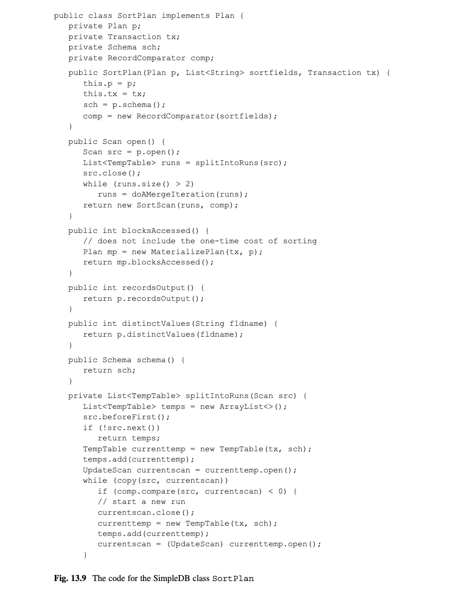

# 第13章 物化和排序(Materialization and Sorting)

本章思考关系代数操作物化(materialize),sort(排序),groupby(分组),和mergejoin(聚合).这些操作通过保存输入记录到临时表来物化它们.这种物化允许操作多次访问它们的记录而不用重新计算,这使得查询比只用管道操作(pipelined operator)更高效.

## 13.1 物化的价值(The Value of Materialization)
你目前看到的每个操作都有一个管道实现.那样的实现有以下特征:
*	根据需要每次计算记录,不保存.
*	访问之前看过的记录的唯一方式是从开始重新计算这个操作.

本章思考物化输入的操作.这些操作的扫描当打开的时候会读取它们的输入记录,并保存它们的输出记录到一个或多个临时表里.这些实现被说成是预处理它们的输入,因为它们在请求输出记录之前实现了所有的计算.这种物化的目的是优化之后的扫描的效率.

比如,思考分组(groupby)操作,将在13.5节介绍.这个操作根据指定分组字段分组输入记录,为每组计算聚合函数.确定分组最容易的办法是根据分组字段排序输入记录,这使得每组的记录都是连着的.因此,一个好的实现策略是首先物化输入,保存记录在一个临时表中,以分组字段排序.然后聚合函数的计算可以通过遍历临时表来实现.

物化是一把双刃剑.一方面,使用临时表可以大大优化扫描的效率.另一方面,创建临时表导致明显的负载消耗,因为它会写入和读取临时表.另外,创建一个临时表意味着预处理整个输入,即使客户端仅对几个输出记录感兴趣.

物化实现仅当这些消耗能被扫描增加的效率抵消时才有用.本章的4个操作都有高效的物化实现.

## 13.2 临时表(Temporary Table)
物化实现保存它们的输入记录在临时表.一个临时表和一个正常表有3个不同:
*	一个临时表不是用表管理器的createTable方法创建的,且它的元数据没有出现在系统目录中.在SimpleDB中,每个临时表管理它自己的元数据并有它自己的getLayout方法.
*	当不再需要时,临时表会自动被数据库系统删除.在SimpleDB中,文件管理器在系统初始化时会删除临时表.
*	恢复管理器不记录临时表的变更日志.没有必要恢复一个临时表的之前状态,因为临时表在查询完成后就不再会被用到了.

SimpleDB通过TempTable类实现临时表,它的代码如图13.1所示.它的构造器创建一个空表并赋值一个唯一名称(整数N的"tempN"的形式).这个类包含3个公共方法.open方法打开一个表扫描,tableName和getLayout方法返回临时表的元数据.

[图13.1]

## 13.3 物化(Materialization)
本节引入一个新的关系代数操作,被称为物化(materialize).物化操作没有可见的功能.它接收一个表作为它的唯一参数,且它的输出记录和它的输入记录一样.也就是说:
materialize(T)=T
物化操作的目的是保存一个子查询的输出在一个临时表里,以防止那些记录被多次计算.本节考察这个操作的使用和实现.

### 13.3.1 物化的一个例子
思考图13.2a的查询树.再次说明积操作对左子树的每条记录都检查右子树的每条记录.因此,左子树的记录会被访问一次,而右子树的记录会被访问很多次.

[图13.2]

反复访问右边记录的问题在于它们需要反复计算.在图13.2a,这个实现会需要多次读取ENROLL表,且每次都会查找成绩为"A"的记录.使用图7.8的统计,你可以如下计算积的消耗:2005班有900位学生.管道实现会为每位学生读取ENROLL表的50,000个块,即会有45,000,000次ENROLL的块访问.把这个加上4500学生块结果是45,004,500次块访问.

图13.2b的查询树有两个物化节点.首先思考右边选择节点上的物化节点.这个节点创建一个包含ENROLL中成绩A的记录.每次,那个积节点从右边请求一个记录,物化节点会从临时表接收记录而不是搜索ENROLL.

这种物化大大降低了积的消耗.思考以下分析.临时表会比ENROLL小14倍,或着说是3572块.右边物化节点需要53,572块访问来创建表(50,000次读取ENROLL,3572次写入表).在临时表创建后,它会被读取900次,总共产生3,214,800次访问.加上4500次STUDENT块访问,结果总共是3,272,872次块访问.换句话说,物化降低原查询树的消耗大约82%(即,以每次块访问1ms计算,结果是剩下了超过11小时的时间).创建临时表的消耗比起省下的消耗可以忽略不记.

现在思考图13.2b的左边的物化节点.那个节点会扫描STUDENT,并创建一个包含2005班所有学生的临时表.积节点然后会每次检查这个临时表.但是,原查询树的积节点也会每次检查STUDENT表.因为不管哪种情况,STUDENT记录都会被检查一次,左边物化节点实际上增加了查询的消耗.一般来说,一个物化节点仅当节点的输出会被反复计算时才会有用.

### 13.3.2 物化的消耗
图13.3 描绘了一个包含物化节点的查询树的结构.该节点的输入是由T2表示的子查询.当一个用户打开查询T1的计划,它的根计划会打开它的子计划,沿着树往下依次类推.当物化计划被打开,它会预处理它的输入.特别是,该计划会打开T2的扫描,计算它,保存输出到一个临时表里,并关闭T2的扫描.在查询T1扫描期间,物化扫描会通过访问临时表的相应记录来响应请求.注意到子查询T2会被访问一次来填充临时表;之后,它就不再需要了.

[图13.3]

和物化节点相关的消耗可以分为两部分:预处理输入的消耗,执行扫描的消耗.预处理的消耗是T2的消耗加上写入记录到临时表的消耗.扫描消耗是从临时表读取记录的消耗.假设临时表是B块,那么这些消耗可以如下表达:
*	预处理消耗 = B + 输入的消耗
*	扫描消耗 = B

### 13.3.3 实现物化操作
SimpleDB类MaterializePlan实现物化操作;它的代码如图13.4所示.open方法预处理输入--它创建一个新的临时表,为该表和输入打开扫描,赋值输入记录到表扫描,然后关闭表扫描,返回表扫描.blocksAccessed方法返回物化表的预估大小.这个大小是通过计算新记录的每块记录数(RPB)然后用输出记录数除以这个RPB得到.recordsOutput和distinctValues方法的值和基础计划一样.

[图13.4]

注意到blocksAccessed并不包含预处理消耗.原因是临时表是一次创建但是可能会被扫描多次.如果你想包括建立表的消耗在消耗公式中,你需要增加一个新的方法(比如,preprocessingCost)到Plan接口并重新修改所有的各种计划预估公式来包含它.这个任务留到练习13.9.要么,你可以默认预处理消耗是极小的,在你的预估中忽略它.

也要注意没有MaterializeScan类.相反,open方法返回一个临时表的表扫描.

## 13.4 排序
另一个有用的关系代数操作是排序(sort).排序操作接收两个参数:一个输入表和一个字段名称列表.输出表有和输入表同样的记录但是是根据字段排序的.比如,以下的查询以GradYear排序STUDENT表,同样毕业年份的学生则再以名称排序.如果两个学生有同样姓名和毕业年份,那么它们的记录可以以任意顺序出现.

sort(STUDENT, [GradYear, SName])

计划器使用排序来实现SQL查询的order by分句.排序也会在后面章节用于实现groupby和mergejoin操作.一个数据库引擎需要能够高效排序记录.本节思考这个问题和SimpleDB的解决方案.

### 13.4.1 为什么排序需要物化它的输入
不用物化也是可以实现排序的.比如,思考图13.5的查询树的排序节点.这个节点的输入是学生和他们专业的集合,输出是根据学生名称排序.假设为了简洁,没有两个学生有相同的名称,所以输入记录都是排好序的没有重复记录.

[图13.5]

在一个排序操作的非物化实现,next方法需要定位扫描到有下一个最大的SName值处.为了这样做,该方法不得不遍历输入记录两次:第一次找到第二大的记录,然后再移到有该值的记录.尽管这种实现是可行的,但是它会极其低效且对大表来说根本不可能.

在一个排序的物化实现里,open方法会预处理输入记录,按顺序把他们保存在临时表里.每次调用next会从临时表里检索下一条记录.这种实现以一些初始预处理代价换来非常高效的扫描.假设创建和排序一个临时表是相对高效的,那么物化实现会比非物化实现消耗低很多.

### 13.4.2 基础合并排序算法(The Basic Mergesort Algorithm)
在初级编程课程里教的标准排序算法(比如插入排序和快排)被称为内部排序算法,因为他们需要所有的记录同时都在内存里.但是,一个数据库引擎,不能认为一个表的数据能完全放入内存;因此它必须使用外部排序算法.最简单和最常见的外部排序算法被称为合并排序(mergesort).

合并排序是基于run的概念.一个run是一个表的一个排好序的部分.一个没有排序的表有多个run;一个排序表只有一个run.比如,假设你想通过id来排序学生,STUDENT记录的SId值目前是下面的顺序:
2 6 20 4 1 16 19 3 18

这个表有4个run.第一个run包含[2,6,20],第二个包含[4],第三个是[1,16,19],第4个是[3,18].

合并排序以两个阶段工作.第一个阶段称为分割(split),扫描输入记录,把每个run放入它自己的临时表.第二个阶段称为合并(merge),反复合并这些run直到只剩下一个run;最终的run就是排序表.

合并阶段的工作像一系列的遍历.在每次遍历过程中,当前run的集合被两两配对;每对run合并成一个run.这些合并的run又组合成新的run集合.新的集合会有之前集合的一半多的run.遍历继续直到当前集合包含一个run.

作为一个合并排序的例子,让我们排序上面的STUDENT记录.分割阶段那4个run,保存每个run到一个临时表:

Run 1: 2 6 20
Run 2: 4
Run 3: 1 16 19
Run 4: 3 18

合并阶段的第一次遍历合并run1和run2,产生run5,然后合并run 3 和run 4产生run 6:

Run 5: 2 4 6 20
Run 6: 1 3 16 18 19

第二次遍历合并run 5 和 run 6,产生 run 7:

Run7:1 2 3 4 6 16 18 19 20

现在只有一个run,所以这个算法就完成了.它只用两次合并遍历就把表排序好了.

假设一个表有2的N次方个初始run.每次合并遍历把每对run转换为一个run.也就是,它以2倍速减少run的数量.因此,排序相应的文件需要N次遍历:第一次遍历减少run数到2的N-1次方的run,第二次减到2的N-2次方,第N次减少的1个run.一般来说,一个有R个初始run的表需要log2R次合并遍历来排序表.

### 13.4.3 优化合并排序算法

有3种方式来优化基础合并算法的效率:
*	增加每次合并的run数量
*	减少初始run数
*	避免写最终排序表

本节考察这些优化.

增加每次合并的run数
与其每次合并一对,算法可以每次合并3个run,或者更多.假设算法每次合并k个run.那么它每次合并需要打开k个临时表.每次,它查找每个扫描的当前记录,复制最小的一个到输出表,并移到扫描的下一条记录.这个步骤会反复执行直到所有k个run都已经复制到输出表里.

每次合并多个run可以减少排序表需要的遍历次数.如果表开始有R个初始run,每次合并k个run,那么只需要logkR次遍历来排序文件.你怎么知道要使用什么k值呢?为什么不用一次遍历来合并所有run?答案取决于有多少缓存是可用的.为了合并k个run,你需要k+1个buffer:每个输入扫描需要一个缓存,还有一个缓存给输出扫描.目前,你可以假设算法采用的是k的任意值.章节14会考察如何采用最优的k值.

减少初始run的数量
如果你想减少初始run的数量,那么你需要增加每个run的记录数.你可以使用两种算法.

第一个算法如图13.6所示.该算法忽略由输入记录生产的run,而是总创建一个块长的run.因为块的记录可以放到内存的缓存页里,算法可以使用内存排序算法(比如快排序)来排序这些记录,而不会产生任何磁盘访问.排序块的记录到一个run后,保存该块到磁盘里.

[图13.6]

第二个算法是类似的,但是它使用内存的额外块作为输入记录的暂存区.它通过用记录填充暂存区开始.只要可能,它就会不停地从暂存去移除一个记录,把它写入到当前run,并添加另一条输入记录到暂存区.当暂存区的所有记录都比run的最后一条小,这个步骤就会停止.这种情况下,run会被关闭,然后一个新的run开始.这个算法的代码如图13.7所示.

[图13.7]

使用一个暂存区的优点是你持续添加记录到其中,这意味着你可以从一个候选池选择下一个保存在run里的记录.因此每个run会包含块大小级别的记录.

下面的例子比较这两个创建初始run的方法.再次思考用SId排序STUDENT记录的例子.假设一个块可以放3条记录,且记录是以下顺序初始的:

2 6 20 4 1 16 19 3 18
这些记录刚好构成4个run,和之前描述的一样.假设你使用图13.6的算法来减少初始化run的数量.那么你会3个一分组地来读取那些记录,单独排序每个组.因此,到头来你会又如下的3个run:
Run 1: 2 6 20
Run 2: 1 4 16
Run 3: 3 18 19
假设你使用的是图13.7的算法来减少run数.你通过读取前3条记录到缓存区.

Staging area: 2 6 20
Run 1:

接下来你选择最小值3,添加它到run中,从缓存区移除它,读取下一条记录到缓存区.

Staging area: 6 20 4
Run 1: 2

下一个最小值是4,所以你添加该值到这个run,从缓存区移除它,读取下一条输入值.

Staging area: 6 20 1
Run 1: 2 4

这里,最小值是1,但是1太小不能成为当前run的值.相反,下一个可用的值是6,所以你添加它到run,然后读下一条输入值到缓存区.

Staging area: 20 1 16
Run 1: 2 4 6

继续,你会添加16,19和20到run里.在这个点,缓存区都是不能添加到run的记录了.

因此你开始一个新的run.因为没有更多的输入记录,这个run会包含在缓存区的3条记录.

Staging area:
Run 1: 2 4 6 16 19 20
Run 2: 1 3 18

这个算法只产生了2个初始run.第一个run是两个块长.第一个run是两个块长.

不写最后的排序表
再次说明每个物化实现有两个阶段:一个预处理阶段,这个阶段输入记录会物化成一个或多个临时表,还有一个扫描阶段,这个阶段使用临时表来确定下一条输出记录.

在基础合并排序算法,预处理阶段创建一个排序临时表,和该表的扫描读.这个是一个简单的策略但是不是最优的.

与其创建一个排序临时表,假设预处理在最终的合并遍历之前停下,也就是说,当临时表的数量<=k时停下.扫描阶段会接收这些k个表作为输入,然后实现最后的合并.特别是,该阶段会给k个表的每个打开一个扫描.每次调用next会确定这些扫描的当前记录,然后选择有最小排序值的记录.

在任何时间点,扫描阶段都需要追踪k个扫描中哪个有当前记录.这个扫描被称为当前扫描(current scan).当客户端请求下一条记录,该实现会移到当前扫描的下一条记录,确定包含最低值记录的扫描,然后赋值该扫描为新的当前扫描.

为了总结,扫描阶段的工作是以排序顺序返回记录,和他们保存在一个单独的排序表里一样.然而,并不需要真正创建那个表.相反,可以使用从预处理接受的k个表.因此,需要用来写(和读)最终排序表的块访问则可以避免.

### 13.4.4 合并排序的消耗
让我们来计算排序的消耗,使用类似物化操作的分析.图13.8描绘了包含排序节点的查询树的结构.

[图13.8]

排序节点相关的消耗可以分为两部分:预处理消耗和扫描消耗.

*	预处理消耗是T2 的消耗,假设分割记录为run的消耗,加上所有合并除最后合并的消耗.
*	扫描消耗是实现临时表的最终合并的消耗.

为了更具体,假设以下条件:
*	算法一次合并k个run.
*	有R个初始run
*	物化输入记录需要B个块.

分割节点每次都需要写入这些块,所以分割需要分割需要B次块访问加上输入的消耗.记录可以用logkR次遍历来排序.那些遍历的其中之一会在扫码阶段实现,剩下都是在预处理阶段处理.在每次预处理遍历期间,每个run的记录都会读一次,和写一次;因此该遍历需要2B次块访问.在扫描阶段期间,每个run的记录都读一次,会有B次块访问.把这些值放在一起,简单给出下面的消耗公式:
预处理消耗=2BlogkR-B+输入的消耗
扫描消耗=B
举一个具体的例子,假设你想排序一个1000块的表,有1个块长度的初始run(即,B=R=1000).该表是保存着的,所以输入的消耗是1000块.如果你一次合并2个run,那么你需要10次合并遍历来完成排序记录(因为log2 1000<=10).上面的公式表明需要20000次块访问来预处理这些记录,假声最终扫描的另外1000次块访问.如果你一次合并10个run,那么你只需要3次遍历,预处理只需要6000次块访问.

继续这个例子,假设你一次合并1000个run(也就是k=1000).那么logkR=1,所以预处里消耗是B加上输入的消耗,或者说2000块访问.注意这种情况下的排序消耗和物化的消耗等同.特别是,预处理阶段不需要实现任何合并,因为分割阶段已经产生k个run.预处理的消耗因此是读取表的消耗和分割记录的消耗,也就是2B块访问.

### 13.4.5 实现合并排序
SimpleDB中的SortPlan和SortScan类实现排序操作.

SortPlan类
SortPlan类的代码如图13.9所示.

[图13.9]

open方法实现合并排序算法.它一次合并两个run(即,k=2),并不试图减少初始run的数量.(相反,练习13.10和13.13要求你来做这些优化).

私有方法splitIntoRuns实现合并排序算法的分割阶段,doAMergeIteration实现合并阶段的一次遍历;这个方法会被反复调用直到它返回不多于两个run.到那个时候,open把run的列表传给SortScan的构造器,它会处理最终的合并遍历.

splitIntoRuns从创建一个临时表并打开它的一个扫描开始("目的地扫描").然后该方法遍历输入扫描.每个输入记录被插入到目的地扫描.每次一个新的run开始,目的地扫描被关闭,然后另一个临时表被创建打开.这个方法的最后,多一个临时表会被创建,每个包含一个run.

doAMergeIterationis 方法接受目前临时表的列表.它反复给列表里的每对临时表调用mergeTwoRuns方法,然后返回包含生成的临时表的列表.

mergeTwoRuns为它的两个表都打开一个扫描,并创建一个临时表接收结果.该方法反复从输入扫描选择最小值记录,复制该记录到到结果里.当一个扫描完成时,然后其他扫描的剩下记录会被添加到结果里.

消耗预估方法是直接的.recordsOutputhehe和distinctValues和输入表返回一样的值,因为排序表包含同样的记录和值分布.blocksAccessed方法预估需要用来遍历排序扫描的块访问次数,它和排序表的块树相等.因为排序和物化表是相同大小,这个计算和MaterializePlan计算的一样.因此,该方法创建一个"假的"物化记录,只为了调用它的blocksAccessed方法.预处理消耗不包含在blocksAccessed方法中,原因和用MaterializePlan的一样.

比较记录的工作是由RecordComparator类实现,它的代码如图13.10所示.该类比较两个扫描的当前记录.它的compare方法遍历排序字段,使用compareTo来比较每个扫描的当前记录的值.如果所以值都相等,则返回0.

[图13.10]

SortScan类
SortScan类实现扫描;它的代码如图13.11所示.构造器期望一个包含一个或多个run的列表.它通过打开表并移到第一条记录来初始化run.(如果只有一个run,那么hasmore2变量会设置成false,第二个run不会再被考虑).

[图13.11]

currentScan变量指向包含合并中最近的记录的扫描.get方法从扫描中获取它们的值.next方法移到当前扫描的下一条记录,然后从两个扫描中选择最小的值.变量currentscan然后指向该扫描.

该类也有两个公共方法savePosition和restorePosition.这些方法允许客户端往回移到一个之前看过的记录,并从那继续扫描.

## 13.5 分组和聚合(Grouping and Aggretion)
分组(groupby)关系代数操作接受3个参数:一个输入表,一个分组字段的集合,一个聚合表达式的集合.它组织它的输入记录到多个分组,分组字段的值一样的记录会分到同一个组.它的输出表里每个组一行;这个行有一个列给每个分组字段,有一个列给聚合表达式.

比如,以下查询对每个学生专业返回,有毕业学生的最小毕业年份和最大毕业年份.给出图1.1的STUDENT表,图13.12展示了这个查询的输出.

[图13.12]

groupby (STUDENT, {MajorID}, {Min(GradYear), Max(GradYear)})

一般来说,一个聚合表达式规定了一个聚合函数和一个字段.在上面的查询中,聚合函数Min(GradYear)返回在分组记录中最小的GradYear的值.在SQL中可用的聚合函数包含Min,Max,Count,Sum,和Avg.

实现分组操作的关键问题是任何创建记录的分组.最找的方案是创建一个临时表,其中的记录是一个分组字段排序的.每个分组中的记录都是连着的,所以相应的实现可以遍历排序表来计算分组的相关信息.图13.13给出了这个算法.

[图13.13]

聚合函数的消耗可以分为预处理消耗和扫描消耗.这些消耗是直接的.预处理消耗是排序的消耗,扫描消耗是遍历排序记录的消耗.换句话说,分组操作和排序有同样的消耗.

SimpleDB使用GroupByPlan和GroupByScan类拉实现分组算法;请看图13.14和13.15.

[图13.14]

[图13.15]

GroupByPlan中的open方法为数据记录创建和打开一个排序计划.结果排序扫描时传给GroupByScan的构造器.分组扫描根据需要读取排序扫描的记录.特别是,next方法每次读取下一个分组的记录,当它被调用的时候.当读取到另一个分组的记录时,这个方法意识到读到一个分组的末尾了(或者当他检测到在排序扫描中没有记录时);因此,每次next被调用,基础扫描的当前记录总会是下一个组的第一条记录.

GroupValue类保存当前组的信息;它的代码如图13.16所示.一个扫描和分组字段被传到它的构造器.当前记录的字段值定义分组.getVal方法返回指定字段的值.equals方法返回true,当两个GroupValue对象有相同的分组字段值,hashCode方法赋值一个哈希值给每个GroupValue对象.

[图13.16]

SimpleDB实现每个聚合函数(比如,MIN,COUNT,等等)为一个类.这些类的对象负责追踪在一个分组中的相关信息,为了计算分组的聚合值,和确定计算字段的名称.这些方法属于AggregationFn接口,它的代码如图13.17所示.processFirst使用当前记录作为分组的第一条记录来开始一个新的分组.processNext方法添加另一条记录到已存在的分组.

[图13.17]

一个聚合函数类的例子是MaxFn,其实现MAX;请看图13.18.客户端传递聚合字段的名称到相应的构造器.对象使用这个字段名称来确认分组中的每条记录的字段值,并保存最大的一个在它的val变量.

[图13.18]

## 13.6 合并连接(Merge join)
章节12谓语是"A=B"形式的两个表连接,开发了一个高效的索引连接(indexjoin)操作.这些字段被称为连接字段(join fields).当右边表时排序的,在连接字段上有索引时索引连接操作是可以应用的.本节考察一个高效的连接操作,被称为合并连接(mergejoin),它总是可应用的.它的算法如图13.19所示.

[图13.19]

思考这个算法的步骤2.如果你假设连接的左边表没有重复值在连接字段上,那么这个算法和积扫描类似.也就是说,它扫描左边表一次.对左边的每条记录,它搜索右边表查找匹配记录.但是,记录排好序的事实相当程度上简化了搜索.特别是,注意到:
*	匹配的右边记录必须在之前的左边记录之后开始.
*	匹配的记录在表里都是挨着的.

因此,每次一个新的左边记录被考虑时,可以直接从上次的地方扫描右边表,当到达一个比左边连接值更大的连接值时就可以停下了.也就是,右边表只需要扫描一次.

### 13.6.1 一个合并连接的例子(An Example of Mergejoin)
以下查询使用合并连接来连接DEPT和STUDENT表.

mergejoin(DEPT, STUDENT, DId=MajorId)

合并连接算法的第一个步骤创建临时表来保存DEPT和STUDENT的内容,分别以DId和MajorId字段排序.图13.20展示了这些排序表,从图1.1使用同样的记录,但是用一个新的系扩展了(Basketry系,Did=18).

[图13.20]

该算法的第二个步骤扫描排序表.当前的DEPT记录是系10.它扫描STUDENT,在前3条记录查找一个匹配记录.当它移到第4条记录(Amy的),它发现一个不同的MojorId值,然后它就知道系10的扫描已经完成.它移到下一条DEPT记录(对Basketry系),并比较记录的DId值和当前STUDENT记录(Amy的)的MajorId值.因为Amy的MajorId值更大,该算法直到没有改系的匹配,因此移到下一条DEPT记录(Math系).这条记录匹配Amy的记录,也匹配接下来的3条STUDENT记录.随着算法在STUDENT中移动,它最终到Bob的记录,它和当前系不匹配.所以它移到下一条DEPT记录(Drama系),并继续在STUDENT中搜索,其中Bob的记录和Art系匹配.当其中一个表已经扫描完记录是,连接就可以结束了.

如果左边的合并连接有重复的连接值会发生什么?再次说明当没有右边记录匹配,该算法移动下一条左边的记录.如果下一条左边记录有同样的连接值,那么该算符需要移回第一条匹配的右边记录处.也就是说,所有有匹配记录的右边块都会再被读,潜在地增加了连接的消耗.

幸好,重复的左边值是很少的.大多数的连接往往基于一个外键关系.比如,上面的连接,DId是DEPT的键,MajorId是它的外键.因为键和外键是在表创建时声明的,查询计划器可以使用这个信息来确保有相应键的表是在合并连接的左边.

要计算合并连接算法的消耗,注意预处理阶段排序每个输入表,扫描阶段遍历排序表.如果没有重复的左边值,那么每个排序表会扫描一次,连接的消耗会是两个排序操作的和.如果有重复的左边值,那么右边扫描的相应记录会被多次读取.

比如,你可以使用图7.8的统计来计算STUDENT和DEPT的合并连接消耗.假设该算法合并每对run,每个初始run是1个块长.预处理消耗包含排序4500块STUDENT表(有9000 x log2(4500) - 4500 = 112,500块访问,假设输如消耗4500),和排序2块DEPT表(有4 x log2(2) - 2 = 2块访问,假声输入的消耗2).总的预处理消耗因此是117,004块访问.扫描消耗是排序表的大小和,即4502块访问.连接的总消耗因此是121,506块访问.

和章节8的以积跟着选择的方式实现的连接对比消耗.那个消耗公式是B1+R1*R2,其会带来184,500块访问.

### 13.6.2 实现合并连接
SimpleDB类 MergeJoinPlan和MergeJoinScan类实习合并连接算法

MergeJoinPlan类
MergeJoinPlan的代码如图13.21所示.open方法为两个输入表的每个打开一个排序扫描,使用指定的连接字段.然后它把这些扫描传给MergeJoinScan的构造器.

[图13.21]

blocksAccessed方法假设每个扫描会被遍历一次.它的想法是即使有重复的左边值,匹配的右边记录要么在新的块里要么在一个最近访问的块里.因此,需要非常少(或可能是0)的额外的块访问.

recordsOutput方法计算连接的记录数.这个值会是积中的记录数,除以根据谓语过滤的记录数.distinctValues方法是直接的.一位内连接不增加或减少字段值,预估和相应的基础查询一样.

MergeJoinScan类
MergeJoinScan类如图13.22所示.next方法实现查找匹配的比较难的工作.扫描使用遍历joinval来追踪最近的连接值.当next调用时,它读取下一条右边记录.如果该记录有一个和joinval相等的值,一个匹配则被发现,该方法返回.如果没有,那么该方法移到下一条左边记录.如果这条记录的连接值和joinval相同,那么我们则有一个重复的左边值.该方法重新定位右边扫描到有该连接值的第一条记录然后返回.否则,该方法反复从扫描中读取有最小连接值的记录,直到要么一个匹配被发现,要么一个扫描结束了.如果一个匹配被发现,遍历joinval变量则被设置,当前右边定位被保存.如果一个扫描结束,该方法返回false.

[图13.22]

## 13.7 章节总结
*	一个操作的物化实现预处理它的基础记录,保存它们在一个或多个临时表.它的扫描方法因此会是更高效的,因为它们只需要检查临时表.

*	物化实现计算它们的输入一次,然后利用排序.但是它们必须计算这个输入表即使用户只对其中的几条记录感兴趣.尽管对任何关系代数写物化实现,一个物化实现仅当它的预处理消耗能被节省的结果扫描消耗所抵消时才有用.

*	物化操作创建一个包含所有输入记录的临时表.每当它的输入是反复执行时物化是有用的,比如物化一个积己节点的右边.
*	一个数据库系统使用一个外部排序算法来排序它的记录到一个临时表.最简单和最通用的外部排序算法被称为合并排序(mergesort).合并排序算法分割输入记录为多个run,然后反复合并run直到所有记录都被排序.

*	当初始run梳理越少合并排序则越高效.一个直接的办法是创建一个块长度的初始run,通过读取输入记录到一个块,然后使用内部排序算法来排序它们.另一个方式是读取输入记录到一个块长度的缓存区域,通过不断选择最小值记录到该区域来构造run.

*	当一次合并更多的run,合并排序也更高效.合并越多run,则需要更少的遍历.一个缓存需要用来管理每个合并run,所以run的最大数量有可用缓存的数量限制.

*	合并排序需要2Blogk(R)-B块访问(加上输入的消耗)来预处理它的输入,其中b是需要用来保存排序表的块数,R是初始run的数量,k是一次合并的run数量.

*	分组操作实现基于分组字段排序记录,所以每组的记录都是挨着的.然后它通过遍历排序记录来计算每组的信息.

*	合并连接算法实现两个表的连接.它通过基于连接字段排序每个表开始.然后它并行扫描两个排序表.每次调用next方法增加有最小值的扫描.

