# 第14章 高效缓存利用

不同的操作实现需要不同的缓存.比如,选择操作的管道实现非常高效地使用一个缓存,不需要额外的缓存.另一方面,排序操作的物化实现一次合并多个run,每个run需要一个缓存.

本章思考操作实现可以用各种方式运用额外缓存的,让排序,积和连接操作更高效的多缓存算法.

## 14.1 查询计划的缓存使用

目前讨论的关系代数实现对于缓存使用都非常摸棱两可.比如,每个表扫描一次钉住一个块;当它完成一个块里的记录,它在钉住下一个块之前解钉该块.选择,投影和积扫描不钉住任何额外的块.因此,给出一个N表查询,有SimpleDB的基础查询计划器产生的扫描同时使用N个钉住的缓存.

思考章节12的索引实现.一个静态哈希索引实现每个桶为一个文件,顺序扫描桶文件,一次钉住一个块.一个B树索引从根节点开始,一次钉住一个目录块来工作.它扫描块来确定相应的子节点,解钉块,然后钉住子块,持续这样的操作直到叶子块被发现.

现在思考第13章的物化实现.物化操作实现需要一个缓存给临时表,还有给输入查询的缓存.排序实现的分割阶段需要一个或两个缓存(取决于它是否适用一个缓存区域),合并阶段需要k+1个缓存:k个run每个需要一个缓存,结果表需要一个缓存.分组和合并连接实现需要不超过排序使用的缓存数.

这个分析显示了,处理排序,一个查询计划同时需要的缓存数大概等于查询中提到的表数;这个数量通常小于10,且几乎肯定小于100.可用的缓存数一般来说会更多.现在服务器通常有至少16GB的物理内存.如果其中的仅400MB用于缓存,那么服务器也有100,000个4KB的缓存.尽管数据库系统支持几百(或上千)个并发连接,仍然有许多可用缓存可以用于执行查询,如果仅查询计划可以高效使用它们.本章思考排序,连接和积操作可以如何利用丰富的缓存.

## 14.2 多缓存排序(Multibuffer Sorting)
再次说明合并排序算法有两个阶段:第一个阶段分割记录为多个run,第二个阶段合并run直到表排好序.第13章讨论了在合并期间使用多缓存的好处.结果显示分割节点也可以利用额外的缓存.

假设k个缓存是可用的.分割阶段可以一次读取表的k块到k个缓存,使用一个内部排序算法来排序它们到一个k块大小run,然后写入那些块到一个临时表.也就是说,不分割记录为1块长度的run,而是分割记录为k块长度的run.如果k足够大(特别是,如果k>=根号B),那么分割阶段会产生不超过k个初始块,这意味着预处理阶段不需要做任何事.多缓存合并排序引入了这些思想;请看图14.1.

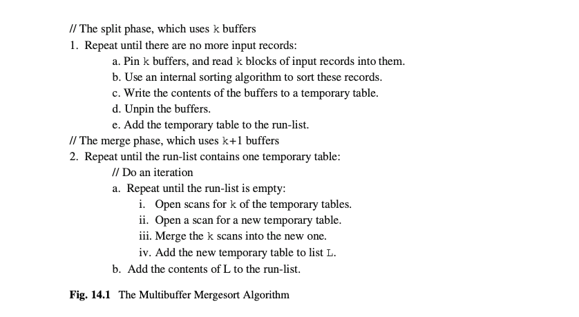
<div align="center">[图14.1]</div>

这个算法的第1步产生了B/k个初始run.使用13.4.4节的消耗分析,可以推导出多缓存合并排序需要logk(B/k)个合并遍历.这比基础合并(其中初始run的大小为1块)排序少一次合并遍历.换句话说,多缓存合并排序在预处理阶段节省了2B块访问,这意味着多缓存排序一个B块表,使用k个缓存,有以下消耗:
*	预处理消耗=2BlogkB - 3B + 输入的消耗
*	扫描消耗 = B

如何选择最佳的k值?k值决定了合并遍历的次数.预处理中做的遍历次数等于(logkB)-2.可以推导出:
*	当k=根号B,会有0次遍历
*	当k=3次方根B,会有1次遍历
*	当k=4次方根B,会有2次遍历

以次类推.

这个计算应该可以给你一些感觉.如果k=根号B,那么分割节点会产生k个大小为k的run.这些run可以在扫描阶段合并,这意味着在预处理期间不需要合并遍历.如果k=3次方根B,那么分割阶段会产生k的平方个k大小的run.一次合并遍历会产生k个run(大小k平方的),然后这些run可以在扫描阶段合并.

举一个具体的例子,假设你需要4GB的表.如果块是4KB,那么该表包含大约一百万的块.图14.2列出了根据预处理期间的指定遍历数需要的缓存数量列表.

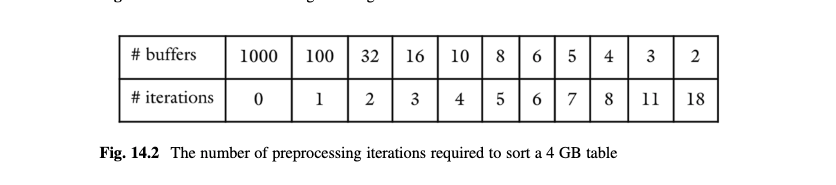
<div align="center">[图14.2]</div>

在这张图的末端,注意到只多添加几个缓存就可以产生巨大的优化:2个缓存需要18次遍历,但是10个缓存则降到仅4次遍历.这种消耗的巨大区别表明,数据库系统使用少于10个缓存来排序表将是一个糟糕的想法.

这张图的上半部分展示了排序可以如何高效.有1000个缓存或至少100个缓存可用,这完全是可能的.这张图显示,使用1000个缓存,在预处理阶段实现1000次合并,在扫描阶段做1000次合并,这是可能的.总的消耗是300万次块访问:100万用于读取未排序块,100万用于写入临时表,100万用于读取临时表.这个效率是无法预料的且显著的.

这个例子也展示了,给一个B大小的表,多缓存合并排序可以高效使用确定数量的缓存,即,根号B,3次方根B,4次方根B等等.图14.2列出了B=1,000,000的那些值.其他缓存值怎么样?如果你有,比如,500个可用缓存会发生什么?你知道100个缓存带来1次预处理合并遍历.让我们看看是否另外的400个缓存是否可以好好利用.用500个缓存,分割阶段可以产生2000个500块大小的run.第一个合并阶段一次会合并500个run,产生4个run(每个250,000块).这些run然后可以在扫描阶段合并.所以实际上400个缓存并没有帮助什么,因为你仍然需要和100个缓存同样数量的遍历.

这个分析可以表达成以下的规则:如果你用k个缓存来排序一个B块长的表,那么k应该是B的一个根.

## 14.3 多缓存积(Multibuffer Product)
积操作的基本实现涉及多个块访问.比如,思考下面查询的SimpleDB实现:

product(T1,T2)

simpledb的实现会使用一个缓存来保存T2的记录,对T1的每条记录检查所有T2.也就是说,在检查一个T2的块的最后一条记录,它解钉该块,然后钉住T2的下一个块.这个解钉允许缓存管理器来替换每个T2块,这意味着当T1的下一条记录被计算的时候,它们都需要从磁盘重新读取.最糟糕的情况下,T2的每个块会读取和T1的块数一样的次数.如果我们假设T1和T2都是1000块大小的表,每块包含20条记录,那么该查询需要20,001,000块访问.

假设该实现不解钉T2的任何块.缓存管理器会将T2的每个块放入专属的缓存里.因此T2的块只需要读取一次,在整个查询期间都呆在内存里.这种扫描会是极其高效的,因为它会读取T1的每块一次,T2的每块一次.

当然这个策略仅在有足够内存来保存T2的所有块的情况下才成立.如果T2过大,你应该做什么?比如,假设T2有1000块,但是仅500个缓存是可用的.最好是以两个阶段处理T2.首先,读取500个缓存到可用缓存中,然后用那些块来计算T1的积;然后读取T2的剩下500块到那些缓存中,然后计算和T1的积.

这种策略是非常高效的.第一个阶段需要读取T1一次,T2的前半部分一次,第二个阶段需要再次读取T1一次,T2的后半部分一次.总的来说,T1读了两次,T2读了一次,总共仅3000次块访问.

多缓存积算法归纳了这些想法;请看图14.3.用这个算法,对每个取块,T1的块都会被读取一次.因为有B2/k个区块,积操作会需要B2 + (B1*B2/k)块访问.

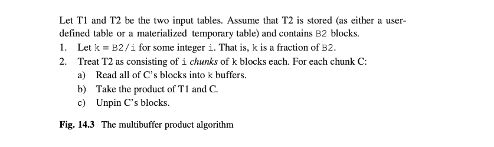
<div align="center">[图14.3]</div>

注意多缓存积实现对待T1和T2是和章节8的基础积实现是相反的.在那个章节,T2被扫描了多次,然而这里,T1被扫描了多次.

再次假设T1和T2都是1000块大小的表.图14.4列出了对各种数量的缓存,多缓存积算法需要的块访问.如果1000个缓存是可用的,那么T2可以以一个区块处理,仅产生2000次块访问.另一方面,如果250个缓存是可用的,那么多缓存积算法会使用4个250块大小的区块;因此,表T1会扫描4次,T2会扫描1次,总共5000次块访问.如果仅100个缓存是可用的,那么该算法会使用10个区块,因此总共11,000次块访问.所有这些值都比基础积实现需要的少.

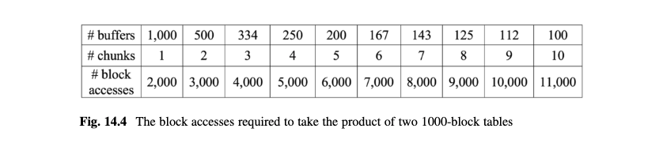
<div align="center">[图14.4]</div>

和排序一样,图14.4也显示不是所有的k值都是有用的.在这个例子中,如果300个缓存是可用的,那么多缓存积算法也只使用250个.

## 14.4 确定缓存分配
每个多缓存算法选择k个缓存,但是不指定准确的k值.合适的k值由可用缓存数,输入表大小,和涉及的操作符决定.对于排序,k是输入表大小的根;对于积,k是一个表大小的因子.

最终是要选择一个k为小于可用缓存数的最大的根(或因子).SimpleDB的BufferNeeds类包含计算这些值的方法;它的代码如图14.5所示.

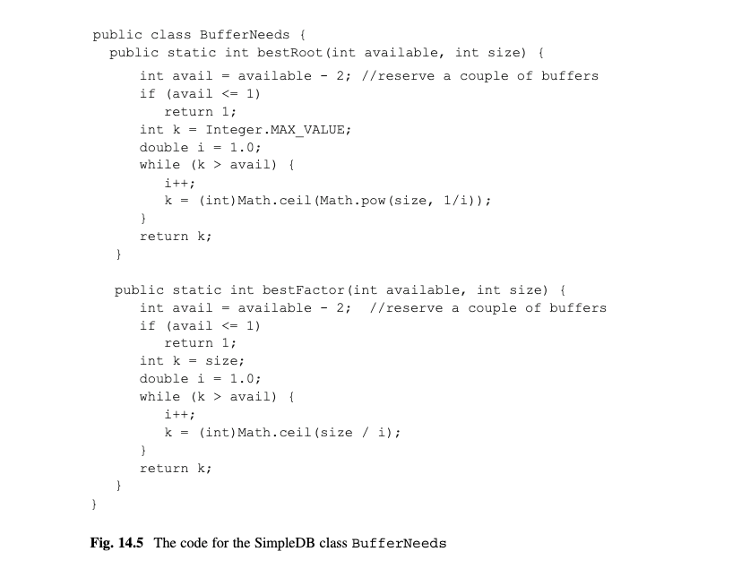
<div align="center">[图14.5]</div>

该类包含公共静态方法bestRoot和bestFactor.这两个方法几乎是等同的.每个方法的输入都是可用缓存数和表大小.这些方法计算最优的缓存数,要么是小于avail的最大的根或最大的因子.bestRoot方法初始k值为MAX_VALUE,以强制循环执行至少一次(所以k不能超过B的平方根).

注意BufferNeeds中的方法并不真正从缓存管理器保留缓存.相反,它们只是简单地问缓存管理器有多少缓存可用,然后选择小于该值的一个k值.当多缓存算法尝试钉住那些k块,某些缓存可能不再可用了.在那种情况下,相应的算法会等待直到缓存变得再次可用.

## 14.5 实现多缓存排序
在SimpleDB的SortPlan类,splitIntoRuns方法和doAMergeIteration方法确定使用多少个缓存.因此,splitIntoRuns递增创建它的run,给每个临时表附带一个缓存,doAMergeIteration使用3个缓存(2个缓存给输入run,一个缓存给输出run).本节思考这些方法需要如何修改以实现多缓存排序.

思考splitIntoRuns.这个方法并不真正知道排序表会是多大,因为相应的表还没有被创建.但是,该方法可以使用blocksAccessed方法来做这个预估.特别是,splitIntoRuns可以执行下面的代码块:
``` java
int size = blocksAccessed();
int available = tx.availableBuffs();
int numbuffs = BufferNeeds.bestRoot(available, size);
```
然后它可以钉住numbuffs个缓存,使用输入记录填充它们,内部排序它们,然后把它们写入一个临时表,入图14.1所示.

现在思考doAMergeIteration方法.最好的策略是让该方法从run列表里移除k个临时表,其中k是初始run数量的一个根:
```java
int available = tx.availableBuffs();
int numbuffs = BufferNeeds.bestRoot(available, runs.size());
List<TempTable> runsToMerge = new ArrayList<>();
for (int i=0; i<numbuffs; i++)runsToMerge.add(runs.remove(0))
```
这个方法然后可以把runsToMerge列表传给mergeTwoRuns方法来合并为一个run.

SimpleDB的分发包里并不包含实现多缓存排序版本的SortPlan.那个任务留在练习14.15-14.17.

最后,注意使用SortPlan的代码,比如GroupByPlan和MergeJoinPlan,不能区分它是使用普通的排序算法还是多缓存算法.因此,那些类不需要修改.(但是,有一些跟MergeJoinPlan使用的缓存数相关的小问题;请看练习14.5).

## 14.6实现多缓存积
为了实现多缓存积算法,你需要实现区块的概念.再次说明一个区块是物化表的k块大小部分,区块里的所有块都能够放入可用缓存里.ChunkScan类实现一个区块为记录的扫描;请看图14.6.

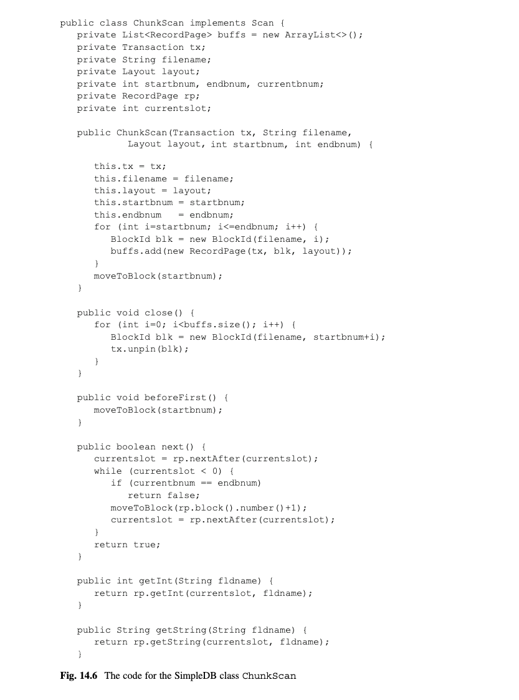
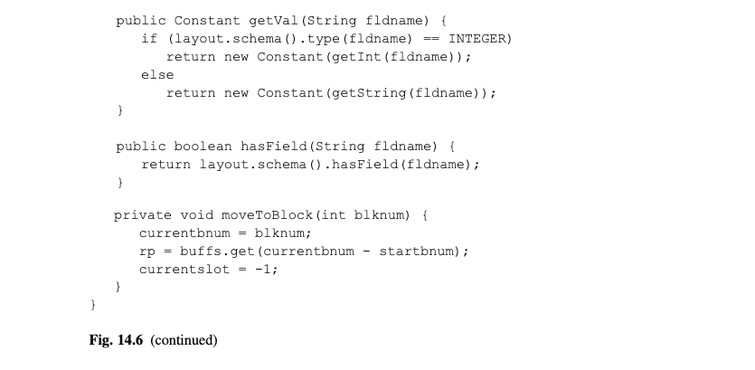
<div align="center">[图14.6]</div>

ChunkScan的构造器被给予了存储表的元数据和第一个区块的块数和最后一个区块的块数.该构造器为区块里的每个块打开记录也,并把它们保存在一个列表里.扫描也追踪当前记录页;开始的时候,当前页是列表里的第一个页.next方法移到当前页的下一条记录.如果当前页没有更多的记录,那么列表里的下一个页变成当前页.不像扫描,在一个区块扫描的块之间移动并不关闭前一个记录页(这会解钉它的缓存).相反,区块的记录页只在区块被关闭的时候解钉.

MultibufferProductPlan类实现多缓存积算法;它的代码如图14.7所示.open方法物化左边和右边的记录--左边作为一个MaterializeScan,右边作为一个临时表.blocksAccessed方法需要知道右边物化表的大小,以便它可以计算区块的数量.因为这个表直到表被打开前是不存在的,该方法通过使用由MaterializePlan提供的预估来预估大小.recordsOutput和distinctValues方法的代码和ProductPlan里一样,是简单的.

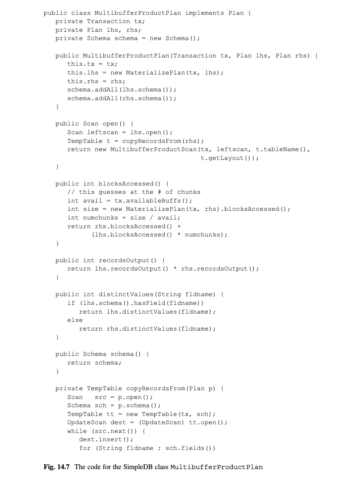
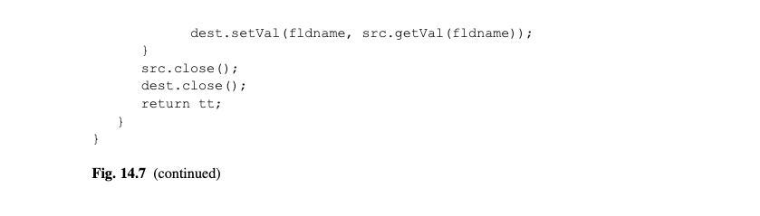

<div align="center">[图14.7]</div>

MultibufferProductScan的代码如图14.8所示.它的构造器通过调用BufferNeeds.bestFactor在右边文件的大小上来确定区块大小.然后它定位左边扫描到第一条记录,为右边的第一个区块打开一个ChunkScan,然后从这两个扫描创建一个ProductScan.也就是说,变量prodscan包含左边扫描和当前扫描之间的一个基础积扫描.大多数扫描方法使用这个积扫描.除了next方法.

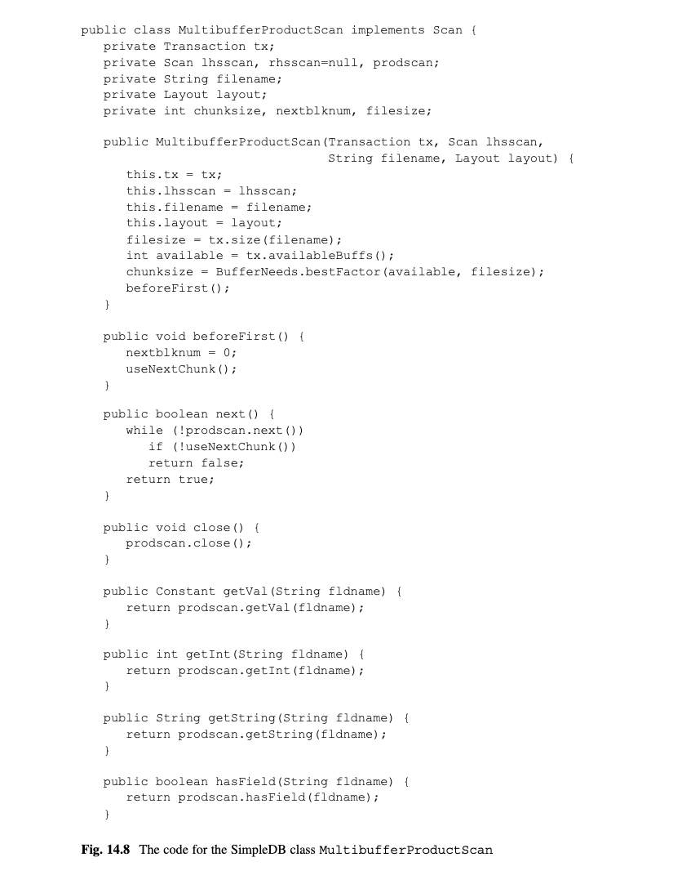
<div align="center">[图14.8]</div>

next方法移到当前积扫描的下一条记录.如果该扫描没有记录,那么该方法关闭那个扫描,为下一个区块创建一个新的积扫描,并移到它的第一条记录.当没有区块处理时,该方法返回false.

## 14.7 哈希连接(Hash Joins)
13.6节考察了合并连接算法.因为那个算法对它的输入表都排序,它的消耗由更大的输入表大小确定.本节思考一个不同的连接算法,被称为哈希连接(hashjoin).这个算法有一个属性,即它的消耗是由更小输入表的大小确定的.因此当输入表的大小差异很大时,这个算法比合并连接更好.

### 14.7.1 哈希连接算法(The Hashjoin Algorithm)
多缓存积算法背后的思想可以扩展到计算连接两个表.这个算法被称为哈希连接(hashjoin),如图14.9所示.

哈希连接算法是递归的,基于T2的大小.如果T2小到足以放入可用缓存,那么该算法使用多缓存积来连接T1和T2.如果T2大的不能放入内存,那么该算法使用哈希来降低T2的大小.它创建两个临时表的集合:一个{V0,...Vk-1}集合给T1,一个{W0,...,Wk-1}集合给T2.这些临时表类似哈希函数的桶.每个T1记录基于它的连接字段哈希,然后放入哈希值相关的桶里.每个T2记录也是类似地被哈希.相对应的表(Vi,Wi)然后被递归地连接.

所有有同样连接值的记录都会哈希到相同的桶,这应该是非常明显的.因此,对每个i,你可以通过单独连接Vi和Wi来实现T1和T2的连接.因为每个Wi比T2更小,递归最终会停下来.

注意每次递归调用哈希连接算法一定要使用一个不同的哈希函数.原因是在一个临时表的所有记录都在那是因为它们都哈希到了同样的值.一个不同的哈希函数确保那些记录会被均匀地哈希到新的临时表之间.

图14.9额代码也表明每次递归调用都会重新选择k值.相反,你可以一次性选择k值,并在所有调用中使用它.练习14.11要求你来思考这两种选择涉及到的折衷.

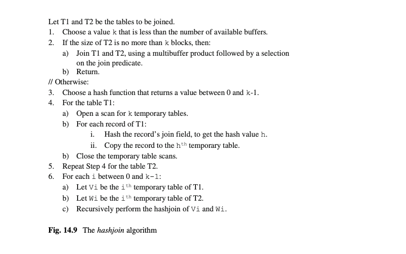
<div align="center">[图14.9]</div>

你可以更仔细地在如何在块里搜索匹配块来优化多缓存积的效率.给出T1的一条记录,该算法需要从T2查找匹配的记录.多缓存积采用的策略是简单地搜索所有的T2.尽管,这种搜索不产生任何额外的磁盘访问,它可以通过合适的内部数据结构的方式来优化效率.比如,你可以保存T2记录的引用在一个哈希表里,或二分查找树里.(实际上,任何Java Map接口的实现都应该有效).给出一个T2的记录,该算法会在相应的数据结构里查询它的连接值,然后找到相应的T2的记录的引用,因此可以避免搜索T2.

### 14.7.2 哈希连接的一个例子
举一个具体的例子,让我们使用一个哈希连接来实现ENROLL和STUDENT表的连接,使用图1.1.的记录.做出以下假设:
*	STUDENT表在连接的右边.
*	两条STUDENT记录填满一个块,两条ENROLL记录填满一个块.
*	3个桶被使用;即,k=3.
*	哈希函数是h(n)=n%3.

9条STUDENT记录填充5个块.因为k=3,相应的STUDENT记录不能一次性放入内存,所以你需要哈希.产生的桶如图14.10所示.

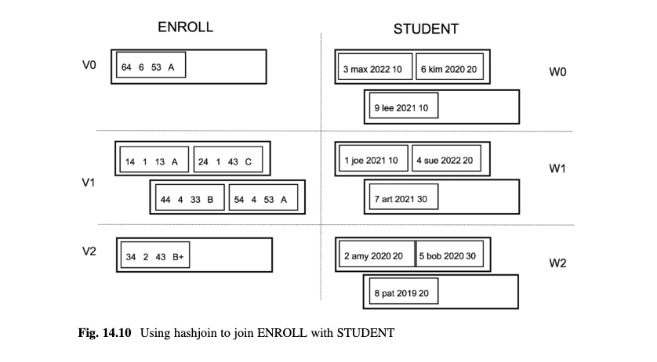
<div align="center">[图14.10]</div>

学生ID值为3,6,和9的哈希值是0.因此,那些学生的ENROLL记录被放在V0,那些学生的STUDENT记录被放在W0.类似地,学生1,4和7放在V1,W1,学生2,5和8的记录放在V2和W2.你现在可以递归地连接每个Vi表和它的相应的Wi表.

因为每个Wi表有两个块,每个都能完整放入内存;因此,3次递归连接都能实现为一个多缓存积.通过读取Wi的全部到内存中来连接Vi和Wi.然后扫描Vi;对于每条记录,扫描Wi查找任何匹配记录.

### 14.7.3 消耗分析
为了分析使用哈希连接来连接T1和T2的消耗,假设T1中的物化记录需要B1块,T2需要B2块.选择k为B2的n次方根;也就是,B2 = k的n次方.然后假设记录都是均匀哈希的,你可以如下计算消耗:

第一轮的哈希会产生k个临时表;每个T2表会k的n-1次方块.当你递归哈希这些临时表,你会有k的2次方个临时表,每个有k的n-2次方块.继续哈希,T2最终会有k的n-1次方临时表,每个都有k块.然后这些表可以用多缓存积连接.

结果,会有n-1轮哈希.第一轮消耗B1+B2,加上读取输入的消耗.之后的每轮,每个临时表的每块都会读取一次,写入一次;因此那些轮的消耗会是2(B1+B2).多缓存积在扫描阶段发生.临时表 的每块会读取一次,消耗B1+B2.

组合这些值显示使用k个缓存连哈希连接B1大小和B2大小的表有以下消耗:
*	预处理消耗 = (2B1logkB2-3B1) + (2B2logkB2-3B2) + 输入的消耗
*	扫描消耗=B1 + B2
够惊人的吧,这个消耗和以多缓存合并连接的消耗计划相同!有一个区别:在这个公式中,两个算法的对数都是B2;但是对于合并连接的公式,第一个对手会是B1.这个区别的原因在于,在哈希连接中,哈希轮数是仅由T2确定,然而在合并连接,排序期间的合并遍历数是由T1和T2共同决定.

这个区别解释了两种连接算法的不同实现.合并连接算法必须在合并它们之前排序两个输入表.另一方面,哈希连接算法不关心T1是多大;它只需要哈希直到T2的桶是足够小.一个合并连接的消耗不受哪个表在左边还是右边所影响.但是,一个哈希连接会更高效,当更小的表在右边.

如果T1和T2的大小接近,那么使用合并连接会更好,尽管哈希连接由同样的消耗公式.原因是哈希连接公式依赖于那些记录会哈希的非常均匀.但是如果哈希的不是那么均匀,这个算法可能比公式说的需要更多的缓存和遍历.另一方面,合并连接有一个更可预测的行为.

## 14.8 比较连接算法(Comparing the Join Algorithm)
本章考察了两种实现两个表的连接的方式,合并连接和哈希连接,且章节12考察了索引连接.这节使用下面的查询来调查这3个实现各自相关的好处.

select SName, Grade from STUDENT, ENROLL where SId=StudentId

假设表有图7.8给出的大小,有200个缓存可用,ENROLL有一个StudentId字段的索引.

思考合并连接算法.这个算法需要在合并它们之前排序ENROLL和STUDENT.ENROLL表有50,000块.50,000的平方根是244,它比可用缓存数大.因此你必须分配3次方根,即37个缓存.这个分割阶段会创建1352个run,每个是37块.一次合并遍历会产生37个大小为1353块的run.因此预处理ENROLL表需要两次读和两次写,或者说200,000次块访问.STUDENT表有4500块.4500的平方根是68,68个缓存是可用的.所以你可以使用68个缓存来分割4500个STUDENT块为68个大小为68的run.这个分割消耗9000次块访问,且是预处理需要的所有.合并两个排序表需要另外54,500块访问,总共263,500次块访问消耗.

现在思考哈希连接算法.当最小的表在右边时,这个算法是最高效的;因此ENROLL会是左边表,STUDENT会是右边表.你可以用68个缓存来哈希STUDENT为68个桶,每个桶包含大约68个块.类似地,你可以用同样68个缓存来哈希ENROLL到68个桶,每个包含大约736块.然后递归连接相对应的桶.每个子连接可以使用多缓存积来实现.也就是说,分配68个缓存来保存整个STUDENT桶,然后分配另外一个缓存给顺序扫描ENROLL的桶.每个桶会被扫描一次.统计这些消耗,ENROLL和STUDENT的记录被读取一次,那些桶被写一次和读一次,总共163,500次块访问.

索引连接实现扫描STUDENT表;对于每个STUDENT表,它使用记录的SId值来搜索索引,然后查找匹配的ENROLL记录.因此,STUDENT表会被访问一次(产生4500块访问),且对每个匹配记录,ENROLL表会被访问一次.但是,因为每个ENROLL记录匹配某些STUDENT记录,ENROLL表会潜在地需要1,500,000次块访问.因此,查询需要1,504,500块访问.

这个分析显示基于这些假设,哈希连接是最快的,然后是合并连接,然后是索引连接.哈希索引高效的理由是其中一个表的大小比起可用缓存数小,其他表则更大.假设有1000个缓存可用.那么合并连接可以不用任何合并遍历就可以排序ENROLL,总的消耗会是163,500块访问,和哈希连接一样.索引连接算法目前对于这个查询来说是最低效的.理由是当有许多匹配数据记录时,索引不是非常有用,且在这个查询中,每个ENROLL记录都有匹配.

现在思考这个索引的一个有在GradYear字段上的筛选的变种.

select SName, Grade from STUDENT, ENROLL where SId=StudentId and GradYear=2020

首先思考合并连接实习.仅有900个相关的STUDENT记录,它们填充90块.因此可以把它们读到90个缓存来排序STUDENT记录,然后使用一个内部排序算法来排序它们.因此,仅需要4500次块访问.但是预处理ENROLL的消耗是不变的,所以该查询会需要总共204,500次块访问,仅比原查询的合并连接优化了一点.

哈希连接实现会意识到STUDENT记录的90块能直接放入90块,不需要哈希.因此,连接可以使用两个表的扫描来实现,即54,500块访问.

索引连接实现会读取所有的4500STUDENT记录来查找2020年的900学生.这些记录会匹配ENROLL记录的1/50(或者说50,000块),产生大约50,000块访问,总共54,500块访问.

因此,哈希和索引连接更好,但是合并连接是最差的.原因是合并连接需要预处理两个表,尽管一个是比较小的.

举最后一个例子,修改上面的查询使得查询有一个更严格的筛选在STUDENT上.

select SName, Grade from STUDENT, ENROLLwhere SId=StudentId and SId=3

现在输出表由34条对应于这个学生的注册的记录.在这种情况下,索引连接会是最高效的.他扫描STUDENT的4500块,遍历索引,找到这34条ENROLL记录,总共有4534块访问(不包含索引遍历消耗).哈希连接实现和之前有同样的消耗.它需要扫描STUDENT一次,ENROLL一次(以找到所有匹配记录),总共消耗54,500次块访问.然后合并连接需要预处理ENROLL和STUDENT,像之前那样,总共消耗204,500块访问.

这个分析证明当输入表是差不多同样大小是,合并连接是最高效的.当输入表是根本不一样大时,哈希连接通常是更好的.且当输出记录比较少时,索引连接更好.

## 14.9 章节总结
*	当谈到缓存使用时,非物化扫描是非常模糊的.特别是:
	-	一个表扫描只用一个缓存.
	-	选择,投影和积扫描不用额外的缓存.
	-	一个静态哈希或B树索引需要一个额外的缓存(为了查询).

*	合并排序算法可以利用多缓存来创建初始run并合并它们.它选择k=n次方B,其中B是输入表的大小,n是让k小于可用缓存数最小的整数.生成的算法被称为多缓存合并排序,如下:
	-	从缓存管理器分配k个缓存
	-	一次读取表的k块到k个缓存,然后使用内部排序算法来排序它们到一个k块大小的run
	-	使用k个临时表对最终的run实现合并遍历,直到剩下不超过k个run.因为分割阶段产生B/k个run,	会有n-2次合并遍历.
	-	在扫描阶段合并最终的k个run.

*	多缓存积算法是积操作的一个高效实现,它是如下工作的:
	1.物化右边表位临时表T2.让B2为T2的块数
	2.让i是让B2/i小于可用缓存数的最小的数.
	3.把T2当成i个k大小的区块.对于每个区块C:
		(a)读取C的所有块到k个缓存.
		(b)采用T1和C的积.
		(c)解钉C的	块.
	也就是说,T1的块会从每块读取一次.因此,积的块数是 B2 + B1*B2/k
*	并不是分配所有缓存都是有用的.多缓存合并排序只需要它的表大小的次方根大小.多缓存积只需要右边表的大小的一个因子大小.

*	哈希连接算法是一个多缓存积的扩展,它是如下工作的:
	1.选择一个比可用缓存数小的k值.
	2.如果T2能放入k个缓存,使用一个多缓存积来连接T1和T2.
	3.否则,每个表使用k个临时表来哈希T1和T2.
	4.在相应的哈希桶上递归实现哈希索引.


