# 第15章 查询优化

第10章的基本计划器使用一个简单的算法来创建它的查询计划.不幸的是,那些计划通常带来比它们需要的更多的块访问,有两个原因:操作不是以最优的顺序执行的,和它们没有利用第12-14章的索引,物化或多缓存实现.

本章考察计划器可以如何解决这些问题,并生成高效的计划.这个任务被称为查询优化(query optimization).一个查询的最高效计划可以比普通的计划快出几个数量级,这是一个可以在合理时间内相应的数据库引擎和完全不可用的数据库引擎的区别.因此一个好的查询优化策略是每个商业数据库系统的至关重要的部分.

## 15.1 等价查询树
如果SQL查询不能区分两个表,那么它们就是等价的.也就是说,两个等价的表包含同样的记录,尽管不需要以相同的顺序.如果输出表总是等价的,那么两个查询时等价的,无论数据库的内容是什么.本节思考关系代数查询间的等价性.因为这些查询可以表示成树,两个查询的等价性往往可以当成是它们树之间的转换.以下的小节思考这些转换.

### 15.1.1 重排积(Rearranging Products)
设T1和T2为两个表.再次说明,T1和T2的积是包含T1和T2的所有记录的组合.也就是说,每当有记录r1在T1中,r2在T2中,那么记录组合(r1,r2)就会在输出表中.注意这个组合记录和(r2,r1)是等价的,因为记录中字段顺序是不重要的.但是因为(r2,r1)是由T2和T1的积产生的记录,因此积操作是可以交换的.即:

product(T1, T2)=product(T2, T1)

一个类似的论证(请看练习15.1)证明积操作是可以结合的.也就是:
product(product(T1, T2), T3)=product(T1, product(T2, T3))

在查询树方面,第一个等价性交换积节点的左边和右边的子节点.第二个等价性应用于当两个积节点是挨着的.在那种情况下,内部积节点从外部积节点的左边子节点移到它的右节点;其他的子节点顺序保持原样.图15.1展示了这些等价性.

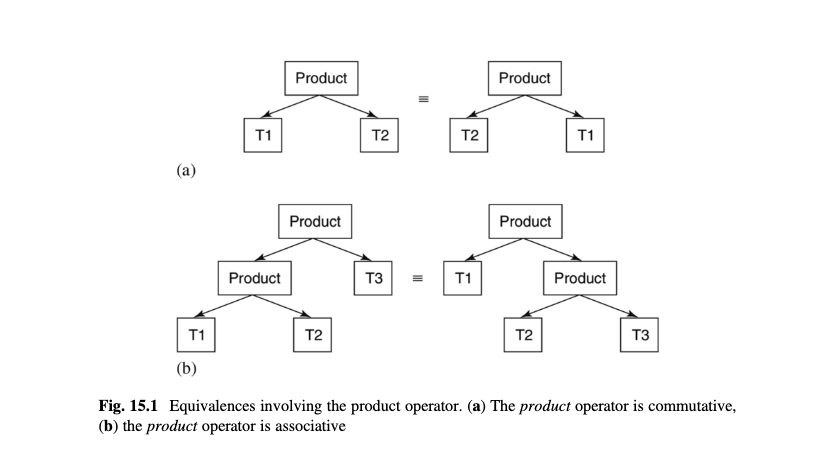

[图15.1]

这两个等价可以反复用于转换积节点树.比如,思考图15.2,它有对应于以下查询的两个树构成:
select SNamefrom STUDENT, ENROLL, SECTION, COURSE, DEPT

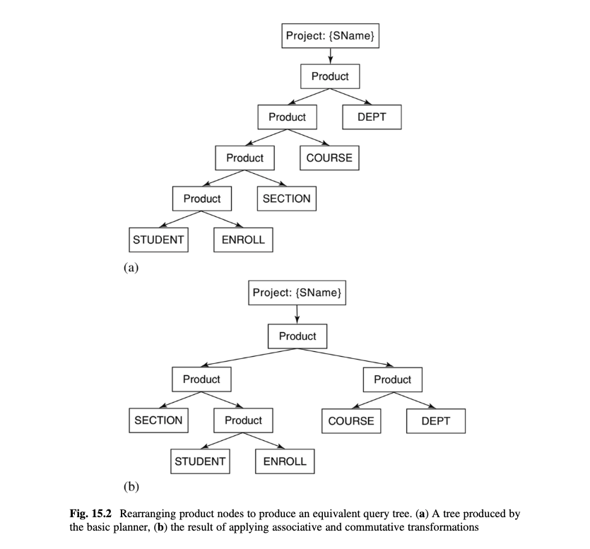

[图15.2]

图15.2a的树是由基本计划器创建的.需要两个步骤转换这个树到15.2b的树.第一个树应用交换律在SECTION的积节点上;第二个步骤应用结合律在DEPT的积节点上.

实际上,你可以使用这两个规则来转换任何积节点为任何有同样节点的树.也就是说,积操作可以以任意顺序实现.

### 15.1.2 分割选择
假设一个选择谓语p是两个谓语p1和p2的结合.可以用两个步骤找到满足p的记录:首先,找到满足p1的记录,然后从该集合查找满足p2的记录.换句话说,下面的操作等价:
select(T, p1 and p2)=select(select(T, p1), p2)

在查询树的方面,这个等价可以用一对选择节点替换一个选择节点;请看图15.3.

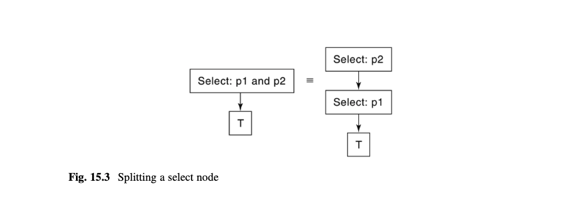

[图15.3]

反复应用这个等价性,可以用多个选择节点替换一个选择节点,每个对应谓语中的条件.另外,一位谓语中的条件可以是任意顺序的,这些选择节点可以以任何顺序出现.

分割一个选择节点的能力对于查询优化是非常有用的,因为每个更小的选择节点可以单独放在查询树中的最优的位置.因此,查询优化器尽可能地分割谓语为多个条件.它通过转换每个谓语为合取范式(conjunctive normal form)(或CNF)来实现.一个谓语是CNF,如果它是多个子谓语的结合,每个子谓语都不包含AND操作.

一个CNF谓语的AND操作总是可以在最外层.比如,考虑下面的SQL查询:
select SName from STUDENTwhere (MajorId=10 and SId=3) or (GradYear=2018)

其中where分句谓语不是CNF,因为AND操作在OR操作里面.但是,可以使用德·摩根定律来使AND操作在最外层.这种情况下的结果会是下面的等价查询:
select SName from STUDENTwhere (MajorId=10 or GradYear=2018) and (SId=3 or GradYear=2018)

这个查询的谓语有两个条件,现在可以分割了.

### 15.1.3 在一个树中移动选择(Moving Selections Within a Tree)
下面的查询检索每个数学专业的名称:
select SName from STUDENT, DEPT where DName = 'math' and MajorId = DId
它的where分句是CNF,包含两个条件.图15.4a描绘了由基本计划器创建的查询树,修改了所以有两个选择节点.思考第一个在DName的筛选.它下面的积节点输出所有STUDENT和DEPT记录的组合;然后选择节点只剩下那些DName为"math"的记录.这和你先从DEPT选择数学系然后返回所有STUDENT记录的组合的结果是一样的结果集.换句话说,因为筛选只应用于DEPT表,把筛选推入积节点里面是可以的,图15.4b给出了等价查询树.

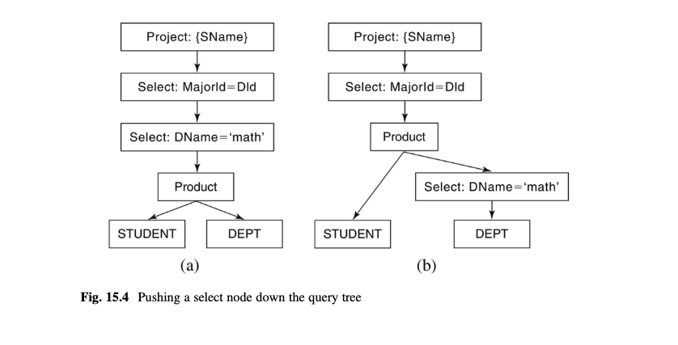

[图15.4]

现在思考连接谓语MajorId=DId.把这个筛选推入积中是不可能的,因为谓语中提到的字段来自STUDENT和DEPT两个表.比如,把筛选推到STUDENT上面会产生一个无意义的查询,因为筛选会引用一个不在STUDENT的字段.

下面的等价性一般化了这个讨论.当谓语p只引用T1中的字段才成立:
select(product(T1, T2), p)=product(select(T1, p), T2)

这种等价在图15.5中描绘了.

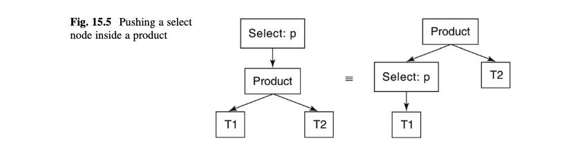

[图15.5]

这种等价性可以反复应用于一个选择节点,尽可能沿着查询树往下推.比如,思考图15.6. (a)部分返回那些挂了2018年的数学课的学生姓名.(b)部分和(c)对这个查询描绘了两个等价查询树.图15.6b描绘由基本计划器创建的查询树.图15.6c描绘了分割选择节点并把更小的选择节点推到下面的查询树.

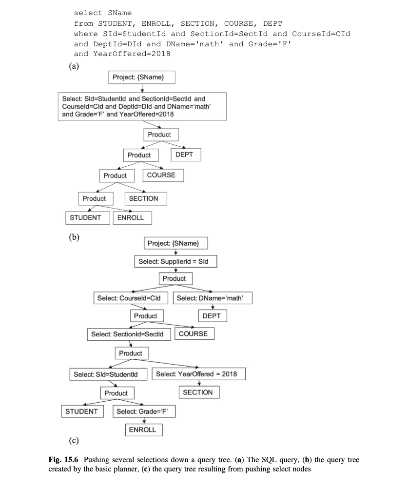

[图15.6]

图15.5的等价性也可以反着应用,越过一个或多个积节点,沿着树往上移动一个选择节点.另外,可以容易看出一个选择节点总是可以以任意方向移动越过另外的选择节点,一个选择节点可以越过一个投影或分组节点,每当这样做是有意义的时候(请看练习15.4).因此,可以推导出一个选择节点可以放在查询树的任何位置,只要它的谓语只提到底下子树的字段.

### 15.1.4 识别连接操作(Identifying Join Operators)
再次说明连接操作是根据选择和积操作定义的:
join(T1, T2, p)=select(product(T1, T2), p)

这个等价确定转换一对选择-积节点为一个连接节点是可以的.比如,图15.7描述了基于图15.6c的树的转换的结果.

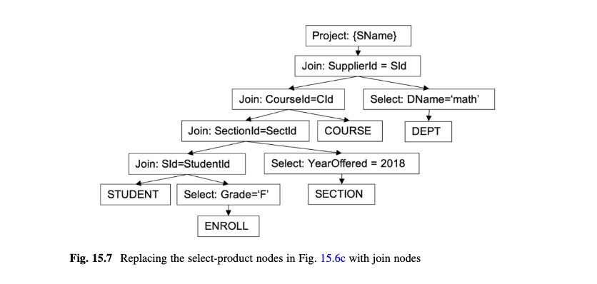

[图15.7]

### 15.1.5 添加投影(Adding Projections)
一个投影节点的可以添加到查询树里的任意节点上,只要它的投影列表包含节点的父级节点提到的字段.这种转换通常用于减少物化的时候一个节点的输入大小.

比如,图15.8描绘了图15.7的查询树,尽可能早地减少用投影节点来减少字段.

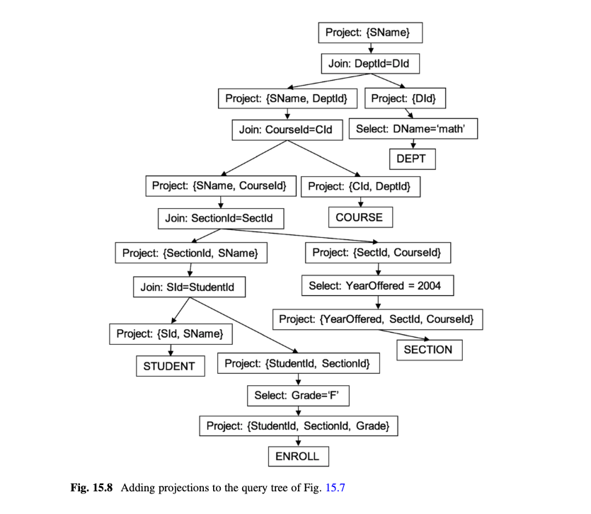

[图15.8]

## 15.2 查询优化的需求(The Need for Query Optimization)
给一个SQL查询,计划器必须为它选择一个合适的计划.这种计划生成操作涉及两个步骤:
*	计划器选择一个和查询相对应的关系代数查询树
*	计划器为查询树里的每个节点选择一个实现.

一般来说,一个SQL查询可以有许多等价查询树,且树中的每个节点可以用多种方式实现.因此,一个计划器可以有多种候选计划来选择.如果计划器选择最高效的计划当然是好事,但是真的需要选择最好的吗?比较,找到最优的计划可能涉及许多工作.在你同意做这之前,你应该确定相应的努力是值得的.使用第10章的基础计划算法哪里不好了?

结果显示同样的查询的不同计划会有非常不同数量的块访问.思考,比如,图15.9的两个查询树.这个图的(a)部分是一个减少Joe在2020获得的成绩的SQL查询.(b)部分描绘了由基本计划器创建的查询树,(c)部分描绘了一个等价树.

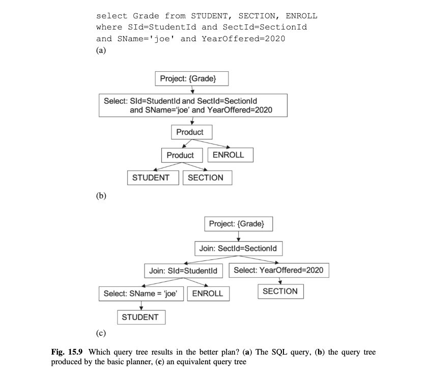

[图15.9]

思考(b)部分的计划.使用图7.8的统计信息,这个计划的消耗会被如下计算:STUDENT和SECTION的积有45,000 x 25,000 = 1,125,000,000条记录,需要4500 + (45,000 x 2500) = 112,504,500块访问.然后ENROLL的积需要112,504,500 + (1,125,000,000 x 50,000) = 56,250,112,504,500 块访问.选择和投影节点不需要额外的块访问.因此,这个计划需要超过56万亿的块访问!如果你假设每次块访问1ms,一个数据库引擎需要消耗1780年来回答这个查询.

现在思考(c)部分的查询树.假设有一个名叫"joe"的学生.在这种情况下,STUDENT的筛选需要4500块访问,然后输入一条记录.和ENROLL的连接需要4500  +  (1x50,000) = 54,500 块访问,然后输出34条记录.然后和SECTION的连接需要54,500 + (34x2500)=139,500 块访问.以每块访问需要1ms计算,执行这个计划需要消耗2.3分钟.

消耗降低从1780年到2.3分钟是非常惊人的,且证明了基本计划算法是多么的没用.没有哪个客户端可以忍受等待几千年来得到一个查询的回答.如果一个数据库引擎有用,它的计划器必须得足以复杂到构建合理的查询树.

尽管2.3分钟不是一个非不可忍受的执行时间,计划器可以通过查询树种的节点的其他实现来做的更好.再次思考(c)部分的查询树,并假设ENROLL有一个在StudentId上的索引.那么图15.10的计划是可行的.

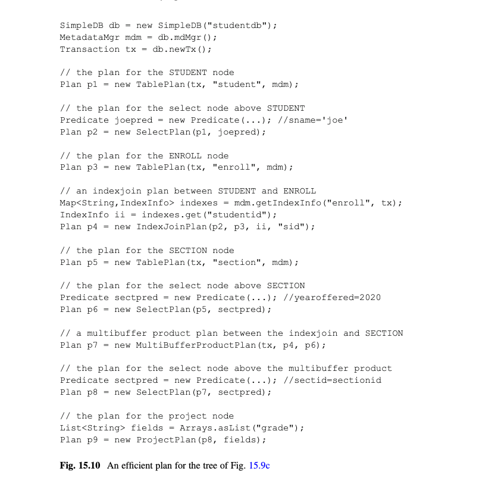

[图15.10]

这个图的大多数计划使用第10章的基本计划类.另个例外是p4和p7. 计划p4实现一个索引连接.对选择的每条STUDENT记录,StudentId上的索引被搜索来查找匹配的ENROLL记录.计划p7用一个多缓存积来实现连接.它物化了它的右边表(积,2020的section),把它们分割为多个区块,并用这些区块实现p4的积.

让我们来计算这个计划需要的块访问.计划p2需要4500块访问,然后输出一条记录.索引连接对34条匹配Joe的STUDENT的记录访问ENROLL一次;也就是说,连接需要34次另外的块访问,输出34条记录.计划p6(它查找2020的section)需要2500次块访问,输出500条记录.多缓存积物化这些记录,这需要50个另外的块来创建一个50块大小的临时表.假设有至少50个可用缓存,这个临时表适配一个区块,那么积需要另外的50次块访问来扫描临时表,还有计算左边记录的消耗.剩下的计划不需要另外的块访问.因此,该计划总共需要7134次块访问,这会消耗7秒多一点.

换句话说,一个节点实现的精心选择可以以大约20的因子减少执行时间,即使相同的查询.这种降低可能没有使用不同查询树的区别那么大,但绝不是不重要的.一个它竞争者慢20倍商业数据库系统在市场上存活不了多久.

## 15.3 一个查询优化器的结构(The Structure of a Query Optimizer)
给出一个SQL查询,计划器必须得为该查询努力查找需要最少块访问的计划.这个处理被称为查询优化.

但是计划器如何确定那个计划?穷尽所有可能的计划是艰巨的:如果一个查询有n个积操作,那么有(2n)!/n1种排列它们的方式,这意味着等价计划数量随着查询的大小指数级的增长.而且,那还没考虑为其他操作替换节点的方式,还有每个节点的不同实现方式.

一个查询计划器可以处理这种复杂性的一种方式是以两个独立的阶段实现优化:
*	阶段1:为查询找到最有希望的树,也就是那个看起来最有可能产生最高效率计划的树.
*	阶段2:对那棵树的每个阶段选择最优的实现.

分别实现这些阶段,计划器可以减少它在每个阶段需要做的选择,这让每个阶段变得更简单和更聚焦.

在这两个优化阶段期间,计划器使用启发式(heuristics)限制它考虑的树和计划的集合来进一步降低复杂性.比如,查询计划通常使用"尽早实现选择"这个启发.经验显示在查询的最优计划里,选择阶段总是尽可能早地被放置.因此,遵循这个启发,一个查询计划器不需要思考任何其他选择节点的放置方式.

下面的两节考察查询优化的两个阶段和它们相关的启发.

## 15.4 查找最有希望的查询树(Finding the Most Promising Query Tree)
### 15.4.1 一个树的消耗
查询优化的第一个阶段是找到最有希望的查询树,也就是,计划器认为有最低消耗的计划.计划器不能真正确定最优的树的原因是消耗信息在第一个阶段是不可用的.块访问是和计划相关的,计划直到第二阶段才会被考虑.因此,计划器需要一种不用真正比较块访问的方法来比较查询树.原理是注意到:
*	查询的大部分块访问是由积和连接操作产生的.
*	这些操作需要的块访问数是和它们的输入大小相关的.

计划器因此定义查询数的消耗为输入大小和树的每个积/连接节点的消耗和.

比如,让我们来计算图15.9的两个查询树的消耗.这些树有两个积节点,你应该统计每个节点的输入大小和.结果如图15.11所示,并且结果表明第二个查询树比第一个更好.

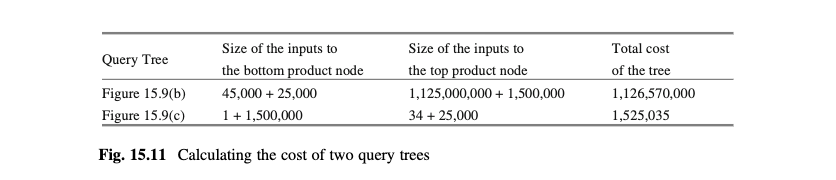

[图15.11]

你可以把一个查询树的消耗当成一个"快且脏"的执行时间接近值.这个消耗并不帮助你预估块访问,但是它确实帮助确定两个树的相对值.特别是,指定两个查询树,你可以期待最有效的计划会来自更低消耗的树.这种期待并不总是正确的(看练习15.8).但是,经验显示大多数时候都是对的,尽管不是最好的时候,更低消耗的树往往也足够好.

### 15.4.2 把选择节点沿树往下推(Pushing Select Nodes Down the Tree)
计划器使用启发式来查找最有希望的查询树.第一个启发关心树中的选择节点的放置.选择谓语来自SQL查询的where分句.再次说明15.1.2节的等价允许计划器放置一个选择节点在树的任何它想的位置,只要那个谓语在那个位置是有意义的.

那种选择节点的放置会带来更低消耗的树?一个选择节点的输出不会有超过输入的记录数.所以如果你放置一个选择节点在一个积或连接里面,那些节点的输入可能会变得更小,且该树的消耗也会减少.这带来了以下启发.
*	启发1:计划器只需要考虑选择节点尽可能在下面的查询树.

假设完成推选择节点之后,两个选择在查询树中互相挨着.启发1不规定这些选择应该出现的顺序.但是,顺序不影响树的消耗,所以计划器可以自由选择任意顺序或把它们组成一个选择节点.

启发1减少了计划器的任务,所以它不需要担心把选择节点放在哪里.给一个查询计划给其他操作,这些节点的放置会好好指定.

### 15.4.3 用连接替换选择积节点
思考一个连接谓语涉及来自表T1和T2的字段.当一个包含这个谓语的选择节点沿树往下推,它会到树的一个特定位置,也就是,T1的积节点出现在一个子树,T2出现在其他子树.这对选择-积节点可以用一个连接节点代替.

*	启发2:计划器应该用一个连接节点替换查询树种的选择-积节点.

尽管这个启发没有改变查询树的消耗,它也是查找最优计划的重要步骤.本书已经考察了连接操作的多个高效实现.通过识别查询树中的连接,计划器允许这些实现在第二个优化阶段考虑.

### 15.4.4 使用左深(left-deep)查询树
计划器必须选择积/连接操作这样的执行顺序.比如,思考图15.12.(a)部分的SQL查询检索毕业于2018的学生姓名和它们上的数学课标题.(b)-(f)部分给这个查询描绘了5个等价树.

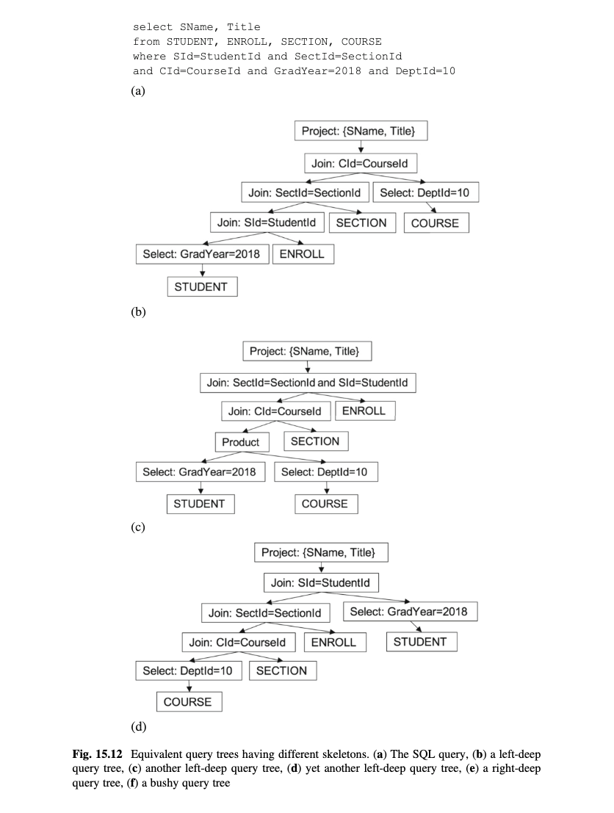
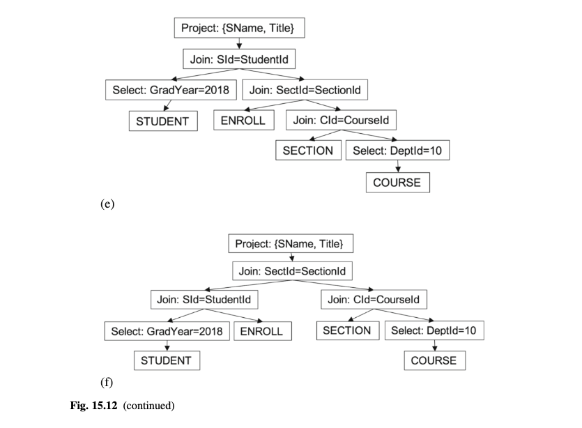

[图15.12]

这些树有不同的结构.(b)-(d)部分的树被称为左深(left-deep),因为每个积/连接节点的右边不包含其他积/连接节点.类似地,(e)部分的树被称为右深(right-deep).(f)部分的树被称为灌木(bushy),因为它既不是左深也不是右深.许多查询计划采用以下启发:
*	启发3:计划器只需要考虑左深查询树.

这个启发背后的原因不是很明显.比如,思考图15.13,它使用图7.8的统计来计算每个树的消耗.图15.12的最低消耗是灌木的那个.另外,该树结果是最有希望的树(看练习15.9).所以,为什么计划器要有意选择忽略很多可能包含最有希望的树.

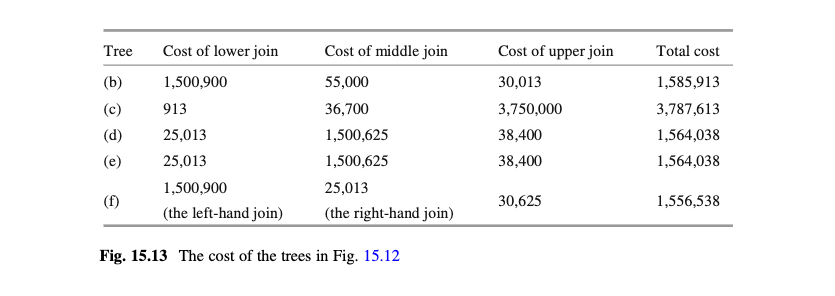

[图15.13]

第一个原因是左深树往往有最高效的计划,尽管它们没有最低的消耗.回想你已经看过的连接算法;当连接的右边是一个存储表时它们都表现的很好.比如,多缓存积需要物化它的右边表.然后一个索引连接仅在右边是一个存储表是才有用.因此使用一个左深树,计划器提高了在生成最终计划时能使用更高效的实现的可能性.经验表明一个查询的最好的左深计划往往要么时最优的要么也是接近最优的.

第二个原因是方便.如果一个查询有n个积/连接节点,那么只会有n!个左深查询树,它比(2n)!/n!少的多.因此启发3允许计划器工作的更快(这是很重要的),伴随着使用一个差计划的低风险.

一个左深树可以通过顺序列出它的表来定义.第一个表是出现在左边的最底下的积/连接节点,后续的表来自逐渐往上的积/连接表的右边.这个顺序被称为左深树的连接顺序.

比如,图15.12b的左深树有(STUDENT,ENROLL,SECTION,COURSE)的连接顺序,且图15.12c的树有(STUDENT, COURSE, SECTION, ENROLL)的连接顺序.启发3因此简化了查询计划器的工作--所有的计划器都必须要确定最优的连接顺序.那么,启发1到3可以完整确定相应的查询树.

### 15.4.5 启发式地选择一个连接顺序.
为一个查询查找最优的连接顺序的任务是查询优化处理中关键的部分.用"最关键",我指的是两件事:
*	连接顺序的选择极大地影响结果查询树的消耗.图15.12是一个例子,(b)树比(c)树好很多.
*	有许多可能的连接顺序,完全检查它们不太现实.特别是,一个查询提到n个表,则会由n!个连接顺序.

因此,计划器必须得非常聪明地考虑连接顺序,以防使用了一个糟糕的顺序.两个通用的方法已经被开发出来用于确定好的连接顺序:一个方法使用启发式,一个考虑所有可能的顺序.本节考察启发式方法.下一节思考穷举搜索.

启发式方法递增构建连接顺序.也就是说,计划器开始选择一个表作为连接顺序的第一个.然后它选择另外一个表来作为连接顺序的下一个,并重复直到完成连接顺序.

以下的启发帮助计划器来排除"明显不好"的连接顺序:
*	启发4:不管任何时候,连接顺序的表都应该连接之前被选择过的表.

换句话说,这个启发声明查询树中仅积节点对应于连接.图15.12c的查询树违反了这个启发,因为它采用STUDENT和COURSE表的积开始的.

为什么连接顺序违反启发4那么厉害?再次说明一个连接谓语的角色是过滤由一个积操作产生的无意义的输出记录.所以当一个查询树包含一个非连接积节点,它的中间表会传播这些无用记录直到遇到连接谓语.比如,再次思考图15.12c的查询树.STUDENT和COURSE之间的积产生11,700条输出记录,因为13条COURSE记录被重复了900次(每条毕业于2018年的学生记录一次).当输出表和SECTION连接,每个COURSE记录是和它的SECTION记录匹配;但是,这些匹配会被重复900次.因此,那个连接的输出是它应该需要的900倍.仅当ENROLL被加到连接顺序里,和STUDENT的连接谓语最终破门而入,重复得以消失.

这个例子证明了一个包含积节点的查询树的输出可以非常小,但是最终积造成的重复会带来非常高的消耗.因此,启发4确定可能的话,积操作会被避免.当然,如果用户定义了一个查询不完全连接所有表,那么一个积节点会是不可避免的.在这种情况下,这个启发确保这个节点会和树一样尽可能的高,所以重复会产生最小的可能影响.

启发4是一个常使用的启发.查找的最优希望树违背了这个启发是有可能的(看练习15.11),但是这种查询现实中很少发生.

现在该接近选择哪个表和选择下一个连接表的问题了.这些都是比较难的问题.数据库社区已经提出了许多启发,对于哪个是最正确的很少有共识.我会思考两中逻辑可能,我称它们为启发5a和5b:
*	启发5a:选择产生最少输出的表.

这个启发是最简单直接的方式.它的意图是:因为查询树的消耗根它的中间输出表的大小和相关,一种最小化这个和的方式是最小化每个表.

我们来使用跟这个启发在图15.12a的查询上.连接顺序的第一个表会是COURSE,因为它的选择谓语减少它为13条记录.剩下的表由启发4决定.也就是说,SECTION是唯一连接COURSE的表,这让STUDENT成为连接顺序的最后的表.最终查询树如图15.12d所示.

一个可选的启发如下:
*	启发5b:选择由最严格筛选谓语的表.

启发5b来源于,当选择谓语出现在查询树的最下面时影响最大的洞见.比如,思考图15.12b的查询树和它在STUDENT上的选择谓语.那个选择谓语有最明显的减少STUDENT记录数量的好处,它降低了就在它上面的连接节点的消耗.但是它有一个更重要的好处--谓语也减少了连接的输出,从1,500,000条记录到仅30,000条记录,这降低了树中的每个后续连接节点的消耗.换句话说,有这个选择节点节省的消耗使得树的上面的节点也节省了消耗.相比之下,树的最上面的COURSE的选择谓语则有比较小的影响.

因为查询树的选择谓语对它的消耗有最大的影响,让优化器选择谓语有最大减少因子的表是有意义的.这正是启发5b所做的.比如,图15.12b的查询树满足这个启发.连接顺序的第一个表是STUDENT,因为它的选择谓语以50的系数减少表,然而COURSE的选择谓语只有40的系数.连接顺序里剩下的表,和之前一样,有启发4确定.

在这个例子中,结果表明使用启发5b会产生一个比启发5a更低消耗的查询树.这是典型的.研究表明尽管启发5a产生良好的直觉和合理的查询树,但是这些树往往比启发5的有更大的消耗.

### 15.4.6 用穷举来选择一个连接顺序
启发4和5往往生成好的连接顺序,但是不保证是最好的.如果一个厂商想要确定它的计划器找到最好的连接顺序,它唯一的选择是列举出所有.本节思考这种策略.

一个提到n个表的查询可以有n!个连接顺序.一个非常出名的算法技术,被称为动态编程,可以减少找到最优希望的连接顺序需要的时间到O(2的n次方).如果n是比较小(比如,不大于15或20个表),那么这个算法是足够高效,切合实际的.

为了展示这个技术是如何节省时间的,思考一个连接大学数据库的所有5个表的查询.它的120个可能的连接顺序中的4个是:

(STUDENT, ENROLL, SECTION, COURSE, DEPT)
(STUDENT, SECTION, ENROLL, COURSE, DEPT)
(STUDENT, ENROLL, SECTION, DEPT, COURSE)
(STUDENT, SECTION, ENROLL, DEPT, COURSE)

前两个连接顺序区别在于第2个和第3个表.假设我们确定部分连接顺序 (STUDENT, ENROLL, SECTION) 的消耗比(STUDENT, SECTION, ENROLL)的低.那么可以推导出,不用进一步的计算,第一个连接顺序肯定比第二个的消耗低.另外,我们也知道第3个连接顺序需要比第4个更少的块访问.概括地说,我们知道任何以(STUDENT, SECTION, ENROLL) 开头的连接顺序都不值得考虑.

动态程序算法使用一个叫做lowest的数组变量,它有所有表集合的条目.如果S是一个表的集合,那么lowest[S]包含3个值:
*	S集合中的表的最低消耗连接顺序
*	和该连接顺序相对应的查询树的消耗
*	查询树的输入记录数量

该算法通过计算lowest[s]中的每对表开始,然后每3个表,一直持续到计算了查询中的所有表为止.当S是所有表的集合时,lowest[S]的值时最佳连接顺序.

计算每两个表集合
思考两个表的集合,比如{T1,T2}.lowest[{T1,T2}]的值是通过计算两个表的连接(或者是积,如果没有连接谓语)和它们的选择谓语的消耗确定的.该查询树的消耗是积/连接节点的两个输入的大小和.注意不论哪个表在先,该消耗都是一样的.因此,计划器必须使用某些其他的条件来确定第一个表.一个合理的选择是使用启发5a或5b.

计算3个表的集合
思考3个表的集合,比如{T1,T2,T3}.它们的最低消耗连接顺序可以同通过考虑以下的连接顺序来计算:
lowest[{T2, T3}] joined with T1
lowest[{T1, T3}] joined with T2
lowest[{T1, T2}] joined with T3

有最低消耗的连接顺序会保存为lowest[{T1,T2,T3}]的值.

计算n个表的集合
现在假设lowest已经为每n-1个表集合计算了.给出一个集合{T1,T2,...,Tn},该算法斯卡下面的连接顺序:

lowest[{T2, T3 ,..., Tn}] 和 T1 连接
lowest[{T1, T3 ,..., Tn}] 和 T2 连接
...
lowest[{T1, T2 ,..., Tn-1}] 和 Tn 连接

有最低消耗的连接顺序是该查询的最优连接顺序.

作为一个例子,我们来对图15.12的查询树使用动态程序算法.这个算法从考虑6个两表集合开始,如图15.14a所示.

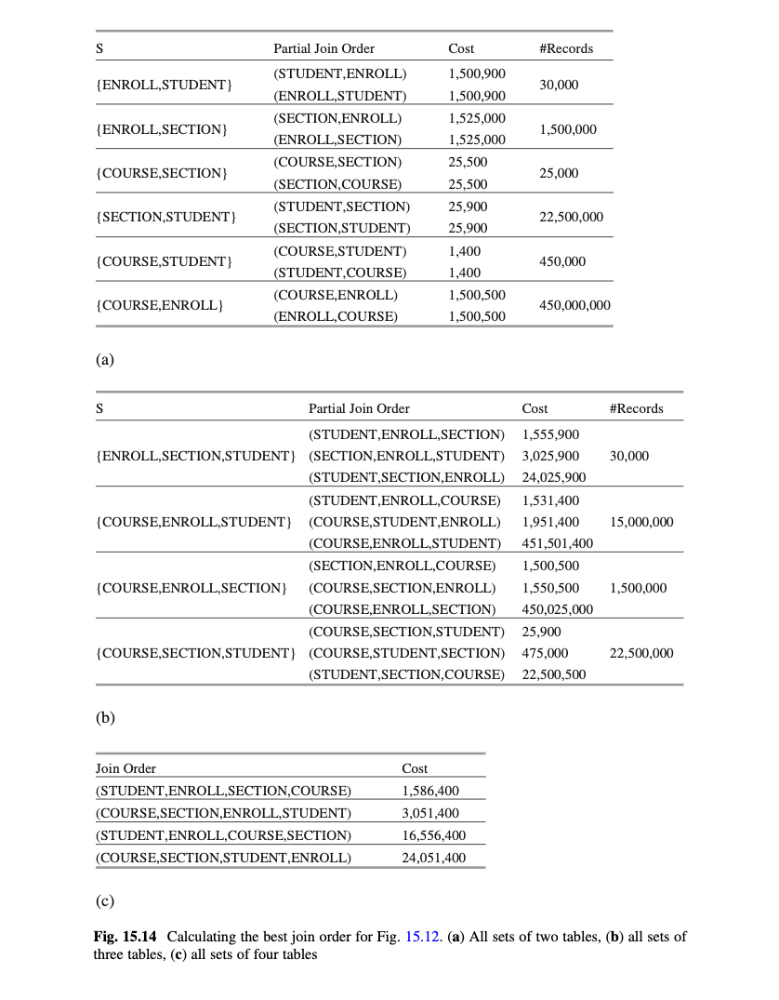

[图15.14]

每两个表集合有两个部分连接顺序,它会列入该集合对应的行里.每个集合的连接顺序是根据需要列出的.在这种情况下,它们有同样的消耗,所以它们是根据启发5a列出的.每个集合第一个部分连接顺序会被选作后续计算中该集合的代表.

然后这个算法考虑所有3表的集合.图15.14b列表了这些集合的部分连接顺序和它们的消耗.每个集合有3个可能的连接顺序.连接顺序的前两个表是图15.14a的集合的最低消耗代表.消耗是从低往高列出的,所以每个集合的第一个部分连接顺序会被选为该集合的代表.

图15.14c思考4个表的集合.有4种连接顺序可以考虑.每个连接顺序的前3个表代表图15.14b中的最低消耗连接顺序;连接顺序的第4个表就是缺的那个表.这个表展示了 (STUDENT, ENROLL, SECTION, COURSE) 是最优连接顺序.

注意在每个阶段,该算法必须为每个前缀表集合计算lowest的值,因为在后续的阶段没有办法知道消耗会如何变化.根据后面的表的连接方式,在某个阶段有最高消耗的连接顺序也可能会产生总体上最低消耗的排序.

## 15.5 查找最高效的计划
查询优化的第一个阶段是查找最有希望的查询树.第二个阶段是将那个查询树转变为一个高效的计划.计划器通过为查询树里的每个节点选择实现来构造计划.它从叶子开始选择这些实现.自下而上处理的优势是当给出一个节点,计划器已经为它的子树选择了最低消耗的计划.因此,计划器可以思考该节点的每个可能实现,使用实现的blocksAccessed方法来计算该实现的消耗,然后选择有最低消耗的实现.

注意计划器选择每个节点的实现是和其他节点的实现分开的.特别是,它不关系一个节点的子树是如何实现的;它只需要纸雕那个实现的消耗.这个在节点间的交互极大地减少了计划生成的计算复杂性.如果查询树有n个节点,每个节点有最多k个实现,那么计划器最多需要考察k*n个计划,这当然是合理的.

但是,计划器也可以利用启发来加速计划生成.这些启发往往是属于特定操作的.比如:
*	启发6:如果可以的话,使用索引选择来实现一个选择节点.
*	启发7:根据以下优先级来实现一个连接节点:
	-	如果可以,使用索引连接
	-	如果输入表的一个比较小,使用哈希连接
	-	否则使用合并连接.

还有一个问题需要考虑.每当计划器选择用一个物化计划来实现一个节点,那么它应该插入投影节点到查询树中,如下:
*	启发8:计划器应该添加一个投影节点作为每个物化节点的子节点,以移除不再需要的字段.

启发8确保由一个物化实现创建的临时表尽可能小.为什么这非常重要?有两个原因:一个更到的表需要更多的块访问来创建,也需要更多的块访问来扫描.因此计划器应该缺点哪些字段会被物化节点积祖父节点需要,然后插入一个投影节点来从输入中移除其他字段.

比如,思考图15.15的查询树.这个树返回Joe在2020年获得的成绩,和图15.9的那棵树是等价的.

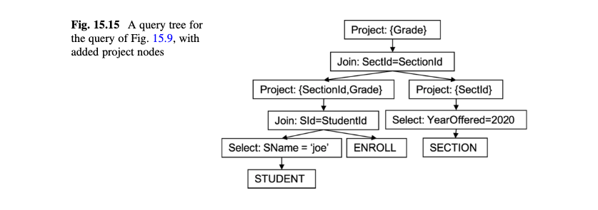

[图15.15]

图15.10的计划选择用多缓存来实现上面的连接节点,其会被物化.启发8确定投影节点需要添加到查询树中作为连接节点的子节点;这些节点如图15.15所示.右边投影节点是特别重要的,因为它减少了临时表大约75%,因为允许该算法运行更少的区块.

## 15.6 组合优化的两个阶段
理解查询优化的最容易的方式是分为两个阶段:第一个阶段构造SQL查询的查询树,第二个阶段从查询树构造计划.但是,现实中,这两个阶段通常是混合的.混合优化阶段有两个好的理由:
*	方便:计划可以被直接创建,而不必创建一个明确的查询树.
*	正确性:因为计划和查询树是同时创建的,计算树的实际块访问次数是可能的.

本节考察组合优化的两个例子:基于启发的SimpleDB的优化器和基于穷举的"Selinger-style"优化器.

### 15.6.1 启发式SimpleDB优化器
SimpleDB查询优化器是在包simpledb.opt里通过两个类HeuristicQueryPlanner和TablePlanner实现的.为了在SimpleDB里使用这个优化器,你必须修改simpledb.server包里的SimpleDB.planner方法,让它创建HeuristicQueryPlanner的实例,而不是BasicQueryPlanner的.

``HeuristicQueryPlanner类``
HeuristicQueryPlanner类使用启发5a来确定连接顺序.每个表有一个TablePlanner对象.当一个表被添加到连接顺序,它的TablePlanner对象创建相应的计划,添加合适的选择和连接谓语,并在可能的时候使用索引.用这种方式,计划和连接顺序可以同时建立.

HeuristicQueryPlanner的代码如图15.16所示.tableinfo集合对查询里的每张表包含一个TablePlanner对象.计划器通过从这个集合选择对应于最小的对象开始,并使用它的选择计划作为当前计划.然后它从该集合反复选择(或移除)有最低消耗的连接的表.计划器发送当前计划给表的TablePlanner对象,它创建并返回连接计划.然后这个连接计划成为当前计划.这个过程一直持续到该集合为空为止,那时当前计划为最后的计划.

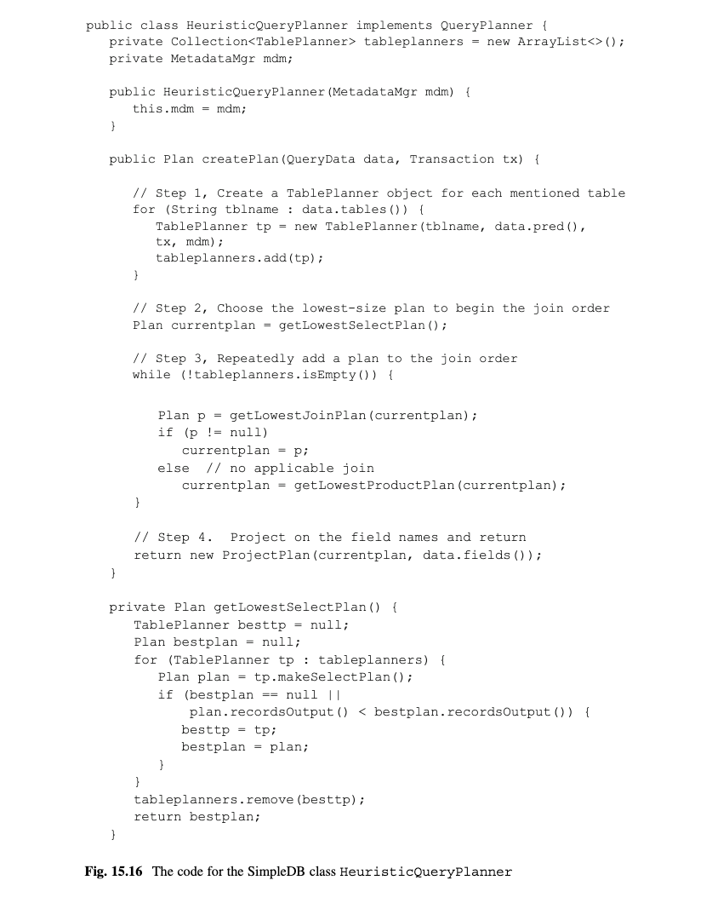
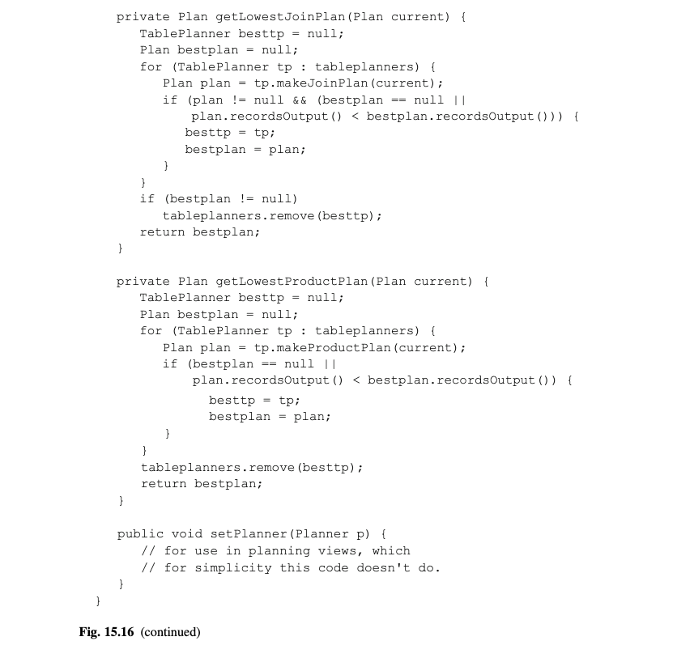

[图15.16]

``TablePlanner类``
TablePlanner类的对象负责为表创建计划;它的代码如图15.17所示.TablePlanner的构造器为指定表创建一个表,获取关于该表的信息,然后保存查询谓语.这个类有公共方法makeSelectPlan,makeProductPlan, 和makeJoinPlan.

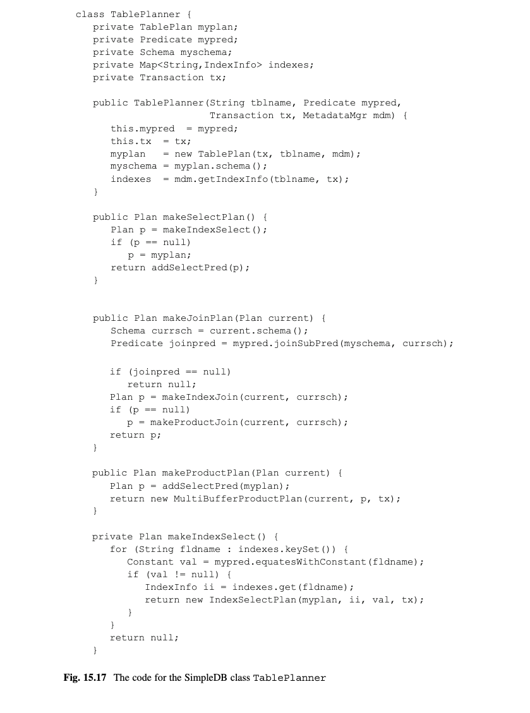
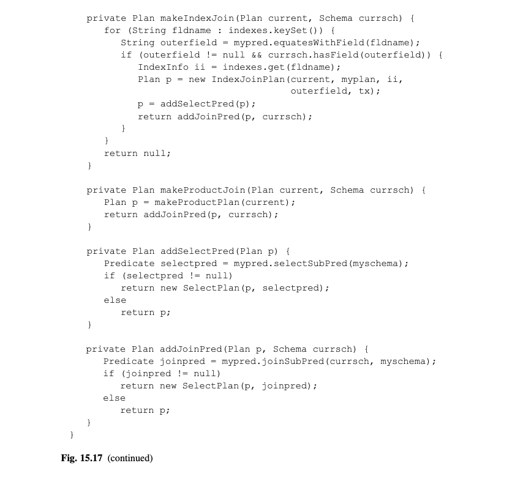

[图15.17]

makeSelectPlan方法为它的表创建一个选择计划.该方法先调用makeIndexSelect来确定是否有索引可以使用;如果有,一个IndexSelect计划被创建.然后该方法调用addSelectPred来确定应用于该表的谓语部分,并为它创建一个选择计划.

makeProductPlan方法添加一个选择计划给表计划,然后创建一个MultiBufferProductPlan来实现和这个计划的指定计划的积.

makeJoinPlan.方法先调用谓语的joinPred方法来确定这个集合和指定计划之间是否存在一个连接.如果没有连接谓语存在,该方法返回null.如果一个连接谓语存在,该方法查看是否可以创建一个IndexJoinScan.如果不行,那么通过创建一个多缓存积跟着一个选择.

记录输出 VS 块访问
HeuristicQueryPlanner的代码使用recordsOutput来计算最低消耗计划.也就是说,它尝试不检查子计划需要的块来查找需要最少块访问的计划.这种情况值得解释一下.

正如你已经看过的,使用启发式优化的问题是可能开头是低消耗的,但到头来确实高消耗的,最优的连接顺序可能有一个非常高消耗的开端.因此对于优化器来说不要单纯偏向于一个看起来比当前更好的连接.图15.18描述了这个问题.

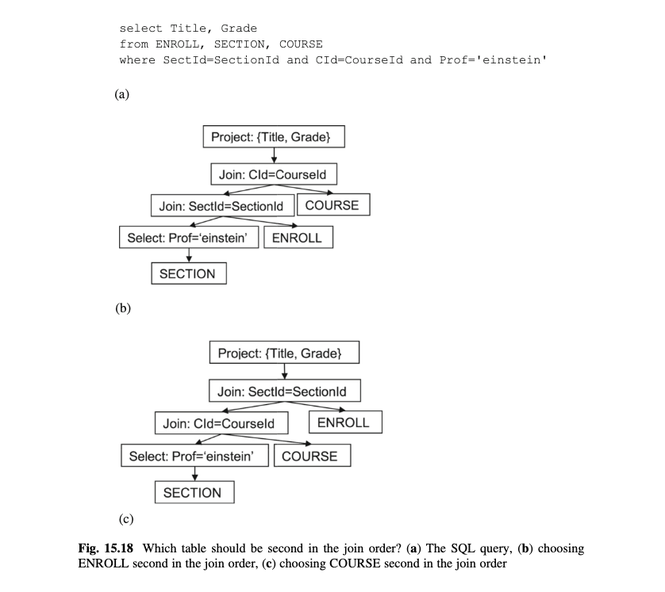

[图15.18]

图15.18a的查询返回einstein教授的每个课程的标题和成绩.假设有图7.8的统计信息,并假设ENROLL有一个SectionId字段的索引.SimpleDB优化器会选择SECTION成为连接顺序的第一个,因为它是最小的(也是好筛选的).问题是下一个它应该选择哪个表.如果你的提交是最小化输出记录,那么你应该选择COURSE.但是如果你的条件是最小化块访问,那么你应该选择ENROLL,因为索引连接会更高效.但是结果显示ENROLL是一个错误的选择,一位内高数量的输出记录导致后面和COURSE的连接的消耗非常高.

这个例子证明很多匹配的ENROLL记录对后续连接的消耗有很大影响;因此ENROLL应该尽可能出现在连接顺序的后面.通过最小化输出记录,优化器最后选择了ENROLL.实际上和ENROLL的连接有一个更快的实现是误导和无关紧要的.

### 15.6.2 Selinger风格优化
SimpleDB的优化器使用启发来选择连接顺序.在1970年代早期,IBM的研究员为System-R原型数据库写了一个有影响力的优化器;这个优化器用动态程序来选择它的连接顺序.那个优化策略通常被称为"Selinger Style",这的名称跟Pat Selinger这个人有关,他领导了优化器小组.

Selinger-style优化组合了动态程序和计划生成.特别是,这个算法为S的表集合计算lowest[S].但是这个算法不保存连接顺序在lowest[S]中,而是保存最低消耗计划.

该算法通过为每对表计算最低消耗计划开始.然后它用这些计划来为每3个表的集合来计算最低消耗计划,以此类推,知道它计算了所有最小消耗计划.

在这个算法中,最低消耗计划是有最少块访问的计划,而不是由最少输出记录的计划.那意味着这个算法是本书中在选择连接顺序时真正考虑块访问的算法;因此,它的预估值比其他的算法的准确度更高.

为什么Selinger-style优化能够使用块访问?原因在于不像启发优化,它考虑所有的左深树,并且不抛弃任何部分连接,除非它确定那个排序没用.再看图15.18的例子.Selinger-style算法会为{SECTION,ENROLL}和{SECTION,COURSE}计算保存最低消耗计划,尽管{SECTION,ENROLL}的计划的消耗会更低.当它计算{ENROLL,SECTION,COURSE}的最低消耗计划时它会考虑这两个计划.当它发现连接COURSE到(ENROLL,SECTION}的消耗非常大时,它便可以使用其它替代计划.

另一个使用块访问来比较计划的优势是一个更详细的消耗分析变得可能了.比如,优化器可以把排序的消耗算进去.思考图15.19的查询树.

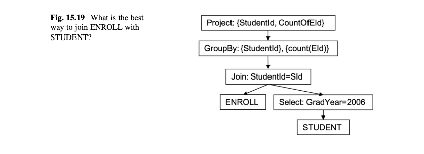

[图15.19]

假设计划器使用一个哈希连接来连接ENROLL和STUDENT.当它做分组的时候,计划器需要物化输出并基于StudentId排序.或者,假设计划器使用的是合并连接来连接表.在这种情况下,它不需要预处理输出,因为它已经基于StudentId做排序了.换句话说,使用一个合并排序可能会带来最好的计划,尽管它比哈希连接的效率低!

这个例子的关键在于计划器也需要追踪排序,如果它想生成最好的计划.一个Selinger-style优化器可以为lowest[S]中的每个排序保存最低消耗计划来实现.在上面的例子中,lowest[{ENROLL,STUDENT}]的值会包含合并连接和哈希连接的计划,因为每个都有不同的排序顺序.

## 15.7 合并查询块
本节考察提到视图的查询优化.思考,比如,图15.20a的查询,它使用一个视图来检索在教授Einstein的课程中得到"A"的学生姓名.第10章的基础查询计划器通过分别计划视图定义和查询来为这个查询创建计划,然后把视图的计划关联到查询的计划上.那个计划如图15.20b所示.

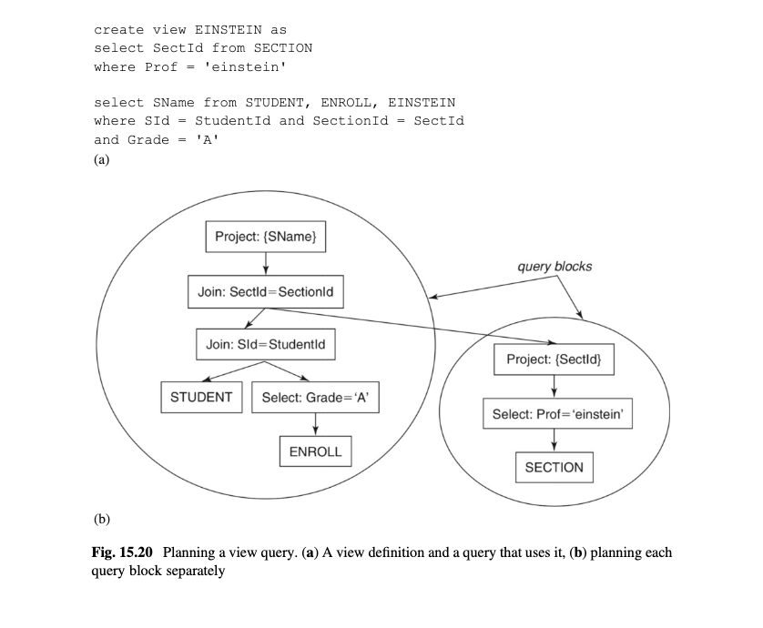

[图15.20]

每个查询和视图定义相关的计划被称为一个查询块(query block).图15.20b的计划展示了一个优化器可以处理视图查询的最简单的方式--它可以在组成最终计划之前分开优化每个查询块.尽管分开优化实现起来比较简单,被创建的计划不要非常好.图15.20的计划是这点的一个案例.最好的连接顺序是(is (SECTION, ENROLL, STUDENT), 但是这个连接顺序不可能给出这些查询块.

这个问题的一个解决方案是合并查询块,并计划它们的内容为一个查询.比如,在图15.20中,计划器可以忽略视图的投影节点,添加它的选择和表节点到主查询.这种策略是可能的,如果视图定义是足够简单.当视图定义包含分组或重复移除,这种情况会变得非常复杂,且合并也是不可能的了.

## 15.8 章节总结
*	无论数据库的内容是怎样的,如果输出表包含同样的记录(不需要以同样的顺序),那么两个查询就是等价的.
*	一个SQL查询可能有多个等价查询树.这些等价是根据关系代数操作的属性推导而来的.
	-	积操作是可交换和可结合的.这些属性表明查询树的积节点可以以任意顺序计算.
	-	谓语p的选择节点可以分割成为多个选择节点,p的一个条件对应一个节点.以CNF形式写谓语p,则允许谓语切分成多个片段.每个条件的节点可以放在树种的任何位置,只要它们的选择谓语是有意义的.
	-	一对选择积积节点可以用一个链接节点替换.
	-	一个投影节点可以插入树中的任意节点上,只要它的投影列表包含该节点的祖父节点中提到的所有字段.

*	两个等价树的计划可以有完全不同的执行时间.因此,计划器努力查找需要最少块访问的计划.这个过程被称为查询优化.
*	查询优化是困难的,因为一个SQL查询可以有比计划器可以列举的多的多的计划.计划器可以同通过以两个单独的阶段来处理这种复杂性:
	*	阶段1:为查询找到最有希望的树,也就是那个看起来最有可能产生最高效率计划的树.
	*	阶段2:对那棵树的每个阶段选择最优的实现.	

*	在阶段1,计划器不能预估块访问,因为它不知道哪个计划被使用了.相反,它定义一个查询树的消耗为树种的每个积/连接节点的输入的大小和.直观地看,一个低消耗的查询树最小化了中间连接的大小.它的思路是每个连接的输出会称为后续连接的输入,所以中间输出越大,执行查询的消耗会更多.
*	计划器也采用启发来限制树的集合和它考虑的计划.常见的启发是:
	-	尽可能把选择节点放在查询树的下面
	-	用一个连接节点替换每个选择-积节点
	-	在每个物化计划的输入上放入一个投影节点
	-	仅思考左深树.
	-	只要可能,避免未连接的积操作

*	每个左深树有一个相关的连接顺序.查找一个好的连接顺序是查询优化中最难的部分.
*	选择连接顺序的一种方式是使用启发.两个合理的启发是:
	*	选择产生最少输出的表.
	*	选择由最严格筛选谓语的表.

	第二个启发力图创建最严格筛选节点在最下面的查询树,灵感来源于这种树往往有最低消耗.

*	另一种选择连接顺序的方式是用动态程序检查所有可能的连接顺序.动态程序算法从两个表的集合开始,为每个表集合计算最低消耗计划,知道它计算了所有表的集合.

*	第二个优化阶段期间,计划器通过为查询树的每个节点选择一个实现来构造计划.它分别选择其他节点的实现,并计算块访问消耗.计划器可以通过每个节点的所有可能实现来确定最低消耗计划,或者通过下面启发来,比如:
	-	如果可以,使用索引连接
	-	如果索引不能拥有连接,如果输入表的一个比较小,使用哈希连接,否则使用合并连接.	

*	一个查询优化器的实现可以混合它的两个阶段,用查询树来构造联合的计划.SimpleDB的优化器用启发来确定连接顺序,并跟随选择的表递增构建计划.一个Selinger-style优化器使用动态程序--不是保存最低消耗连接顺序,而是保存最低消耗计划.Selinger-style的优势在于,不想任何其他技术,它可以使用预估的块访问来计算最佳连接顺序.
*	一个使用视图的查询会有一个由多个查询块组成的计划.最直接处理多查询块的方式是分开优化每个查询块,然后组合它们.但是,如果查询块可以一起优化的话,可能得到更高效的计划.比如如果视图定义是足够简单,这样的策略是可能的.

